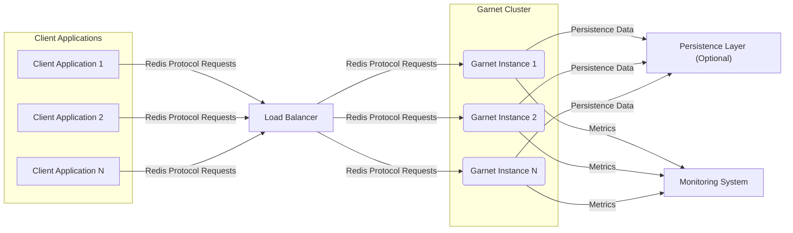
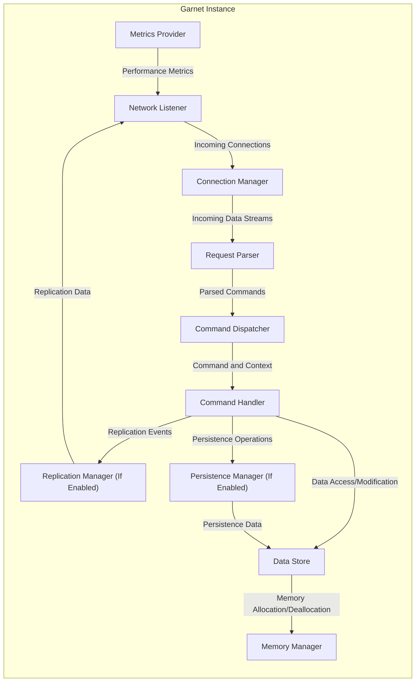
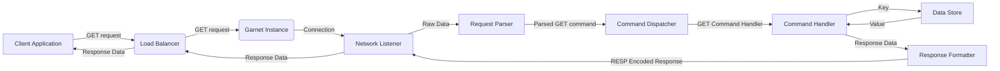
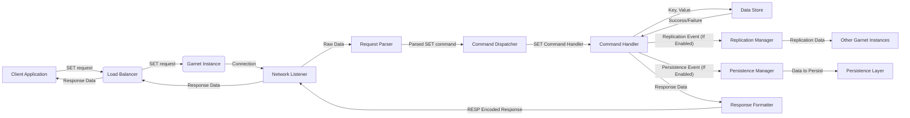

# Project Design Document: Garnet - A Redis Compatible In-Memory Key-Value Store (Improved)

**Version:** 1.1
**Date:** October 26, 2023
**Author:** AI Software Architect

## 1. Introduction

This document provides an enhanced design overview of Garnet, an open-source, in-memory key-value store developed by Microsoft. Garnet aims for high performance and compatibility with the Redis protocol. This improved document offers more detail and clarity, serving as a robust foundation for subsequent threat modeling activities.

## 2. Goals and Objectives

* **High Performance:** Achieve ultra-low latency and high throughput for both read and write operations, suitable for demanding applications.
* **Redis Protocol Compatibility:** Implement a comprehensive subset of the Redis protocol, ensuring seamless integration with existing Redis clients and minimizing the need for code changes.
* **In-Memory Storage with Optional Persistence:** Primarily leverage in-memory data storage for optimal speed, while providing configurable persistence options to ensure data durability.
* **Horizontal Scalability:** Design the system architecture to facilitate horizontal scaling by adding more Garnet instances to handle increasing workloads and ensure high availability.
* **Extensibility and Modularity:**  Develop a modular architecture that allows for future extensions, feature additions, and the integration of new functionalities without significant disruption.
* **Resource Efficiency:** Optimize resource utilization (CPU, memory, network) to maximize performance within given hardware constraints.

## 3. System Architecture

### 3.1. High-Level Architecture

* **Client Applications:** Applications that interact with the Garnet cluster by sending requests formatted according to the Redis protocol.
* **Load Balancer:** Distributes incoming client requests across the available Garnet instances in a manner that optimizes performance and availability (e.g., round-robin, least connections).
* **Garnet Cluster:** A collection of interconnected Garnet server instances working collaboratively to provide a unified key-value store.
* **Garnet Instance:** An individual, independent instance of the Garnet server process responsible for handling client requests and managing a portion of the data.
* **Persistence Layer (Optional):** An optional storage mechanism (e.g., disk files, cloud storage) used by Garnet instances to persist data for durability and recovery.
* **Monitoring System:** An external system that collects and visualizes metrics from the Garnet instances, providing insights into performance and health.

### 3.2. Detailed Architecture of a Garnet Instance

* **Network Listener:**  Accepts new client connections on a specified port and hands them off to the Connection Manager. Implements the underlying TCP/IP communication.
* **Connection Manager:** Manages active client connections, handling connection lifecycle events (open, close, timeout). May implement connection pooling or multiplexing.
* **Request Parser:**  Decodes incoming byte streams from client connections according to the Redis Serialization Protocol (RESP), converting them into structured command objects with arguments.
* **Command Dispatcher:**  Examines the parsed command and routes it to the appropriate Command Handler based on the command type (e.g., `GET`, `SET`, `HSET`).
* **Command Handler:** Contains the specific business logic for each Redis command. Interacts with the Data Store, Replication Manager, and Persistence Manager as needed.
* **Data Store:** The core in-memory data structure holding the key-value pairs. Optimized for fast read and write operations. Manages different Redis data types (strings, lists, sets, hashes, sorted sets).
* **Replication Manager (If Enabled):**  Responsible for replicating data changes to other Garnet instances (replicas) to ensure data redundancy and high availability. May implement asynchronous or synchronous replication.
* **Persistence Manager (If Enabled):** Handles the process of saving the Data Store's state to persistent storage and loading it back upon restart. May support different persistence strategies (e.g., snapshots, append-only files).
* **Memory Manager:**  Oversees memory allocation and deallocation within the Garnet instance. May implement memory eviction policies to manage memory usage when limits are reached.
* **Metrics Provider:** Collects and exposes internal performance metrics (e.g., request latency, throughput, memory usage) for monitoring purposes.

## 4. Key Components

* **Network Layer:**
    * Implements asynchronous, non-blocking I/O to handle a large number of concurrent client connections efficiently.
    * Manages TCP connection lifecycle, including connection establishment, data transfer, and connection termination.
    * May support TLS/SSL for encrypted communication.
* **Redis Protocol Parser (RESP Parser):**
    * Implements the logic to fully parse the Redis Serialization Protocol (RESP).
    * Handles various RESP data types (simple strings, errors, integers, bulk strings, arrays).
    * Performs validation of incoming commands and arguments.
* **Command Processing Engine:**
    * A central component responsible for orchestrating the execution of Redis commands.
    * Includes the Command Dispatcher and individual Command Handlers.
    * Manages the execution context for each command.
* **In-Memory Data Structures:**
    * Employs highly optimized in-memory data structures (e.g., hash tables, skip lists, linked lists) for efficient storage and retrieval of data.
    * Supports all standard Redis data types and their associated operations.
    * Implements memory management and potential eviction policies (e.g., LRU, LFU).
* **Replication Module (Optional):**
    * Supports different replication topologies (e.g., master-slave, peer-to-peer).
    * Implements mechanisms for propagating data changes from a primary instance to replica instances.
    * Handles synchronization and conflict resolution (if applicable).
* **Persistence Module (Optional):**
    * Offers configurable persistence options, such as:
        * **Snapshotting (RDB):** Periodically saves the entire dataset to disk.
        * **Append-Only File (AOF):** Logs every write operation to a file.
    * Handles background saving and loading of data to minimize impact on performance.
* **Configuration Management:**
    * Loads configuration parameters from files, environment variables, or other sources.
    * Allows for runtime reconfiguration of certain parameters.
* **Monitoring and Metrics:**
    * Exposes a wide range of performance metrics (e.g., queries per second, latency, memory usage, CPU utilization).
    * May integrate with standard monitoring systems and protocols (e.g., Prometheus, StatsD).
    * Provides logging capabilities for debugging and auditing.
* **Error Handling:**
    * Implements robust error handling mechanisms to gracefully handle unexpected situations.
    * Returns appropriate error messages to clients according to the Redis protocol.
    * Logs errors for debugging and analysis.

## 5. Data Flow

### 5.1. Read Operation (e.g., GET)

1. **Client Application:** Sends a `GET` request for a specific key to the Load Balancer.
2. **Load Balancer:** Routes the request to a selected Garnet Instance.
3. **Garnet Instance:**
    * **Network Listener:** Receives the incoming connection and data.
    * **Request Parser:** Parses the raw data stream to extract the `GET` command and the key.
    * **Command Dispatcher:** Directs the parsed command to the appropriate `GET` Command Handler.
    * **Command Handler:**  Retrieves the value associated with the key from the **Data Store**.
    * **Response Formatter:** Encodes the retrieved value into the Redis Serialization Protocol (RESP).
    * **Network Listener:** Sends the RESP-encoded response back to the Load Balancer.
4. **Load Balancer:** Forwards the response to the originating Client Application.

### 5.2. Write Operation (e.g., SET)

1. **Client Application:** Sends a `SET` request with a key and value to the Load Balancer.
2. **Load Balancer:** Routes the request to a selected Garnet Instance.
3. **Garnet Instance:**
    * **Network Listener:** Receives the incoming connection and data.
    * **Request Parser:** Parses the raw data stream to extract the `SET` command, key, and value.
    * **Command Dispatcher:** Directs the parsed command to the appropriate `SET` Command Handler.
    * **Command Handler:**
        * Stores the value associated with the key in the **Data Store**.
        * If replication is enabled, notifies the **Replication Manager** about the data change.
        * If persistence is enabled, instructs the **Persistence Manager** to persist the change.
    * **Replication Manager:** Sends the data change to other Garnet instances for replication.
    * **Persistence Manager:** Writes the data change to the configured persistence layer.
    * **Response Formatter:** Encodes a success or failure response into the Redis Serialization Protocol (RESP).
    * **Network Listener:** Sends the RESP-encoded response back to the Load Balancer.
4. **Load Balancer:** Forwards the response to the originating Client Application.

## 6. Security Considerations

This section details security considerations for the Garnet project, providing a more granular view for threat modeling.

* **Network Security:**
    * **Transport Layer Security (TLS/SSL):** Enforce TLS/SSL encryption for all client-server communication to protect data in transit from eavesdropping and tampering.
    * **Network Segmentation:** Isolate the Garnet cluster within a private network segment, restricting access from untrusted networks.
    * **Firewall Rules:** Implement strict firewall rules to allow only necessary traffic to and from the Garnet instances.
    * **Rate Limiting:** Implement connection and request rate limiting to mitigate denial-of-service (DoS) attacks.
* **Authentication and Authorization:**
    * **Redis Authentication (AUTH command):** Implement the Redis `AUTH` command to require clients to authenticate with a password before executing commands.
    * **Access Control Lists (ACLs):**  Implement Redis ACLs to provide fine-grained control over which users or clients can execute specific commands or access certain keys.
    * **Secure Credential Storage:** Store authentication credentials securely (e.g., using hashing and salting).
* **Data Security:**
    * **Data at Rest Encryption (Optional):** If persistence is enabled, provide options to encrypt data at rest on the persistence layer.
    * **Memory Protection:**  Utilize operating system features to protect memory regions used by the Garnet process.
    * **Secure Key Management:**  Implement secure practices for managing encryption keys.
* **Denial of Service (DoS) Protection:**
    * **Connection Limits:**  Limit the number of concurrent client connections to prevent resource exhaustion.
    * **Memory Limits:** Configure maximum memory usage for each Garnet instance to prevent out-of-memory errors.
    * **Command Limits:**  Potentially limit the execution rate of expensive or potentially abusive commands.
* **Command Injection Prevention:**
    * **Input Validation:** Thoroughly validate all input received from clients to prevent command injection attacks.
    * **Parameterization:**  Use parameterized queries or similar techniques when interacting with any underlying storage mechanisms.
* **Replication Security:**
    * **Authentication for Replication:** Require authentication between replication partners to prevent unauthorized instances from joining the cluster.
    * **Encryption for Replication Traffic:** Encrypt the communication channel between replication partners to protect replicated data.
* **Configuration Security:**
    * **Secure Configuration Storage:** Store configuration files securely and restrict access to authorized personnel.
    * **Avoid Hardcoding Secrets:**  Do not hardcode sensitive information (e.g., passwords, API keys) in the codebase or configuration files.
* **Logging and Auditing:**
    * **Comprehensive Logging:** Log significant events, including client connections, authentication attempts, command executions, and errors, for auditing and security analysis.
    * **Secure Log Storage:** Store logs securely and protect them from unauthorized access or modification.

## 7. Deployment Model

* **Containerized Deployment (Docker, Kubernetes):**  Recommended for scalability, portability, and ease of management. Allows for automated deployment and orchestration.
* **Cloud Deployment (Azure, AWS, GCP):**  Well-suited for cloud environments, leveraging cloud-native services for infrastructure and management.
* **On-Premises Deployment:**  Deployable on physical or virtual machines in a traditional data center environment.
* **Clustering with Load Balancing:** Garnet instances are typically deployed in a cluster behind a load balancer to distribute traffic and ensure high availability.
* **Configuration Management Tools (Ansible, Chef, Puppet):** Can be used to automate the deployment and configuration of Garnet instances.

## 8. Technologies Used

* **Programming Language:** C# (.NET)
* **Networking Library:**  `System.Net.Sockets` or potentially higher-level abstractions within the .NET framework.
* **Data Structures:**  Standard .NET collections (`Dictionary`, `HashSet`, `LinkedList`, etc.) and potentially specialized data structures for performance.
* **Serialization:**  Custom implementation for Redis protocol (RESP) encoding and decoding.
* **Optional Persistence:** File system APIs (`System.IO`) or potentially integration with database systems.
* **Asynchronous Programming:**  Leveraging `async`/`await` for non-blocking I/O operations.
* **Logging Framework:**  `Microsoft.Extensions.Logging` or similar.

## 9. Dependencies

* **.NET Runtime or SDK:**  Requires a compatible .NET environment.
* **Potentially NuGet Packages:**  For logging, configuration management, or other utility functionalities.

## 10. Future Considerations

* **Enhanced Redis Protocol Coverage:** Implement less common but potentially useful Redis commands and features.
* **Active-Active Replication:** Explore more advanced replication strategies for improved write scalability and fault tolerance.
* **Data Tiering:** Investigate options for extending storage beyond in-memory, potentially using disk or other storage tiers for less frequently accessed data.
* **Built-in Clustering and Sharding:**  Potentially integrate clustering and sharding capabilities directly into Garnet, reducing the reliance on external load balancers.
* **Security Audits and Penetration Testing:**  Conduct regular security audits and penetration testing to identify and address potential vulnerabilities.

This improved design document provides a more comprehensive and detailed overview of the Garnet project, making it a more effective resource for subsequent threat modeling activities. The added granularity and specific examples will aid in identifying potential attack vectors and designing appropriate security mitigations.