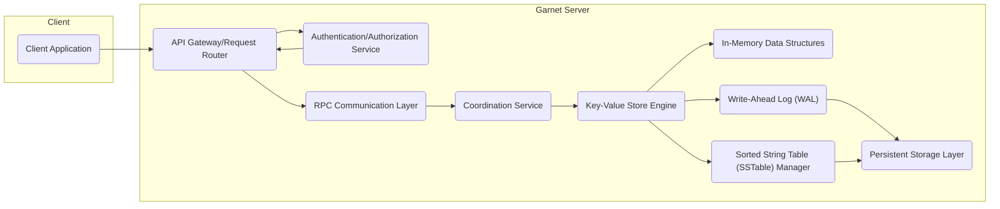

# Project Design Document: Garnet - A Remote Persistent Key-Value Store

**Version:** 1.1
**Date:** October 26, 2023
**Author:** AI Software Architect

## 1. Introduction

This document provides an enhanced design overview of the Garnet project, a remote persistent key-value store developed by Microsoft and hosted on GitHub (https://github.com/microsoft/garnet). This document aims to provide a more detailed and comprehensive understanding of Garnet's architecture, components, and data flow, serving as a robust foundation for subsequent threat modeling activities.

## 2. Goals and Objectives

The primary goals of the Garnet project are to:

* Provide a high-performance, low-latency remote key-value store suitable for demanding applications.
* Offer strong persistence guarantees for stored data, ensuring durability even in the face of failures.
* Support efficient data access patterns, including both point lookups and potentially range queries.
* Be horizontally scalable to handle increasing data volumes and request rates.
* Be highly reliable and fault-tolerant.
* Offer a simple and intuitive API for clients, abstracting away the underlying complexity.

## 3. High-Level Architecture

Garnet's architecture comprises the following key components, interacting to provide the key-value storage functionality:

* **Client Application:**  Any application or service that interacts with the Garnet service to perform key-value operations.
* **API Gateway/Request Router:** The entry point for all client requests. Responsible for request routing, basic validation, and potentially rate limiting.
* **Authentication/Authorization Service:** Handles client authentication and authorization, ensuring only authorized clients can access specific data or perform certain operations.
* **RPC Communication Layer:** Facilitates efficient and reliable communication between the API Gateway and the internal Garnet services. Likely uses gRPC.
* **Coordination Service:** Manages the distributed nature of Garnet, handling tasks like leader election, membership management, and potentially distributed transactions.
* **Key-Value Store Engine:** The core component responsible for managing the key-value data. Handles read, write, and delete operations, interacting with the memory, log, and storage layers.
* **In-Memory Data Structures:**  Utilizes in-memory data structures (e.g., hash tables, skip lists) for fast data access and indexing.
* **Write-Ahead Log (WAL):** A persistent, append-only log that records all write operations before they are applied to the main data store, ensuring durability and atomicity.
* **Sorted String Table (SSTable) Manager:** Manages the creation, merging, and compaction of SSTables, the on-disk data format for efficient storage and retrieval.
* **Persistent Storage Layer:** The underlying storage mechanism where the actual key-value data is stored persistently in SSTable format.

## 4. Detailed Component Descriptions

### 4.1. Client Application

* Represents any external entity needing to store and retrieve data from Garnet.
* Interacts with Garnet via the defined API (likely using an SDK or client library).
* Responsible for handling connection management, request serialization/deserialization, and error handling.

### 4.2. API Gateway/Request Router

* Serves as the single point of entry for client requests.
* Performs initial request validation (e.g., format, basic parameters).
* Routes requests to the appropriate internal service based on the operation and potentially the key.
* May implement rate limiting or other traffic management policies.

### 4.3. Authentication/Authorization Service

* Responsible for verifying the identity of clients attempting to access Garnet.
* Enforces authorization policies, determining if an authenticated client has permission to perform the requested operation on the specified key.
* May integrate with external identity providers.

### 4.4. RPC Communication Layer

* Provides a high-performance communication mechanism between internal Garnet services.
* Likely utilizes gRPC for its efficiency, strong typing, and support for various languages.
* Handles serialization and deserialization of messages between services.

### 4.5. Coordination Service

* Manages the distributed aspects of Garnet, especially in a clustered deployment.
* May implement a consensus algorithm (e.g., Raft, Paxos) for leader election and distributed agreement.
* Tracks the membership of the Garnet cluster.
* Could be involved in coordinating distributed transactions or ensuring data consistency across nodes.

### 4.6. Key-Value Store Engine

* The core logic of Garnet, responsible for all data operations.
* Handles `GET`, `PUT`, and `DELETE` requests.
* Interacts with the In-Memory Data Structures for fast lookups.
* Writes all mutations to the Write-Ahead Log for durability.
* Triggers the creation and management of SSTables via the SSTable Manager.

### 4.7. In-Memory Data Structures

* Utilizes in-memory data structures like hash tables or skip lists to store recently accessed data and indexes for efficient lookups.
* Acts as a cache to reduce the need to access persistent storage for frequently accessed data.
* Implements a cache eviction policy (e.g., LRU) to manage memory usage.

### 4.8. Write-Ahead Log (WAL)

* An append-only log stored on persistent storage.
* Every write operation is first written to the WAL before being applied to the in-memory structures or SSTables.
* Ensures durability: even if the server crashes before data is written to the main storage, the WAL can be replayed upon restart to recover the lost writes.
* Provides atomicity: either the entire write operation is applied, or none of it is.

### 4.9. Sorted String Table (SSTable) Manager

* Responsible for managing the on-disk storage of data in SSTable format.
* SSTables are immutable, sorted files that store key-value pairs.
* Handles the creation of new SSTables from in-memory data.
* Performs compaction of SSTables to merge and optimize them, reclaiming space and improving read performance.

### 4.10. Persistent Storage Layer

* The underlying storage system where SSTables and the WAL are stored.
* Could be implemented using:
    * Local file system on each server node.
    * Network-attached storage (NAS).
    * Cloud-based object storage services (e.g., Azure Blob Storage, AWS S3).
    * Distributed file systems (e.g., HDFS).
* The choice of storage impacts performance, cost, and durability characteristics.

## 5. Data Flow

The following describes the typical data flow for key operations:

### 5.1. Write Operation (PUT)

1. Client Application sends a `PUT` request to the API Gateway.
2. API Gateway authenticates and authorizes the request via the Authentication/Authorization Service.
3. API Gateway routes the request to the appropriate Key-Value Store Engine instance via the RPC Communication Layer, potentially involving the Coordination Service for routing decisions.
4. The Key-Value Store Engine writes the operation to the Write-Ahead Log.
5. The Key-Value Store Engine updates the In-Memory Data Structures.
6. Periodically, data from the in-memory structures is flushed to disk as new SSTables by the SSTable Manager.
7. The SSTable Manager writes the new SSTables to the Persistent Storage Layer.
8. The Key-Value Store Engine confirms the successful write operation back through the RPC Layer and API Gateway to the Client Application.

### 5.2. Read Operation (GET)

1. Client Application sends a `GET` request to the API Gateway.
2. API Gateway authenticates and authorizes the request.
3. API Gateway routes the request to the appropriate Key-Value Store Engine instance.
4. The Key-Value Store Engine first checks the In-Memory Data Structures.
    * If the data is found (cache hit), it is returned directly.
    * If the data is not found (cache miss), the Key-Value Store Engine consults the SSTable Manager.
5. The SSTable Manager locates the relevant SSTable(s) on the Persistent Storage Layer.
6. The data is read from the SSTable(s).
7. The retrieved data may be added to the In-Memory Data Structures based on the caching policy.
8. The data is sent back to the Client Application.

### 5.3. Delete Operation (DELETE)

1. Client Application sends a `DELETE` request to the API Gateway.
2. API Gateway authenticates and authorizes the request.
3. API Gateway routes the request to the appropriate Key-Value Store Engine instance.
4. The Key-Value Store Engine writes the delete operation (often a "tombstone") to the Write-Ahead Log.
5. The Key-Value Store Engine updates the In-Memory Data Structures (marking the key as deleted).
6. The deletion will eventually be reflected in the SSTables during compaction.
7. The Key-Value Store Engine confirms the successful delete operation back to the Client Application.

## 6. Key Technologies

Based on the project's nature and Microsoft's technology stack, the following technologies are highly likely to be used:

* **Programming Language:** C# (.NET)
* **RPC Framework:** gRPC (.NET implementation)
* **Concurrency and Asynchrony:**  .NET's `async`/`await` for handling concurrent operations efficiently.
* **Data Structures:**  Likely using collections from the .NET framework, potentially specialized data structures for performance.
* **Logging:**  `Microsoft.Extensions.Logging` or similar .NET logging frameworks.
* **Configuration Management:**  `.NET Configuration` for managing application settings.
* **Testing Framework:**  Likely xUnit.net for unit and integration testing.

## 7. Deployment Model

Garnet is designed for distributed deployment and can be deployed in various environments:

* **Self-Managed Clusters:** Deployed on a cluster of physical or virtual machines managed by the user, requiring manual configuration and management of the infrastructure.
* **Containerized Deployment (Docker/Kubernetes):**  Packaged as Docker containers and orchestrated using Kubernetes for scalability, resilience, and automated management. This is a highly probable deployment model.
* **Cloud-Native Services:** Deployed as a managed service on cloud platforms like Azure (potentially leveraging Azure Kubernetes Service - AKS), AWS (EKS), or GCP (GKE), abstracting away infrastructure management.

## 8. Security Considerations (Pre-Threat Modeling)

Several security aspects need careful consideration during threat modeling:

* **Authentication and Authorization:**
    * Client authentication mechanisms (e.g., API keys, OAuth 2.0).
    * Granular authorization controls to restrict access to specific keys or namespaces.
    * Secure storage and management of credentials.
* **Data Encryption:**
    * Encryption at rest for data stored in the Persistent Storage Layer.
    * Encryption in transit for all communication between clients and the server, and between internal components (e.g., TLS/SSL).
* **Input Validation and Sanitization:**  Rigorous validation of all client inputs to prevent injection attacks (e.g., command injection, NoSQL injection).
* **Access Control:**  Secure access control mechanisms for the underlying storage and internal services to prevent unauthorized access.
* **Auditing and Logging:** Comprehensive audit logs tracking access attempts, data modifications, and administrative actions.
* **Denial of Service (DoS) Protection:** Mechanisms to mitigate DoS attacks, such as rate limiting, connection limits, and resource quotas.
* **Vulnerability Management:**  Regular security scanning and patching of dependencies and the Garnet codebase.
* **Secure Configuration:**  Secure default configurations and guidance on hardening the deployment environment.
* **Secrets Management:** Securely managing sensitive information like database credentials and encryption keys.

## 9. Assumptions and Constraints

* The client application is assumed to have reliable network connectivity to the Garnet service.
* The Persistent Storage Layer provides the expected durability and availability characteristics.
* The RPC Communication Layer ensures reliable and ordered message delivery between internal services.
* Security features like authentication and authorization are configurable and can be enforced based on deployment requirements.
* The Coordination Service ensures consistency and fault tolerance in a distributed environment.

## 10. Future Considerations

* **Enhanced Query Capabilities:**  Support for more complex queries beyond simple key lookups, such as range queries or filtering.
* **Transactions:**  Support for ACID transactions across multiple key-value pairs.
* **Replication and Sharding:**  Explicit mechanisms for data replication and sharding to improve scalability, availability, and fault tolerance.
* **Monitoring and Observability:**  Comprehensive monitoring metrics and tracing capabilities for performance analysis and troubleshooting.
* **Backup and Restore:**  Features for backing up and restoring the data store.
* **Data Compression:**  Implementing data compression to reduce storage costs and improve I/O performance.
* **Integration with other Microsoft Services:**  Seamless integration with other Azure services and technologies.

This improved document provides a more detailed and nuanced understanding of the Garnet project's architecture and functionality. This enhanced information will be invaluable for conducting a thorough and effective threat modeling exercise.