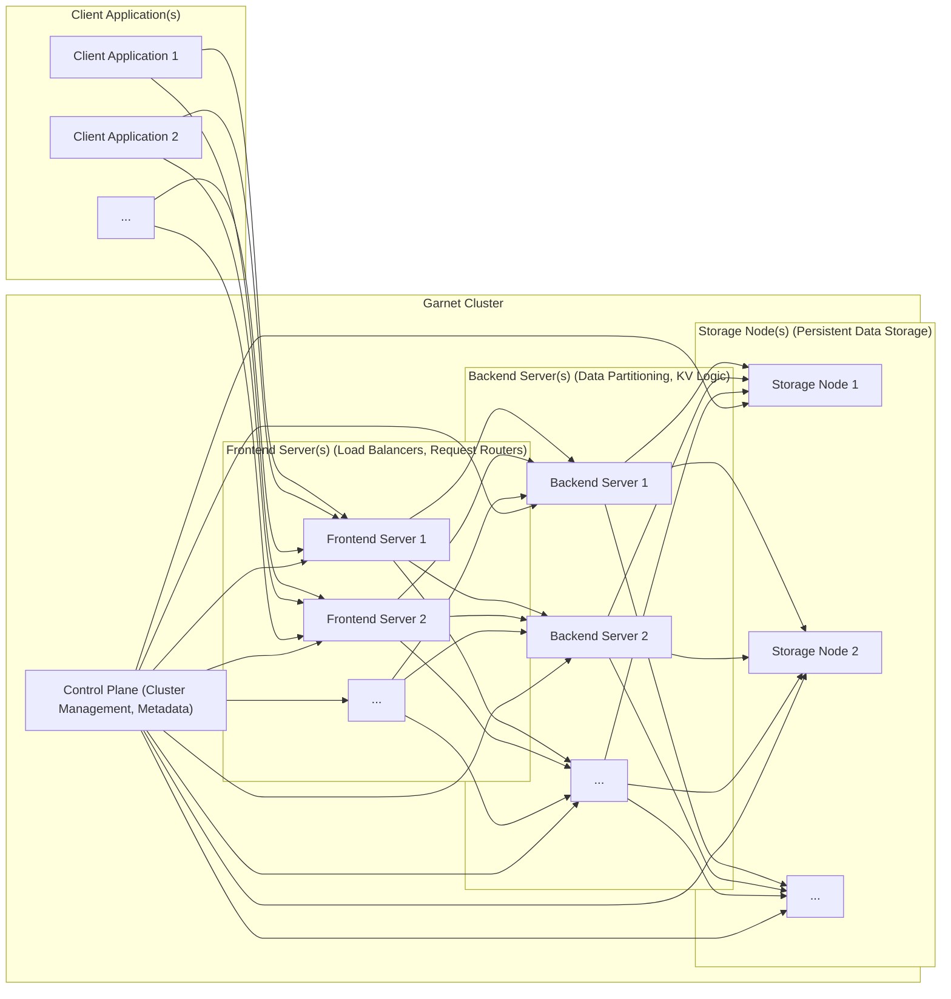
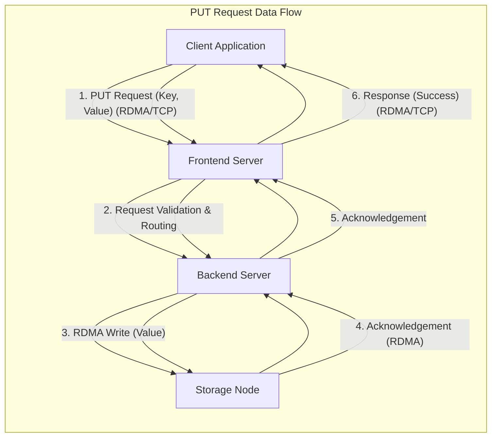
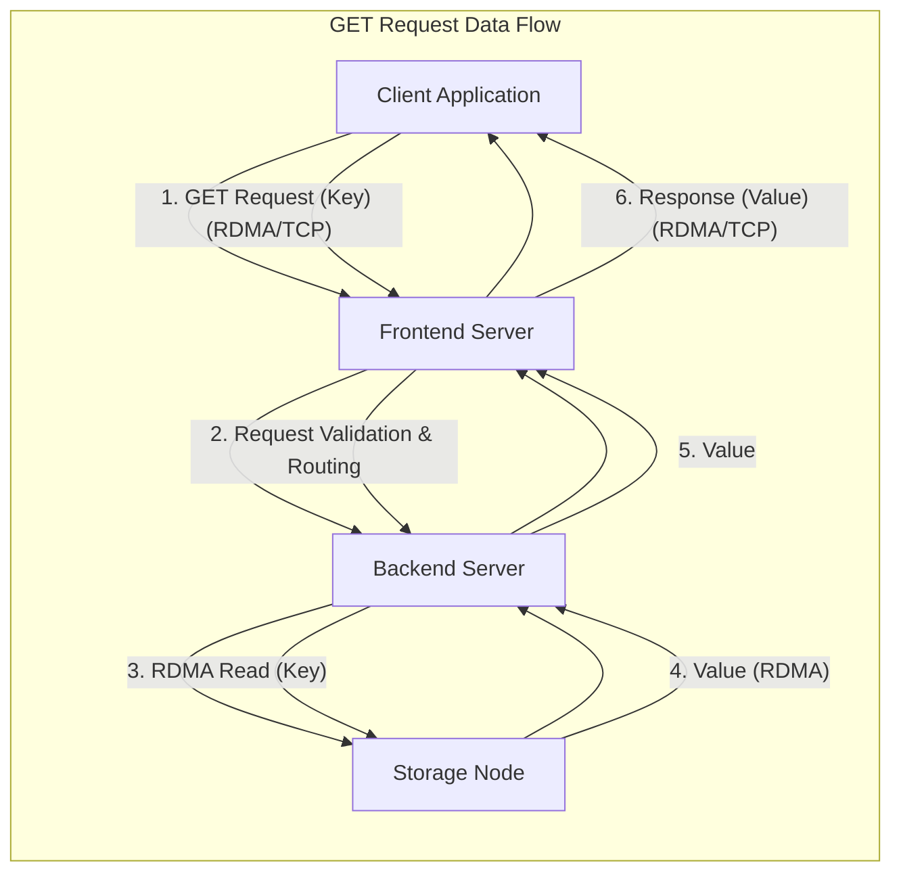

# Project Design Document: Garnet - RDMA-Accelerated Key-Value Store

## 1. Introduction

### 1.1. Project Overview

Garnet is a cutting-edge, high-performance, low-latency key-value store meticulously engineered to harness the power of Remote Direct Memory Access (RDMA) for unparalleled data access and transfer efficiency.  It is designed to surpass the performance limitations of traditional key-value stores by significantly reducing CPU overhead in data movement and capitalizing on the exceptional bandwidth and minimal latency offered by RDMA-enabled networks. Garnet is specifically targeted for demanding applications requiring extreme performance, such as in-memory databases, distributed caching layers, high-frequency trading platforms, and real-time analytics systems. This document provides a comprehensive design overview of Garnet, serving as a foundational resource for subsequent threat modeling and in-depth security analysis.

### 1.2. Goals and Objectives

*   **Extreme Performance:**  Achieve orders of magnitude higher throughput and significantly lower latency compared to conventional TCP/IP based key-value stores.  Target sub-microsecond latency for critical operations.
*   **RDMA-Centric Design:**  Maximize the utilization of RDMA across all communication paths within the system, including client-server and server-server interactions, to minimize CPU involvement and maximize bandwidth utilization.
*   **Horizontal Scalability:**  Enable seamless horizontal scaling by allowing the addition of storage nodes and backend servers to accommodate growing data volumes and increasing request loads without significant performance degradation.
*   **Robust Fault Tolerance:**  Implement comprehensive fault tolerance mechanisms to guarantee data availability and system resilience in the face of node failures, network disruptions, and other potential issues. This includes data replication and distributed consensus.
*   **Developer-Friendly API:**  Provide a well-documented and easy-to-use client library that simplifies integration into a wide range of existing and new applications, abstracting away the complexities of RDMA.
*   **Security Awareness:**  Incorporate security considerations throughout the design process, recognizing that while performance is paramount, security is a critical aspect for real-world deployments. This document initiates the security discussion and provides a basis for detailed threat modeling.

### 1.3. Target Audience

This document is specifically tailored for:

*   **Software Developers:** To gain a deep understanding of the system architecture, component interactions, and design principles for effective development, contribution, and integration of Garnet into applications.
*   **System Operators and DevOps Engineers:** To comprehend the deployment model, operational procedures, monitoring requirements, and maintenance aspects of Garnet clusters in production environments.
*   **Cybersecurity Analysts and Security Engineers:** To conduct thorough threat modeling, perform vulnerability assessments, and execute penetration testing based on a detailed understanding of the system's architecture and data flows.
*   **Project Managers and Stakeholders:** To obtain a high-level overview of the project's architecture, scope, and key design decisions, facilitating informed decision-making and project oversight.

## 2. System Architecture

### 2.1. High-Level Architecture Diagram

### 2.2. Architecture Description

Garnet is built upon a distributed, multi-tiered architecture designed for high performance and scalability. The core components are:

*   **Client Application:**  The external application that needs to store and retrieve key-value data. It interacts with the Garnet cluster through the provided client library, initiating operations like `GET`, `PUT`, `DELETE`, and potentially more complex operations.
*   **Frontend Server (Load Balancer & Request Router):**  Acts as the initial point of contact for all client requests. Frontend servers perform crucial functions:
    *   **Request Reception:**  Accept incoming client requests, ideally over RDMA for optimal performance.
    *   **Request Parsing and Validation:**  Parse and validate incoming requests to ensure they are well-formed and conform to the expected API. This includes input sanitization to prevent injection attacks.
    *   **Authentication and Authorization (Initial):**  Perform initial authentication of clients and authorization checks to ensure they have the necessary permissions to access the system.
    *   **Load Balancing:** Distribute incoming client requests across available Backend Servers to ensure even load distribution and prevent overload on any single server.
    *   **Request Routing:**  Determine the appropriate Backend Server to handle a specific request based on the key's hash or a predefined partitioning scheme. This ensures requests are directed to the Backend Server responsible for the relevant data partition.
    *   **Connection Management:** Manage client connections and potentially implement connection pooling for efficiency.
    *   **TLS Termination (Optional):**  Handle TLS/SSL termination for secure client connections if encryption in transit is required.
    *   **Web Application Firewall (WAF) Integration (Optional):** Integrate with a WAF for enhanced protection against common web application attacks.
*   **Backend Server (Data Partitioning & Key-Value Logic):**  The core processing engine of the key-value store. Backend servers are responsible for:
    *   **Request Processing:**  Receive routed requests from Frontend Servers and execute the core key-value operations (GET, PUT, DELETE, etc.).
    *   **Data Partitioning Management:**  Maintain knowledge of the data partitioning scheme and determine which Storage Node holds the data for a given key.
    *   **Key-Value Store Logic:** Implement the underlying key-value store logic, including data structures for indexing and efficient data access. This might involve hash tables, trees, or other optimized data structures.
    *   **RDMA Operations with Storage Nodes:**  Communicate with Storage Nodes using RDMA to perform data storage and retrieval operations. This is the primary path for data interaction and performance optimization.
    *   **Data Replication and Consistency (Potentially):** Implement mechanisms for data replication across multiple Storage Nodes to ensure fault tolerance and data durability. This might involve synchronous or asynchronous replication strategies and distributed consensus protocols (e.g., Raft, Paxos) for consistency.
    *   **Transaction Management (Potentially):**  Support transactional operations if required, ensuring atomicity, consistency, isolation, and durability (ACID) properties for data modifications.
    *   **Caching (Optional):** Implement a local cache to store frequently accessed data in memory for faster retrieval.
*   **Storage Node (Persistent Data Storage):**  The persistent storage layer responsible for durably storing the key-value data. Storage Nodes are designed for:
    *   **Persistent Data Storage:**  Store data on persistent storage media, typically high-performance NVMe SSDs or other low-latency storage devices.
    *   **RDMA Data Access:**  Serve read and write requests from Backend Servers via RDMA, providing high-bandwidth and low-latency data access.
    *   **Local Data Caching (Optional):**  Implement a local cache (e.g., in DRAM) to improve read performance for frequently accessed data.
    *   **Data at Rest Encryption (Optional):**  Encrypt data stored on persistent storage to protect data confidentiality.
    *   **Data Integrity Verification:**  Implement mechanisms to ensure data integrity on storage media, such as checksums or error correction codes.
*   **Control Plane (Cluster Management & Metadata):**  The central management and coordination component of the Garnet cluster. The Control Plane is responsible for:
    *   **Cluster Membership Management:**  Handle node joining and leaving the cluster, maintaining an up-to-date view of active Frontend, Backend, and Storage Nodes.
    *   **Metadata Management:**  Store and manage cluster metadata, including data partitioning information, node health status, configuration parameters, and potentially schema information.
    *   **Configuration Management:**  Distribute and manage configuration updates across the cluster components.
    *   **Monitoring and Health Checks:**  Monitor the health and performance of all cluster components, detecting failures and triggering recovery procedures.
    *   **Failover and Recovery:**  Orchestrate failover and recovery processes in case of node failures, ensuring data availability and system resilience. This might involve leader election, data redistribution, and replica synchronization.
    *   **Administrative Interface:**  Provide an administrative interface (e.g., CLI, API) for cluster management, monitoring, and configuration.
    *   **Security Policy Enforcement:**  Manage and enforce security policies across the cluster, such as access control rules and encryption settings.

## 3. Component Details

### 3.1. Client Library

*   **Functionality:**  Provides a user-friendly API for client applications to interact with the Garnet cluster.  Offers functions for common key-value operations like `Get(key)`, `Put(key, value)`, `Delete(key)`, `BatchGet(keys)`, `BatchPut(keyValues)`, etc.  May also include features like connection pooling, retry mechanisms, and asynchronous operation support.
*   **Technology:**  Likely implemented primarily in C# (based on the GitHub repository), offering high performance and cross-platform compatibility.  Potentially provides bindings or wrappers for other popular programming languages (e.g., Python, Java, C++) to broaden its usability.
*   **Communication:**  Optimized for RDMA communication with Frontend Servers for data operations. May utilize TCP/IP for initial connection establishment, control plane interactions (if any), or as a fallback mechanism in environments where RDMA is not fully available or configured.
*   **Security Considerations:**
    *   **Secure Connection Establishment:**  Implement secure mechanisms for establishing connections with Frontend Servers, such as mutual TLS or other authentication protocols.
    *   **Authentication and Authorization:**  Integrate with the Garnet authentication and authorization mechanisms to securely identify and authenticate client applications. Handle credential management securely.
    *   **Data Encryption in Transit:**  Support encryption of data in transit between the client library and Garnet servers, especially when using TCP/IP as a fallback.
    *   **Input Validation and Sanitization:**  Perform client-side input validation to prevent common injection attacks and ensure data integrity.
    *   **Dependency Management:**  Carefully manage dependencies of the client library to avoid introducing vulnerabilities from third-party libraries.

### 3.2. Frontend Server

*   **Functionality:**  Serves as the entry point and load balancer for the Garnet cluster.  Handles client connections, request routing, and initial security checks.  Aims to offload processing from Backend Servers and Storage Nodes.
*   **Technology:**  Likely implemented in C# for performance and maintainability.  May leverage high-performance networking libraries and frameworks.
*   **Communication:**
    *   **Client Communication:**  Primarily RDMA for high-throughput data transfer and low latency.  TCP/IP as a fallback for initial connection, control messages, or non-RDMA environments.  Support for TLS/SSL for secure client connections over TCP/IP.
    *   **Backend Server Communication:**  RDMA for low-latency and high-bandwidth communication with Backend Servers.
    *   **Control Plane Communication:**  TCP/IP or similar protocols for control plane interactions, such as receiving configuration updates and reporting health status.
*   **Security Considerations:**
    *   **Authentication and Authorization:**  Implement robust authentication mechanisms to verify client identities (e.g., API keys, OAuth 2.0, mutual TLS). Enforce authorization policies to control client access to specific operations and data.
    *   **Input Validation and Sanitization:**  Thoroughly validate and sanitize all incoming client requests to prevent injection attacks (e.g., command injection, SQL injection if applicable, cross-site scripting if web-based management is exposed).
    *   **Rate Limiting and DDoS Protection:**  Implement rate limiting and other mechanisms to protect against denial-of-service (DoS) and distributed denial-of-service (DDoS) attacks.
    *   **Secure Communication:**  Enforce secure communication channels, including TLS/SSL for TCP/IP based communication and leveraging RDMA security features where available.
    *   **Web Application Firewall (WAF):**  Consider integrating with a WAF to provide an additional layer of security against web-based attacks, especially if the Frontend Server exposes any web-based management interfaces.
    *   **Regular Security Audits:**  Conduct regular security audits and penetration testing of Frontend Servers to identify and remediate vulnerabilities.

### 3.3. Backend Server

*   **Functionality:**  The core engine of the key-value store, responsible for data partitioning, key-value operation logic, and interaction with Storage Nodes.  Manages the distributed nature of the data.
*   **Technology:**  Likely implemented in C# for performance and complex logic handling.  May utilize concurrent data structures and algorithms for high throughput.
*   **Communication:**
    *   **Frontend Server Communication:**  RDMA for low-latency request processing and efficient data transfer.
    *   **Storage Node Communication:**  RDMA for high-bandwidth and low-latency data access to Storage Nodes.
    *   **Control Plane Communication:**  TCP/IP or similar for cluster management, metadata updates, and health reporting.
    *   **Inter-Backend Server Communication:**  Potentially RDMA or TCP/IP for data replication, consistency protocols (e.g., for distributed consensus), and distributed transaction management.  The choice depends on the consistency model and replication strategy.
*   **Security Considerations:**
    *   **Authorization and Access Control:**  Enforce fine-grained authorization policies to control access to data based on user roles or application permissions.  Ensure that Backend Servers only access data they are authorized to manage.
    *   **Data Integrity:**  Implement mechanisms to ensure data integrity throughout the data lifecycle, including checksums, data validation, and potentially cryptographic hashing.
    *   **Secure Data Handling in Memory:**  Handle sensitive data securely in memory, minimizing the risk of memory leaks or unauthorized access. Consider memory scrubbing techniques for sensitive data.
    *   **Intra-Cluster Security:**  Secure communication channels between Backend Servers and Storage Nodes, and between Backend Servers themselves, using RDMA security features or encryption protocols.
    *   **Resource Management:**  Implement resource management and isolation mechanisms to prevent resource exhaustion and ensure fair resource allocation among different requests and operations.
    *   **Code Security:**  Follow secure coding practices to minimize vulnerabilities in the Backend Server code, including input validation, output encoding, and proper error handling.

### 3.4. Storage Node

*   **Functionality:**  Provides persistent and high-performance storage for the key-value data.  Responds to data access requests from Backend Servers.  Focuses on data durability and low-latency access.
*   **Technology:**  Likely implemented in C# or potentially lower-level languages (C/C++) for performance-critical storage operations and direct hardware interaction.  May utilize kernel bypass techniques for optimized RDMA performance.
*   **Communication:**
    *   **Backend Server Communication:**  RDMA for high-bandwidth and low-latency data transfer.  This is the primary communication path.
    *   **Control Plane Communication:**  TCP/IP or similar for control plane interactions, such as health checks, status updates, and potentially configuration updates.
*   **Security Considerations:**
    *   **Data at Rest Encryption:**  Implement robust data at rest encryption to protect the confidentiality of data stored on persistent storage. Use strong encryption algorithms and secure key management practices.
    *   **Access Control:**  Restrict physical and logical access to Storage Nodes and the underlying storage devices. Implement operating system-level access controls and potentially application-level access controls.
    *   **Physical Security:**  Ensure the physical security of the data center or environment where Storage Nodes are deployed to prevent unauthorized physical access and data theft.
    *   **Data Integrity:**  Implement data integrity mechanisms to detect and prevent data corruption on storage media. Utilize checksums, RAID configurations, and potentially error-correcting codes.
    *   **Secure Boot and System Hardening:**  Implement secure boot processes and system hardening measures to protect the Storage Node operating system and prevent unauthorized modifications.
    *   **Regular Security Updates:**  Keep the operating system and software components of Storage Nodes up-to-date with the latest security patches to mitigate known vulnerabilities.

### 3.5. Control Plane

*   **Functionality:**  The central nervous system of the Garnet cluster, responsible for cluster management, coordination, and metadata management.  Ensures the overall health and stability of the cluster.
*   **Technology:**  Likely implemented in C# for management logic and cluster coordination.  May utilize distributed consensus algorithms and distributed databases for metadata storage.
*   **Communication:**
    *   **Frontend Server Communication:**  TCP/IP or similar for configuration updates, health status monitoring, and potentially cluster membership updates.
    *   **Backend Server Communication:**  TCP/IP or similar for cluster management, metadata distribution, and coordination of distributed operations.
    *   **Storage Node Communication:**  TCP/IP or similar for node monitoring, health checks, and potentially storage-related management tasks.
    *   **Administrator Interface:**  Secure administrative interface (CLI, API, or GUI) for cluster management, monitoring, and configuration.  Access should be strictly controlled.
*   **Security Considerations:**
    *   **Strong Authentication and Authorization:**  Implement strong authentication mechanisms (e.g., multi-factor authentication, certificate-based authentication) to secure access to the Control Plane. Enforce strict role-based access control (RBAC) to limit administrative privileges.
    *   **Audit Logging:**  Comprehensive audit logging of all administrative actions and security-related events within the Control Plane. Logs should be securely stored and regularly reviewed.
    *   **Secure Communication:**  Encrypt all communication channels used by the Control Plane, including communication with other cluster components and the administrative interface.
    *   **Role-Based Access Control (RBAC):**  Implement granular RBAC to control access to different administrative functions and resources within the Control Plane.  Principle of least privilege should be applied.
    *   **Regular Security Audits and Penetration Testing:**  Conduct regular security audits and penetration testing of the Control Plane to identify and address vulnerabilities.
    *   **Backup and Recovery:**  Implement robust backup and recovery procedures for the Control Plane metadata and configuration to ensure business continuity in case of failures.
    *   **Isolation:**  Isolate the Control Plane network and infrastructure from public networks and potentially from the data plane network to limit the attack surface.

### 3.6. RDMA Layer

*   **Functionality:**  Provides the underlying RDMA communication infrastructure that enables high-performance data transfer between Garnet components.  Abstracts away the complexities of RDMA hardware and protocols.
*   **Technology:**  Leverages RDMA libraries and hardware, such as `libfabric`, `Mellanox OFED`, or similar, depending on the chosen RDMA interconnect (InfiniBand, RoCE, iWARP).  May utilize specific RDMA protocols like verbs API, RDMA CM, etc.
*   **Communication:**  The foundation for high-performance communication between Client-Frontend, Frontend-Backend, and Backend-Storage nodes.  Enables zero-copy data transfer and kernel bypass.
*   **Security Considerations:**
    *   **RDMA Security Features:**  Utilize available RDMA security features, such as Partition Keys (P_Keys) for network segmentation and Access Control Lists (ACLs) for controlling RDMA access.
    *   **Network Segmentation and Isolation:**  Isolate the RDMA network from less trusted networks to limit the potential impact of security breaches.  Consider using VLANs or separate physical networks.
    *   **Firmware Security:**  Ensure the firmware of RDMA Network Interface Cards (NICs) is secure, up-to-date, and from trusted vendors.  Firmware vulnerabilities can be exploited to compromise RDMA communication.
    *   **RDMA Protocol Security:**  Understand the security implications of the specific RDMA protocols being used and configure them securely.
    *   **Resource Limits:**  Implement resource limits and quotas for RDMA resources to prevent resource exhaustion and denial-of-service attacks at the RDMA layer.
    *   **Monitoring and Logging:**  Monitor RDMA network traffic and log relevant events for security auditing and troubleshooting.

## 4. Data Flow

### 4.1. Data Flow Diagram (Simplified PUT Request)

### 4.2. Data Flow Diagram (Simplified GET Request)

### 4.3. Data Flow Description (PUT and GET Requests)

**PUT Request Flow:**

1.  **Client Request (RDMA/TCP):** The Client Application initiates a `PUT` request, sending the key and value to a Frontend Server. Ideally, this communication uses RDMA for optimal performance. TCP/IP might be used as a fallback or for initial connection setup.
2.  **Frontend Processing (Validation & Routing):** The Frontend Server receives the request, performs validation (e.g., input sanitization, size checks), and potentially initial authentication/authorization. It then determines the appropriate Backend Server based on the key's partitioning scheme and routes the request.
3.  **Backend RDMA Write:** The Backend Server, upon receiving the routed request, identifies the target Storage Node responsible for storing the data. It then uses RDMA to directly write the value to the memory space of the Storage Node associated with the given key. This RDMA write operation bypasses the CPU on the Storage Node for data transfer, maximizing efficiency.
4.  **Storage Acknowledgement (RDMA):** The Storage Node (or the RDMA hardware on the Storage Node) sends an RDMA-based acknowledgement back to the Backend Server upon successful completion of the write operation. This acknowledgement confirms data persistence.
5.  **Backend Acknowledgement:** The Backend Server, after receiving confirmation from the Storage Node, processes the acknowledgement and prepares a response for the Frontend Server.
6.  **Frontend Response (RDMA/TCP):** The Frontend Server sends a success response back to the Client Application, indicating that the `PUT` operation was successfully completed. This response is ideally sent over RDMA, but TCP/IP might be used as a fallback.

**GET Request Flow:**

1.  **Client Request (RDMA/TCP):** The Client Application sends a `GET` request with a key to a Frontend Server, ideally using RDMA for performance. TCP/IP might be used as a fallback.
2.  **Frontend Processing (Validation & Routing):** Similar to the PUT request, the Frontend Server validates the GET request and routes it to the appropriate Backend Server based on the key's partitioning.
3.  **Backend RDMA Read:** The Backend Server identifies the Storage Node holding the data for the requested key and initiates an RDMA read operation to retrieve the value directly from the Storage Node's memory.
4.  **Storage Value (RDMA):** The Storage Node (or RDMA hardware) responds to the RDMA read request by sending the requested value directly back to the Backend Server's memory via RDMA.
5.  **Backend Value:** The Backend Server receives the value retrieved from the Storage Node. It may perform any necessary post-processing or data transformation.
6.  **Frontend Response (RDMA/TCP):** The Frontend Server sends the retrieved value back to the Client Application as the response to the GET request.  This response is ideally sent over RDMA, with TCP/IP as a potential fallback.

## 5. Technology Stack

*   **Programming Languages:** Primarily C# for core components (Frontend, Backend, Control Plane, Client Library) due to its performance, memory management capabilities, and the Microsoft ecosystem. Potentially C/C++ for performance-critical modules within Storage Nodes or for low-level RDMA interaction if needed for extreme optimization.
*   **RDMA Libraries:**  Likely utilizing high-performance RDMA libraries such as `libfabric` (providing a unified interface to various RDMA providers), `Mellanox OFED` (if targeting Mellanox/NVIDIA InfiniBand or RoCE hardware), or similar libraries. The choice depends on the target RDMA hardware and operating system environment.
*   **Networking:**  RDMA (InfiniBand, RoCE, iWARP) as the primary network transport for high-performance data plane communication. TCP/IP for control plane communication, initial client connection setup, fallback communication in non-RDMA environments, and potentially for inter-node communication in certain scenarios (e.g., wide-area replication).
*   **Operating System:**  Linux is the most probable operating system for server-side components (Frontend, Backend, Storage, Control Plane) due to its robust RDMA support, performance optimizations, and wide adoption in high-performance computing and data center environments. Windows Server might be considered for specific deployments or client-side components.
*   **Storage:**  High-performance NVMe Solid State Drives (SSDs) are the expected persistent storage medium for Storage Nodes, offering low latency and high throughput required for RDMA-accelerated key-value stores.  Potentially other persistent memory technologies in the future.
*   **Data Serialization:**  Efficient binary serialization formats are crucial for minimizing serialization/deserialization overhead. Likely candidates include Protocol Buffers (protobuf), FlatBuffers, Apache Thrift, or custom-designed binary formats optimized for key-value data.
*   **Concurrency and Parallelism:**  Extensive use of asynchronous programming (e.g., async/await in C#), multi-threading, and potentially distributed computing frameworks (e.g., actors, reactive streams) to achieve high concurrency, parallelism, and throughput.  Event-driven architectures are also likely to be employed.
*   **Distributed Consensus (for Replication/Consistency):** If data replication and strong consistency are implemented, distributed consensus algorithms like Raft, Paxos, or Zab are likely candidates for ensuring consistency across replicas.  A distributed key-value store like etcd or Consul might be used for cluster metadata management and leader election.

## 6. Deployment Model

*   **Deployment Environment:**  Primarily designed for deployment in on-premise data centers or cloud environments that offer RDMA-capable infrastructure.  Optimized for environments where low latency and high bandwidth are critical.  Can be deployed on bare-metal servers for maximum performance or within virtualized/containerized environments (e.g., VMs, Kubernetes) with RDMA passthrough or SR-IOV for near-native RDMA performance.
*   **Cluster Deployment Architecture:** Garnet is deployed as a distributed cluster of interconnected nodes, comprising:
    *   **Multiple Frontend Servers:** Deployed behind a load balancer (hardware or software) to provide high availability, load distribution, and a single point of entry for client applications.
    *   **Multiple Backend Servers:**  Horizontally scalable layer for processing key-value operations and managing data partitioning.  The number of Backend Servers can be scaled based on request load and data volume.
    *   **Multiple Storage Nodes:**  Provide distributed persistent storage for the key-value data.  Data is partitioned and distributed across Storage Nodes for scalability and fault tolerance.  The number of Storage Nodes can be scaled based on data capacity and performance requirements.
    *   **Dedicated Control Plane Nodes (Potentially):**  A dedicated cluster of nodes for the Control Plane to ensure high availability and reliability of cluster management functions.  Redundancy and failover mechanisms are crucial for the Control Plane.
*   **Scalability Strategy:**  Horizontal scalability is a core design principle.  Scaling out the cluster involves adding more Frontend Servers, Backend Servers, and Storage Nodes as needed to handle increased load or data growth.  Scaling can be performed dynamically or based on capacity planning.
*   **Containerization and Orchestration:**  Designed to be container-friendly and easily deployable using container orchestration platforms like Kubernetes. Containerization simplifies deployment, management, and scaling of Garnet components, especially in cloud environments.  Kubernetes can manage container lifecycle, scaling, networking, and storage for Garnet.

## 7. Security Considerations (Detailed)

This section expands on the initial security considerations, providing more specific details relevant for threat modeling.

*   **Authentication and Authorization:**
    *   **Client Authentication Methods:**
        *   **API Keys:** Simple API keys for basic authentication, suitable for less sensitive environments. Secure key generation, storage, and rotation are essential.
        *   **Mutual TLS (mTLS):**  Stronger authentication using client certificates and server certificates for mutual authentication and encrypted communication. Recommended for production environments.
        *   **OAuth 2.0/OpenID Connect:**  Integration with industry-standard authentication and authorization frameworks for delegated access and centralized identity management.
        *   **Kerberos:**  For enterprise environments, Kerberos integration can provide strong authentication and single sign-on capabilities.
    *   **Inter-Service Authentication:**
        *   **Mutual TLS (mTLS):**  Mandatory for securing communication between Frontend, Backend, Storage, and Control Plane components. Prevents man-in-the-middle attacks and ensures service identity verification.
        *   **Service Accounts/Managed Identities:**  Utilize service accounts or managed identities (e.g., in cloud environments) for authenticating services to each other, minimizing the need for hardcoded credentials.
        *   **Internal Authentication Tokens:**  Use internally generated and securely managed tokens for authentication between components within the cluster.
    *   **Authorization Mechanisms:**
        *   **Role-Based Access Control (RBAC):**  Implement RBAC to control access to operations and data based on user roles or application roles. Define granular roles and permissions.
        *   **Attribute-Based Access Control (ABAC):**  Consider ABAC for more fine-grained authorization based on attributes of the user, resource, and environment.
        *   **Access Control Lists (ACLs):**  Use ACLs to control access to specific keyspaces or data partitions, if applicable.
        *   **Policy Enforcement Points (PEPs) and Policy Decision Points (PDPs):**  Employ PEPs (e.g., in Frontend Servers) to enforce authorization policies decided by PDPs (e.g., in Control Plane or dedicated authorization service).

*   **Data Confidentiality and Integrity:**
    *   **Data in Transit Encryption:**
        *   **TLS/SSL:**  Mandatory for all TCP/IP based communication, including client-Frontend communication (fallback), Control Plane communication, and potentially inter-node communication in certain scenarios. Use strong cipher suites and regularly update TLS configurations.
        *   **RDMA Encryption (if available):**  Explore and utilize RDMA encryption mechanisms if supported by the RDMA hardware and libraries.  This is crucial for securing high-performance data plane communication.
        *   **IPsec:**  Consider IPsec for encrypting network traffic at the IP layer, providing network-level encryption for all communication within the Garnet cluster.
    *   **Data at Rest Encryption:**
        *   **Disk Encryption:**  Encrypt the entire disks or partitions used by Storage Nodes using operating system-level disk encryption (e.g., LUKS, BitLocker) or hardware-based encryption.
        *   **Application-Level Encryption:**  Implement application-level encryption where data is encrypted before being written to storage. This provides more granular control over encryption keys and can be used in conjunction with disk encryption for defense in depth.  Secure key management is paramount for application-level encryption.
        *   **Key Management System (KMS):**  Utilize a dedicated KMS for secure generation, storage, rotation, and management of encryption keys. Avoid storing keys directly within the Garnet cluster configuration or code.
    *   **Data Integrity Checks:**
        *   **Checksums/Hashing:**  Calculate and verify checksums or cryptographic hashes for data blocks during transmission and storage to detect data corruption or tampering.
        *   **Data Validation:**  Implement data validation at multiple layers (Client Library, Frontend Server, Backend Server, Storage Node) to ensure data integrity and prevent injection of malicious data.
        *   **Immutable Data Structures (Potentially):**  Consider using immutable data structures where possible to enhance data integrity and simplify reasoning about data consistency.

*   **Network Security:**
    *   **RDMA Network Segmentation:**  Isolate the RDMA network on a separate VLAN or physical network to limit the attack surface and prevent unauthorized access.
    *   **Control Plane Network Isolation:**  Isolate the Control Plane network from public networks and potentially from the data plane network.  Restrict access to the Control Plane network to authorized administrators and services.
    *   **Firewalling:**  Deploy firewalls to control network traffic flow between Garnet components and between Garnet cluster and external networks.  Implement strict firewall rules based on the principle of least privilege.
    *   **Intrusion Detection and Prevention Systems (IDS/IPS):**  Consider deploying IDS/IPS to monitor network traffic for malicious activity and automatically block or alert on suspicious events.
    *   **Network Micro-segmentation:**  Implement network micro-segmentation to further isolate different Garnet components and limit the blast radius of potential security breaches.

*   **Availability and Resilience:**
    *   **High Availability (HA) for Components:**
        *   **Frontend Server HA:**  Deploy multiple Frontend Servers behind a load balancer for redundancy and failover.
        *   **Backend Server HA:**  Deploy multiple Backend Servers and use data partitioning and replication to ensure continued operation even if some Backend Servers fail.
        *   **Storage Node HA:**  Implement data replication across multiple Storage Nodes and use distributed consensus to maintain data consistency and availability in case of Storage Node failures.
        *   **Control Plane HA:**  Deploy a cluster of Control Plane nodes with leader election and data replication to ensure Control Plane availability.
    *   **Fault Tolerance Mechanisms:**
        *   **Data Replication:**  Implement synchronous or asynchronous data replication across multiple Storage Nodes to ensure data durability and availability.
        *   **Distributed Consensus:**  Use distributed consensus algorithms (e.g., Raft, Paxos) to maintain data consistency across replicas and ensure fault-tolerant operation.
        *   **Automatic Failover:**  Implement automatic failover mechanisms to switch to backup components in case of primary component failures.
        *   **Health Monitoring and Alerting:**  Comprehensive health monitoring of all components with automated alerting for failures or performance degradation.
    *   **Disaster Recovery (DR):**
        *   **Backup and Restore:**  Implement regular backups of cluster metadata and potentially data (depending on DR requirements).  Test backup and restore procedures regularly.
        *   **Replication to Secondary Site:**  Consider replicating data to a secondary data center or cloud region for disaster recovery purposes.  Implement mechanisms for failover to the secondary site in case of a primary site disaster.

*   **Operational Security:**
    *   **Centralized Logging and Monitoring:**  Implement centralized logging and monitoring infrastructure to collect logs and metrics from all Garnet components.  Use security information and event management (SIEM) systems for security monitoring and incident response.
    *   **Security Auditing:**  Regular security audits of Garnet infrastructure, configurations, and code to identify and remediate vulnerabilities.
    *   **Vulnerability Management:**  Implement a vulnerability management process that includes regular vulnerability scanning, patching, and tracking of security vulnerabilities in Garnet components and dependencies.
    *   **Incident Response Plan:**  Develop and maintain a comprehensive incident response plan for handling security incidents in the Garnet cluster.  Regularly test and update the incident response plan.
    *   **Secure Configuration Management:**  Use secure configuration management tools and practices to ensure consistent and secure configurations across all Garnet components.  Implement infrastructure-as-code (IaC) for reproducible and auditable infrastructure deployments.
    *   **Principle of Least Privilege:**  Apply the principle of least privilege throughout the Garnet system, granting only necessary permissions to users, applications, and services.
    *   **Security Training:**  Provide security training to developers, operators, and administrators involved in the Garnet project to raise security awareness and promote secure practices.

## 8. Threat Modeling Preparation

### 8.1. Target Assets and Security Objectives

| Asset                     | Confidentiality | Integrity | Availability |
| -------------------------- | --------------- | --------- | ------------ |
| Key-Value Data            | High            | High      | High         |
| Cluster Metadata          | High            | High      | High         |
| Frontend Servers          | Medium          | High      | High         |
| Backend Servers           | High            | High      | High         |
| Storage Nodes             | High            | High      | High         |
| Control Plane             | High            | High      | High         |
| RDMA Infrastructure       | Medium          | High      | High         |
| Client Applications       | Medium          | Medium      | Medium         |
| Administrative Interfaces | High            | High      | High         |
| Logs and Audit Trails     | Medium          | High      | High         |

### 8.2. Threat Modeling Scope (Refined)

*   **In-Scope:**
    *   All components described in Section 3 (Client Library, Frontend Server, Backend Server, Storage Node, Control Plane, RDMA Layer).
    *   All data flows described in Section 4 (PUT and GET request flows, and implicitly other operations like DELETE, BATCH operations).
    *   Authentication and authorization mechanisms for clients and inter-service communication.
    *   Data confidentiality and integrity measures (encryption, checksums, validation).
    *   Network security aspects (RDMA network security, Control Plane security, firewalling, segmentation).
    *   Availability and resilience mechanisms (HA, fault tolerance, DR).
    *   Operational security aspects (logging, monitoring, patching, configuration management).
    *   Administrative interfaces and management operations.

*   **Out-of-Scope (for initial threat model, may be included in later iterations):**
    *   Physical security of data centers and server rooms (assume adequate physical security controls are in place).
    *   Supply chain security of hardware and software components (assume components are from trusted vendors).
    *   Detailed code-level vulnerabilities within specific modules (focus on architectural and design level threats initially, code review and SAST/DAST can be performed separately).
    *   Compliance and regulatory aspects (e.g., GDPR, HIPAA) - security controls to meet compliance requirements will be considered after core threat model is established.
    *   Specific denial-of-service attack vectors beyond general rate limiting and network security measures (detailed DDoS mitigation strategies can be explored in a separate, more focused threat model).

### 8.3. Next Steps for Threat Modeling

1.  **STRIDE per Component and Data Flow:**  Conduct a detailed STRIDE analysis for each component (Frontend Server, Backend Server, Storage Node, Control Plane, Client Library, RDMA Layer) and for each data flow (PUT, GET, etc.).  Identify potential threats in each STRIDE category (Spoofing, Tampering, Repudiation, Information Disclosure, Denial of Service, Elevation of Privilege).
2.  **Threat Diagram Creation:**  Create detailed threat diagrams (e.g., using tools like Microsoft Threat Modeling Tool) to visually represent the system architecture, data flows, components, and identified threats.
3.  **Threat Prioritization and Risk Assessment:**  Prioritize identified threats based on their potential impact (severity of consequences) and likelihood (probability of occurrence).  Use a risk scoring framework (e.g., DREAD or similar) to quantify risk.
4.  **Security Control Identification and Design:**  For each prioritized threat, identify and design appropriate security controls (preventative, detective, corrective) to mitigate the threat.  Map security controls to security considerations outlined in Section 7.
5.  **Security Control Implementation and Validation:**  Implement the designed security controls in the Garnet system.  Validate the effectiveness of security controls through security testing (penetration testing, vulnerability scanning, security code review).
6.  **Documentation and Threat Model Maintenance:**  Document the threat model, identified threats, security controls, and risk assessment.  Treat the threat model as a living document and update it regularly as the Garnet project evolves, new features are added, and the threat landscape changes.  Re-evaluate the threat model periodically (e.g., annually or after significant changes).

This improved design document provides a more detailed and security-focused foundation for conducting a comprehensive threat model for the Garnet project. It emphasizes security considerations throughout the architecture and provides actionable steps for security analysis and mitigation.