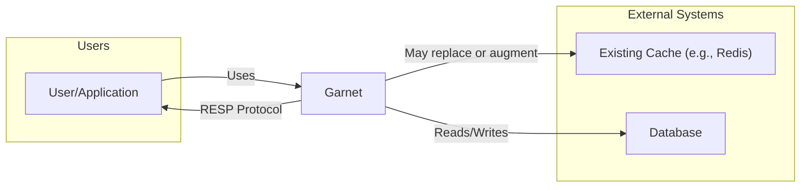
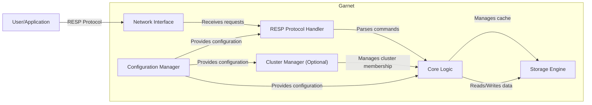
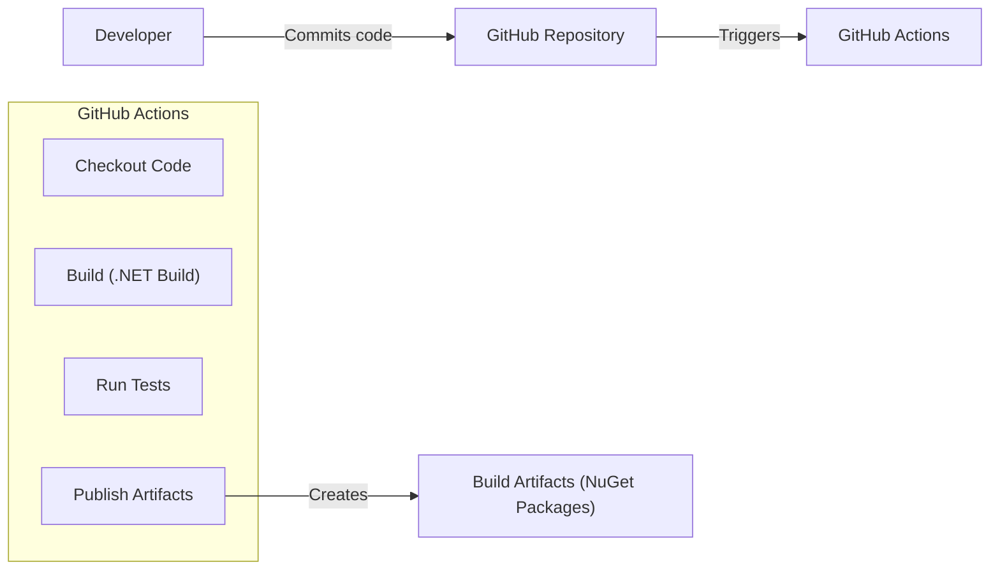

Okay, let's create a design document for the Garnet project from Microsoft, focusing on aspects relevant for threat modeling.

# BUSINESS POSTURE

Garnet is positioned as a fast, resource-efficient, and scalable remote cache store.  It's designed to be a drop-in replacement or enhancement for existing caching solutions, particularly in scenarios with high throughput and low latency requirements.  It appears to be targeted at organizations with significant performance needs, potentially those dealing with large datasets and high user traffic.  It's also designed to be flexible, supporting various deployment models (from single servers to large clusters).  The open-source nature suggests a focus on community contribution and adoption.

Priorities:

*   Performance:  Achieve extremely low latency and high throughput for cache operations.
*   Scalability:  Scale horizontally to handle increasing workloads and data volumes.
*   Resource Efficiency:  Minimize CPU and memory usage.
*   Compatibility:  Provide easy integration with existing systems and Redis clients.
*   Reliability:  Ensure data consistency and availability.
*   Extensibility: Allow for future growth and feature additions.

Goals:

*   Provide a faster alternative to existing in-memory data structure stores.
*   Reduce operational costs associated with caching infrastructure.
*   Enable new applications and use cases that require extreme performance.
*   Build a strong open-source community around the project.

Business Risks:

*   Data Loss:  Loss of cached data due to server failures, network issues, or software bugs. This is a critical risk, especially if Garnet is used for session state or other critical data.
*   Data Corruption:  Corruption of cached data, leading to incorrect application behavior.
*   Performance Degradation:  Unexpected performance drops, impacting application responsiveness.
*   Security Breaches:  Unauthorized access to cached data, potentially exposing sensitive information.
*   Compatibility Issues:  Problems integrating Garnet with existing systems or Redis clients.
*   Lack of Adoption:  Insufficient community interest and adoption, hindering long-term viability.

# SECURITY POSTURE

Existing Security Controls (based on the GitHub repository and documentation):

*   security control: Network-level security: Garnet can be deployed behind firewalls and network access control lists (ACLs) to restrict access to authorized clients. (Deployment configuration)
*   security control: Transport Layer Security (TLS): Garnet supports TLS for encrypting communication between clients and servers, and between servers in a cluster. (Configuration options)
*   security control: Access Control Lists (ACLs): Garnet implements Redis-compatible ACLs, allowing fine-grained control over which users/clients can access specific keys and commands. (Configuration and command support)
*   security control: Password Authentication: Garnet supports password authentication for client connections. (Configuration options)
*   security control: Code Quality and Testing: The project uses C# and benefits from its strong typing and memory safety features. There is evidence of unit testing and performance benchmarking. (Codebase and CI pipelines)
*   security control: Input Validation: Garnet, as a RESP protocol server, must perform input validation to prevent protocol-level attacks. (RESP protocol implementation)

Accepted Risks:

*   accepted risk: Denial of Service (DoS): While Garnet is designed for high performance, it is still susceptible to DoS attacks that overwhelm its resources. Mitigation strategies (e.g., rate limiting) are likely necessary at the network or application level.
*   accepted risk: Insider Threats: Malicious or compromised administrators with access to the Garnet servers could potentially access or modify cached data.
*   accepted risk: Zero-Day Vulnerabilities: As with any software, there is a risk of undiscovered vulnerabilities that could be exploited.
*   accepted risk: Configuration Errors: Incorrect configuration of security features (e.g., weak passwords, misconfigured ACLs) could expose Garnet to attacks.
*   accepted risk: Supply Chain Attacks: Dependencies used by Garnet could be compromised, introducing vulnerabilities.

Recommended Security Controls:

*   Auditing: Implement comprehensive audit logging to track all access and modifications to cached data. This is crucial for detecting and investigating security incidents.
*   Intrusion Detection/Prevention System (IDS/IPS): Deploy an IDS/IPS to monitor network traffic for malicious activity targeting Garnet.
*   Regular Security Assessments: Conduct regular penetration testing and vulnerability scanning to identify and address potential weaknesses.
*   Resource Quotas: Implement resource quotas to limit the impact of potential DoS attacks or resource exhaustion bugs.
*   Formal Security Code Reviews: Integrate formal security code reviews into the development process.
*   Supply Chain Security Measures: Implement measures to verify the integrity of dependencies and protect against supply chain attacks (e.g., software bill of materials (SBOM), dependency scanning).

Security Requirements:

*   Authentication:
    *   Support strong password policies.
    *   Consider multi-factor authentication (MFA) for administrative access.
    *   Integrate with existing identity providers (e.g., LDAP, Active Directory) if required.
*   Authorization:
    *   Enforce the principle of least privilege using ACLs.
    *   Regularly review and update ACLs to ensure they remain appropriate.
*   Input Validation:
    *   Thoroughly validate all input received from clients to prevent protocol-level attacks and injection vulnerabilities.
    *   Sanitize data before storing it in the cache.
*   Cryptography:
    *   Use strong, industry-standard encryption algorithms for TLS.
    *   Regularly update cryptographic libraries to address known vulnerabilities.
    *   Consider data-at-rest encryption if required by compliance or security policies.

# DESIGN

## C4 CONTEXT



Element Descriptions:

*   Element:
    *   Name: User/Application
    *   Type: User
    *   Description:  An application or user that interacts with Garnet to store and retrieve data.
    *   Responsibilities:  Send requests to Garnet, handle responses, manage cache keys.
    *   Security controls:  Authentication (password, TLS), ACLs (client-side enforcement).

*   Element:
    *   Name: Existing Cache (e.g., Redis)
    *   Type: External System
    *   Description:  An existing caching system that Garnet may replace or work alongside.
    *   Responsibilities:  Provide caching functionality.
    *   Security controls:  Dependent on the specific caching system.

*   Element:
    *   Name: Database
    *   Type: External System
    *   Description:  The primary data store that Garnet caches data from.
    *   Responsibilities:  Store the persistent data.
    *   Security controls:  Database-specific security controls (e.g., authentication, authorization, encryption).

*   Element:
    *   Name: Garnet
    *   Type: System
    *   Description:  The Garnet remote cache store.
    *   Responsibilities:  Handle client requests, manage cached data, interact with the database (if configured), enforce security policies.
    *   Security controls:  TLS, ACLs, password authentication, input validation, (future) auditing, resource quotas.

## C4 CONTAINER



Element Descriptions:

*   Element:
    *   Name: Network Interface
    *   Type: Container
    *   Description: Handles network communication with clients.
    *   Responsibilities: Accept connections, read/write data, manage TLS (if enabled).
    *   Security controls: TLS encryption, network-level access controls (firewalls, ACLs).

*   Element:
    *   Name: RESP Protocol Handler
    *   Type: Container
    *   Description: Parses and handles the Redis Serialization Protocol (RESP).
    *   Responsibilities: Decode client requests, encode server responses, handle protocol-specific logic.
    *   Security controls: Input validation, protocol-specific security checks.

*   Element:
    *   Name: Core Logic
    *   Type: Container
    *   Description: Implements the core caching logic and command processing.
    *   Responsibilities: Execute commands, manage cache entries, enforce ACLs, handle data expiration.
    *   Security controls: ACL enforcement, data validation.

*   Element:
    *   Name: Storage Engine
    *   Type: Container
    *   Description: Manages the in-memory storage of cached data.
    *   Responsibilities: Store and retrieve data, manage memory allocation, handle data eviction.
    *   Security controls: Data sanitization (if applicable).

*   Element:
    *   Name: Cluster Manager (Optional)
    *   Type: Container
    *   Description: Manages cluster membership and communication between nodes.
    *   Responsibilities: Node discovery, data sharding, failure detection, recovery.
    *   Security controls: Secure inter-node communication (TLS), access control for cluster management operations.

*   Element:
    *   Name: Configuration Manager
    *   Type: Container
    *   Description: Loads and manages the Garnet configuration.
    *   Responsibilities: Read configuration files, provide configuration settings to other components.
    *   Security controls: Secure storage of configuration files (permissions, encryption), validation of configuration settings.

## DEPLOYMENT

Possible Deployment Solutions:

1.  Single Server: Garnet running on a single server. Simplest deployment, suitable for development, testing, or small-scale production environments.
2.  Multiple Servers (Unclustered): Multiple independent Garnet instances, each serving a subset of the data. Requires application-level sharding logic.
3.  Clustered: Multiple Garnet nodes forming a cluster, providing data replication, sharding, and high availability.  Most complex but offers the best scalability and resilience.
4.  Cloud-Based (e.g., Azure, AWS, GCP): Garnet deployed on virtual machines or containers within a cloud environment.  Leverages cloud provider's infrastructure and security features.

Chosen Deployment (Detailed): Clustered Deployment

```mermaid
graph LR
    subgraph Deployment Environment (e.g., Kubernetes Cluster)
        subgraph Garnet Node 1
            GarnetInstance1["Garnet Instance"]
            Network1["Network Interface"]
        end
        subgraph Garnet Node 2
            GarnetInstance2["Garnet Instance"]
            Network2["Network Interface"]
        end
        subgraph Garnet Node 3
            GarnetInstance3["Garnet Instance"]
            Network3["Network Interface"]
        end
        LoadBalancer["Load Balancer"]
        Client["Client Application"]

        Client -- "Requests" --> LoadBalancer
        LoadBalancer -- "Distributes traffic" --> Network1
        LoadBalancer -- "Distributes traffic" --> Network2
        LoadBalancer -- "Distributes traffic" --> Network3
        GarnetInstance1 -- "Cluster Communication" --> GarnetInstance2
        GarnetInstance1 -- "Cluster Communication" --> GarnetInstance3
        GarnetInstance2 -- "Cluster Communication" --> GarnetInstance3

    end
```

Element Descriptions:

*   Element:
    *   Name: Client Application
    *   Type: External System
    *   Description:  An application that uses Garnet as a cache.
    *   Responsibilities:  Send requests to Garnet, handle responses.
    *   Security controls:  Application-level security controls.

*   Element:
    *   Name: Load Balancer
    *   Type: Infrastructure
    *   Description:  Distributes client requests across multiple Garnet nodes.
    *   Responsibilities:  Forward traffic, health checks, potentially TLS termination.
    *   Security controls:  TLS termination, DDoS protection, access control lists.

*   Element:
    *   Name: Garnet Node 1/2/3
    *   Type: Node
    *   Description:  A server running a Garnet instance.
    *   Responsibilities:  Host a Garnet instance, participate in the cluster.
    *   Security controls:  Operating system security, network security, Garnet security configuration.

*   Element:
    *   Name: Garnet Instance (1/2/3)
    *   Type: Software
    *   Description:  A running instance of the Garnet server.
    *   Responsibilities:  Handle client requests, manage cached data, communicate with other cluster nodes.
    *   Security controls:  Garnet's internal security controls (TLS, ACLs, etc.).

*   Element:
    *   Name: Network Interface (1/2/3)
    *   Type: Software
    *   Description: Network interface for each Garnet instance.
    *   Responsibilities: Handle network communication.
    *   Security controls: Network-level security controls.

## BUILD

The Garnet build process leverages .NET's build system and GitHub Actions for CI/CD.



Security Controls in Build Process:

*   Source Code Management: GitHub provides access control and version history for the codebase.
*   Automated Build: GitHub Actions automates the build process, ensuring consistency and repeatability.
*   Dependency Management: .NET's package management system (NuGet) is used to manage dependencies.
*   Unit Testing: The project includes unit tests that are run as part of the build process.
*   Static Analysis: While not explicitly mentioned, it's highly recommended to integrate static analysis tools (e.g., Roslyn analyzers, SonarQube) into the GitHub Actions workflow to detect potential security vulnerabilities in the code.
*   Supply Chain Security: Consider using tools like `dotnet list package --vulnerable` to identify known vulnerabilities in dependencies.  GitHub's Dependabot can also be used to automatically create pull requests to update vulnerable dependencies.

# RISK ASSESSMENT

Critical Business Processes:

*   Caching of frequently accessed data to improve application performance and reduce load on backend systems.
*   Potentially storing session state or other critical data that requires high availability.

Data Sensitivity:

*   The sensitivity of the data stored in Garnet depends entirely on the application using it. Garnet itself doesn't inherently know the sensitivity of the data.
*   Data could range from non-sensitive (e.g., cached product descriptions) to highly sensitive (e.g., user session tokens, personal data).
*   The design document and threat model must consider the *worst-case scenario* for data sensitivity based on the intended use cases.

# QUESTIONS & ASSUMPTIONS

Questions:

*   What are the specific compliance requirements (e.g., GDPR, PCI DSS) that apply to applications using Garnet?
*   What are the expected data retention policies for cached data?
*   What are the specific threat actors and attack scenarios that are most concerning?
*   What level of monitoring and alerting is required for Garnet deployments?
*   Will Garnet be used to store any personally identifiable information (PII)?
*   What is the recovery plan in case of a major outage or data loss?
*   Are there any plans for integrating with existing security infrastructure (e.g., SIEM, vulnerability scanners)?

Assumptions:

*   BUSINESS POSTURE: The primary goal is to provide a high-performance, scalable, and reliable caching solution. Cost optimization is a secondary, but important, consideration.
*   SECURITY POSTURE: Security is a high priority, but performance should not be significantly impacted. A balance between security and performance is required. The organization has a mature security program and is willing to invest in security controls.
*   DESIGN: Garnet will be deployed in a clustered configuration for high availability and scalability. The deployment environment will provide basic network security controls (firewalls, ACLs). The application using Garnet will be responsible for handling some aspects of security, such as authentication and authorization of end-users.