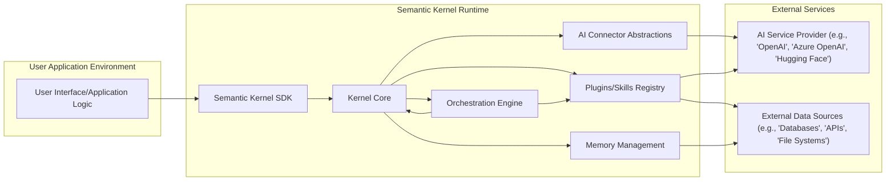
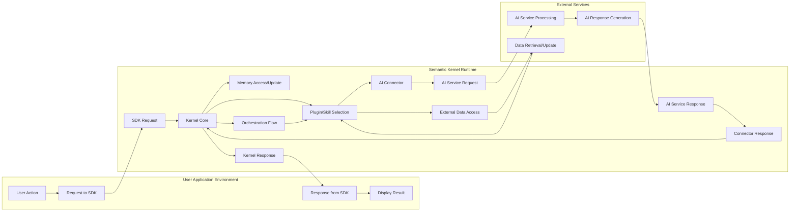

# Project Design Document: Semantic Kernel

**Version:** 1.1
**Date:** October 26, 2023
**Author:** AI Architecture Expert

## 1. Introduction

This document provides an enhanced and more detailed design overview of the Semantic Kernel project, as found on the GitHub repository [https://github.com/microsoft/semantic-kernel](https://github.com/microsoft/semantic-kernel). Building upon the previous version, this document further elaborates on the architectural components, data flows, and interactions within the system, with a stronger emphasis on aspects relevant to threat modeling.

## 2. Goals of Semantic Kernel

*   Empower developers to seamlessly integrate Large Language Models (LLMs) like GPT and other AI models into their applications.
*   Offer a highly flexible and extensible framework for constructing sophisticated AI-powered features and workflows.
*   Abstract the complexities involved in interacting with diverse LLM providers and AI services, promoting provider agnosticism.
*   Facilitate the creation, sharing, and reuse of modular AI skills and plugins, fostering a collaborative ecosystem.
*   Support the intelligent orchestration of multiple AI functions, traditional code, and external services to achieve complex tasks.
*   Provide a consistent and intuitive programming model across various programming languages, including C# and Python, enhancing developer accessibility.

## 3. High-Level Architecture

## 4. Component Details

This section provides a more granular description of the key components within Semantic Kernel.

*   **User Interface/Application Logic:**
    *   Represents the entry point for user interactions and the core logic of the application leveraging Semantic Kernel.
    *   Initiates requests to the Semantic Kernel SDK to perform AI-driven tasks.
    *   Consumes and processes the results returned by the Kernel.
    *   Examples include web frontends, mobile applications, backend services, or command-line interfaces.

*   **Semantic Kernel SDK:**
    *   Provides language-specific libraries and APIs that developers use to interact with the Kernel Core.
    *   Offers abstractions for common tasks like creating Kernels, loading plugins, and invoking functions.
    *   Handles serialization and deserialization of data exchanged with the Kernel.
    *   Manages communication with the Kernel Core, potentially through in-process calls or remote procedure calls (RPC).

*   **Kernel Core:**
    *   The central runtime engine of Semantic Kernel, responsible for managing and coordinating all operations.
    *   Manages the lifecycle of plugins and skills, including loading, unloading, and discovery.
    *   Routes incoming requests to the appropriate plugins or skills based on function names and parameters.
    *   Provides access to AI Connector Abstractions and Memory Management.
    *   Acts as the central point for enforcing security policies and access controls within the Kernel.

*   **AI Connector Abstractions:**
    *   Defines interfaces and abstract classes for connecting to various AI Service Providers.
    *   Provides concrete implementations (Connectors) for specific providers like OpenAI, Azure OpenAI, and Hugging Face.
    *   Handles authentication, authorization, and API request formatting specific to each provider.
    *   Abstracts away the differences in API endpoints, request structures, and response formats between providers.
    *   May include logic for error handling, retry mechanisms, and rate limit management for each provider.

*   **Plugins/Skills Registry:**
    *   A repository or catalog of available AI functionalities, both semantic (prompt-based) and native code.
    *   Stores metadata about plugins and skills, including their names, descriptions, parameters, and dependencies.
    *   Allows the Kernel to discover and load plugins dynamically.
    *   May involve mechanisms for versioning and managing different versions of plugins.
    *   Can be implemented as in-memory structures, file system directories, or dedicated services.

*   **Memory Management:**
    *   Provides functionalities for storing, retrieving, and managing various types of data relevant to AI operations.
    *   Includes capabilities for storing embeddings generated from text or other data.
    *   Supports different storage backends, such as in-memory stores, vector databases (e.g., Pinecone, Weaviate), and traditional databases.
    *   Offers features for semantic search and retrieval of information based on similarity.
    *   May include mechanisms for data partitioning, indexing, and caching to optimize performance.

*   **Orchestration Engine:**
    *   Responsible for managing the execution flow of complex AI workflows involving multiple plugins and skills.
    *   Allows developers to define sequences of operations, conditional logic, and branching based on the results of previous steps.
    *   May involve planning and reasoning capabilities to automatically determine the optimal sequence of actions to achieve a goal.
    *   Can handle error conditions and implement rollback mechanisms for complex operations.

*   **AI Service Provider (e.g., OpenAI, Azure OpenAI, Hugging Face):**
    *   External services that host and provide access to Large Language Models and other AI capabilities.
    *   Receive requests from the Semantic Kernel Connectors and execute the corresponding AI tasks.
    *   Perform model inference, generate text, analyze data, and provide other AI-driven functionalities.
    *   Manage the underlying AI models, infrastructure, and scaling.

*   **External Data Sources (e.g., Databases, APIs, File Systems):**
    *   External systems or repositories that plugins and skills may need to access to retrieve or store data.
    *   Provide context, information, or persistent storage for AI operations.
    *   Require appropriate authentication and authorization mechanisms to ensure secure access.

## 5. Data Flow

The data flow within Semantic Kernel typically follows these steps, with a focus on the movement and transformation of data:

*   A user interaction in the **User Interface/Application Logic** triggers a request for an AI-powered operation.
*   The **User Interface/Application Logic** sends a request to the **Semantic Kernel SDK**, specifying the desired function or skill and any necessary input parameters.
*   The **Semantic Kernel SDK** receives the request and forwards it to the **Kernel Core**.
*   The **Kernel Core** analyzes the request and identifies the appropriate **Plugin/Skill** from the **Plugins/Skills Registry** to handle it.
*   If the selected **Plugin/Skill** requires interaction with an **AI Service Provider**, the **Kernel Core** utilizes the corresponding **AI Connector Abstraction**.
*   The **AI Connector Abstraction** formats the request according to the specific API requirements of the **AI Service Provider** and handles authentication.
*   The formatted request is sent to the **AI Service Provider**.
*   The **AI Service Provider** processes the request, potentially performing model inference or other AI computations, and generates a response.
*   The **AI Service Provider** sends the response back to the **AI Connector Abstraction**.
*   The **AI Connector Abstraction** parses the response and transforms it into a format understandable by the **Kernel Core**.
*   The **Kernel Core** may interact with **Memory Management** to retrieve relevant information (e.g., embeddings, context) or store the results of the operation.
*   The **Orchestration Engine** can manage the execution of multiple **Plugins/Skills** in a defined sequence, passing data between them.
*   **Plugins/Skills** can interact with **External Data Sources** to retrieve or update information necessary for their operation. This interaction involves data retrieval and potential transformation.
*   The **Kernel Core** receives the final result from the executed **Plugin/Skill** or orchestration flow.
*   The **Kernel Core** sends the response back to the **Semantic Kernel SDK**.
*   The **Semantic Kernel SDK** delivers the response to the **User Interface/Application Logic**.
*   The **User Interface/Application Logic** processes and displays the result to the user.

## 6. Security Considerations (Pre-Threat Modeling)

This section details potential security concerns and areas of vulnerability that will be the focus of a thorough threat modeling exercise.

*   **Authentication and Authorization:**
    *   **SDK Authentication:** How is the Semantic Kernel SDK itself authenticated, especially in distributed environments? Are there API keys or other credentials involved?
    *   **AI Provider Authentication:** How are connections to AI Service Providers authenticated? Are API keys securely managed? Is OAuth or other secure authentication mechanisms used?
    *   **Plugin/Skill Authorization:** Are there mechanisms to control which users or applications can access and execute specific plugins or skills? Can access be restricted based on roles or permissions?
    *   **Internal Component Authentication:** How do different components within the Semantic Kernel runtime authenticate and authorize interactions with each other?

*   **Data Privacy and Confidentiality:**
    *   **Sensitive Data Handling:** What types of sensitive data (e.g., PII, API keys, proprietary information) are processed by Semantic Kernel? How is this data handled in transit and at rest?
    *   **Memory Store Security:** How is data stored in the Memory Management component secured? Is encryption used? Are access controls in place?
    *   **Prompt Data Security:** Prompts sent to LLMs may contain sensitive information. How is the confidentiality of these prompts ensured?
    *   **Data Minimization:** Are there strategies to minimize the amount of sensitive data processed by the Kernel?
    *   **Compliance:** Does the system comply with relevant data privacy regulations (e.g., GDPR, CCPA)?

*   **Input Validation and Sanitization:**
    *   **Prompt Injection Prevention:** How are user inputs and prompts validated and sanitized to prevent prompt injection attacks that could manipulate the LLM's behavior?
    *   **Data Sanitization from External Sources:** How is data retrieved from External Data Sources sanitized before being used by plugins or sent to AI providers?

*   **Secure Communication:**
    *   **TLS/SSL Encryption:** Is communication between the SDK, Kernel, Connectors, and external services encrypted using TLS/SSL? Are certificates properly validated?
    *   **Internal Communication Security:** How is communication secured between different components within the Semantic Kernel runtime?

*   **Dependency Management:**
    *   **Vulnerability Scanning:** Are dependencies regularly scanned for known vulnerabilities?
    *   **Supply Chain Security:** Are measures in place to ensure the integrity and security of third-party libraries and components?

*   **Code Injection and Plugin Security:**
    *   **Native Code Plugin Security:** How are native code plugins vetted to prevent the introduction of malicious code? Are there sandboxing or isolation mechanisms?
    *   **Semantic Function Security:** Can carefully crafted semantic functions (prompts) be used to cause harm or bypass security controls?

*   **Rate Limiting and Abuse Prevention:**
    *   **API Rate Limiting:** Are rate limits enforced to prevent abuse of AI services and protect against denial-of-service attacks?
    *   **Resource Exhaustion:** Are there mechanisms to prevent malicious actors from exhausting system resources?

*   **Logging and Monitoring:**
    *   **Security Auditing:** Are security-relevant events (e.g., authentication attempts, authorization failures, access to sensitive data) logged for auditing purposes?
    *   **Anomaly Detection:** Are there mechanisms for monitoring the system for suspicious activity or deviations from normal behavior?

*   **Secrets Management:**
    *   **Secure Storage of API Keys:** How are API keys for AI Service Providers and other sensitive credentials securely stored and managed? Are secrets stored in environment variables, dedicated secret management services, or other secure locations?
    *   **Rotation and Revocation:** Are there processes for rotating and revoking secrets?

*   **Trust Boundaries:** Identifying the trust boundaries within the system is crucial for threat modeling. These boundaries exist between:
    *   The User Application and the Semantic Kernel Runtime.
    *   The Semantic Kernel Runtime and external AI Service Providers.
    *   The Semantic Kernel Runtime and External Data Sources.
    *   Different components within the Semantic Kernel Runtime itself.

## 7. Technology Stack

*   **Primary Programming Languages:** C#, Python
*   **Core SDKs:** .NET SDK, Python SDK
*   **Supported AI Service Provider Integrations:** OpenAI, Azure OpenAI, Hugging Face Transformers, potentially others via custom connectors.
*   **Memory Store Options:** In-memory stores, integrations with vector databases like Pinecone, Weaviate, Azure Cognitive Search, and potentially traditional databases.
*   **Communication Protocols:** Primarily HTTP/HTTPS for external API interactions. Internal communication might use in-process calls or RPC mechanisms.
*   **Serialization Formats:** Likely JSON for data exchange with AI services.

## 8. Deployment Considerations

*   **Deployment Environments:** Semantic Kernel can be integrated into various deployment environments, including:
    *   **Web Applications:** Deployed as part of a web service or application backend. Security considerations include typical web application security best practices.
    *   **Desktop Applications:** Integrated directly into desktop applications. Security concerns include protecting API keys and preventing reverse engineering.
    *   **Mobile Applications:** While possible, direct integration might be less common due to resource constraints and security concerns around embedding API keys. Backend-for-frontend patterns might be preferred.
    *   **Serverless Functions (e.g., Azure Functions, AWS Lambda):** Deployed as serverless functions for event-driven processing. Securely managing secrets in serverless environments is critical.
    *   **Containerized Environments (e.g., Docker, Kubernetes):** Deployed within containers for scalability and isolation. Secure container image management and orchestration are important.
*   **Scaling and Resource Management:** Considerations for scaling the Semantic Kernel runtime and managing resources, especially when interacting with resource-intensive AI services.
*   **Network Configuration:** Proper network configuration is essential to secure communication between components and external services.

## 9. Future Considerations

*   Expanding the range of supported AI Service Providers and models.
*   Enhancing the orchestration engine with more sophisticated planning and reasoning capabilities.
*   Improving developer tooling and debugging support.
*   Developing a richer ecosystem of pre-built plugins and skills.
*   Further enhancing the memory management features with more advanced indexing and retrieval techniques.
*   Adding support for more diverse data types and modalities.

## 10. Conclusion

This enhanced design document provides a more detailed and comprehensive understanding of the Semantic Kernel project's architecture, data flow, and security considerations. It serves as a solid foundation for conducting thorough threat modeling activities to identify and mitigate potential vulnerabilities within the system. The detailed component descriptions and data flow diagrams, along with the expanded security considerations, provide valuable context for assessing the security posture of applications built with Semantic Kernel.
