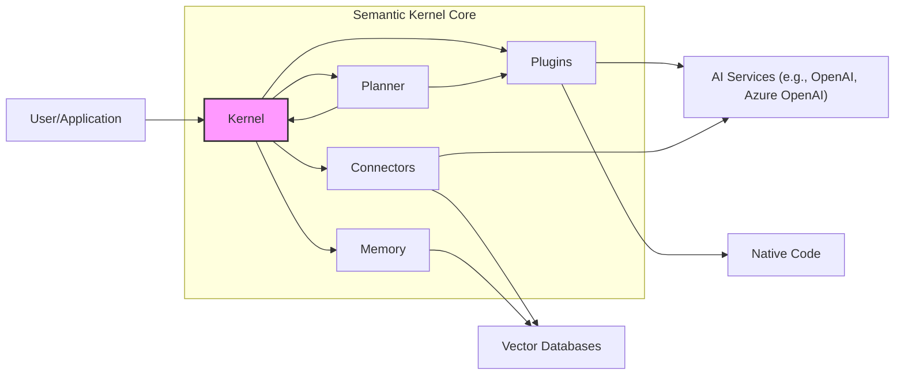
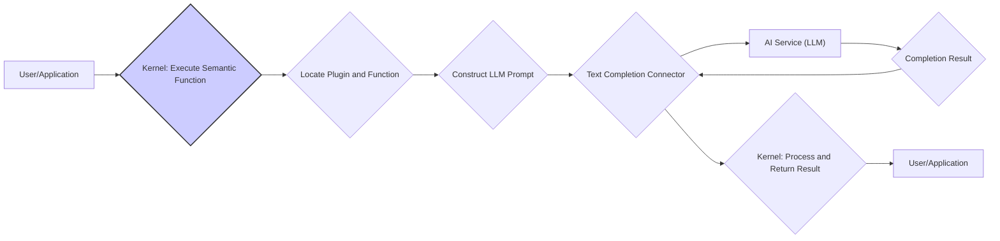
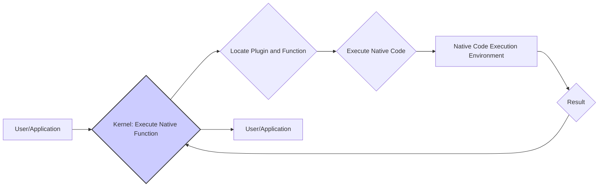
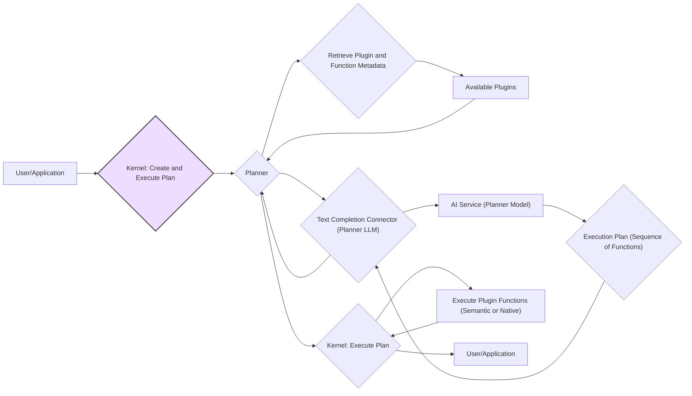

# Semantic Kernel Project Design Document

**Version:** 1.1
**Date:** October 26, 2023
**Author:** AI Design Expert

## 1. Introduction

This document provides a detailed design overview of the Semantic Kernel project, an open-source Software Development Kit (SDK) designed to simplify the creation of intelligent applications. It achieves this by seamlessly integrating traditional programming languages (such as C# and Python) with the capabilities of Large Language Models (LLMs). This document is intended to be a comprehensive resource for understanding the architecture, components, and data flow within the Semantic Kernel, specifically for the purpose of conducting future threat modeling exercises.

## 2. Project Goals

The primary objectives of the Semantic Kernel project are:

*   **Simplified LLM Integration:** To offer a straightforward and consistent programming model for interacting with various LLM providers.
*   **Composable AI Functionality:** To enable developers to construct complex AI-powered features by assembling smaller, reusable units known as plugins.
*   **Support for Diverse AI Services:** To provide the flexibility to integrate with a range of LLM providers and other relevant AI services.
*   **Extensibility and Customization:** To offer a framework that allows developers to easily extend the Kernel's capabilities with custom functionalities and connectors.
*   **Community Engagement and Collaboration:** To foster an active and collaborative open-source community around the project.

## 3. High-Level Architecture

The Semantic Kernel's architecture can be broadly categorized into the following core functional areas:

*   **Kernel:** The central orchestrator responsible for managing plugins, connectors, memory, and the overall execution workflow.
*   **Plugins:** Reusable modules encapsulating specific functionalities, which can be either native code or semantic functions powered by LLMs.
*   **Connectors:** Abstractions that facilitate communication between the Kernel and external services, including LLM providers, vector databases, and other resources.
*   **Memory:** A system for storing and retrieving information, encompassing embeddings for semantic search and conversational history.
*   **Planner:** An intelligent component capable of automatically generating and orchestrating execution plans using available plugins to achieve a user's specified goal.



## 4. Key Components

This section provides a more detailed description of the core components within the Semantic Kernel:

*   **Kernel:**
    *   Serves as the central object, managing the lifecycle of plugins, connectors, and the memory system.
    *   Provides methods for invoking both semantic and native functions.
    *   Handles dependency injection and configuration management.
    *   Manages the execution context and maintains state throughout the operation.
*   **Plugins:**
    *   Represent collections of functions that can be invoked by the Kernel to perform specific tasks.
    *   Comprise two primary types of functions:
        *   **Semantic Functions:** Functions that leverage LLMs to perform tasks such as text completion, summarization, translation, and more. These are defined using natural language prompts and configuration settings.
        *   **Native Functions:** Traditional code functions written in the host programming language (e.g., C#, Python).
    *   Can be loaded from various sources, including files, code, or external repositories.
    *   Include metadata describing the function's signature, purpose, and parameters.
*   **Connectors:**
    *   Implement interfaces that enable the Kernel to interact with external services and resources.
    *   Key connector categories include:
        *   **Text Completion Connectors:** Facilitate communication with LLM services like OpenAI's GPT models or Azure OpenAI Service. They handle sending prompts to the LLM and receiving the generated completions.
        *   **Embedding Generation Connectors:** Interface with services capable of generating vector embeddings for textual data.
        *   **Memory Connectors:** Enable the Kernel to interact with different storage solutions for semantic memory, such as vector databases or in-memory storage.
*   **Memory:**
    *   Provides abstractions for storing, retrieving, and managing information within the Kernel.
    *   Key features include:
        *   **Semantic Memory:** Stores vector embeddings of text, enabling semantic search and retrieval based on meaning and context.
        *   **Volatile Memory:** Provides temporary storage for session-specific data that does not need persistent storage.
    *   Supports various backend storage solutions through the use of memory connectors.
*   **Planner:**
    *   An optional but powerful component that can automatically devise a plan (a sequence of function calls) to achieve a user's stated objective.
    *   Utilizes LLMs to understand the user's intent and determine the necessary steps to fulfill the request.
    *   Leverages the metadata of available plugins and their functions to construct the execution plan.

## 5. Data Flow

This section illustrates the typical data flow patterns within the Semantic Kernel for different operational scenarios:

### 5.1. Invoking a Semantic Function



*   The user application initiates a request to execute a specific semantic function.
*   The Kernel identifies the relevant plugin and the target function within that plugin.
*   The Kernel constructs a prompt to be sent to the LLM, based on the function's configuration and the provided input parameters.
*   The constructed prompt is transmitted to the configured Text Completion Connector.
*   The Text Completion Connector forwards the prompt to the designated AI service (LLM).
*   The AI service processes the prompt and generates a completion result.
*   The completion result is returned to the Text Completion Connector.
*   The Kernel receives the result from the connector, processes it as needed, and formats it for the user.
*   The final result is returned to the requesting user application.

### 5.2. Invoking a Native Function



*   The user application requests the execution of a native function.
*   The Kernel identifies the appropriate plugin and the specific native function to be executed.
*   The Kernel directly executes the native code associated with the identified function.
*   The native code executes within its designated environment.
*   The result of the native code execution is returned.
*   The Kernel receives the result and passes it back to the user application.

### 5.3. Utilizing Semantic Memory

```mermaid
graph LR
    subgraph "Storing Information in Memory"
        A["User/Application"] --> B{"Kernel: Save Information"};
        B --> C{"Embedding Generation Connector"};
        C --> D["AI Service (Embedding Model)"];
        D --> E{"Text Embeddings"};
        E --> C;
        C --> F{"Memory Connector"};
        F --> G["Vector Database or Memory Store"];
    end
    subgraph "Retrieving Information from Memory"
        H["User/Application"] --> I{"Kernel: Search Memory"};
        I --> J{"Embedding Generation Connector"};
        J --> K["AI Service (Embedding Model)"];
        K --> L{"Query Embeddings"};
        L --> J;
        J --> M{"Memory Connector"};
        M --> N["Vector Database or Memory Store"];
        N --> O{"Relevant Information"];
        O --> M;
        M --> I;
        I --> P["User/Application"];
    end
    style B fill:#ddf,stroke:#333,stroke-width:2px
    style I fill:#ddf,stroke:#333,stroke-width:2px
```

*   **Storing Information:**
    *   The user application requests the Kernel to store specific information in memory.
    *   The Kernel utilizes a configured Embedding Generation Connector to generate vector embeddings for the provided text.
    *   The Embedding Generation Connector sends the text to an AI service with an embedding model.
    *   The AI service generates and returns the corresponding text embeddings.
    *   The Memory Connector receives the embeddings and stores them, along with associated metadata, in the designated vector database or memory store.
*   **Retrieving Information:**
    *   The user application requests the Kernel to search its memory for relevant information.
    *   The Kernel uses an Embedding Generation Connector to create embeddings for the search query.
    *   The Memory Connector queries the vector database or memory store using the generated query embeddings.
    *   The vector database or memory store returns information that is semantically similar to the query.
    *   The Kernel returns the retrieved information to the user application.

### 5.4. Orchestrating Tasks with the Planner



*   The user application requests the Kernel to create and execute a plan to achieve a specific goal.
*   The Kernel invokes the Planner component to handle the request.
*   The Planner retrieves metadata describing all available plugins and their functions.
*   The Planner interacts with a Text Completion Connector configured for a planner-specific LLM.
*   The Text Completion Connector sends a prompt describing the user's goal and the available functions to the designated AI service (planner model).
*   The AI service generates a proposed execution plan, outlining a sequence of function calls.
*   The Kernel receives the execution plan from the Planner.
*   The Kernel proceeds to execute the plan by invoking the specified plugin functions in the determined order (following the data flow patterns described in sections 5.1 and 5.2).
*   The final result of the plan execution is returned to the user application.

## 6. Security Considerations

This section highlights potential security considerations relevant to the Semantic Kernel project, serving as a basis for future threat modeling activities:

*   **Authentication and Authorization:**
    *   Mechanisms for verifying the identity of users or applications interacting with the Kernel.
    *   Strategies for controlling access to Kernel functionalities and resources based on user roles or permissions.
    *   Consideration of API key management and secure credential storage for accessing the Kernel.
*   **Data Security and Privacy:**
    *   Methods for handling and storing sensitive data, such as API keys, user inputs, and LLM responses.
    *   Implementation of encryption techniques for data at rest and in transit.
    *   Adherence to data privacy regulations and best practices for handling user data.
*   **Input Validation and Sanitization:**
    *   Techniques for validating and sanitizing user inputs and prompts to prevent prompt injection attacks and other malicious inputs.
    *   Strategies for mitigating risks associated with untrusted or malformed input data.
*   **Dependency Management:**
    *   Processes for managing and regularly updating project dependencies to address known vulnerabilities in third-party libraries.
    *   Utilizing tools and practices for secure dependency management.
*   **Secrets Management:**
    *   Secure storage and access mechanisms for sensitive credentials like API keys and database connection strings.
    *   Avoiding hardcoding secrets in code and utilizing secure vault solutions.
*   **Plugin Security:**
    *   Ensuring the security and integrity of loaded plugins, especially those from untrusted sources.
    *   Implementing mechanisms for verifying plugin authenticity and preventing the execution of malicious code.
    *   Consideration of sandboxing or isolation techniques for plugin execution.
*   **Connector Security:**
    *   Securing connections to external services, including LLM providers and databases.
    *   Enforcing appropriate authentication and authorization protocols for external service interactions.
    *   Protecting API keys and credentials used by connectors.
*   **Rate Limiting and Abuse Prevention:**
    *   Implementing rate limiting mechanisms to prevent abuse or excessive consumption of LLM service resources.
    *   Strategies for detecting and mitigating denial-of-service attacks.
*   **Logging and Monitoring:**
    *   Comprehensive logging of security-related events and activities within the Kernel.
    *   Implementation of monitoring systems to detect and respond to potential security incidents.
*   **Code Injection Risks (Native Functions):**
    *   Mitigating risks associated with dynamically loaded or executed native functions, which could be susceptible to code injection vulnerabilities.
    *   Careful validation and sanitization of inputs passed to native functions.
*   **Planner Security:**
    *   Addressing potential vulnerabilities in the Planner that could allow manipulation to generate harmful or unintended execution plans.
    *   Ensuring secure communication and interaction between the Planner and LLMs.

## 7. Future Considerations

This section outlines potential future development directions and considerations for the Semantic Kernel:

*   **Enhanced Security Framework:** Development of a more comprehensive and integrated security framework with well-defined policies and enforcement mechanisms.
*   **Advanced Plugin Management and Security:** Implementing more robust mechanisms for managing, discovering, verifying, and securing plugins, potentially including a plugin marketplace with security ratings.
*   **Standardized Security Policies and Auditing:** Defining and enforcing standardized security policies for Kernel usage and plugin development, along with features to support security auditing.
*   **Granular Access Control:** Implementing more fine-grained access control mechanisms to manage permissions for specific functionalities and data within the Kernel.
*   **Integration with Security Information and Event Management (SIEM) Systems:** Enabling seamless integration with SIEM systems for enhanced security monitoring and incident response.
*   **Federated Identity Management:** Supporting integration with federated identity providers for streamlined authentication and authorization.

This document provides a comprehensive design overview of the Semantic Kernel project, focusing on aspects relevant to future threat modeling activities. It is intended to be a living document and will be updated as the project evolves.