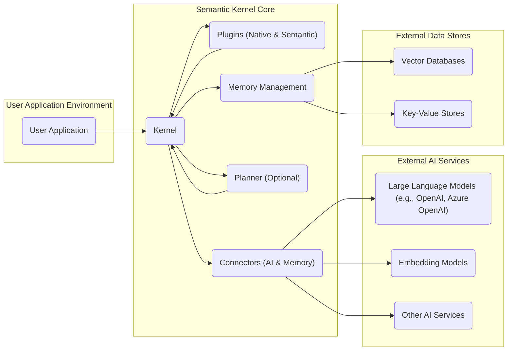
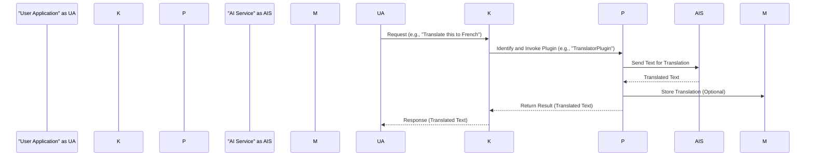

# Project Design Document: Semantic Kernel

**Version:** 1.1
**Date:** October 26, 2023
**Author:** AI Architecture Expert

## 1. Introduction

This document provides an enhanced design overview of the Semantic Kernel project, based on the information available in the GitHub repository [https://github.com/microsoft/semantic-kernel](https://github.com/microsoft/semantic-kernel). This revised document aims to provide an even clearer and more detailed articulation of the architecture, components, and data flow of the Semantic Kernel. The primary purpose of this document is to serve as a robust foundation for subsequent threat modeling activities, enabling a comprehensive security analysis of the system.

## 2. Goals and Objectives

The core goal of Semantic Kernel is to empower developers to seamlessly integrate the capabilities of Large Language Models (LLMs), such as those offered by OpenAI and Azure OpenAI, into their applications. Key objectives driving the design include:

*   **Extensibility and Flexibility:** To offer a framework that can easily adapt to new AI services and evolving LLM technologies.
*   **Simplified Orchestration:** To abstract the complexities of interacting with multiple AI services and enable the creation of sophisticated AI workflows with minimal code.
*   **Intelligent Agent Development:** To provide the building blocks necessary for creating autonomous and intelligent agents capable of performing complex tasks.
*   **Consistent Programming Model:** To offer a unified and intuitive way to interact with diverse LLMs and AI platforms, reducing the learning curve for developers.
*   **Reusability and Modularity:** To facilitate the development and sharing of reusable AI components, known as plugins, fostering a collaborative ecosystem.

## 3. High-Level Architecture

At a high level, Semantic Kernel acts as an intelligent intermediary, orchestrating interactions between user applications and various AI and data services.

## 4. Detailed Component Design

Semantic Kernel is built upon several interconnected components, each with specific responsibilities.

### 4.1. Kernel

*   **Description:** The central runtime engine of Semantic Kernel. It's responsible for managing the execution lifecycle of requests and coordinating interactions between other components. It acts as the primary interface for user applications.
*   **Responsibilities:**
    *   Receiving and interpreting requests from the user application.
    *   Resolving and invoking the appropriate plugins based on the request.
    *   Managing the execution context, including variables and temporary data.
    *   Orchestrating the flow of execution, including sequential and conditional plugin execution.
    *   Interacting with the Memory component for data retrieval and storage.
    *   Utilizing the Planner (if enabled) to generate execution plans.
    *   Handling errors, exceptions, and logging.

### 4.2. Plugins

*   **Description:**  Modular and reusable units of functionality that extend the capabilities of the Kernel. They encapsulate specific tasks, logic, or interactions with external systems.
*   **Types:**
    *   **Native Plugins:** Implemented using code in the host language (e.g., C#, Python). They offer direct access to system resources and libraries.
    *   **Semantic Plugins:** Defined using natural language prompts and configuration. They leverage LLMs to understand and execute tasks based on these descriptions.
*   **Responsibilities:**
    *   Performing specific actions based on input parameters.
    *   Interacting with external AI services through Connectors to perform tasks like text generation, summarization, or translation.
    *   Accessing and manipulating data stored in the Memory component.
    *   Returning results to the Kernel for further processing or to the user application.

### 4.3. Memory Management

*   **Description:** Provides mechanisms for storing, retrieving, and managing information, enabling the Kernel to maintain state, learn from past interactions, and perform knowledge retrieval.
*   **Components:**
    *   **Vector Database Connectors:** Facilitate the storage and efficient retrieval of vector embeddings, enabling semantic search and similarity matching. Examples include integrations with Pinecone or Azure Cognitive Search.
    *   **Key-Value Store Connectors:** Offer simple storage for structured data, configurations, or temporary information.
*   **Responsibilities:**
    *   Storing and indexing data, often in the form of vector embeddings for semantic understanding.
    *   Performing semantic searches based on natural language queries to retrieve relevant information.
    *   Providing data persistence for the Kernel and Plugins.

### 4.4. Planner (Optional)

*   **Description:** An intelligent component that leverages LLMs to automatically generate execution plans based on high-level user goals. It simplifies the process of orchestrating complex workflows.
*   **Responsibilities:**
    *   Analyzing user requests to understand the desired outcome and underlying intent.
    *   Identifying and sequencing the necessary plugins to achieve the stated goal.
    *   Generating an ordered execution plan that the Kernel can follow.
    *   Potentially optimizing the execution plan for efficiency.

### 4.5. Connectors

*   **Description:** Abstraction layers that enable seamless communication with external services, shielding the Kernel and Plugins from the specific details of individual APIs.
*   **Types:**
    *   **AI Service Connectors:** Handle interactions with various LLM providers (e.g., OpenAI, Azure OpenAI), embedding models, and other AI services. They manage API calls, authentication, and data transformation.
    *   **Memory Connectors:** Provide interfaces to different vector databases and key-value stores, abstracting the underlying storage mechanisms.
*   **Responsibilities:**
    *   Translating requests from the Kernel and Plugins into the specific API calls required by external services.
    *   Managing authentication and authorization credentials for accessing external services securely.
    *   Transforming data between the Kernel's internal representation and the formats expected by external services.
    *   Handling potential errors and retries when communicating with external services.

## 5. Data Flow

The typical flow of data within Semantic Kernel involves a series of interactions between its components.

1. **User Application Initiates Request:** The user application sends a request to the Kernel. This request can be a natural language instruction or a structured command.
2. **Kernel Receives and Processes Request:** The Kernel receives the request and begins processing it. This may involve parsing the request and identifying the intended action.
3. **Plugin Resolution and Invocation:** Based on the request, the Kernel determines which plugin(s) are needed. If a Planner is involved, the Kernel follows the generated execution plan. The Kernel then invokes the selected plugin(s), passing relevant data and context.
4. **Plugin Executes and Interacts with External Services (Optional):** The plugin performs its designated task. This might involve interacting with AI services through Connectors (e.g., sending a prompt to an LLM for text generation) or accessing data from the Memory component.
5. **Memory Access for Data Retrieval or Storage (Optional):** Plugins or the Kernel may interact with the Memory component to retrieve relevant information or store intermediate results.
6. **Result Generation:** The plugin processes the information and generates a result.
7. **Kernel Receives and Processes Results:** The Kernel receives the results from the plugin(s).
8. **Response to User Application:** The Kernel sends the final result back to the user application.

## 6. Deployment Considerations

Semantic Kernel offers flexibility in deployment, adapting to various application architectures.

*   **Embedded Deployment:** The Kernel and its dependencies are integrated directly within the user application's process. This is suitable for applications where tight integration and low latency are critical.
*   **Microservices Deployment:** Components of the Semantic Kernel, or the entire Kernel itself, can be deployed as independent microservices. This allows for scalability and independent deployment of AI capabilities.
*   **Serverless Deployment:**  Functions within the Semantic Kernel can be deployed as serverless functions (e.g., Azure Functions, AWS Lambda), enabling event-driven and cost-effective execution.
*   **Hybrid Deployment:** A combination of the above approaches, where some components run within the application while others are deployed as services.

The chosen deployment strategy significantly impacts security considerations, particularly regarding network boundaries, access control, and data protection.

## 7. Security Considerations (Pre-Threat Modeling)

This section highlights potential security concerns that will be the focus of subsequent threat modeling efforts.

*   **Authentication and Authorization:**
    *   How is the user application authenticated to interact with the Kernel?
    *   How are plugins authenticated and authorized to access specific resources or AI services?
    *   Is there proper role-based access control for different functionalities within the Kernel?
*   **Input Validation and Sanitization:**
    *   How is user input validated to prevent injection attacks (e.g., prompt injection in semantic plugins)?
    *   Are inputs sanitized before being passed to LLMs or other external services to prevent malicious code execution or data breaches?
*   **Data Security and Privacy:**
    *   How is sensitive data handled and stored within the Memory component? Is encryption at rest and in transit enforced?
    *   Are there mechanisms to ensure data privacy and compliance with regulations when interacting with AI services?
    *   How is personally identifiable information (PII) handled and protected?
*   **Plugin Security and Trust:**
    *   How is the integrity and trustworthiness of plugins verified, especially community-contributed or dynamically loaded plugins?
    *   Can malicious plugins gain unauthorized access to system resources or sensitive data?
    *   How are semantic plugins secured against prompt manipulation or adversarial attacks?
*   **AI Service API Key Management:**
    *   How are API keys for accessing external AI services securely stored and managed?
    *   Are there mechanisms to prevent unauthorized access or leakage of API keys?
*   **Network Security:**
    *   How is communication between the user application, the Kernel, and external services secured (e.g., using TLS)?
    *   Are appropriate network segmentation and firewall rules in place to limit the impact of potential breaches?
*   **Dependency Management and Vulnerabilities:**
    *   Are the dependencies of the Semantic Kernel and its plugins regularly scanned for known vulnerabilities?
    *   Is there a process for patching and updating dependencies to mitigate security risks?
*   **Logging and Monitoring:**
    *   Are security-related events (e.g., authentication failures, unauthorized access attempts) logged and monitored?
    *   Are there mechanisms for alerting and responding to security incidents?
*   **Rate Limiting and Abuse Prevention:**
    *   Are there mechanisms in place to prevent abuse of AI services or the Kernel itself through excessive requests?

## 8. Future Considerations

The Semantic Kernel is under active development, and future enhancements may include:

*   More advanced planning algorithms and capabilities.
*   Expanded support for a wider range of AI services, modalities (e.g., vision, audio), and platforms.
*   Improved tooling for plugin development, testing, and deployment.
*   Enhanced security features, such as more granular access control and improved plugin sandboxing.
*   Deeper integration with other Microsoft cloud services and developer tools.

This improved design document provides a more comprehensive and detailed understanding of the Semantic Kernel's architecture and potential security considerations. It serves as a valuable resource for security engineers and developers involved in building and securing applications using this framework.