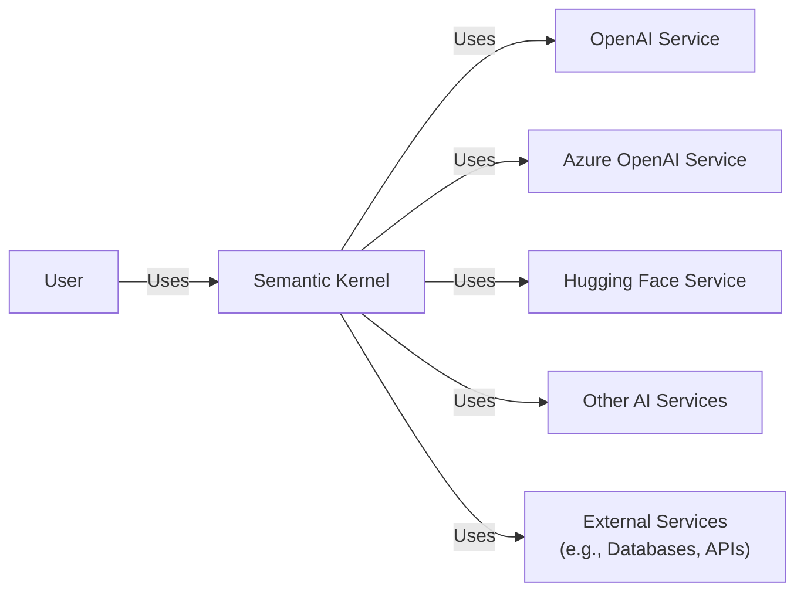
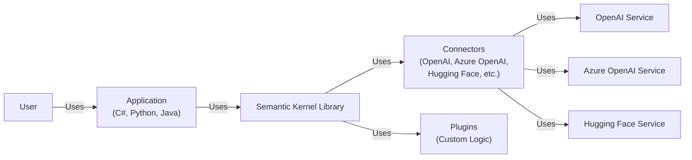
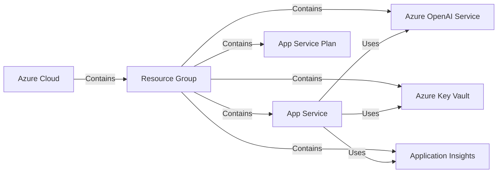
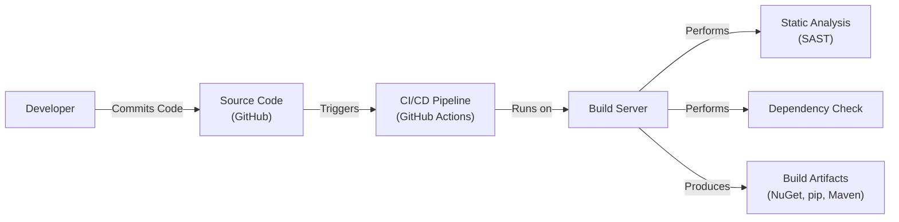

Okay, let's create a design document for the Microsoft Semantic Kernel project.

# BUSINESS POSTURE

Business Priorities and Goals:

*   Enable developers to easily integrate AI and Large Language Models (LLMs) into their applications.
*   Provide a flexible and extensible framework for building AI-powered features.
*   Simplify the orchestration of AI components and services.
*   Foster innovation and experimentation with AI technologies.
*   Reduce the complexity of working with various AI models and APIs.
*   Support multiple programming languages (C#, Python, Java).

Most Important Business Risks:

*   Data privacy and security: LLMs can potentially expose sensitive data if not handled carefully.
*   Model bias and fairness: LLMs can exhibit biases that lead to unfair or discriminatory outcomes.
*   Reliability and availability: Applications relying on LLMs need to be resilient to failures and ensure consistent performance.
*   Cost management: Using LLMs can be expensive, so cost optimization is crucial.
*   Dependency on third-party services: Reliance on external AI models and APIs introduces potential risks.
*   Rapidly evolving technology: The AI landscape is changing quickly, requiring continuous adaptation and updates.
*   Lack of explainability: LLM decisions can be difficult to understand, posing challenges for debugging and accountability.

# SECURITY POSTURE

Existing Security Controls:

*   security control: Secure coding practices: The project's GitHub repository shows evidence of secure coding practices, including input validation and handling of secrets. (Described in contribution guidelines and code reviews).
*   security control: Dependency management: The project uses package managers (NuGet, pip, Maven) to manage dependencies, reducing the risk of using vulnerable libraries. (Described in project files).
*   security control: Code reviews: The project uses pull requests and code reviews to ensure code quality and security. (Visible in the GitHub repository).
*   security control: Static analysis: The project likely uses static analysis tools to identify potential security vulnerabilities. (Inferred from Microsoft's standard development practices).
*   security control: Authentication and authorization: The project itself doesn't handle authentication/authorization directly, but it's designed to integrate with services that do (e.g., Azure OpenAI, Hugging Face). (Described in documentation and examples).
*   accepted risk: The project relies on the security of third-party LLM services (e.g., OpenAI, Azure OpenAI). The project itself does not control the security of these services.
*   accepted risk: The project is under active development, and new vulnerabilities may be introduced.

Recommended Security Controls:

*   security control: Implement dynamic analysis (DAST) to complement static analysis.
*   security control: Conduct regular penetration testing to identify vulnerabilities that automated tools might miss.
*   security control: Establish a clear vulnerability disclosure program.
*   security control: Implement a robust secrets management solution (e.g., Azure Key Vault, HashiCorp Vault).
*   security control: Provide clear guidance on securely configuring and deploying applications built with the Semantic Kernel.
*   security control: Implement monitoring and logging to detect and respond to security incidents.

Security Requirements:

*   Authentication:
    *   The Semantic Kernel should support integration with various authentication mechanisms (e.g., API keys, OAuth 2.0, Azure Active Directory).
    *   Authentication credentials should be securely stored and managed.
*   Authorization:
    *   The Semantic Kernel should allow developers to define granular access control policies for different AI components and services.
    *   Authorization should be enforced consistently across all supported programming languages.
*   Input Validation:
    *   All inputs to the Semantic Kernel and underlying LLMs should be validated to prevent prompt injection attacks and other vulnerabilities.
    *   Input validation should be context-aware and consider the specific LLM being used.
*   Cryptography:
    *   Sensitive data (e.g., API keys, user data) should be encrypted in transit and at rest.
    *   Cryptographic keys should be securely managed.
*   Output Encoding:
    *   Output from the Semantic Kernel should be properly encoded to prevent cross-site scripting (XSS) and other injection vulnerabilities.

# DESIGN

## C4 CONTEXT

Element Descriptions:

*   Element:
    *   Name: User
    *   Type: Person
    *   Description: A person who interacts with an application that uses the Semantic Kernel.
    *   Responsibilities: Provides input to the application, receives output from the application.
    *   Security controls: Authentication and authorization are typically handled by the application, not the Semantic Kernel itself.

*   Element:
    *   Name: Semantic Kernel
    *   Type: Software System
    *   Description: A lightweight SDK that lets you easily mix conventional programming languages with the latest in Large Language Model AI "prompts" with prompt templating, function chaining, and intelligent planning capabilities.
    *   Responsibilities: Orchestrates AI components and services, provides a unified interface for interacting with LLMs, manages prompt templates and function chains.
    *   Security controls: Input validation, secure coding practices, dependency management, code reviews, static analysis.

*   Element:
    *   Name: OpenAI Service
    *   Type: External System
    *   Description: The OpenAI API provides access to OpenAI's powerful language models.
    *   Responsibilities: Processes natural language requests, generates text, performs various AI tasks.
    *   Security controls: Authentication via API keys, rate limiting, usage monitoring (managed by OpenAI).

*   Element:
    *   Name: Azure OpenAI Service
    *   Type: External System
    *   Description: Provides access to OpenAI models through the Azure cloud platform.
    *   Responsibilities: Same as OpenAI Service, but with Azure-specific security and management features.
    *   Security controls: Azure Active Directory integration, role-based access control, network security, encryption (managed by Azure).

*   Element:
    *   Name: Hugging Face Service
    *   Type: External System
    *   Description: Provides access to a wide range of open-source and commercial LLMs.
    *   Responsibilities: Processes natural language requests, generates text, performs various AI tasks.
    *   Security controls: Authentication via API keys, usage monitoring (managed by Hugging Face).

*   Element:
    *   Name: Other AI Services
    *   Type: External System
    *   Description: Represents other AI services that the Semantic Kernel might integrate with.
    *   Responsibilities: Varies depending on the specific service.
    *   Security controls: Varies depending on the specific service.

*   Element:
    *   Name: External Services
    *   Type: External System
    *   Description: Represents external services (databases, APIs, etc.) that the Semantic Kernel might interact with.
    *   Responsibilities: Varies depending on the specific service.
    *   Security controls: Varies depending on the specific service.

## C4 CONTAINER

Element Descriptions:

*   Element:
    *   Name: User
    *   Type: Person
    *   Description: A person who interacts with an application that uses the Semantic Kernel.
    *   Responsibilities: Provides input to the application, receives output from the application.
    *   Security controls: Authentication and authorization are typically handled by the application.

*   Element:
    *   Name: Application (C#, Python, Java)
    *   Type: Container
    *   Description: The application that uses the Semantic Kernel. This can be a web app, desktop app, mobile app, etc.
    *   Responsibilities: Handles user interaction, business logic, and integration with the Semantic Kernel.
    *   Security controls: Authentication, authorization, input validation, output encoding, session management, etc. (specific to the application).

*   Element:
    *   Name: Semantic Kernel Library
    *   Type: Container
    *   Description: The core library of the Semantic Kernel.
    *   Responsibilities: Provides the main API for interacting with LLMs, manages plugins and connectors.
    *   Security controls: Input validation, secure coding practices, dependency management.

*   Element:
    *   Name: Connectors (OpenAI, Azure OpenAI, Hugging Face, etc.)
    *   Type: Container
    *   Description: Components that handle communication with specific LLM services.
    *   Responsibilities: Translates requests from the Semantic Kernel into the format required by the LLM service, handles authentication and authorization with the LLM service.
    *   Security controls: Secure handling of API keys, secure communication (HTTPS), input validation.

*   Element:
    *   Name: Plugins (Custom Logic)
    *   Type: Container
    *   Description: Custom code that extends the functionality of the Semantic Kernel.
    *   Responsibilities: Performs specific tasks, such as data processing, interacting with external services, or implementing custom logic.
    *   Security controls: Depends on the specific plugin; developers are responsible for implementing appropriate security controls.

*   Element:
    *   Name: OpenAI Service
    *   Type: External System
    *   Description: The OpenAI API.
    *   Responsibilities: Processes natural language requests, generates text.
    *   Security controls: Managed by OpenAI.

*   Element:
    *   Name: Azure OpenAI Service
    *   Type: External System
    *   Description: OpenAI models on Azure.
    *   Responsibilities: Processes natural language requests, generates text.
    *   Security controls: Managed by Azure.

*   Element:
    *   Name: Hugging Face Service
    *   Type: External System
    *   Description: Hugging Face LLMs.
    *   Responsibilities: Processes natural language requests, generates text.
    *   Security controls: Managed by Hugging Face.

## DEPLOYMENT

Possible Deployment Solutions:

1.  Cloud-based deployment (Azure, AWS, GCP): This is the most common and recommended approach for applications using LLMs.
2.  On-premises deployment: Possible, but less common due to the computational requirements of LLMs.
3.  Hybrid deployment: A combination of cloud and on-premises.
4.  Edge deployment: Deploying the application and potentially smaller LLMs on edge devices.

Chosen Deployment Solution (for detailed description): Cloud-based deployment on Azure.

Element Descriptions:

*   Element:
    *   Name: Azure Cloud
    *   Type: Infrastructure
    *   Description: Microsoft's cloud computing platform.
    *   Responsibilities: Provides the infrastructure for hosting the application and related services.
    *   Security controls: Azure-wide security features (network security, DDoS protection, etc.).

*   Element:
    *   Name: Resource Group
    *   Type: Infrastructure
    *   Description: A container that holds related resources for an Azure solution.
    *   Responsibilities: Organizes and manages Azure resources.
    *   Security controls: Role-based access control (RBAC).

*   Element:
    *   Name: App Service Plan
    *   Type: Infrastructure
    *   Description: Defines the compute resources for running the application.
    *   Responsibilities: Provides the CPU, memory, and storage for the application.
    *   Security controls: Scaling options, network isolation.

*   Element:
    *   Name: App Service
    *   Type: Infrastructure
    *   Description: A fully managed platform for building, deploying, and scaling web apps.
    *   Responsibilities: Hosts the application code.
    *   Security controls: HTTPS enforcement, authentication/authorization integration, network security.

*   Element:
    *   Name: Azure OpenAI Service
    *   Type: PaaS
    *   Description: Provides access to OpenAI models on Azure.
    *   Responsibilities: Processes natural language requests.
    *   Security controls: Azure Active Directory integration, role-based access control, network security, encryption.

*   Element:
    *   Name: Azure Key Vault
    *   Type: PaaS
    *   Description: A service for securely storing and managing secrets, keys, and certificates.
    *   Responsibilities: Stores API keys and other sensitive information.
    *   Security controls: Access policies, auditing, encryption.

*   Element:
    *   Name: Application Insights
    *   Type: PaaS
    *   Description: A monitoring service for web applications.
    *   Responsibilities: Collects telemetry data, detects anomalies, and provides insights into application performance and usage.
    *   Security controls: Data encryption, access control.

## BUILD

Build Process Description:

1.  Developer commits code to the GitHub repository.
2.  A commit to the main branch (or a pull request) triggers the CI/CD pipeline (GitHub Actions).
3.  The CI/CD pipeline runs on a build server.
4.  The build server performs the following steps:
    *   Checks out the source code.
    *   Restores dependencies (using NuGet, pip, Maven).
    *   Compiles the code.
    *   Runs unit tests.
    *   Performs static analysis (SAST) to identify potential security vulnerabilities.
    *   Checks for known vulnerabilities in dependencies.
    *   Packages the code into build artifacts (NuGet packages, pip packages, Maven packages).
5.  The build artifacts are published to a package repository (e.g., NuGet.org, PyPI, Maven Central).

Security Controls:

*   security control: CI/CD pipeline (GitHub Actions): Automates the build process, ensuring consistency and repeatability.
*   security control: Static analysis (SAST): Identifies potential security vulnerabilities in the code.
*   security control: Dependency check: Scans for known vulnerabilities in dependencies.
*   security control: Code signing: (Potentially) Digitally signs the build artifacts to ensure their integrity and authenticity.
*   security control: Build server security: The build server itself should be secured (e.g., using a secure operating system, limiting access).

# RISK ASSESSMENT

Critical Business Processes:

*   Providing a reliable and secure platform for developers to integrate AI into their applications.
*   Maintaining the trust of developers and users by protecting sensitive data.
*   Ensuring the accuracy and fairness of AI-powered features.

Data Sensitivity:

*   User data: Potentially sensitive, depending on the application.
*   API keys: Highly sensitive, should be protected at all costs.
*   Prompt inputs: Can contain sensitive information, depending on the application.
*   LLM outputs: Can contain sensitive information, depending on the prompt and the LLM.
*   Training data (for custom models): Potentially sensitive, depending on the data.

# QUESTIONS & ASSUMPTIONS

Questions:

*   What specific types of user data will be processed by applications built with the Semantic Kernel?
*   What are the specific regulatory requirements (e.g., GDPR, CCPA) that apply to these applications?
*   What level of assurance is required for the accuracy and fairness of LLM outputs?
*   What is the expected volume of requests to the LLM services?
*   Are there any specific performance requirements for the Semantic Kernel?
*   What are the specific threat models for the different LLM services being used?

Assumptions:

*   Business Posture: Assumes a moderate risk appetite, balancing innovation with the need for security and compliance.
*   Security Posture: Assumes that Microsoft's standard security practices are followed. Assumes that developers using the Semantic Kernel will implement appropriate security controls in their applications.
*   Design: Assumes that the Semantic Kernel will be primarily used in cloud-based environments. Assumes that developers will use the provided connectors for interacting with LLM services.