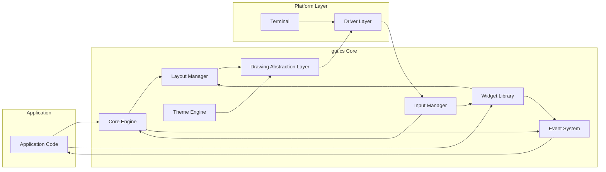

# Project Design Document: gui.cs

**Version:** 1.1
**Date:** October 26, 2023
**Author:** AI Software Architect

## 1. Introduction

This document provides a detailed design overview of the `gui.cs` project, a cross-platform terminal UI toolkit written in C#. This document aims to capture the key architectural components, data flow, and design decisions to facilitate future threat modeling activities.

## 2. Goals and Objectives

The primary goals of `gui.cs` are:

*   To provide a framework for building rich, interactive terminal-based user interfaces.
*   To offer a cross-platform experience, supporting various operating systems and terminal emulators.
*   To enable developers to create visually appealing and functional terminal applications using a declarative approach.
*   To offer a set of reusable UI components (widgets) for common terminal UI patterns.
*   To abstract away the complexities of low-level terminal interactions.

## 3. Architectural Overview

`gui.cs` adopts a layered architecture, separating concerns and promoting modularity. The core components interact to manage the application lifecycle, user input, UI rendering, and platform-specific functionalities.

## 4. Key Components

Here's a breakdown of the key components:

*   **Core Engine:**
    *   Manages the application lifecycle (initialization, event loop, shutdown).
    *   Handles the overall structure of the UI, including the concept of top-level windows.
    *   Provides the main event loop for processing user input and system events.
    *   Orchestrates the rendering process.
*   **Input Manager:**
    *   Captures raw input events from the terminal (keyboard, mouse).
    *   Normalizes input across different terminal types and operating systems.
    *   Dispatches input events to the appropriate UI elements based on focus and event routing.
*   **Layout Manager:**
    *   Responsible for determining the size and position of UI elements within their containers.
    *   Implements various layout algorithms (e.g., absolute positioning, stacking, docking).
    *   Dynamically adjusts layouts based on terminal size changes.
*   **Widget Library:**
    *   A collection of pre-built UI components (e.g., buttons, labels, text boxes, lists, dialogs).
    *   Each widget encapsulates its own rendering logic, input handling, and state management.
    *   Provides a consistent API for developers to interact with UI elements.
*   **Drawing Abstraction Layer:**
    *   Abstracts the low-level terminal drawing operations (e.g., writing characters, setting colors, moving the cursor).
    *   Provides a platform-independent interface for rendering UI elements.
    *   Handles differences in terminal capabilities and escape sequences.
*   **Driver Layer (Platform Specific):**
    *   Provides platform-specific implementations for interacting with the terminal.
    *   Handles tasks such as:
        *   Setting terminal modes (e.g., raw mode).
        *   Reading input events.
        *   Writing output to the terminal.
        *   Handling terminal resizing.
    *   Examples of drivers include implementations for Unix-like systems (using `ncurses` or similar) and Windows (using the console API).
*   **Theme Engine:**
    *   Manages the visual appearance of the UI elements (colors, styles, borders).
    *   Allows for customization of the UI's look and feel.
    *   Provides default themes and mechanisms for creating custom themes.
*   **Event System:**
    *   A mechanism for UI elements to communicate with each other and the application.
    *   Supports both direct event handling and a more loosely coupled event subscription model.
    *   Enables responding to user interactions and changes in application state.

## 5. Data Flow

**Data Flow Description:**

*   **User Input:**
    *   The "Terminal" (J) receives raw input (keyboard, mouse).
    *   The "Driver Layer" (I) reads and translates this input.
    *   The "Input Manager" (C) processes the raw input, normalizes it, and determines the target UI element.
    *   Input events are dispatched through the "Event System" (H) to the relevant "Widget" (E) or the "Application Code" (A).
*   **Rendering:**
    *   When the application state changes or an event occurs, the "Core Engine" (B) triggers a redraw.
    *   The "Layout Manager" (D) calculates the positions and sizes of the "Widgets" (E).
    *   Each "Widget" (E) determines how to render itself.
    *   The "Theme Engine" (G) provides styling information.
    *   The "Drawing Abstraction Layer" (F) translates the rendering instructions into terminal-specific drawing commands.
    *   The "Driver Layer" (I) sends these commands to the "Terminal" (J) for display.
*   **Application Logic:**
    *   The "Application Code" (A) interacts with the "Widget Library" (E) to create and manage the UI.
    *   It receives events from the "Event System" (H) and updates the application state.
    *   Changes in application state can trigger UI updates and re-rendering.

## 6. Security Considerations

This section outlines potential security considerations for `gui.cs`. These will be further explored during threat modeling.

Here are some key security aspects to consider:

*   **Input Validation:**
    *   How is user input validated to prevent injection attacks (e.g., control character injection)?
    *   Are there mechanisms to sanitize input before processing and display?
*   **Output Encoding:**
    *   How is output encoded to prevent terminal escape sequence injection or other display-related vulnerabilities?
    *   Is there proper handling of Unicode and other character encodings?
*   **State Management:**
    *   How is the application state managed, and are there potential vulnerabilities related to state manipulation?
    *   Is sensitive information stored securely within the application's state?
*   **Permissions and Access Control:**
    *   What permissions does the `gui.cs` application require to run?
    *   Are there any access control mechanisms within the framework itself?
*   **Dependency Management:**
    *   What external libraries or dependencies does `gui.cs` rely on?
    *   Are these dependencies regularly updated and scanned for vulnerabilities?
*   **Platform Security:**
    *   How does `gui.cs` leverage or interact with underlying operating system security features?
    *   Are there platform-specific security considerations for each supported operating system?
*   **Event Handling Security:**
    *   Could malicious actors inject or manipulate events to cause unintended behavior?
    *   Are there mechanisms to prevent event spoofing or unauthorized event triggering?
*   **Resource Management:**
    *   How does `gui.cs` manage resources (e.g., memory, file handles) to prevent denial-of-service attacks?
    *   Are there limits on input size or complexity to prevent resource exhaustion?
*   **Terminal Emulation Vulnerabilities:**
    *   Are there known vulnerabilities in the terminal emulators that `gui.cs` targets that could be exploited?
    *   How does `gui.cs` mitigate potential risks associated with terminal emulator behavior?

## 7. Deployment Considerations

Here are some points regarding deployment:

*   `gui.cs` applications are typically deployed as standalone executables or as part of larger applications.
*   Deployment requires the .NET runtime environment to be available on the target system.
*   Cross-platform compatibility relies on the .NET runtime's ability to abstract platform differences.
*   Key considerations for deployment include:
    *   Packaging and distribution of the application and its dependencies.
    *   Ensuring the correct .NET runtime version is installed.
    *   Potential security implications of the deployment environment.

## 8. Future Considerations

The following are potential future enhancements:

*   Enhancements to the widget library with more advanced UI components.
*   Improved theming capabilities and support for custom styling.
*   Integration with accessibility tools and features.
*   Performance optimizations for rendering and input handling.
*   Further development of platform-specific drivers and features.

This design document provides a comprehensive overview of the `gui.cs` project's architecture and key components. It serves as a foundation for understanding the system's functionality and identifying potential security vulnerabilities during the threat modeling process.
