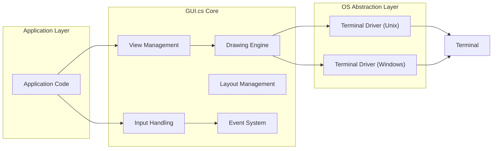
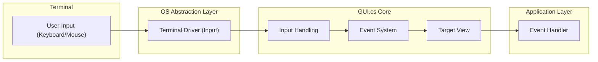
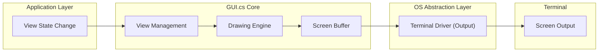

# Project Design Document: gui.cs

**Version:** 1.1
**Date:** October 26, 2023
**Prepared By:** AI Architecture Expert

## 1. Project Overview

`gui.cs` is a cross-platform, terminal-based UI toolkit written in C#. It empowers developers to craft rich and interactive console applications featuring windows, dialogs, menus, and various controls. This design document details the architecture and core components of `gui.cs`, aiming to foster a deep understanding of the system and serve as a foundational resource for subsequent threat modeling activities.

## 2. Goals and Objectives

* **Primary Goal:** To deliver a robust and feature-rich UI framework specifically tailored for terminal-based applications.
* **Key Objectives:**
    * Enable developers to construct visually engaging and intuitive terminal interfaces.
    * Offer a truly cross-platform solution, with primary support for Unix-like systems and Windows.
    * Abstract the inherent complexities of terminal manipulation and input management.
    * Provide a comprehensive suite of common UI elements and established design patterns.
    * Uphold a clean, modular, and easily extensible architectural design.

## 3. Target Audience

* Developers tasked with building interactive command-line applications.
* Developers who have chosen C# as their primary programming language.
* Developers in search of a cross-platform solution for terminal UI development.

## 4. High-Level Architecture

The `gui.cs` framework is conceptually organized into the following distinct layers:

* **Application Layer:** This encompasses the code authored by the developer, directly utilizing the `gui.cs` library. It defines the specific UI components, their spatial arrangement, and the overarching application logic.
* **GUI.cs Core:**  Serving as the central engine of the framework, this layer manages UI elements, processes events, handles the drawing of elements to the terminal, and oversees the application's lifecycle.
* **Operating System Abstraction Layer:** This layer provides a crucial abstraction, shielding the core framework from the intricacies of different operating system terminal capabilities. It manages variations in terminal implementations and input/output mechanisms.
* **Terminal:** This represents the actual terminal emulator or console window where the application is actively executing.

## 5. Detailed Component Descriptions

### 5.1. Application Layer

* **Description:** Contains the custom code developed by users of the `gui.cs` library to define the application's specific user interface and operational logic.
* **Responsibilities:**
    * Defining the structure of `Window` and `View` hierarchies.
    * Implementing event handlers to respond to user interactions.
    * Managing the application's internal state and data.
    * Utilizing pre-built `gui.cs` controls (e.g., `Button`, `Label`, `TextView`, `ListView`).

### 5.2. GUI.cs Core

* **Description:** The fundamental logic and functionality of the `gui.cs` framework.
* **Components:**
    * **View Management:**
        * **Description:** Responsible for managing the hierarchical structure of `View` objects within the application.
        * **Responsibilities:** Maintaining the visual tree of UI elements, handling the focus state of views, managing the z-order of views, and coordinating the drawing process across all views.
    * **Input Handling:**
        * **Description:** Receives low-level input events from the Operating System Abstraction Layer and interprets them as higher-level UI events.
        * **Responsibilities:** Processing keyboard input (key presses, releases), handling mouse input (movements, clicks, scrolling), and potentially supporting touch input if the underlying terminal environment allows. It then dispatches these interpreted events to the appropriate `View` objects based on focus and event propagation rules. Key event types include `KeyPress`, `KeyDown`, `KeyUp`, `MouseEvent`.
    * **Drawing Engine:**
        * **Description:** The component responsible for rendering the visual representation of UI elements onto the terminal screen.
        * **Responsibilities:** Maintaining an internal representation of the screen (screen buffer), drawing characters with specified foreground and background colors, applying text attributes (bold, underline), and managing the process of updating the terminal display with the contents of the screen buffer. It interacts directly with the OS Abstraction Layer to send drawing commands to the terminal.
    * **Layout Management:**
        * **Description:**  Determines the size and screen position of `View` objects within their parent containers.
        * **Responsibilities:** Implementing various layout algorithms (e.g., absolute positioning, relative positioning, automatic sizing based on content, stacking of elements). It responds to events that might trigger a layout recalculation, such as window resizing or changes in the size of contained views.
    * **Event System:**
        * **Description:** Provides a structured mechanism for communication and interaction between different parts of the application and the framework itself.
        * **Responsibilities:** Defining various event types that can occur within the UI, allowing `View` objects and other components to subscribe to specific events, and managing the process of dispatching events to all subscribed listeners when those events occur.

### 5.3. Operating System Abstraction Layer

* **Description:**  Abstracts the platform-specific methods of interacting with the underlying terminal environment.
* **Components:**
    * **Terminal Driver (Unix):**
        * **Description:** Manages communication with terminals on Unix-like operating systems, often leveraging libraries such as `ncurses` or `terminfo`.
        * **Responsibilities:** Initializing the terminal interface, setting necessary terminal modes (e.g., raw mode for direct input), reading raw input events from the terminal, and writing character data and control sequences to the terminal to update the display.
    * **Terminal Driver (Windows):**
        * **Description:** Handles communication with the Windows console subsystem via the Windows Console API.
        * **Responsibilities:** Initializing the console, configuring console modes, reading input events from the console input buffer, and writing character and attribute data to the console output buffer for display.

### 5.4. Terminal

* **Description:** The external terminal emulator application or console window where the `gui.cs`-based application is actively running and interacting with the user.
* **Responsibilities:** Displaying the visual output generated by the application and providing a means for the user to input commands and data.

## 6. Data Flow Diagrams

### 6.1. Application Input Flow

**Description:** User-initiated input from the terminal (keyboard presses or mouse actions) is initially captured by the Terminal. This raw input is then received and processed by the **Terminal Driver (Input)** component within the OS Abstraction Layer. The Terminal Driver translates this raw input into a standardized format understood by the `gui.cs` framework. The **Input Handling** component within the `gui.cs` Core receives this translated input, determines the intended recipient `View`, and utilizes the **Event System** to dispatch the appropriate event to the corresponding **Event Handler** within the Application Layer.

### 6.2. Application Output Flow

**Description:** When the internal state of a `View` object is modified (e.g., text content is updated, a button's state changes), this change is communicated to the **View Management** component. View Management then signals the **Drawing Engine**. The Drawing Engine updates the internal **Screen Buffer** to reflect the necessary visual changes. Finally, the **Terminal Driver (Output)** component within the OS Abstraction Layer takes the contents of the Screen Buffer and transmits the corresponding character and control sequences to the **Terminal** for display.

## 7. Key Technologies and Dependencies

* **Primary Programming Language:** C#
* **Target Framework:** .NET (Core or Framework)
* **Platform-Specific Dependencies:**
    * On Unix-like systems: Libraries for terminal interaction such as `ncurses`, `terminfo` (likely accessed via P/Invoke or a managed wrapper).
    * On Windows: The native Windows Console API (accessed via P/Invoke).
* **Potential Internal Dependencies:**
    * Standard .NET libraries for collections, string manipulation, and other utility functions.

## 8. Security Considerations (Preliminary)

This section outlines initial security considerations relevant to the design of `gui.cs`. A more comprehensive threat model will be developed based on this document.

* **Input Validation and Sanitization:** The framework must rigorously validate and sanitize all user input received from the terminal to prevent injection attacks or unexpected behavior. This includes validating keyboard input for control characters and escape sequences, and carefully handling mouse events to prevent actions outside the application's intended scope.
* **Output Handling and Escape Sequences:** While terminal output is generally less susceptible to traditional web-style injection, careful handling of terminal escape sequences is crucial. Maliciously crafted escape sequences could potentially be used to manipulate the terminal display in unintended ways or even execute commands in some terminal emulators. The framework should sanitize or carefully control the escape sequences it generates.
* **Dependency Security:** The security posture of `gui.cs` is inherently linked to the security of its external dependencies (e.g., `ncurses`). Regular updates and security audits of these dependencies are vital to mitigate potential vulnerabilities.
* **Resource Management and Denial of Service:** The framework should be designed to prevent resource exhaustion attacks. For example, it should limit the amount of memory allocated for UI elements and handle potentially large input streams gracefully to avoid crashing or becoming unresponsive.
* **Permissions and Privilege Escalation:** Applications built with `gui.cs` will run with the permissions of the user executing them. The framework itself should avoid actions that require elevated privileges. Developers using the framework should also be mindful of potential privilege escalation risks in their application logic.
* **Terminal Emulation Security:** While `gui.cs` aims to abstract away terminal specifics, vulnerabilities in the underlying terminal emulator itself could still pose a risk. The framework's behavior should be tested against various terminal emulators to identify and mitigate potential issues arising from differing terminal implementations.
* **Event Handling Security:**  The event system should be designed to prevent malicious actors from injecting or intercepting events in unintended ways. This might involve ensuring proper scoping and access control for event handlers.

## 9. Future Considerations

* **Enhanced Accessibility Features:**  Implementing features to improve accessibility for users with disabilities, such as screen reader support or keyboard navigation enhancements.
* **Advanced Theming and Customization:** Providing more extensive options for customizing the visual appearance of the UI elements, allowing developers to create more unique and branded interfaces.
* **Support for Advanced Input Methods:**  Exploring support for more complex input methods beyond basic keyboard and mouse interactions.
* **Improved Testing and Security Audits:**  Establishing a robust testing framework and conducting regular security audits to proactively identify and address potential vulnerabilities.
* **Modularization and Plugin Architecture:**  Potentially exploring a more modular architecture that allows for extensions and plugins to add new features or customize existing ones.

This revised design document offers a more detailed and refined understanding of the `gui.cs` project's architecture and its constituent components. It provides a solid foundation for comprehending the system's inner workings and serves as a valuable resource for conducting a thorough threat modeling exercise aimed at identifying and mitigating potential security vulnerabilities.
