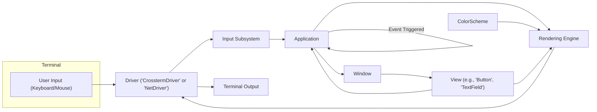

# Project Design Document: gui.cs for Threat Modeling

**Version:** 1.1
**Date:** October 26, 2023
**Author:** AI Software Architect

## 1. Introduction

This document provides an enhanced design overview of the `gui.cs` project, a C# library for building text-based user interfaces (TUIs) for terminal applications. The primary purpose of this document remains to serve as a robust foundation for subsequent threat modeling activities. It offers a more detailed exploration of the key components, their interactions, and the overall architecture of the library, providing crucial context for identifying potential security vulnerabilities and attack vectors.

## 2. Project Overview

*   **Project Name:** gui.cs
*   **Project Repository:** [https://github.com/migueldeicaza/gui.cs](https://github.com/migueldeicaza/gui.cs)
*   **Project Description:** `gui.cs` is a cross-platform, .NET library empowering developers to create rich, interactive console applications with a strong emphasis on user experience. It offers abstractions for a wide range of common UI elements, sophisticated input handling mechanisms, and platform-aware rendering capabilities within a terminal environment.
*   **Target Audience:** Developers building command-line tools, interactive scripts, and applications requiring sophisticated and user-friendly interfaces within a terminal.

## 3. Architectural Design

The `gui.cs` library employs principles aligning with the Model-View-Controller (MVC) pattern, or a similar separation of concerns, to structure its architecture. This design promotes modularity and maintainability by separating the data (model), the presentation (view), and the logic governing user interaction and application behavior (controller/event handling).

### 3.1. Key Components

*   **Core Library (`Terminal.Gui` namespace):** The central part of the library, housing the fundamental classes and interfaces essential for constructing TUIs.
    *   **`Application`:**  Manages the application's main loop, orchestrates event processing, handles focus management, and controls the overall application lifecycle, including initialization and shutdown.
    *   **`Window`:** Represents a top-level visual container, often with borders and titles, serving as a canvas for hosting other `View` elements.
    *   **`View`:** The abstract base class for all visual elements (widgets) displayed on the screen. It defines common properties like position, size, and drawing behavior. Concrete implementations include:
        *   `Label`:  Renders static, non-interactive text.
        *   `Button`: An interactive element that triggers an action when activated (e.g., by pressing Enter or clicking).
        *   `TextField`: Allows users to input and edit single-line text. It handles cursor movement, text selection, and basic editing operations.
        *   `TextView`: Provides a more advanced text editing area for multi-line text input and display, supporting features like scrolling and potentially syntax highlighting.
        *   `ListView`: Presents a scrollable list of selectable items. It manages item selection and display.
        *   `FrameView`: Offers a bordered container, often with a title, to visually group related `View` elements.
        *   `MenuBar`: Displays a menu bar at the top of the application window, providing access to application commands.
        *   `StatusBar`: Presents status information or contextual hints at the bottom of the application window.
        *   `Dialog`: Creates modal dialog boxes for focused user interaction, often used for prompts or confirmations.
    *   **`ColorScheme`:** Defines a set of color pairs (foreground and background) that are applied to different UI elements, allowing for visual customization.
    *   **`Driver` (Abstract Class):** An abstraction layer responsible for interacting with the underlying terminal. Concrete implementations adapt the library to different terminal environments.
        *   `CrosstermDriver`: Leverages the `Crossterm.Sharp` library to provide cross-platform terminal interaction, handling differences in terminal capabilities.
        *   `NetDriver`: A fallback driver offering basic terminal functionality, potentially with limited features or platform-specific behavior.
    *   **`Input` Subsystem:** Manages the capture and processing of keyboard and mouse input events from the terminal.
        *   Captures raw terminal input streams.
        *   Translates raw input sequences into higher-level, platform-independent events (e.g., key presses with modifiers, mouse button clicks and movements).
        *   Dispatches these events to the appropriate `View` based on focus and event coordinates.
    *   **`Layout` Management:**  Mechanisms for automatically arranging `View` elements within their containers, adapting to changes in window size or content.
        *   Constraint-based layout using properties like `X`, `Y`, `Width`, and `Height`, which can be absolute or relative to the parent container.
        *   Potentially more sophisticated layout managers for complex arrangements (details may vary based on the specific version).
    *   **`Event` System:** A robust mechanism enabling `View` objects to communicate and react to user actions and internal state changes within the application.
        *   Utilizes delegates and event handlers for actions such as button clicks (`Clicked`), text changes (`Changed`), and other relevant interactions.

### 3.2. Component Interactions and Data Flow

*   **User Input Initiation:** The user interacts with the terminal by physically pressing keys on the keyboard or manipulating the mouse.
*   **Driver Capture:** The concrete `Driver` implementation (e.g., `CrosstermDriver`) intercepts the raw input signals from the operating system's terminal interface.
*   **Input Processing and Translation:** The `Input` subsystem receives the raw input stream from the `Driver`. It then interprets these raw signals, translating them into meaningful, platform-independent events like "key pressed," "mouse moved," or "button clicked."
*   **Event Routing:** The `Input` subsystem dispatches these translated events to the central `Application` object.
*   **Focus Determination and Event Delivery:** The `Application` determines which specific `View` element should handle the event, based on the current focus and the event's coordinates (for mouse events). The event is then delivered to the appropriate `View`.
*   **Local Event Handling:** The target `View`'s registered event handlers are executed. This might involve updating the `View`'s internal state (e.g., changing the text in a `TextField`), triggering application logic, or requesting a re-render.
*   **Rendering Orchestration:** When the UI needs to be updated (due to user interaction, internal state changes, or timer events), the `Application` initiates the rendering process.
*   **View Drawing:** Each `View` is responsible for drawing itself onto an internal representation of the terminal screen (the screen buffer). The `ColorScheme` dictates the colors used during this rendering process.
*   **Driver Output to Terminal:** The `Rendering Engine` (implicitly managed through the interaction between `View`s and the `Driver`) utilizes the active `Driver` to write the contents of the updated screen buffer to the terminal's output stream.
*   **Terminal Display Update:** The terminal emulator receives the output from the `Driver` and updates its display to reflect the changes.

### 3.3. Key Data Structures

*   **View Hierarchy Tree:** A hierarchical data structure (typically a tree) representing the containment relationships between `View` objects. The `Window` usually serves as the root of this tree, containing other nested `View` elements. This structure is crucial for layout management and event propagation.
*   **Event Queues:** Queues are used internally to manage and process input events and other application-level events in an orderly manner, ensuring that events are handled sequentially.
*   **Screen Buffer (Internal):** An in-memory representation of the terminal screen's content. This buffer is used for efficient rendering by allowing the library to update only the changed portions of the screen.

## 4. Security Considerations (Detailed)

This section expands upon the initial security considerations, providing more specific examples of potential threats based on the architectural design. This detailed analysis is crucial for effective threat modeling.

*   **Input Validation Vulnerabilities:**
    *   **Injection Attacks:** If user input from `TextField` or `TextView` is not properly sanitized, attackers could inject malicious code or escape sequences that are then interpreted by the terminal, potentially leading to command injection or arbitrary code execution within the terminal context.
    *   **Format String Bugs:** If user-provided strings are directly used in formatting functions without proper sanitization, attackers could exploit format string vulnerabilities to read from or write to arbitrary memory locations.
    *   **Denial of Service (DoS):**  Submitting excessively long or specially crafted input strings could potentially overwhelm the input processing mechanisms or rendering engine, leading to a denial of service.
*   **Terminal Driver Security Risks:**
    *   **Escape Sequence Exploitation:** Malicious applications using `gui.cs` could potentially send crafted terminal escape sequences through the `Driver` to manipulate the terminal's behavior in unintended ways (e.g., clearing the screen unexpectedly, changing terminal settings, or even attempting to execute commands if the terminal emulator has vulnerabilities).
    *   **Vulnerabilities in `Crossterm.Sharp`:**  Security vulnerabilities in the underlying `Crossterm.Sharp` library could directly impact the security of `gui.cs`. Regular updates and security audits of dependencies are crucial.
*   **Event Handling Security Weaknesses:**
    *   **Spoofed Events:**  While likely difficult, if an attacker could somehow inject or spoof events, they might be able to trigger unintended actions within the application or bypass security checks that rely on specific event sequences.
    *   **Unhandled Exceptions in Event Handlers:**  Exceptions thrown within event handlers that are not properly caught could lead to application crashes or unexpected behavior, potentially creating a denial-of-service scenario.
*   **Rendering Engine Vulnerabilities:**
    *   **DoS through Resource Exhaustion:**  Crafted UI layouts or malicious content within `View` elements could potentially cause excessive resource consumption during rendering, leading to a denial of service. For example, deeply nested views or extremely large text blocks.
    *   **Exploitation of Terminal Rendering Bugs:**  Bugs or inconsistencies in how different terminal emulators render certain characters or escape sequences could be exploited to display misleading information or even potentially trigger vulnerabilities in the terminal itself.
*   **Dependency Security Concerns:**
    *   **Vulnerable Dependencies:**  The project's reliance on external libraries like `Crossterm.Sharp` introduces a dependency risk. Unpatched vulnerabilities in these dependencies could be exploited through `gui.cs`.
    *   **Supply Chain Attacks:**  Compromised dependencies could introduce malicious code into the `gui.cs` library.
*   **Information Disclosure Risks:**
    *   **Accidental Display of Sensitive Data:** Errors in rendering logic or improper handling of data could lead to sensitive information being inadvertently displayed on the terminal screen.
    *   **Information Leakage through Terminal Features:**  Certain terminal features or escape sequences, if not handled carefully, could potentially be used to leak information about the application's state or environment.
*   **Privilege Escalation (Low Probability but Possible):**
    *   While `gui.cs` itself operates within the privileges of the running application, vulnerabilities in the library could potentially be chained with other vulnerabilities in the host application or operating system to achieve privilege escalation. This is a less direct threat but should be considered.

## 5. Deployment Considerations

*   `gui.cs` is typically distributed as a NuGet package, which developers integrate as a dependency into their .NET applications.
*   Applications utilizing `gui.cs` are executed directly within a terminal environment.
*   The overall security posture of a deployed application depends on a combination of the security of the `gui.cs` library itself and the security practices employed in the application's own codebase. Developers must be mindful of how they use `gui.cs` and ensure they are not introducing vulnerabilities in their application logic.

## 6. Future Considerations (Impact on Threat Landscape)

*   **Enhanced Accessibility Features:**  The introduction of features for screen readers or other assistive technologies could introduce new attack vectors related to information disclosure if sensitive data is not properly handled for accessibility output.
*   **Advanced Theming and Customization:**  Allowing users to define custom themes or styles could introduce risks if these themes can execute arbitrary code (e.g., through embedded scripts or unsafe styling mechanisms) or access sensitive data.
*   **Networking Integration:**  If future versions of `gui.cs` were to incorporate networking capabilities (e.g., for displaying remote data or interacting with network services), this would significantly broaden the attack surface and introduce a range of new security considerations related to network communication, authentication, and data security.

## 7. Conclusion

This enhanced design document provides a more in-depth understanding of the `gui.cs` project's architecture, components, and their interactions. By elaborating on potential security considerations with concrete examples, this document serves as a more robust and valuable input for the subsequent threat modeling process. This detailed foundation will enable a more thorough identification of potential vulnerabilities and the development of effective mitigation strategies.