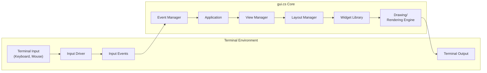

# Project Design Document: gui.cs - Terminal UI Toolkit

**Project Name:** gui.cs

**Project Repository:** [https://github.com/migueldeicaza/gui.cs](https://github.com/migueldeicaza/gui.cs)

**Version:** (Based on the repository's current state - consider specifying a commit hash or release tag for a more stable reference in a real-world scenario) -  Latest commit as of October 26, 2023.

**Document Version:** 1.1
**Date:** October 27, 2023
**Author:** Gemini (AI Assistant)

**Changes from Version 1.0:**

*   Improved clarity and conciseness in component descriptions.
*   Enhanced the "Security Considerations" section with more specific examples and potential mitigations.
*   Refined Mermaid diagrams for better readability and adherence to requested syntax.
*   Added a "Data Storage" section to address potential data handling aspects.
*   Clarified the Deployment Model section.

## 1. Introduction

This document provides a detailed design overview of the `gui.cs` project, a cross-platform terminal UI toolkit for .NET. This document is intended to serve as a foundation for threat modeling and security analysis of the project. It outlines the system's architecture, key components, data flow, technology stack, and initial security considerations.

`gui.cs` empowers developers to create interactive and visually rich console-based applications, mimicking many features of graphical user interfaces (GUIs) within the terminal environment. It offers a high-level API to build terminal UIs with elements like windows, dialogs, menus, and various UI controls, abstracting away the complexities of direct terminal manipulation.

## 2. Project Goals and Objectives

The core goals of `gui.cs` are:

*   **Cross-Platform Portability:** Ensure consistent UI behavior and functionality across diverse operating systems and terminal emulators that support standard terminal escape sequences (e.g., ANSI, VT100).
*   **Comprehensive UI Widget Set:** Provide a rich and extensible library of UI controls (widgets) enabling developers to construct sophisticated terminal applications.
*   **Event-Driven Programming Model:** Implement an event-driven architecture for efficient handling of user interactions (keyboard, mouse) and application logic, promoting responsiveness and modularity.
*   **Flexible Layout Management:** Offer robust and adaptable layout mechanisms to arrange UI elements dynamically within windows and views, accommodating different screen sizes and content.
*   **Theming and Customization Capabilities:** Allow developers to customize the visual appearance of applications, including colors, styles, and potentially custom themes, enhancing user experience and branding.
*   **Developer-Friendly API:** Design an intuitive and easy-to-use API that simplifies the development process of terminal-based user interfaces, reducing development time and complexity.

## 3. System Architecture Overview

`gui.cs` employs a modular, component-based architecture. The system's core components interact to manage input, UI logic, rendering, and output within the terminal.



**Description of Components:**

*   **"Terminal Input (Keyboard, Mouse)":** Represents the source of raw input from the terminal, including keystrokes, mouse movements, button presses, and potentially signals like window resize.
*   **"Input Driver":**  This component is responsible for interacting directly with the terminal's input stream. It reads raw byte streams, interprets terminal escape sequences related to input, and translates them into normalized, platform-independent `Input Events`. It handles variations in terminal behavior across different operating systems and terminal types.
*   **"Input Events":**  Structured representations of user input or terminal events. These events include key presses (with key codes and modifier keys), mouse events (position, button states, motion), and terminal resize events. They provide a consistent interface for the rest of the `gui.cs` system to process input.
*   **"Event Manager":** The central nervous system of `gui.cs`. It receives `Input Events` from the "Input Driver" and manages their distribution. It dispatches events to the appropriate UI elements (widgets, views, application itself) based on focus, event type, and defined event routing rules. It also manages event propagation mechanisms like bubbling and capturing.
*   **"Application":** Represents the top-level application instance built using `gui.cs`. It controls the overall application lifecycle, manages top-level windows and dialogs, and handles global application-level events (e.g., menu commands, application shutdown). It serves as the entry point and orchestrator for the UI.
*   **"View Manager":** Manages the hierarchical structure of views and windows within the application. It handles the creation, destruction, and organization of views. It is responsible for focus management, determining which view receives input, and managing view-related events such as resizing or focus changes.
*   **"Layout Manager":**  Calculates and determines the size and position of UI elements (widgets) within views and windows. It implements various layout algorithms and policies (e.g., stacking, grid, absolute positioning) to arrange widgets according to defined rules and constraints, ensuring proper UI rendering across different terminal sizes.
*   **"Widget Library":** A rich collection of pre-built, reusable UI components (widgets). Examples include buttons, labels, text fields, list views, menus, dialogs, and windows. Each widget encapsulates its own rendering logic, event handling, and layout behavior, providing building blocks for application UIs.
*   **"Drawing/Rendering Engine":**  The component responsible for the actual visual representation of UI elements on the terminal screen. It translates widget rendering instructions into terminal escape sequences. It controls cursor positioning, colors, text attributes (bold, underline), and character drawing to create the visual UI in the terminal.
*   **"Terminal Output":** Represents the output stream directed to the terminal. The "Drawing/Rendering Engine" sends terminal escape sequences through this stream, which the terminal interprets to display the UI.

## 4. Component Details

### 4.1. "Input Driver"

*   **Functionality:**
    *   **Raw Input Acquisition:** Reads raw byte streams from the terminal's input stream (typically standard input).
    *   **Escape Sequence Parsing:**  Parses and interprets terminal escape sequences related to input, such as ANSI escape codes for cursor keys, function keys, and mouse events.
    *   **Input Normalization:**  Standardizes input across different terminal types and operating systems, abstracting away platform-specific input handling differences.
    *   **"Input Event" Generation:**  Transforms parsed input into structured `Input Events` (Key events, Mouse events, Resize events).
*   **Data Flow:**
    *   **Input:** Raw byte stream from the terminal input.
    *   **Output:** Structured `Input Events` to the "Event Manager".
*   **Interfaces:**
    *   `ReadInput()`: Function to read raw input data from the terminal.
    *   `ParseInput()`: Function to process raw input and generate `Input Events`.
*   **Dependencies:**
    *   Operating System specific APIs for terminal input (e.g., `termios` on Unix-like systems, Console APIs on Windows).
    *   Knowledge of terminal escape sequence standards (ANSI, VT100, xterm, etc.).

### 4.2. "Event Manager"

*   **Functionality:**
    *   **Event Reception:** Receives `Input Events` from the "Input Driver".
    *   **Event Dispatching:** Routes events to the appropriate UI elements based on focus, event type, and event routing rules.
    *   **Event Propagation Management:** Implements and manages event propagation mechanisms like event bubbling and capturing, allowing for hierarchical event handling.
    *   **Event Handler Registration:** Provides APIs for widgets and views to register and unregister event handlers for specific event types.
    *   **Application-Level Event Handling:** Manages application-wide events, such as application start, exit, or global keybindings.
*   **Data Flow:**
    *   **Input:** `Input Events` from the "Input Driver".
    *   **Output:** Routed events to "Application", "View Manager", and individual "Widgets".
*   **Interfaces:**
    *   `QueueEvent(InputEvent event)`: Adds an event to the event queue for processing.
    *   `ProcessEvents()`: Processes events from the event queue and dispatches them to relevant handlers.
    *   `AddEventHandler(Widget widget, EventType type, EventHandler handler)`: Registers an event handler function for a specific widget and event type.
*   **Dependencies:**
    *   "Widget Library", "View Manager", "Application" components for event routing and handling.

### 4.3. "Application"

*   **Functionality:**
    *   **Application Lifecycle Management:** Manages the entire application lifecycle, including initialization, the main event loop execution, and shutdown procedures.
    *   **Window and Dialog Management:** Creates and manages top-level windows and modal dialogs, providing the main UI containers.
    *   **Global Event Handling:** Handles application-level events, such as menu commands, global keyboard shortcuts, and application-specific events.
    *   **Resource Management:** Potentially manages global application settings, resources (like themes or configurations), and application state.
*   **Data Flow:**
    *   **Input:** Events from the "Event Manager".
    *   **Output:** Interactions with "View Manager" for window/view management, "Widget Library" for UI element creation, and triggers rendering via the "Drawing/Rendering Engine".
*   **Interfaces:**
    *   `Initialize()`: Initializes the application, setting up core components and resources.
    *   `Run()`: Starts the main application event loop, processing events and driving the UI.
    *   `Shutdown()`: Gracefully shuts down the application, releasing resources and performing cleanup.
    *   `CreateWindow(Window window)`: Creates and adds a top-level window to the application.
    *   `OpenDialog(Dialog dialog)`: Opens a modal dialog, pausing interaction with the main application until the dialog is closed.
*   **Dependencies:**
    *   "View Manager", "Widget Library", "Event Manager", "Drawing/Rendering Engine".

### 4.4. "View Manager"

*   **Functionality:**
    *   **View Hierarchy Management:** Manages the tree-like structure of views and windows, organizing UI elements.
    *   **View Lifecycle Management:** Handles the creation, destruction, and lifecycle of views within the application.
    *   **Focus Management:**  Tracks and manages input focus, determining which view or widget currently receives keyboard and mouse input.
    *   **View Arrangement:** Provides mechanisms for adding, removing, and arranging views within windows and parent views.
    *   **View Event Handling:** Handles events related to views, such as view resizing, focus changes, and visibility changes.
*   **Data Flow:**
    *   **Input:** Events from the "Event Manager".
    *   **Output:** Interactions with "Widgets" to manage their lifecycle within views, "Layout Manager" to arrange widgets, and triggers rendering of views via the "Drawing/Rendering Engine".
*   **Interfaces:**
    *   `AddView(View view, ContainerView parent)`: Adds a view as a child to a parent container view.
    *   `RemoveView(View view)`: Removes a view from its parent.
    *   `SetFocus(View view)`: Sets the input focus to a specific view, making it the target for subsequent input events.
    *   `GetFocusedView()`: Returns the currently focused view in the view hierarchy.
*   **Dependencies:**
    *   "Widget Library", "Layout Manager", "Event Manager", "Drawing/Rendering Engine".

### 4.5. "Layout Manager"

*   **Functionality:**
    *   **Widget Positioning and Sizing:** Calculates the precise size and screen position of widgets within views and windows based on layout policies and constraints.
    *   **Layout Policy Implementation:** Implements various layout algorithms and policies, such as:
        *   Absolute Positioning: Widgets placed at fixed coordinates.
        *   Relative Layouts: Widgets positioned relative to each other or parent containers.
        *   Grid Layouts: Widgets arranged in rows and columns.
        *   Stack Layouts: Widgets stacked vertically or horizontally.
    *   **Dynamic Layout Adjustment:** Handles resizing and repositioning of widgets when the window or view size changes, ensuring responsive UI behavior.
    *   **Layout Constraint Handling:** Interprets and applies layout constraints and hints provided by widgets and views to guide layout algorithms.
*   **Data Flow:**
    *   **Input:** Layout requests from "View Manager" and "Widgets", including desired sizes and layout constraints.
    *   **Output:** Calculated widget positions and sizes, provided to the "Drawing/Rendering Engine" and "Widgets".
*   **Interfaces:**
    *   `PerformLayout(View view)`: Executes the layout algorithm for a given view, recalculating widget positions and sizes.
    *   `GetWidgetBounds(Widget widget)`: Retrieves the calculated bounding rectangle (position and size) of a widget.
    *   `SetLayoutPolicy(View view, LayoutPolicy policy)`: Sets the layout policy to be used for a specific view, determining how its child widgets are arranged.
*   **Dependencies:**
    *   "Widget Library", "View Manager", "Drawing/Rendering Engine".

### 4.6. "Widget Library"

*   **Functionality:**
    *   **UI Component Provision:** Offers a diverse collection of reusable UI components (widgets), including but not limited to:
        *   "Button": Interactive buttons for triggering actions.
        *   "Label": Static text displays.
        *   "TextField": Single-line text input fields.
        *   "TextView": Multi-line text editors or viewers.
        *   "ListView": Displays scrollable lists of items.
        *   "Menu": Dropdown or popup menus for commands.
        *   "Dialog": Modal windows for user interaction and information display.
        *   "Window": Top-level application windows.
        *   "Frame": Container widgets for grouping and visually separating UI elements.
        *   Progress bars, checkboxes, radio buttons, etc.
    *   **Encapsulated Logic:** Each widget encapsulates:
        *   **Rendering Logic:** How the widget is visually drawn on the terminal using the "Drawing/Rendering Engine".
        *   **Event Handling Logic:** How the widget responds to user input events (keyboard, mouse) and triggers actions or state changes.
        *   **Layout Behavior:** How the widget interacts with the "Layout Manager" to determine its size and position within a view.
*   **Data Flow:**
    *   **Input:** Events from the "Event Manager", layout information from the "Layout Manager".
    *   **Output:** Rendering commands to the "Drawing/Rendering Engine", layout information to the "Layout Manager".
*   **Interfaces:**
    *   Each widget class defines its own API for configuration, properties, event handling, and interaction.
    *   Common interfaces for widgets might include:
        *   `Draw(RenderingContext context)`:  Method to render the widget onto the terminal using the provided rendering context.
        *   `HandleEvent(InputEvent event)`: Method to process an input event and update the widget's state or trigger actions.
        *   `Layout(LayoutContext context)`: Method to participate in the layout calculation process, providing size hints and constraints.
*   **Dependencies:**
    *   "Drawing/Rendering Engine", "Event Manager", "Layout Manager".

### 4.7. "Drawing/Rendering Engine"

*   **Functionality:**
    *   **Terminal Drawing Primitives:** Provides low-level drawing functions for rendering UI elements on the terminal screen.
    *   **Escape Sequence Generation:**  Generates terminal escape sequences (ANSI, VT100, etc.) to control terminal attributes:
        *   Cursor positioning (`SetCursorPosition`).
        *   Foreground and background colors (`SetForegroundColor`, `SetBackgroundColor`).
        *   Text attributes (bold, underline, italics, etc.).
        *   Character and string drawing (`DrawString`).
        *   Screen clearing (`ClearRegion`, `ClearScreen`).
    *   **Terminal Abstraction:**  Abstracts away terminal-specific escape sequence variations, providing a consistent rendering API.
    *   **Rendering Optimization:**  Potentially implements optimizations to minimize screen updates and reduce flickering, such as buffering output and only updating changed regions.
*   **Data Flow:**
    *   **Input:** Rendering commands from "Widgets", "View Manager", and "Application", specifying what to draw and where.
    *   **Output:** Terminal escape sequences sent to the "Terminal Output" stream.
*   **Interfaces:**
    *   `SetCursorPosition(int row, int col)`: Sets the cursor position to the specified row and column.
    *   `SetForegroundColor(Color color)`: Sets the foreground color for subsequent drawing operations.
    *   `SetBackgroundColor(Color color)`: Sets the background color for subsequent drawing operations.
    *   `DrawString(int row, int col, string text)`: Draws a string of text at the specified position.
    *   `ClearRegion(Rectangle rect)`: Clears a rectangular region of the terminal screen.
    *   `Flush()`: Flushes the output buffer, sending the generated escape sequences to the terminal output.
*   **Dependencies:**
    *   Knowledge of terminal escape sequence standards (ANSI, VT100, xterm, etc.).
    *   Operating System specific APIs for terminal output (e.g., standard output stream).

## 5. Data Flow Diagrams

### 5.1. Input Event Processing

```mermaid
graph LR
    A["Terminal Input"] --> B["Input Driver"];
    B --> C["Input Events"];
    C --> D["Event Manager"];
    D --> E{ "Focused Widget\nor View" };
    E -- "Event Dispatch" --> F["Widget Event Handler"];
    F --> G["Widget State\nUpdate"];
    G --> H["Request\nRedraw"];
    H --> I["Drawing/\nRendering Engine"];
    I --> J["Terminal Output"];
```

**Description:** This diagram illustrates the flow of input events. Raw terminal input is processed by the "Input Driver", converted to "Input Events", and dispatched by the "Event Manager" to the currently focused UI element ("Focused Widget or View"). The event is then handled by the "Widget Event Handler", potentially leading to a "Widget State Update". This update may trigger a "Request Redraw", which is processed by the "Drawing/Rendering Engine" to update the "Terminal Output" and refresh the display.

### 5.2. Widget Rendering

```mermaid
graph LR
    A["Application\nor View Manager"] --> B["Layout Manager"];
    B --> C{ "Widget\nBounds" };
    C --> D["Widget"];
    D --> E["Drawing/\nRendering Engine"];
    E --> F["Terminal Output"];
```

**Description:** This diagram depicts the widget rendering process. The "Application" or "View Manager" initiates the layout process by interacting with the "Layout Manager". The "Layout Manager" calculates the "Widget Bounds" (position and size). The "Widget" then uses the "Drawing/Rendering Engine" to render itself within these bounds, ultimately sending output to the "Terminal Output" for display.

## 6. Data Storage

While `gui.cs` primarily focuses on UI rendering in the terminal, applications built with it might require data storage.  `gui.cs` itself likely does not provide built-in data storage mechanisms. Applications would typically rely on standard .NET data storage options, such as:

*   **In-Memory Data Structures:** For temporary or application-session-only data.
*   **File System:**  Reading and writing data to local files (plain text, configuration files, data files).
*   **Databases:** Using database systems (e.g., SQLite for local storage, or external databases via database connectors) for structured data persistence.
*   **Configuration Files:**  Storing application settings in configuration files (e.g., JSON, XML, INI).

The choice of data storage would depend on the specific requirements of the application built using `gui.cs`.  Security considerations related to data storage (encryption, access control, secure storage practices) would be the responsibility of the application developer.

## 7. Technology Stack

*   **Programming Language:** C# (.NET)
*   **Target Platform:** Cross-platform (Linux, macOS, Windows, and potentially other platforms supported by .NET and terminal emulation).
*   **Terminal Interaction:** Standard input/output streams, terminal escape sequences (ANSI, VT100, xterm, etc.).
*   **Build System:** Standard .NET build tools (e.g., `dotnet build`, MSBuild, potentially IDEs like Visual Studio or VS Code).
*   **Dependencies:** Standard .NET libraries and potentially platform-specific libraries for terminal interaction if needed (though the goal is to minimize platform-specific code).

## 8. Deployment Model

`gui.cs` is distributed as a library (likely a NuGet package). Applications built using `gui.cs` are deployed as standard .NET console applications.

**Deployment Steps (Typical):**

1.  **Application Development:** Developers create a .NET console application project and incorporate the `gui.cs` library (e.g., via NuGet package manager).
2.  **Application Building:** The application is compiled using the .NET SDK (`dotnet build` command or IDE build tools). This produces an executable file (and potentially necessary .NET runtime dependencies).
3.  **Executable Deployment:** The compiled executable and any required .NET runtime components (if deploying as a self-contained application, or ensuring the target system has the .NET runtime installed) are deployed to the target environment. This could involve copying files, using deployment tools, or packaging for specific platforms.
4.  **Application Execution:** The executable is launched from a terminal or command prompt on the target system. The application then utilizes `gui.cs` to render its user interface directly within the terminal.

**Important Note:**  As `gui.cs` is a library, its security posture is crucial for the security of applications built upon it. Any vulnerabilities within `gui.cs` could potentially be inherited or exploited by applications that depend on it.

## 9. Security Considerations (For Threat Modeling)

This section outlines security considerations to be addressed during threat modeling.

*   **Input Validation and Sanitization:**
    *   **Terminal Input Parsing Vulnerabilities:** The "Input Driver" must rigorously parse terminal input and escape sequences to prevent injection attacks. Maliciously crafted escape sequences could potentially be used to manipulate the terminal in unintended ways, bypass security measures, or cause denial of service. *Mitigation: Implement robust parsing logic, validate escape sequences against expected formats, and potentially sanitize or discard unexpected or potentially harmful sequences.*
    *   **Widget Input Handling and Injection:** Widgets accepting user input (e.g., "TextField", "TextView") need to validate and sanitize input to prevent injection vulnerabilities. While less critical than in web applications, vulnerabilities could still be exploited to inject control characters, escape sequences, or data that could disrupt application logic or cause unexpected behavior. *Mitigation: Implement input validation within widgets, sanitize input to remove or escape potentially harmful characters, and consider context-specific validation rules.*
*   **Terminal Escape Sequence Security:**
    *   **Rendering Engine Vulnerabilities:**  Although less likely in managed code like .NET, vulnerabilities could arise in the "Drawing/Rendering Engine" if escape sequence generation or handling is flawed. Incorrectly constructed escape sequences could potentially lead to terminal corruption, unexpected display behavior, or even, in extreme cases, terminal emulator vulnerabilities (though rare). *Mitigation: Thoroughly test the "Drawing/Rendering Engine" with various terminal types and escape sequences, adhere to terminal escape sequence standards, and consider using well-vetted libraries or approaches for escape sequence generation.*
    *   **Escape Sequence Injection via Data:** If application data (e.g., data from files or network sources) is directly rendered to the terminal without proper sanitization, it could be exploited to inject malicious escape sequences. *Mitigation: Sanitize any external data before rendering it to the terminal, especially if it originates from untrusted sources. Treat external data as potentially containing escape sequences and encode or escape them appropriately.*
*   **Denial of Service (DoS) Attacks:**
    *   **Input Flooding and Event Queue Exhaustion:** The application might be vulnerable to DoS attacks if it doesn't handle excessive input gracefully. Flooding the input stream with events could overwhelm the "Event Manager" and lead to performance degradation or application crashes. *Mitigation: Implement input rate limiting, event queue size limits, and efficient event processing to prevent resource exhaustion from excessive input.*
    *   **Rendering Performance DoS:** Complex UI layouts, inefficient rendering algorithms, or excessive redraw requests could lead to performance bottlenecks and DoS if rendering becomes too resource-intensive, especially under heavy load or with maliciously crafted UI structures. *Mitigation: Optimize rendering algorithms, implement efficient UI updates (e.g., partial redraws), and consider limiting UI complexity or widget count in performance-critical scenarios.*
*   **Information Disclosure Risks:**
    *   **Logging and Debugging Information Exposure:**  Careless logging or debug output could inadvertently expose sensitive information (user data, internal application details, paths, etc.) to the terminal, especially in production environments. *Mitigation: Implement secure logging practices, avoid logging sensitive data to the terminal in production, and ensure debug output is disabled or appropriately controlled in release builds.*
    *   **Error Message Verbosity:**  Overly verbose error messages displayed on the terminal could reveal sensitive internal application details or system information to users, potentially aiding attackers. *Mitigation: Implement secure error handling, provide user-friendly and generic error messages on the terminal, and log detailed error information securely for debugging purposes only.*
*   **Dependency Security:**
    *   **.NET Runtime Vulnerabilities:** The security of the underlying .NET runtime is a critical dependency. Vulnerabilities in the .NET runtime could directly impact `gui.cs` and applications built with it. *Mitigation: Keep the .NET runtime updated with the latest security patches and follow .NET security best practices.*
    *   **Third-party Library Security (If Applicable):** If `gui.cs` relies on any external third-party libraries, their security posture must also be considered. Vulnerabilities in these dependencies could be exploited. *Mitigation: Conduct security assessments of third-party dependencies, keep them updated, and choose libraries from reputable sources with active security maintenance.*

This improved design document provides a more detailed and refined overview of the `gui.cs` project, enhancing its utility as a foundation for threat modeling and security analysis. The expanded security considerations section offers more specific examples of potential threats and suggests mitigation strategies, making it more actionable for security assessments.