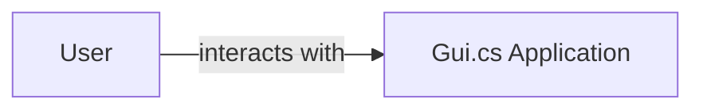
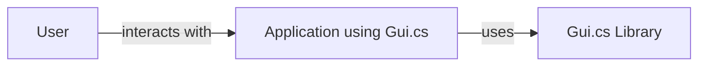
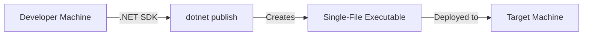
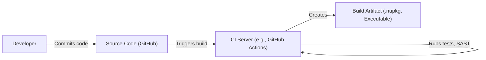

# BUSINESS POSTURE

Business Priorities and Goals:

*   Provide a user-friendly, cross-platform, console-based UI framework for .NET developers.
*   Enable rapid development of console applications with rich UI elements.
*   Offer a lightweight and performant alternative to traditional GUI frameworks.
*   Maintain backward compatibility and ease of use for developers familiar with Terminal.Gui.
*   Foster a vibrant open-source community around the project.

Business Risks:

*   Data breaches: Since this is a UI framework, the direct risk of data breaches is lower than in, for example, a web application. However, applications built using this framework could handle sensitive data, and vulnerabilities in the framework could be exploited to gain access to that data.
*   Denial of Service: Maliciously crafted input or excessive resource consumption could lead to application crashes or freezes, rendering the console application unusable.
*   Code Injection: If the framework doesn't properly sanitize user input or handle events securely, it could be vulnerable to code injection attacks, allowing attackers to execute arbitrary code within the context of the application.
*   Supply Chain Attacks: Compromised dependencies or build tools could introduce vulnerabilities into the framework itself.
*   Reputational Damage: Security vulnerabilities or poor performance could damage the reputation of the framework and discourage adoption.

# SECURITY POSTURE

Existing Security Controls:

*   security control: Code Reviews: The project is open-source and hosted on GitHub, which facilitates community code reviews and scrutiny. (Described in GitHub repository)
*   security control: Issue Tracking: GitHub's issue tracker is used to report and manage bugs and security vulnerabilities. (Described in GitHub repository)
*   security control: Static Analysis: The project may use static analysis tools, although this is not explicitly mentioned. (Not explicitly described, assumed from .NET ecosystem)

Accepted Risks:

*   accepted risk: Limited Resources: As an open-source project, it may have limited resources for dedicated security audits and penetration testing.
*   accepted risk: Cross-Platform Compatibility: Supporting multiple platforms can introduce complexity and potential security inconsistencies.

Recommended Security Controls:

*   security control: Integrate SAST (Static Application Security Testing) tools into the build process to automatically identify potential vulnerabilities.
*   security control: Implement DAST (Dynamic Application Security Testing) to test the running application for vulnerabilities.
*   security control: Establish a clear security vulnerability disclosure policy.
*   security control: Conduct regular security reviews and penetration testing.
*   security control: Implement a Software Bill of Materials (SBOM) to track dependencies and their vulnerabilities.
*   security control: Use a linter that includes security rules.

Security Requirements:

*   Authentication: Not directly applicable to the framework itself, but applications built with it may require authentication. The framework should not hinder the implementation of secure authentication mechanisms.
*   Authorization: Similar to authentication, authorization is typically handled by the application logic. The framework should provide mechanisms to support secure authorization practices.
*   Input Validation: The framework must properly validate and sanitize all user input to prevent injection attacks and unexpected behavior. This includes handling keyboard input, mouse events, and any other forms of input.
*   Cryptography: The framework itself may not directly handle cryptography, but it should not interfere with the use of cryptographic libraries by the application. If the framework does handle any sensitive data (e.g., in configuration files), it should use appropriate encryption.

# DESIGN

## C4 CONTEXT

Element Description:

*   Element:
    *   Name: User
    *   Type: Person
    *   Description: A person interacting with a console application built using Gui.cs.
    *   Responsibilities: Provides input to the application, views output from the application.
    *   Security controls: None (external to the system).

*   Element:
    *   Name: Gui.cs Application
    *   Type: Software System
    *   Description: A console application built using the Gui.cs framework.
    *   Responsibilities: Processes user input, displays UI elements, performs application logic.
    *   Security controls: Input validation, secure event handling, (potentially) authentication and authorization implemented within the application logic.

## C4 CONTAINER

Element Description:

*   Element:
    *   Name: User
    *   Type: Person
    *   Description: A person interacting with a console application built using Gui.cs.
    *   Responsibilities: Provides input to the application, views output from the application.
    *   Security controls: None (external to the system).

*   Element:
    *   Name: Application using Gui.cs
    *   Type: Container: .NET Application
    *   Description: The specific console application built by a developer utilizing the Gui.cs library.
    *   Responsibilities: Implements the core business logic, handles user interactions, and manages the application's state.
    *   Security controls: Input validation, output encoding, error handling, and any application-specific security measures.

*   Element:
    *   Name: Gui.cs Library
    *   Type: Container: .NET Library
    *   Description: The Gui.cs framework itself, providing the UI elements and event handling.
    *   Responsibilities: Provides UI components (windows, buttons, text fields, etc.), handles user input events, manages the rendering of the UI.
    *   Security controls: Input validation, secure event handling, protection against common UI-related vulnerabilities.

## DEPLOYMENT

Possible deployment solutions:

1.  Self-contained .NET deployment: The application and all its dependencies, including the .NET runtime, are packaged into a single executable or a directory.
2.  Framework-dependent deployment: The application is deployed along with its dependencies, but it relies on a shared .NET runtime installed on the target system.
3.  Single-file deployment (available in newer .NET versions): The application, its dependencies, and optionally the .NET runtime are bundled into a single executable file.

Chosen solution (Single-file deployment):

Element Description:

*   Element:
    *   Name: Developer Machine
    *   Type: Infrastructure Node
    *   Description: The machine used by the developer to write and build the application.
    *   Responsibilities: Hosts the development environment, source code, and build tools.
    *   Security controls: Standard development machine security practices (e.g., OS patching, antivirus).

*   Element:
    *   Name: .NET SDK
    *   Type: Software
    *   Description: The .NET Software Development Kit, used to build the application.
    *   Responsibilities: Compiles the source code, links dependencies, and creates the deployment package.
    *   Security controls: Regularly updated to the latest version to include security fixes.

*   Element:
    *   Name: dotnet publish
    *   Type: Process
    *   Description: The .NET CLI command used to create a deployable package.
    *   Responsibilities: Packages the application and its dependencies into a single-file executable.
    *   Security controls: Configuration options for security (e.g., code signing).

*   Element:
    *   Name: Single-File Executable
    *   Type: File
    *   Description: The deployable output of the build process.
    *   Responsibilities: Contains the application, its dependencies, and (optionally) the .NET runtime.
    *   Security controls: Code signing, potentially obfuscation.

*   Element:
    *   Name: Target Machine
    *   Type: Infrastructure Node
    *   Description: The machine where the application will be executed.
    *   Responsibilities: Runs the single-file executable.
    *   Security controls: OS patching, antivirus, potentially application whitelisting.

## BUILD

Element Description:

*   Developer: Writes and commits code to the source code repository.
*   Source Code (GitHub): The repository hosting the project's source code.
*   CI Server (e.g., GitHub Actions): A continuous integration server that automates the build process.
*   Build Artifact (.nupkg, Executable): The output of the build process, which can be a NuGet package, a standalone executable, or other deployment formats.

Security Controls:

*   security control: Source Code Management: Use of Git and GitHub for version control and collaboration.
*   security control: CI/CD Pipeline: Automated build and testing using a CI server (e.g., GitHub Actions).
*   security control: SAST (Static Application Security Testing): Integration of SAST tools into the CI pipeline to scan for vulnerabilities in the code.
*   security control: Dependency Scanning: Use of tools to identify and manage vulnerabilities in project dependencies.
*   security control: Code Signing: Signing the build artifacts to ensure their integrity and authenticity.

# RISK ASSESSMENT

Critical Business Processes:

*   Rapid development of console-based applications.
*   Providing a stable and reliable UI framework.
*   Maintaining a positive reputation within the .NET community.

Data to Protect:

*   Source Code: Sensitivity - Medium (Intellectual property, potential vulnerabilities).
*   Build Artifacts: Sensitivity - Medium (Could be tampered with to introduce malicious code).
*   User Data (handled by applications built with Gui.cs): Sensitivity - Varies greatly depending on the specific application. The framework itself does not directly handle user data, but applications built with it might.

# QUESTIONS & ASSUMPTIONS

Questions:

*   Are there any specific compliance requirements (e.g., GDPR, HIPAA) that applications built with Gui.cs are expected to meet?
*   What is the expected level of security expertise of developers using Gui.cs?
*   What are the most common types of applications that are expected to be built with Gui.cs?
*   Is there a budget allocated for security tools and audits?
*   What is the process for handling security vulnerability reports?

Assumptions:

*   BUSINESS POSTURE: The project prioritizes ease of use and rapid development, but also recognizes the importance of security.
*   SECURITY POSTURE: The project relies primarily on community code reviews and issue tracking for security, but is open to adopting more robust security practices.
*   DESIGN: The deployment model will typically be a single-file executable or a self-contained deployment for simplicity. The build process will leverage CI/CD for automation and security checks.