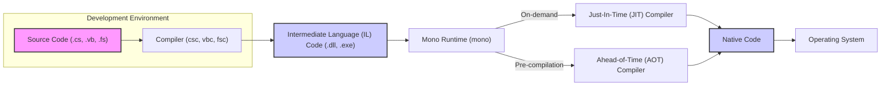

## Project Design Document: Mono - A Cross-Platform .NET Implementation

**1. Project Overview**

The Mono project is an open-source initiative providing a cross-platform implementation of the .NET Framework. This allows developers to create and execute .NET applications on a variety of operating systems, including Linux, macOS, Windows, and mobile platforms like Android and iOS (through Xamarin). Mono encompasses a complete Common Language Runtime (CLR), a comprehensive set of class libraries mirroring the .NET Framework, and essential development and deployment tools. This document details the architectural design and core components of Mono, specifically for the purpose of facilitating thorough threat modeling activities.

**2. Goals and Objectives**

*   To present a clear and accurate depiction of the Mono system architecture.
*   To pinpoint critical components and their interdependencies that are relevant to security considerations.
*   To illustrate the flow of data within the Mono runtime environment.
*   To serve as a foundational document for subsequent threat modeling exercises.
*   To highlight potential areas of security vulnerability within the Mono project.

**3. Target Audience**

*   Security engineers and architects responsible for assessing the security of systems utilizing Mono.
*   Software developers contributing to or building applications on the Mono platform.
*   Threat modeling specialists tasked with identifying and mitigating potential security risks.
*   Individuals seeking a deeper understanding of the internal workings of the Mono runtime environment from a security perspective.

**4. System Architecture**

The Mono architecture is structured around several key interacting components:

*   **Common Language Runtime (CLR):**
    *   The fundamental execution engine for .NET bytecode (Intermediate Language - IL).
    *   Performs Just-In-Time (JIT) compilation, translating IL into native machine code for the target platform during runtime.
    *   Manages memory allocation and deallocation through its Garbage Collector (GC).
    *   Handles thread creation, scheduling, and synchronization primitives.
    *   Provides support for runtime reflection, allowing inspection and manipulation of types and objects at runtime.
    *   Includes mechanisms for dynamic code generation, enabling the creation of new code during execution.
    *   Historically included a Security Manager for enforcing security policies, though its role is significantly reduced in modern .NET and Mono implementations, with security largely relying on OS-level protections and code access security attributes.
*   **Class Libraries:**
    *   A vast collection of libraries providing core functionalities analogous to the .NET Framework Base Class Library (BCL).
    *   Organized into namespaces such as `System`, `System.IO`, `System.Net`, `System.Security`, `System.Data`, and others.
    *   Offers APIs for a wide range of tasks, including file input/output, network communication, cryptographic operations, data structures, and more.
    *   May contain platform-specific implementations to leverage native operating system features.
*   **Just-In-Time (JIT) Compiler:**
    *   A crucial component responsible for translating platform-agnostic IL bytecode into platform-specific native machine code at the moment of execution.
    *   Performs optimizations on the generated code to improve performance.
    *   A potential area for security vulnerabilities if not implemented correctly.
*   **Ahead-of-Time (AOT) Compiler:**
    *   Enables the pre-compilation of IL bytecode into native code before runtime.
    *   Reduces startup time and can be essential for platforms with restrictions on dynamic code generation (e.g., iOS).
    *   Can be used to create standalone native executables, improving deployment options.
*   **Garbage Collector (GC):**
    *   An automatic memory management system that reclaims memory occupied by objects no longer in use by the application.
    *   Helps prevent memory leaks and reduces the risk of dangling pointers.
    *   Different GC algorithms may be employed depending on the platform and configuration.
*   **Native Interoperability (P/Invoke):**
    *   Provides a mechanism for .NET code to interact with native libraries (e.g., C libraries, operating system APIs).
    *   Essential for accessing platform-specific functionalities not available through the standard .NET libraries.
    *   Requires careful handling of data marshalling and security considerations to prevent vulnerabilities.
*   **MonoDevelop/Visual Studio Integration:**
    *   Integrated Development Environments (IDEs) that offer tools for developing, debugging, and building Mono applications.
    *   Features include code editors, debuggers, project management tools, and integration with build systems.
*   **Configuration System:**
    *   Manages application configuration settings, typically stored in XML-based configuration files (e.g., `app.config`).
    *   Allows for customization of application behavior without requiring recompilation.

**5. Data Flow**

*   **Development Phase:**
    *   Developers write application logic in .NET languages such as C#, VB.NET, or F#.
    *   The appropriate language compiler (e.g., `csc` for C#, `vbc` for VB.NET, `fsc` for F#) translates the source code into platform-independent Intermediate Language (IL) bytecode.
    *   The IL code, along with metadata, is packaged into assemblies (DLLs for libraries, EXEs for executable applications).
*   **Execution Phase:**
    *   When a Mono application is launched, the Mono runtime environment (`mono`) loads the necessary assemblies containing the IL code.
    *   **Just-In-Time (JIT) Compilation:** By default, the JIT compiler translates the IL code into native machine code specific to the target operating system and processor architecture. This compilation occurs dynamically as methods are invoked during runtime.
    *   **Ahead-of-Time (AOT) Compilation:** Alternatively, developers can use the AOT compiler to pre-compile assemblies into native code before deployment. In this scenario, the Mono runtime can directly load and execute the pre-compiled native code, bypassing the JIT compilation step at runtime.
    *   The generated native code interacts directly with the underlying operating system to perform the application's intended functions, including accessing system resources, managing memory, and handling input/output operations.

**6. Key Technologies**

*   **Programming Languages:** C#, VB.NET, F# (primary languages for developing Mono applications).
*   **.NET Standard Library:** A formal specification of .NET APIs intended to be available on all .NET implementations, including Mono.
*   **C and C++:** Used extensively in the implementation of the Mono runtime itself, particularly for performance-critical components and native interoperability.
*   **Assembly Language:** The target language for the JIT and AOT compilers, representing the low-level instructions executed by the processor.
*   **Operating System APIs:**  The interfaces through which the Mono runtime and applications interact with the underlying operating system kernel and services.

**7. Deployment Model**

Mono applications can be deployed across a diverse range of environments:

*   **Desktop Applications:** Installed and executed directly on user desktops running Windows, macOS, or Linux.
*   **Server-Side Applications:** Deployed on servers to handle web requests, background processing, or other server-side tasks.
*   **Mobile Applications:** Utilized as the foundation for building cross-platform mobile applications for Android and iOS through the Xamarin platform.
*   **Embedded Systems:** Employed in resource-constrained embedded environments where a managed runtime is required.

**8. Security Considerations (Initial)**

This section outlines initial security considerations relevant to the Mono project. A dedicated threat modeling exercise will delve deeper into these areas.

*   **JIT Compiler Vulnerabilities:**  Bugs or flaws in the JIT compiler could potentially be exploited to execute arbitrary code by crafting malicious IL bytecode.
*   **AOT Compiler Vulnerabilities:** Similar to the JIT compiler, vulnerabilities in the AOT compiler could lead to the generation of insecure native code.
*   **Native Interoperability (P/Invoke) Risks:** Incorrect or insecure use of P/Invoke can introduce vulnerabilities if native libraries have security flaws or if data is not properly validated and sanitized when crossing the managed/unmanaged boundary, leading to issues like buffer overflows or format string bugs.
*   **Class Library Vulnerabilities:** Security vulnerabilities within the Mono class libraries (e.g., in networking, cryptography, or data handling components) could be exploited by malicious code.
*   **Garbage Collector Vulnerabilities:** While less frequent, vulnerabilities in the garbage collector could potentially be exploited to compromise memory safety.
*   **Limited Role of Security Manager:** The traditional .NET Security Manager is largely deprecated in modern .NET and Mono. Relying on it for security enforcement is not recommended. Security relies more on operating system-level protections, code access security attributes, and secure coding practices.
*   **Dependency Management Security:**  Vulnerabilities in third-party libraries or NuGet packages used by Mono or applications built on Mono can introduce security risks. Secure dependency management practices are crucial.
*   **Configuration Vulnerabilities:** Insecurely configured applications or reliance on default, insecure configurations can create attack vectors. Proper configuration management is essential.
*   **Reflection and Dynamic Code Generation Risks:** While powerful, reflection and dynamic code generation can be misused to bypass security restrictions or inject malicious code if not handled carefully.
*   **Platform-Specific Security Considerations:** Security features and potential vulnerabilities vary across different operating systems where Mono is deployed. Understanding these platform-specific nuances is important for comprehensive threat modeling.
*   **Denial of Service (DoS) Attacks:**  Vulnerabilities that could lead to excessive resource consumption or crashes, resulting in denial of service.

**9. Out of Scope**

This design document focuses on the core architecture and components of the Mono runtime environment. The following aspects are considered outside the scope of this document:

*   Specific applications built using the Mono platform.
*   Detailed implementation specifics of individual methods within the Mono class libraries.
*   The internal workings and specific features of the Xamarin platform (although it is built upon Mono).
*   Detailed performance benchmarking and optimization strategies.
*   Specific deployment configurations and infrastructure for individual applications.

This document provides a comprehensive architectural overview of the Mono project, serving as a crucial foundation for conducting thorough threat modeling activities. The identified components, data flow, and initial security considerations will be instrumental in analyzing potential threats and vulnerabilities within the Mono ecosystem.