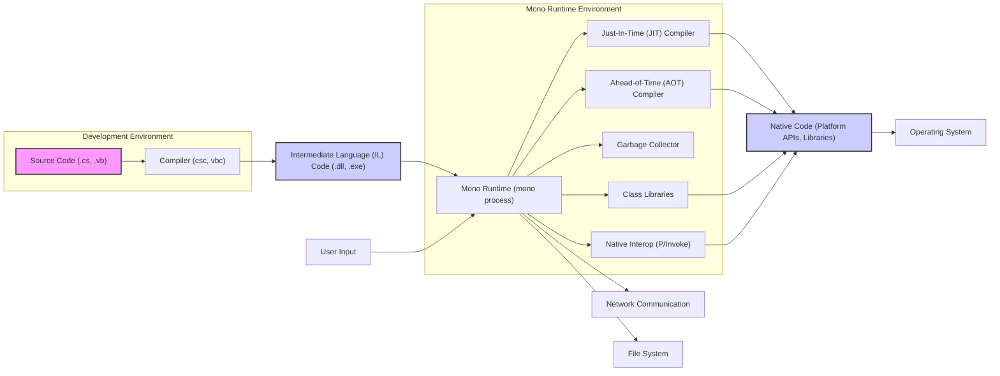

## Project Design Document: Mono - A Cross-Platform .NET Implementation (Improved for Threat Modeling)

**1. Project Overview**

The Mono project is an open-source, cross-platform implementation of the .NET Framework. It enables developers to build and run .NET applications on a variety of operating systems, including Linux, macOS, Windows, and mobile platforms like Android and iOS. Mono comprises a Common Language Runtime (CLR), a comprehensive set of class libraries designed to be compatible with the .NET Framework, and associated development and deployment tools. This document provides a detailed architectural overview of Mono, specifically tailored to facilitate thorough threat modeling.

**2. Goals and Objectives**

*   Provide a more granular and security-focused representation of the Mono architecture.
*   Clearly identify key components, their interactions, and potential security implications.
*   Detail the data flow within the Mono runtime environment, highlighting sensitive data paths.
*   Serve as a robust foundation for subsequent threat modeling exercises, such as STRIDE analysis.
*   Proactively highlight potential areas of security concern and attack surfaces within the Mono project.

**3. Target Audience**

*   Security engineers and architects responsible for assessing the security of systems utilizing Mono.
*   Software developers contributing to or building applications on the Mono platform.
*   Threat modeling specialists tasked with identifying and mitigating potential security risks.
*   Researchers and individuals seeking a deeper understanding of the security architecture of the Mono runtime.

**4. System Architecture**

The Mono architecture can be dissected into the following key components, with a focus on their security relevance:

*   **Common Language Runtime (CLR):**
    *   **Execution Engine:** The core responsible for executing .NET bytecode (Intermediate Language - IL). Potential vulnerabilities include flaws in the IL interpreter or execution logic that could lead to sandbox escapes or arbitrary code execution.
    *   **Just-In-Time (JIT) Compiler:** Translates IL to native machine code at runtime. A highly critical component from a security perspective. Vulnerabilities here can allow attackers to inject and execute malicious native code. The JIT's optimization passes are complex and potential sources of bugs.
    *   **Ahead-of-Time (AOT) Compiler:** Pre-compiles IL to native code. While improving startup time, vulnerabilities in the AOT compiler can lead to the generation of insecure native code. The AOT process itself needs to be secure.
    *   **Garbage Collector (GC):** Manages memory allocation and deallocation. While designed to prevent memory errors, vulnerabilities in the GC could lead to memory corruption, use-after-free issues, or information leaks.
    *   **Security Manager (Largely Deprecated):** Historically responsible for enforcing security policies through Code Access Security (CAS). While largely superseded by other mechanisms, understanding its historical role is important. Its limitations are a key security consideration.
    *   **Reflection Subsystem:** Allows inspection and manipulation of types and members at runtime. Can be misused to bypass security restrictions or access sensitive information if not carefully controlled.
    *   **Threading Subsystem:** Manages threads and synchronization primitives. Improper use or vulnerabilities in this subsystem can lead to race conditions, deadlocks, and other concurrency-related security issues.
*   **Class Libraries:**
    *   **Core Libraries (`System.*` namespaces):** Provide fundamental functionalities. Vulnerabilities in these core libraries (e.g., in `System.IO`, `System.Net`, `System.Security.Cryptography`) can have widespread impact. Input validation flaws, buffer overflows, and cryptographic weaknesses are potential concerns.
    *   **Platform-Specific Implementations:** Certain functionalities rely on platform-specific native code. This introduces dependencies on the security of the underlying operating system and the potential for vulnerabilities in the bridging layer.
*   **Native Interoperability (P/Invoke):**
    *   Allows managed code to call functions in native libraries (e.g., C libraries, operating system APIs). This is a significant attack surface. Vulnerabilities can arise from:
        *   **Insecure Native Libraries:** The called native code might have its own vulnerabilities (buffer overflows, format string bugs, etc.).
        *   **Incorrect Marshalling:** Improper handling of data types when crossing the managed/unmanaged boundary can lead to memory corruption or information leaks.
        *   **DLL Hijacking:** Attackers might be able to substitute malicious native libraries.
*   **MonoDevelop/Visual Studio Integration (Development Tools):**
    *   While not part of the runtime, vulnerabilities in these tools could compromise the development process, leading to the creation of insecure applications. Supply chain security is relevant here.
*   **Configuration System:**
    *   Handles application settings. Insecurely stored or parsed configuration data can be exploited (e.g., injection attacks if configuration values are used in commands or queries).

**5. Data Flow (Detailed)**

*   **Development Phase:** Developers write code, which is compiled into IL.
*   **Execution Initiation:** The Mono runtime loads the IL assemblies.
*   **Compilation:**
    *   The JIT compiler translates IL to native code on demand.
    *   Alternatively, AOT-compiled native code might be loaded.
*   **Execution:** The native code executes, interacting with:
    *   **Operating System:** Making system calls for resources and functionalities.
    *   **Class Libraries:** Utilizing provided functionalities, potentially involving data processing and manipulation.
    *   **Native Libraries (via P/Invoke):** Calling external native code.
*   **Data Input/Output:**
    *   **User Input:** Data enters the application through user interactions. This is a primary source of potentially malicious input.
    *   **Network Communication:** Data is sent and received over the network. This involves serialization, deserialization, and network protocols, all potential areas for vulnerabilities.
    *   **File System:** Data is read from and written to files. File access permissions and handling of file contents are security considerations.

**6. Key Technologies**

*   **Programming Languages:** C#, VB.NET, F# (for application development). C and C++ (for Mono runtime implementation).
*   **.NET Standard/.NET Framework:** The specifications and libraries that Mono aims to implement. Understanding the differences and compatibility levels is important for security analysis.
*   **Operating System APIs:**  Direct interaction with OS functionalities introduces platform-specific security considerations.
*   **Assembly Language:** The target language of the JIT and AOT compilers. Understanding assembly can be crucial for analyzing compiler-related vulnerabilities.

**7. Deployment Model and Security Implications**

*   **Desktop Applications:**  Security relies on OS-level protections and the application's own security measures. Vulnerabilities can lead to local privilege escalation or compromise of user data.
*   **Server-Side Applications:** Exposed to network attacks. Web application vulnerabilities (e.g., SQL injection, cross-site scripting) are relevant. Secure configuration and input validation are critical.
*   **Mobile Applications (Xamarin):**  Subject to mobile platform security models (Android, iOS). Permissions, data storage, and secure communication are key considerations. The interaction between managed and native code in Xamarin introduces additional complexity.
*   **Embedded Systems:** Resource constraints might limit available security features. Physical security and secure boot processes become more important.

**8. Security Architecture and Considerations**

*   **Memory Safety:** Mono relies on the CLR's memory management (garbage collection) to prevent many common memory errors. However, vulnerabilities can still occur in the GC itself or through unsafe native code interactions.
*   **Code Access Security (CAS - Largely Deprecated):**  Historically used to restrict code based on its origin or identity. Its effectiveness has been debated, and it's largely superseded by other mechanisms in modern .NET. Understanding its historical role is important for analyzing older systems.
*   **Sandboxing (Limited):** While the CLR provides some level of isolation, it's not a full security sandbox like those found in web browsers. Escaping the managed environment to execute arbitrary native code is a significant threat.
*   **Input Validation:** Crucial for preventing injection attacks and other input-related vulnerabilities. Developers must validate all data entering the application.
*   **Secure Coding Practices:**  Following secure coding guidelines is essential to minimize vulnerabilities in applications built on Mono.
*   **Dependency Management:**  Vulnerabilities in third-party libraries used by Mono or applications built on it can introduce significant risks. Regularly updating dependencies and using vulnerability scanning tools are important.
*   **Cryptographic Agility:**  The ability to easily update and change cryptographic algorithms is important to mitigate risks from known weaknesses.

**9. Trust Boundaries**

Understanding trust boundaries is crucial for threat modeling:

*   **Managed Code vs. Native Code:** The boundary between managed code executed by the CLR and native code called through P/Invoke is a significant trust boundary. Native code is inherently less safe and can bypass managed security features.
*   **Application Code vs. Mono Runtime:** While the application trusts the Mono runtime to execute its code correctly, vulnerabilities in the runtime can compromise the application.
*   **Process Boundary:**  Interactions with other processes (e.g., through inter-process communication) represent trust boundaries.
*   **Network Boundary:** Communication over the network involves interacting with untrusted entities.

**10. Out of Scope**

This design document focuses on the core Mono runtime environment and its immediate security implications. The following are explicitly considered out of scope:

*   Security analysis of specific applications built using Mono (unless directly related to a Mono runtime feature).
*   Detailed implementation specifics of individual class library methods beyond their general security relevance.
*   In-depth analysis of the Xamarin platform's specific security architecture (though its reliance on Mono is acknowledged).
*   Performance benchmarking and optimization details.
*   Specific deployment configurations for individual applications, except for discussing general security implications of deployment models.

This improved design document provides a more detailed and security-focused overview of the Mono project's architecture, intended to be a valuable resource for comprehensive threat modeling activities. The emphasis on data flow, trust boundaries, and specific component vulnerabilities aims to facilitate a deeper understanding of potential attack surfaces and security risks.