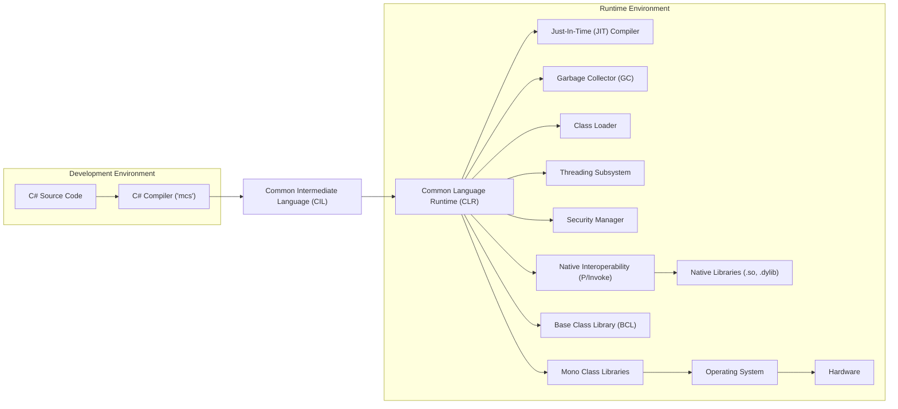
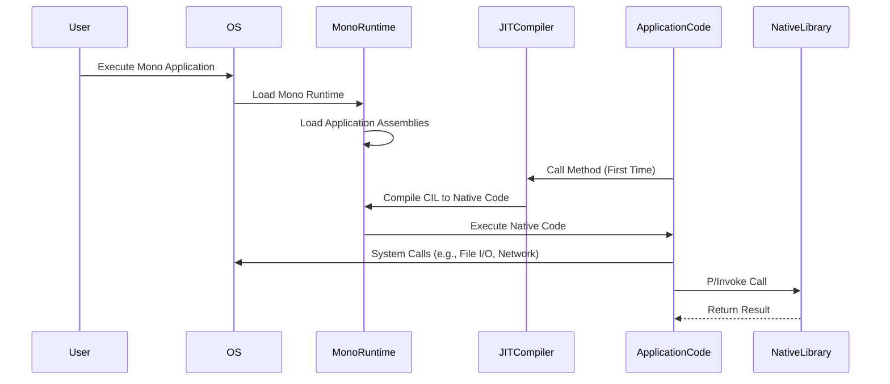

## Project Design Document: Mono - Improved for Threat Modeling

This document provides a detailed design overview of the Mono project, focusing on aspects relevant for threat modeling. It aims to provide a clear understanding of the system's architecture, components, and interactions to facilitate the identification of potential security vulnerabilities.

### 1. Project Overview

*   **Project Name:** Mono
*   **Project Repository:** [https://github.com/mono/mono](https://github.com/mono/mono)
*   **Project Description:** Mono is a free and open-source project that provides the necessary software to develop and run .NET Framework applications on non-Windows operating systems. It includes a C# compiler, a Common Language Runtime (CLR) implementation, and a comprehensive set of class libraries.
*   **Primary Goal:** To provide cross-platform compatibility for .NET applications.
*   **Key Stakeholders:** Developers using Mono to build and deploy applications, system administrators managing Mono environments, security researchers.

### 2. Architectural Overview

Mono's architecture can be broadly divided into the following key components:

*   **C# Compiler (mcs):**  Compiles C# source code into Common Intermediate Language (CIL) bytecode.
*   **Common Language Runtime (CLR):** The virtual machine that executes CIL bytecode. This includes:
    *   **Just-In-Time (JIT) Compiler:** Translates CIL bytecode into native machine code at runtime.
    *   **Garbage Collector (GC):** Manages memory allocation and deallocation.
    *   **Class Loader:** Loads and manages .NET assemblies.
    *   **Threading Subsystem:** Manages the execution of multiple threads.
    *   **Security Manager:** Enforces security policies and permissions.
    *   **Native Interoperability (P/Invoke):** Allows managed code to interact with native libraries.
*   **Base Class Library (BCL):** A set of fundamental classes providing core functionalities like data structures, input/output, networking, and more.
*   **Mono Class Libraries:** Implementations of the .NET Framework class libraries, providing a wide range of APIs for application development. This includes:
    *   **System.* namespaces:** Core functionalities.
    *   **System.Web.* namespaces:** ASP.NET components.
    *   **System.Data.* namespaces:** Data access components.
    *   **System.Windows.Forms:** GUI framework (platform-specific implementations).
*   **Mono Tools:** Various utilities and tools for development and deployment, such as:
    *   **MonoDevelop/Xamarin Studio (historical):** Integrated Development Environments.
    *   **mkbundle:** Tool for creating self-contained application bundles.
    *   **mono-service:** Tool for running Mono applications as services.

### 3. Component Details and Interactions

*   **C# Compiler (mcs):**
    *   **Functionality:** Parses C# source code, performs semantic analysis, and generates CIL bytecode.
    *   **Inputs:** C# source code files (.cs).
    *   **Outputs:** .NET assemblies (.dll, .exe) containing CIL bytecode and metadata.
    *   **Security Considerations:** Vulnerabilities in the compiler could lead to the generation of insecure bytecode.

*   **Common Language Runtime (CLR):**
    *   **Functionality:** Executes CIL bytecode, manages memory, provides security features, and interacts with the underlying operating system.
    *   **Just-In-Time (JIT) Compiler:**
        *   **Functionality:** Translates CIL bytecode into native machine code just before execution.
        *   **Security Considerations:** JIT compiler bugs could lead to exploitable vulnerabilities.
    *   **Garbage Collector (GC):**
        *   **Functionality:** Automatically reclaims memory that is no longer in use.
        *   **Security Considerations:** GC vulnerabilities could lead to memory corruption.
    *   **Class Loader:**
        *   **Functionality:** Loads .NET assemblies into memory.
        *   **Security Considerations:** Improper handling of assembly loading could lead to malicious code injection.
    *   **Threading Subsystem:**
        *   **Functionality:** Manages the execution of multiple threads.
        *   **Security Considerations:** Threading issues like race conditions can lead to vulnerabilities.
    *   **Security Manager:**
        *   **Functionality:** Enforces security policies, such as code access security (CAS).
        *   **Security Considerations:** Bypass vulnerabilities in the security manager could allow untrusted code to perform privileged operations.
    *   **Native Interoperability (P/Invoke):**
        *   **Functionality:** Allows managed code to call functions in native libraries.
        *   **Security Considerations:** Incorrect use of P/Invoke can introduce vulnerabilities if the called native libraries have security flaws or if data is not properly sanitized.

*   **Base Class Library (BCL) and Mono Class Libraries:**
    *   **Functionality:** Provide a wide range of pre-built classes and functionalities for application development.
    *   **Security Considerations:** Vulnerabilities in these libraries can be exploited by applications using them. Examples include:
        *   **Input validation flaws:** Leading to injection vulnerabilities.
        *   **Cryptographic weaknesses:** Resulting in data breaches.
        *   **Deserialization vulnerabilities:** Allowing remote code execution.

*   **Mono Tools:**
    *   **mkbundle:**
        *   **Functionality:** Creates self-contained executable bundles by embedding the Mono runtime and application assemblies.
        *   **Security Considerations:**  If the bundling process is not secure, it could be possible to inject malicious code.
    *   **mono-service:**
        *   **Functionality:** Allows running Mono applications as system services.
        *   **Security Considerations:** Improper configuration or vulnerabilities in `mono-service` could lead to privilege escalation.

### 4. Data Flow and Interactions

The following describes the typical data flow during the execution of a Mono application:

1. The user initiates the execution of a Mono application (e.g., by running an executable file).
2. The operating system loads the Mono runtime.
3. The Mono runtime's class loader loads the application's assemblies (CIL bytecode).
4. When a method is called for the first time, the JIT compiler translates the corresponding CIL bytecode into native machine code.
5. The native code is executed by the processor.
6. The application interacts with the operating system and other resources through the Mono runtime and class libraries.
7. If the application uses P/Invoke, the Mono runtime calls into the specified native libraries.
8. The garbage collector automatically manages memory allocation and deallocation.

### 5. Key Security Considerations and Potential Threat Areas

Based on the architecture and data flow, the following are key security considerations and potential threat areas for the Mono project:

*   **Vulnerabilities in the JIT Compiler:** Bugs in the JIT compiler could lead to arbitrary code execution.
*   **Garbage Collector Vulnerabilities:** Flaws in the GC could result in memory corruption and exploitable conditions.
*   **Class Loader Security:** Improper validation during assembly loading could allow malicious assemblies to be loaded.
*   **P/Invoke Misuse:** Calling into untrusted or vulnerable native libraries can introduce significant security risks.
*   **Base Class Library and Mono Class Library Vulnerabilities:**  Flaws in these libraries, such as injection vulnerabilities or deserialization issues, can be exploited by applications.
*   **Security Manager Bypasses:**  If the security manager can be bypassed, applications could perform actions they are not authorized to do.
*   **mkbundle Security:**  The process of creating self-contained bundles needs to be secure to prevent code injection.
*   **mono-service Security:**  Vulnerabilities in the service hosting process could lead to privilege escalation.
*   **Supply Chain Security:**  Compromised dependencies or build processes could introduce vulnerabilities.
*   **Denial of Service (DoS):**  Resource exhaustion or other attacks targeting the runtime environment.
*   **Information Disclosure:**  Leaks of sensitive data through memory corruption or insecure API usage.

### 6. Trust Boundaries

Identifying trust boundaries is crucial for threat modeling. Key trust boundaries in the Mono ecosystem include:

*   **Between Managed Code and Native Code (via P/Invoke):**  Data passed between these environments needs careful validation and sanitization.
*   **Between Different Applications Running on the Same Mono Runtime (if applicable):**  Security mechanisms should prevent one application from interfering with or accessing the data of another.
*   **Between the Mono Runtime and the Underlying Operating System:**  The runtime relies on the OS for various services, and vulnerabilities in either can impact the other.
*   **Between the Development Environment and the Production Environment:**  Ensuring that compiled code and dependencies are not tampered with during deployment.

### 7. Assumptions

*   The Mono project is assumed to be the upstream version from the official GitHub repository.
*   The underlying operating system and hardware are assumed to be reasonably secure.
*   Developers using Mono are expected to follow secure coding practices.

### 8. Out of Scope

*   Specific applications built using Mono are outside the scope of this document.
*   Detailed analysis of individual class library implementations is not included.
*   Third-party libraries used by Mono applications are not directly covered.

This document provides a foundational understanding of the Mono project's architecture for threat modeling purposes. Further analysis can delve deeper into specific components and potential vulnerabilities based on this high-level design.
