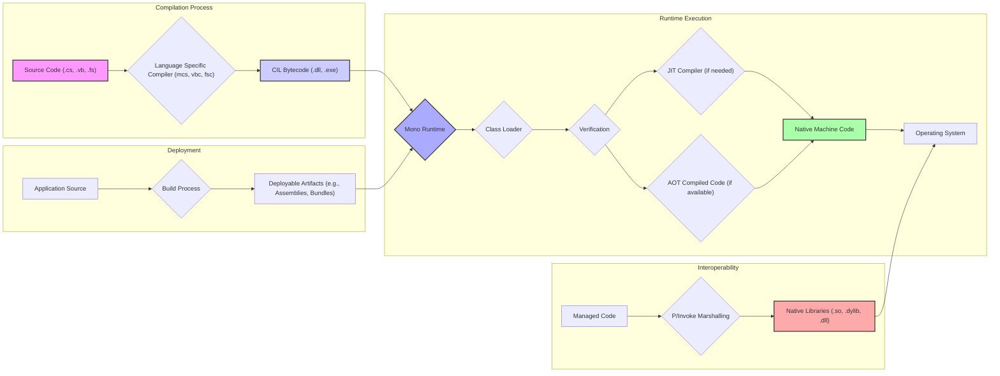

## Project Design Document: Mono Project for Threat Modeling (Improved)

**1. Introduction**

This document provides an enhanced architectural overview of the Mono project, an open-source, cross-platform implementation of the .NET Framework. This improved version aims to provide a more detailed foundation for threat modeling activities by elaborating on key components, data flows, and potential attack surfaces within the Mono ecosystem. This document is intended to be a living document, updated as the Mono project evolves.

**2. Project Overview**

The Mono project empowers developers to build and execute .NET applications across diverse platforms, including Linux, macOS, Windows, Android, iOS, and others. It delivers a comprehensive implementation of the Common Language Infrastructure (CLI) and the .NET Framework class libraries. A thorough understanding of its architecture is paramount for proactively identifying and mitigating potential security vulnerabilities.

**3. Key Architectural Components (Detailed)**

The Mono project comprises several interconnected components, each with specific responsibilities and potential security implications:

* **Mono Runtime (mono):** The central execution engine for .NET bytecode.
    * **Virtual Machine (VM):** Interprets and executes CIL instructions. Security concerns include vulnerabilities leading to arbitrary code execution or sandbox escapes.
    * **Just-In-Time (JIT) Compiler (e.g., LLVM backend):** Dynamically compiles CIL to native machine code at runtime. Potential threats include JIT spraying attacks and vulnerabilities in the compilation process leading to exploitable code.
    * **Ahead-of-Time (AOT) Compiler (e.g., `mono --aot`):**  Compiles CIL to native code before runtime. While improving performance, vulnerabilities in the AOT compiler could lead to the generation of insecure native code.
    * **Garbage Collector (GC) (e.g., SGen):** Manages memory allocation and deallocation. Bugs in the GC can lead to memory corruption vulnerabilities.
    * **Class Loader:** Responsible for loading and managing .NET assemblies. Security implications involve verifying assembly integrity and preventing malicious assembly loading.
    * **Threading Subsystem:** Manages threads and concurrency. Improper synchronization can lead to race conditions and other concurrency-related vulnerabilities.
    * **Interoperability Layer (P/Invoke, COM Interop):** Enables managed code to interact with native libraries and COM components. This is a significant attack surface if not handled securely, potentially leading to arbitrary native code execution.
    * **Security Manager (Obsolete in newer versions, but relevant for historical context):**  Historically, Mono had a security manager to enforce code access security. Understanding its limitations is important for analyzing older applications.
* **Class Libraries (mscorlib, System.*, etc.):** Provide fundamental functionalities for .NET applications. Vulnerabilities in these libraries can have widespread impact. Examples include:
    * **Serialization/Deserialization Issues:** Insecure deserialization can lead to remote code execution.
    * **XML Processing Vulnerabilities:**  Billion laughs attack, XML External Entity (XXE) injection.
    * **Networking Issues:**  Vulnerabilities in HTTP handling, socket implementations.
    * **Cryptography Implementation Flaws:** Weak encryption, incorrect usage of cryptographic APIs.
* **Compiler (mcs):** The Mono C# compiler. Vulnerabilities could lead to the generation of insecure CIL bytecode.
* **Tools and Utilities:**
    * **MonoDevelop/Visual Studio Integration:** Development environment components. Security risks are lower but could involve vulnerabilities in the IDE itself.
    * **mkbundle:** Creates self-contained application bundles. Potential for vulnerabilities if the bundling process is compromised.
    * **pdb2mdb:** Converts debugging symbols. Less of a direct security risk but could aid in reverse engineering.
* **Native Libraries and Bindings:** Mono relies on underlying OS libraries.
    * **libc:** Standard C library. Vulnerabilities in `libc` can affect Mono.
    * **Operating System APIs:** Direct interaction with system calls. Incorrect usage can lead to security issues.
    * **Third-party native libraries:**  Security depends on the quality and security of these external libraries.

**4. Data Flow Diagrams (Granular)**

**5. Security Considerations (Specific Examples)**

* **Mono Runtime Vulnerabilities:**
    * **JIT Spraying:** Exploiting vulnerabilities in the JIT compiler to inject and execute malicious code.
    * **GC Heap Corruption:** Bugs in the garbage collector leading to memory corruption and potential code execution.
    * **Sandbox Escapes:**  Vulnerabilities allowing code to break out of the intended security sandbox (if one is in place).
* **Class Library Vulnerabilities:**
    * **`System.Xml.XmlDocument` XXE:**  Exploiting vulnerabilities in XML parsing to access local files or internal network resources.
    * **`System.Runtime.Serialization.Formatters.Binary` Insecure Deserialization:**  Executing arbitrary code by deserializing malicious data.
    * **Weak Cryptographic Defaults:** Using outdated or weak cryptographic algorithms.
* **Compiler Vulnerabilities:**
    * **Backdoor Insertion:**  A compromised compiler could inject malicious code into compiled assemblies.
    * **Code Generation Bugs:**  Generating CIL bytecode with exploitable flaws.
* **Interoperability Issues:**
    * **Buffer Overflows in Native Code:**  P/Invoke calls to native libraries with insufficient bounds checking.
    * **Incorrect Marshalling:**  Mismatched data types between managed and native code leading to memory corruption.
* **Dependency Vulnerabilities:**
    * **Outdated `libssl`:**  Using an old version of OpenSSL with known vulnerabilities.
    * **Vulnerabilities in Third-Party Native Libraries:**  Exploiting flaws in external libraries used by Mono applications.
* **Supply Chain Attacks:**
    * **Compromised Build Servers:**  Attackers injecting malicious code into the Mono distribution.
    * **Malicious Package Dependencies:**  Including compromised NuGet packages.
* **Denial of Service:**
    * **Resource Exhaustion:**  Exploiting vulnerabilities to consume excessive CPU, memory, or network resources.
    * **Infinite Loops:**  Causing the application or runtime to enter an infinite loop.
* **Information Disclosure:**
    * **Memory Leaks:**  Exposing sensitive data through unreleased memory.
    * **Verbose Error Messages:**  Revealing internal system information in error messages.
* **Privilege Escalation:**
    * **Exploiting Setuid Binaries:**  Abusing misconfigured setuid binaries within the Mono environment.
    * **Kernel Vulnerabilities:**  Exploiting vulnerabilities in the underlying operating system kernel.
* **Insecure Deserialization:**  As mentioned above, a significant risk area.

**6. Deployment Scenarios and Attack Surfaces (Detailed)**

* **Desktop Applications:**
    * Attack Surface: Local file system, user input, network connections, inter-process communication.
    * Potential Threats: Malware targeting the application, exploitation of Mono runtime/library vulnerabilities, privilege escalation, data theft from local storage.
    * Specific Considerations:  Code signing practices, sandboxing capabilities of the OS.
* **Web Applications (using ASP.NET on Mono - e.g., with Apache/nginx and mod_mono or Kestrel):**
    * Attack Surface: Network (HTTP requests, WebSockets), user input (forms, URLs), database connections, session management.
    * Potential Threats: Web application vulnerabilities (SQL injection, XSS, CSRF), attacks targeting the Mono runtime or ASP.NET implementation, session hijacking, denial of service.
    * Specific Considerations:  Web server configuration, input validation, output encoding, authentication and authorization mechanisms.
* **Mobile Applications (using Xamarin):**
    * Attack Surface: Device sensors, network connections, local storage, inter-process communication, mobile-specific APIs.
    * Potential Threats: Exploitation of Mono runtime vulnerabilities on mobile platforms, insecure data storage, network attacks, permission abuse, reverse engineering of the application.
    * Specific Considerations:  Mobile OS security features, app signing, secure storage mechanisms.
* **Cloud Environments (Containers, VMs - e.g., Docker, Kubernetes):**
    * Attack Surface: Network, container runtime, underlying operating system, container image vulnerabilities, orchestration platform vulnerabilities.
    * Potential Threats: Container escape vulnerabilities, attacks targeting the Mono runtime or application within the container, misconfigurations, insecure secrets management.
    * Specific Considerations:  Container image security scanning, network policies, resource limits, security context configurations.
* **Embedded Systems:**
    * Attack Surface: Hardware interfaces (serial, I2C, etc.), network connections, local storage, physical access.
    * Potential Threats: Exploitation of Mono runtime vulnerabilities on embedded platforms, physical attacks, network attacks, firmware vulnerabilities.
    * Specific Considerations:  Limited resources, real-time constraints, secure boot processes.

**7. Authentication and Authorization Considerations**

* **Application-Level Authentication:** Mono applications often implement their own authentication mechanisms (e.g., username/password, OAuth). Vulnerabilities here can lead to unauthorized access.
* **Operating System Level Permissions:** Mono applications run with the permissions of the user executing them. Privilege escalation within the application can be a threat.
* **Code Access Security (CAS - largely obsolete but relevant for older systems):**  Historically, Mono supported CAS to restrict code execution based on origin or permissions. Understanding its limitations is important for legacy applications.
* **Role-Based Access Control (RBAC):** Applications may implement RBAC to control access to specific functionalities. Misconfigurations can lead to security issues.

**8. External Dependencies**

* **Operating System Libraries:** Mono relies heavily on OS libraries (libc, kernel libraries). Vulnerabilities in these can directly impact Mono's security.
* **Third-Party Native Libraries:** Applications often use external native libraries. Their security is crucial.
* **NuGet Packages:**  Managed dependencies introduced through NuGet. Vulnerabilities in these packages can be a significant attack vector. Supply chain security for NuGet packages is important.

**9. Threat Modeling Methodology**

This design document can be used as input for various threat modeling methodologies, such as:

* **STRIDE:** Categorizing threats as Spoofing, Tampering, Repudiation, Information Disclosure, Denial of Service, and Elevation of Privilege.
* **PASTA:** Process for Attack Simulation and Threat Analysis.
* **Trike:** A risk-based approach.
* **Attack Trees:**  Visualizing potential attack paths.

**10. Input Validation**

* **Importance:**  Crucial for preventing many types of vulnerabilities (e.g., injection attacks).
* **Techniques:**  Whitelisting, blacklisting, sanitization, data type validation.
* **Mono/.NET Framework Features:**  Regular expressions, data annotation attributes.

**11. Code Signing and Verification**

* **Purpose:**  Ensuring the integrity and authenticity of Mono assemblies.
* **Mechanisms:**  Strong naming, Authenticode signing (on Windows).
* **Verification:**  Verifying signatures before loading assemblies can prevent the execution of tampered code.

**12. Error Handling and Logging**

* **Security Implications:**  Verbose error messages can reveal sensitive information. Insufficient logging can hinder incident response.
* **Best Practices:**  Log security-relevant events, sanitize sensitive data before logging, avoid exposing internal details in error messages.

**13. Assumptions and Limitations**

* This document provides a comprehensive but not exhaustive overview. The Mono project is constantly evolving.
* Specific security vulnerabilities are not listed, as they change over time. The focus is on architectural weaknesses and potential attack surfaces.
* The security of applications built with Mono depends heavily on secure development practices.

**14. Conclusion**

This improved design document offers a more detailed and nuanced understanding of the Mono project's architecture for threat modeling purposes. By considering the specific components, data flows, and potential vulnerabilities outlined here, security professionals can conduct more effective threat assessments and implement appropriate security measures to protect applications built on the Mono platform. Continuous review and updates to this document are essential to keep pace with the evolving Mono project and threat landscape.