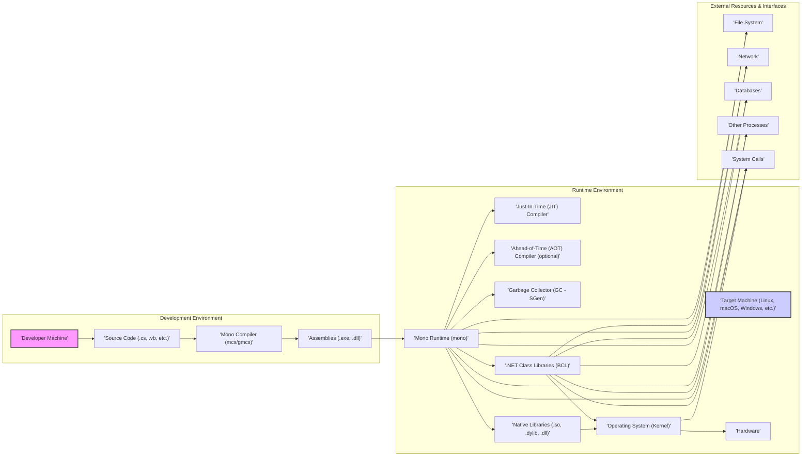
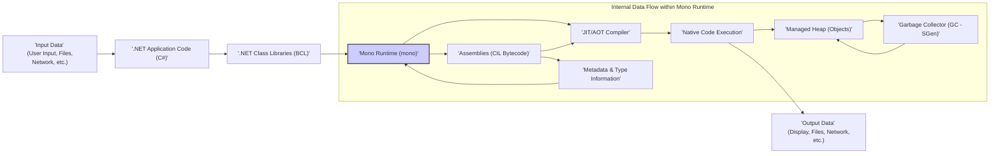

# Design Document for Threat Modeling: Mono Project

**Project Name:** Mono Project

**Project Repository:** [https://github.com/mono/mono](https://github.com/mono/mono)

**Document Version:** 1.1
**Date:** 2023-10-27
**Author:** AI Software Architect

## 1. Introduction

This document provides a detailed design overview of the Mono project, an open-source, cross-platform implementation of the .NET Framework. This document is specifically created to facilitate threat modeling activities. It outlines the key components, architecture, data flow, and technologies involved in Mono. This information will be crucial for identifying potential security vulnerabilities, attack vectors, and developing appropriate mitigation strategies. This document is intended to be a living document and will be updated as the project evolves and new information becomes available.

## 2. Project Overview

### 2.1. Project Goals

The primary goal of the Mono project is to provide a robust, performant, and compatible .NET development platform that can run on a variety of operating systems and hardware architectures, extending the reach of .NET applications beyond Windows. Key objectives include:

* **Cross-Platform Compatibility:**  Achieve seamless execution of .NET applications across diverse operating systems (Linux, macOS, Windows, Android, iOS, etc.) and CPU architectures (x86, ARM, etc.).
* **Standard Compliance:**  Maintain a high level of compatibility with the .NET Standard and .NET Framework APIs, ensuring applications written for .NET can run on Mono with minimal or no modifications.
* **Open Source Development & Community:** Foster a thriving open-source community to drive innovation, contributions, and long-term sustainability of the project under the MIT License.
* **Performance and Efficiency:** Deliver a runtime environment that offers competitive performance and resource utilization compared to other .NET implementations and native alternatives.
* **Extensibility and Interoperability:** Provide mechanisms for seamless integration with native libraries, system services, and other programming languages, enabling developers to leverage platform-specific features.
* **Modern .NET Support:** Continuously evolve to support newer versions of the .NET platform and related technologies, including C# language features and runtime improvements.

### 2.2. Target Audience

The Mono project serves a broad spectrum of users:

* **.NET Developers:** Developers seeking to build and deploy .NET applications on non-Windows platforms or target cross-platform deployments from a single codebase.
* **System Administrators & DevOps Engineers:** Professionals responsible for deploying, managing, and maintaining .NET applications in heterogeneous environments.
* **Embedded Systems & Mobile Developers:** Developers targeting resource-constrained environments like embedded systems and mobile devices with .NET technologies, leveraging AOT compilation and optimized runtime.
* **Open Source Community & Contributors:** Individuals and organizations interested in contributing to the development, testing, documentation, and promotion of the Mono project.
* **Software Vendors & ISVs:** Companies that want to offer their .NET-based software solutions on a wider range of platforms, expanding their market reach.
* **Researchers & Educators:**  Individuals and institutions using Mono for research, education, and experimentation with .NET technologies in diverse contexts.

### 2.3. Key Features

Mono's feature set is comprehensive, mirroring and extending the capabilities of the .NET Framework:

* **Common Language Runtime (CLR):** A high-performance, cross-platform CLR implementation, featuring:
    * **Just-In-Time (JIT) Compilation:** Dynamic compilation of CIL bytecode to native code at runtime, optimized for various architectures.
    * **Ahead-of-Time (AOT) Compilation:** Static compilation of CIL bytecode to native code before runtime, crucial for platforms with JIT restrictions (e.g., iOS) and performance-sensitive scenarios.
    * **Garbage Collector (SGen GC):**  A generational, precise garbage collector optimized for performance and low pause times.
    * **Security Manager:** (Less prominent in modern .NET, but present in Mono) Provides a sandbox environment for code execution with security permissions.
    * **Reflection:**  Runtime type introspection and manipulation capabilities.
    * **Threading & Asynchronous Programming:** Support for multi-threading and modern asynchronous programming patterns (async/await).
* **.NET Framework Class Libraries (BCL):** Extensive implementations of the .NET Base Class Libraries, including:
    * **System.* namespaces:** Core functionalities like collections, IO, networking, threading, reflection, diagnostics, etc.
    * **Data Access (ADO.NET):**  Providers for connecting to various databases (SQL Server, MySQL, PostgreSQL, SQLite, etc.).
    * **Web Development (ASP.NET):** Support for building web applications and services using ASP.NET Web Forms, MVC, and Web API (with varying levels of completeness depending on the specific ASP.NET technology).
    * **XML & JSON Processing:** Libraries for working with XML and JSON data formats.
    * **Cryptography:**  Implementations of cryptographic algorithms and protocols.
    * **Globalization & Localization:** Support for internationalization and localization of applications.
* **C# Compiler (mcs/gmcs):**  Robust and standards-compliant C# compilers supporting various C# language versions.
* **Interoperability (P/Invoke & COM Interop):** Mechanisms for seamless interaction with native libraries (P/Invoke) and COM components (COM Interop - primarily on Windows, less relevant cross-platform).
* **GUI Frameworks:**
    * **WinForms (Windows Forms):**  Cross-platform implementation of WinForms for legacy application compatibility (less actively developed in Mono).
    * **GTK#:**  Bindings for the GTK+ cross-platform GUI toolkit, enabling the development of native-looking applications on Linux, macOS, and Windows.
* **MonoDevelop & Visual Studio for Mac Integration:** IDE support for development, debugging, and deployment of Mono applications.
* **WebAssembly (Wasm) Support (Experimental):**  Emerging support for running Mono applications in web browsers via WebAssembly.

## 3. System Architecture

The Mono project architecture is layered and modular, designed for cross-platform compatibility and extensibility.

### 3.1. Components Description (Detailed)

* **'Developer Machine':** The workstation used by developers for writing, compiling, and testing .NET code. This environment typically includes an IDE (MonoDevelop, Visual Studio for Mac, or others) and the Mono SDK.
* **'Source Code (.cs, .vb, etc.)':**  Human-readable source code written in .NET languages like C# or VB.NET. This code defines the application logic and functionality.
* **'Mono Compiler (mcs/gmcs)':**  The Mono C# and VB.NET compilers. They parse source code, perform semantic analysis, and generate Common Intermediate Language (CIL) bytecode.
* **'Assemblies (.exe, .dll)':**  Portable Executable (PE) files containing CIL bytecode, metadata describing types and members, and resources. Assemblies are the unit of deployment and execution for .NET applications.
* **'Target Machine (Linux, macOS, Windows, etc.)':** The server, desktop, mobile device, or embedded system where the Mono application will be deployed and executed.
* **'Mono Runtime (mono)':** The core execution engine. Key responsibilities include:
    * **Assembly Loading & Management:** Loading .NET assemblies into memory and managing their dependencies.
    * **Code Execution Management:** Orchestrating the execution of CIL bytecode, utilizing the JIT or AOT compiler.
    * **Memory Management:**  Managing memory allocation and garbage collection via the SGen GC.
    * **Exception Handling:**  Handling exceptions and errors during application execution.
    * **Security Enforcement:** (To a degree) Enforcing security policies and permissions (less prominent in modern .NET Core/ .NET).
    * **Interoperability Services:** Providing mechanisms for P/Invoke and COM Interop.
* **'Just-In-Time (JIT) Compiler':**  Dynamically compiles CIL bytecode to native machine code at runtime. This allows for platform-specific optimizations and efficient execution. Mono's JIT compiler is highly optimized and supports various architectures.
* **'Ahead-of-Time (AOT) Compiler (optional)':**  Compiles CIL bytecode to native machine code *before* runtime. This is crucial for:
    * **Platforms with JIT restrictions:**  iOS, some embedded systems.
    * **Improved Startup Time:**  Eliminating JIT compilation overhead at application startup.
    * **Performance Optimization:**  Potentially enabling more aggressive optimizations than JIT in certain scenarios.
* **'Garbage Collector (GC - SGen)':**  Mono's SGen garbage collector is a generational, precise, and copying GC. It automatically manages memory, freeing developers from manual memory management and preventing memory leaks.
* **'.NET Class Libraries (BCL)':**  A vast collection of pre-built classes and APIs that provide fundamental functionalities for .NET applications. These libraries are implemented in a combination of C# and native code and interact extensively with the underlying OS.
* **'Native Libraries (.so, .dylib, .dll)':**  Platform-specific native libraries (shared objects on Linux, dynamic libraries on macOS and Windows) that Mono interacts with. These include OS libraries, graphics libraries, database client libraries, and more.
* **'Operating System (Kernel)':** The underlying operating system kernel (Linux, macOS, Windows, etc.) providing core system services like process management, memory management, file system access, networking, and device drivers.
* **'Hardware':** The physical hardware infrastructure on which the OS and Mono runtime execute (CPU, memory, storage, network interfaces, etc.).
* **'File System':**  The hierarchical file system provided by the operating system, used for persistent storage and data access.
* **'Network':**  The network infrastructure and protocols used for communication between Mono applications and other systems or services.
* **'Databases':**  External database systems (SQL, NoSQL) that Mono applications may interact with for data storage and retrieval.
* **'Other Processes':**  Other applications and services running on the same or different machines that Mono applications might communicate with or depend on.
* **'System Calls':**  Direct interfaces to the operating system kernel, used by the Mono runtime and class libraries to access low-level system functionalities.

### 3.2. Component Interactions (Detailed)

1. **Development & Compilation:** Developers write source code (B) using a Developer Machine (A). The Mono Compiler (C) compiles this source code into .NET Assemblies (D) containing CIL bytecode.
2. **Application Launch & Runtime Initialization:** When a Mono application is launched on a Target Machine (E), the Mono Runtime (F) is invoked. The runtime loads the necessary Assemblies (D).
3. **Code Execution & Compilation:**  The Mono Runtime (F) manages code execution. For each method executed for the first time, the JIT Compiler (G) translates the CIL bytecode into native machine code optimized for the Target Machine's architecture. Alternatively, if AOT compilation is used (H), this step is performed beforehand.
4. **Garbage Collection:** The Garbage Collector (I) runs periodically in the background, automatically reclaiming memory occupied by objects that are no longer referenced by the application. This prevents memory leaks and simplifies memory management for developers.
5. **Class Library Usage:**  The .NET Application code within Assemblies (D) extensively utilizes the .NET Class Libraries (J) for various functionalities. These libraries provide abstractions and implementations for common tasks, interacting with the Operating System (L) and Native Libraries (K) as needed.
6. **Native Interoperability (P/Invoke):**  When .NET code needs to interact with platform-specific features or existing native code, it uses P/Invoke to call functions within Native Libraries (K). This involves marshalling data between the managed .NET environment and the native environment.
7. **System Resource Access:** Mono applications access system resources like the File System (N), Network (O), and interact with Databases (P) and Other Processes (Q) through the .NET Class Libraries (J) and underlying Operating System (L) System Calls (R). The Mono Runtime (F) also directly interacts with System Calls (R) for core functionalities.

## 4. Data Flow (Refined)

The data flow diagram illustrates the movement and transformation of data within the Mono execution environment.

### 4.1. Data Flow Description (Detailed)

1. **'Input Data':** Data originates from various external sources (A) and enters the .NET Application Code (B). This could be user input from the UI, data read from files, data received over the network, or data from other processes.
2. **'.NET Application Code (C#)':** The application logic (B) processes the Input Data. This involves computations, data transformations, business logic execution, and interactions with other components.
3. **'.NET Class Libraries (BCL)':** The Application Code (B) frequently utilizes the .NET Class Libraries (C) to perform common tasks. Data flows between the application code and the BCL as methods are called and data is exchanged.
4. **'Mono Runtime (mono)':** The Mono Runtime (D) orchestrates the execution. It receives instructions from the compiled Application Code and BCL calls. Data is passed as arguments to methods and returned as results.
5. **'JIT/AOT Compiler':** The Runtime (D) invokes the JIT or AOT Compiler (E) to translate CIL bytecode from Assemblies (H) into native machine code. The data flowing here is the CIL bytecode itself, which is transformed into native instructions.
6. **'Native Code Execution':** The processor executes the Native Code (F), performing the actual operations on data. This is where the core processing happens.
7. **'Output Data':** The Native Code Execution (F) generates Output Data (G). This data is then presented to the user (display), written to files, sent over the network, or used to interact with external systems.
8. **'Assemblies (CIL Bytecode)':** Assemblies (H) containing the compiled application code (CIL bytecode) are loaded into memory by the Runtime (D). These assemblies are the source of the code to be executed.
9. **'Managed Heap (Objects)':** The Runtime (D) manages memory allocation on the Managed Heap (I). Objects created by the application during execution are stored here. Data representing the state of objects resides in the Managed Heap.
10. **'Garbage Collector (GC - SGen)':** The Garbage Collector (J) monitors the Managed Heap (I) and reclaims memory occupied by objects that are no longer reachable. It processes data related to object references and memory usage.
11. **'Metadata & Type Information':** Assemblies (H) contain Metadata & Type Information (K) describing the structure of the code, classes, methods, etc. This metadata is used by the Runtime (D) for reflection, type checking, and other runtime operations.

## 5. Technology Stack (Expanded)

Mono leverages a diverse technology stack to achieve its goals:

* **Programming Languages:**
    * **C:** Core runtime, JIT compiler, garbage collector, low-level system interactions, parts of BCL. Performance-critical and platform-specific code.
    * **C++:**  Parts of the runtime, some BCL implementations, especially for platform-specific APIs and interoperability layers.
    * **C#:**  Significant portions of the BCL are implemented in C#. Tools, utilities, and higher-level components.
    * **Assembly Language:**  Small portions of the runtime and JIT compiler for highly optimized, architecture-specific code.
* **Operating Systems (Supported):**
    * **Linux:**  Various distributions (Ubuntu, Fedora, Debian, CentOS, etc.). Primary development and deployment platform.
    * **macOS:**  Desktop and server platform.
    * **Windows:**  For compatibility and development purposes.
    * **Android:** Mobile platform.
    * **iOS:** Mobile platform (requires AOT compilation due to JIT restrictions).
    * **WebAssembly (Wasm):** Emerging target for browser-based execution.
    * **BSD variants:** FreeBSD, OpenBSD, NetBSD.
    * **Solaris:** (Less actively maintained).
    * **Other embedded and specialized OSes.**
* **Architectures (Supported):**
    * **x86 (32-bit):** Legacy support.
    * **x86-64 (AMD64):**  Primary desktop and server architecture.
    * **ARM (32-bit, ARMv7, ARMv8):** Mobile and embedded systems.
    * **ARM64 (AArch64):** Modern mobile and server architecture.
    * **SPARC:** (Limited support, mostly for historical reasons).
    * **PowerPC:** (Limited support).
* **Build Systems & Tools:**
    * **CMake:** Primary cross-platform build system. Used for generating build files for various platforms and compilers.
    * **Autotools (GNU Autotools):** Legacy build system, still used for some components.
    * **Make:**  Used in conjunction with CMake and Autotools.
    * **MSBuild:**  Used for Windows-specific builds and integration with Visual Studio.
    * **pkg-config:**  Used for managing dependencies on Unix-like systems.
* **Key Dependencies (External Libraries):**
    * **glib:** Cross-platform utility library (data structures, threading, event loop, etc.). Fundamental dependency.
    * **libgc (Boehm Garbage Collector):**  *Historically* used as an optional GC, but Mono primarily uses its own SGen GC now.
    * **zlib:** Compression library (used for various purposes, including assembly compression).
    * **libpng:** Image library (PNG image format support).
    * **libjpeg:** Image library (JPEG image format support).
    * **libtiff:** Image library (TIFF image format support).
    * **libxml2:** XML parsing library.
    * **freetype:** Font rendering library.
    * **cairo:** 2D graphics library.
    * **pango:** Text layout and rendering library.
    * **GTK+:** Cross-platform GUI toolkit (used by GTK#).
    * **OpenSSL/LibreSSL/BoringSSL:** Cryptography libraries for secure communication (HTTPS, TLS, etc.).
    * **ICU (International Components for Unicode):**  Internationalization and Unicode support.
    * **Database client libraries:**  libpq (PostgreSQL), libmysqlclient (MySQL), etc.
    * **And many more platform-specific and feature-dependent libraries.**

## 6. Security Considerations (Detailed & Categorized)

This section expands on the initial security considerations, categorizing them for better threat modeling.

**6.1. Interoperability & Native Code Risks:**

* **P/Invoke Vulnerabilities:**
    * **Incorrect Marshalling:**  Improper data marshalling between managed and native code can lead to buffer overflows, memory corruption, and information disclosure.
    * **Vulnerable Native Libraries:**  If P/Invoke calls target vulnerable native libraries, the .NET application becomes susceptible to those vulnerabilities. Supply chain risks related to native dependencies.
    * **Security Context Switching:**  Transitions between managed and native code can introduce opportunities for privilege escalation or bypass security checks if not handled carefully.
* **COM Interop Risks (Windows-specific):**
    * **Vulnerable COM Components:**  Interacting with vulnerable COM components can expose the application to their weaknesses.
    * **Security Policy Bypass:**  COM Interop might bypass .NET security policies if not configured correctly.

**6.2. Compiler & Runtime Vulnerabilities:**

* **JIT Compiler Vulnerabilities:**
    * **Code Injection:** Bugs in the JIT compiler could be exploited to inject malicious native code during runtime compilation.
    * **Denial of Service (DoS):**  JIT compilation errors or resource exhaustion during JIT compilation could lead to DoS.
    * **Information Disclosure:**  JIT compiler bugs might leak sensitive information from memory.
* **AOT Compiler Vulnerabilities:**
    * Similar vulnerabilities to JIT compilers, but potentially harder to detect as compilation happens offline.
    * **Backdoor Insertion:**  Compromised AOT compilation toolchains could insert backdoors into compiled native code.
* **Garbage Collector (SGen GC) Vulnerabilities:**
    * **Memory Corruption:**  Bugs in the GC could lead to memory corruption, potentially exploitable for code execution.
    * **Denial of Service (DoS):**  GC inefficiencies or vulnerabilities could lead to excessive resource consumption and DoS.

**6.3. .NET Class Library Vulnerabilities:**

* **API Vulnerabilities:**  Bugs or design flaws in .NET Class Library APIs (e.g., in networking, cryptography, XML processing, web functionalities) could be exploited by applications.
* **Implementation Vulnerabilities:**  Vulnerabilities in the implementation of class library methods (e.g., buffer overflows, format string bugs, injection vulnerabilities).
* **Logic Errors:**  Logical flaws in class library code that could lead to unexpected behavior or security breaches.

**6.4. Denial of Service (DoS) & Resource Exhaustion:**

* **Algorithmic Complexity Attacks:**  Exploiting inefficient algorithms in Mono components or class libraries to cause excessive CPU or memory usage.
* **Resource Exhaustion:**  Attacks that aim to exhaust system resources (memory, CPU, network bandwidth, file handles, etc.) by exploiting Mono runtime or application behavior.
* **Uncontrolled Resource Consumption:**  Applications with resource leaks or inefficient resource management can lead to DoS.

**6.5. Cross-Platform & Platform-Specific Issues:**

* **Platform-Specific Bugs:**  Bugs that manifest only on certain operating systems or architectures due to differences in underlying system behavior or Mono's platform-specific code.
* **Inconsistent Security Behavior:**  Subtle differences in security features or behavior across platforms could lead to vulnerabilities if applications rely on platform-specific assumptions.

**6.6. Update & Patch Management:**

* **Delayed Security Updates:**  Slow or inconsistent release of security patches for Mono could leave systems vulnerable for extended periods.
* **Difficult Update Process:**  Complex or cumbersome update processes might discourage users from applying security patches promptly.
* **Unreliable Update Channels:**  Compromised update channels or package repositories could distribute malicious Mono versions.

**6.7. Web Application Security (ASP.NET on Mono):**

* **ASP.NET Vulnerabilities:**  Vulnerabilities specific to the ASP.NET implementation within Mono (e.g., in Web Forms, MVC, Web API).
* **Web Application Logic Flaws:**  Common web application vulnerabilities (SQL injection, cross-site scripting (XSS), cross-site request forgery (CSRF), etc.) in applications built using ASP.NET on Mono.

**6.8. Input Validation & Data Handling:**

* **Input Validation Failures:**  Lack of proper input validation in .NET applications running on Mono can lead to various vulnerabilities (injection attacks, buffer overflows, etc.).
* **Data Sanitization Issues:**  Insufficient data sanitization before processing or outputting data can result in vulnerabilities like XSS or command injection.
* **Serialization/Deserialization Vulnerabilities:**  Insecure deserialization of data can lead to code execution or other security breaches.

## 7. Trust Boundaries

Identifying trust boundaries is crucial for threat modeling. In the context of Mono:

* **Boundary 1: Managed Code vs. Native Code:**  The boundary between .NET managed code and native code accessed via P/Invoke or COM Interop. This is a critical boundary due to potential vulnerabilities in native libraries and marshalling issues.
* **Boundary 2: Mono Runtime vs. Operating System:** The boundary between the Mono Runtime and the underlying Operating System kernel. System calls and interactions with OS services cross this boundary. OS vulnerabilities or misconfigurations can impact Mono applications.
* **Boundary 3: Application Domain/Process Isolation (Within Mono Runtime):** While less strict than OS process isolation, Application Domains (AppDomains - less relevant in modern .NET Core/ .NET, but present in Mono's full framework compatibility) and OS process boundaries provide a degree of isolation between applications running on Mono.
* **Boundary 4: Mono Runtime vs. External Resources:** The boundary between the Mono Runtime and external resources like the file system, network, databases, and other processes. Interactions with these resources need to be secured.
* **Boundary 5: User Input vs. Application Code:** The boundary between untrusted user input and the application code processing it. Input validation and sanitization are critical at this boundary.

## 8. Assumptions and Constraints (Clarified)

* **Scope:** This document focuses on the core Mono runtime environment, including the CLR, BCL, compilers, and key interoperability mechanisms. It does not cover specific applications built on Mono, MonoDevelop IDE in detail, or every single component of the vast .NET ecosystem. Threat modeling will primarily target the Mono platform itself.
* **Target Audience:**  The primary audience remains security professionals, threat modelers, security researchers, and developers interested in understanding Mono's security architecture.
* **Open Source Nature & Community:**  We assume the benefits of open-source development, including community scrutiny, public vulnerability disclosure, and collaborative security efforts. However, we also acknowledge potential risks associated with open-source projects, such as slower patch cycles in some cases or vulnerabilities being publicly known before patches are widely deployed.
* **Up-to-Date Version & Patching:**  Threat modeling should ideally be performed against the latest stable version of Mono with all relevant security patches applied. However, analysis of older versions or unpatched systems might also be relevant to understand historical vulnerabilities and risks in legacy deployments.
* **Standard Deployment Environment (General Case):**  We assume a typical deployment environment for Mono applications, without highly unusual or intentionally insecure configurations. However, threat modeling should also consider common misconfigurations or insecure deployment practices.
* **Focus on Platform Security:** The primary focus is on the security of the Mono platform itself. Application-level security vulnerabilities in code built *on* Mono are considered secondary, although the document highlights areas where Mono's features can influence application security (e.g., P/Invoke, ASP.NET).

## 9. Glossary (Unchanged)

*(Glossary remains the same as in version 1.0)*

This revised document provides a more detailed and structured foundation for threat modeling the Mono project. The expanded descriptions, categorized security considerations, and explicit trust boundaries should facilitate a more comprehensive and effective threat modeling process. This document should be considered a starting point and will likely be refined further as the threat modeling exercise progresses and new insights are gained.