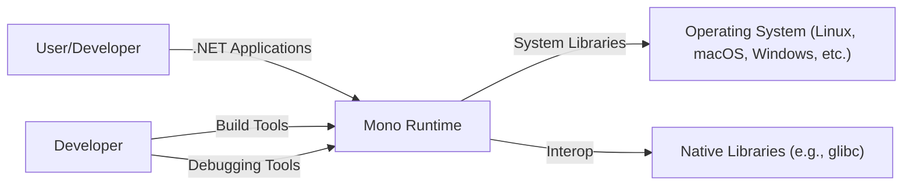
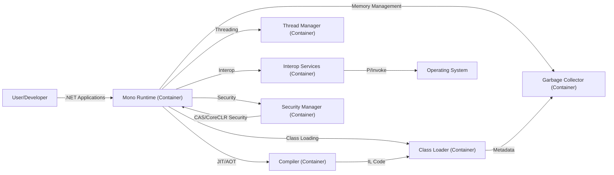
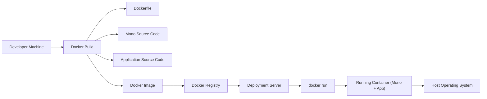
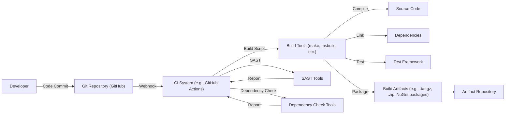

Okay, let's create a design document for the "mono/mono" repository, focusing on aspects relevant to threat modeling.

# BUSINESS POSTURE

Business Priorities and Goals:

*   Provide a cross-platform .NET runtime and framework implementation.
*   Enable developers to build and run .NET applications on various operating systems (Linux, macOS, Windows, etc.).
*   Maintain compatibility with the .NET Standard and, where feasible, with existing .NET Framework applications.
*   Offer a viable alternative to the official .NET runtime for specific use cases (e.g., embedded systems, mobile development via Xamarin/MAUI).
*   Foster an open-source community around the project.
*   Provide long-term support and maintenance for the runtime.

Most Important Business Risks:

*   Security vulnerabilities in the runtime that could lead to remote code execution, denial of service, or information disclosure.  This is the highest risk, as it directly impacts the users of Mono and applications built upon it.
*   Incompatibility with newer .NET features or breaking changes in the .NET ecosystem, rendering Mono less useful or requiring significant rework.
*   Loss of community support and contributions, leading to stagnation and eventual obsolescence.
*   Legal challenges related to intellectual property (though this risk has likely been mitigated over time).
*   Performance issues or instability compared to the official .NET runtime, hindering adoption.
*   Lack of support for critical platforms or architectures.

# SECURITY POSTURE

Existing Security Controls:

*   security control: Code reviews: The project is open-source, allowing for community scrutiny and peer review of code changes. Implemented in GitHub pull requests.
*   security control: Static analysis: Likely used, though the specific tools and frequency aren't explicitly stated in the top-level repository. Implemented in build scripts and CI pipelines.
*   security control: Fuzzing: Some fuzzing efforts are mentioned in the documentation and issue tracker. Implemented in dedicated fuzzing projects and CI.
*   security control: Issue tracking: A public issue tracker allows for reporting and tracking of security vulnerabilities. Implemented in GitHub Issues.
*   security control: Security advisories: The project publishes security advisories for discovered vulnerabilities. Implemented in GitHub Security Advisories.
*   security control: Sandboxing (partial): Certain components, like the runtime's garbage collector, have inherent security boundaries. Implemented in runtime code.
*   security control: Regular Updates: New releases are published that include security fixes. Implemented in release process.

Accepted Risks:

*   accepted risk: Legacy code: The codebase has a long history, and some parts may not adhere to modern security best practices.
*   accepted risk: Third-party dependencies: Mono relies on external libraries, which may introduce their own vulnerabilities.
*   accepted risk: Platform-specific vulnerabilities: The security of Mono also depends on the underlying operating system and its security mechanisms.
*   accepted risk: Limited resources: As an open-source project, Mono may have limited resources for dedicated security audits and penetration testing.

Recommended Security Controls:

*   Implement a comprehensive Software Bill of Materials (SBOM) management system to track all dependencies and their versions.
*   Integrate regular dynamic analysis (DAST) into the CI/CD pipeline.
*   Establish a bug bounty program to incentivize external security researchers.
*   Conduct regular penetration testing by independent security experts.
*   Implement more robust sandboxing mechanisms for untrusted code execution.
*   Adopt a "secure by default" configuration approach.

Security Requirements:

*   Authentication:
    *   The runtime itself doesn't directly handle user authentication. This is typically managed by the application using Mono. However, Mono should securely handle any credentials or tokens passed to it by the application.
*   Authorization:
    *   Similar to authentication, authorization is primarily the application's responsibility.  Mono should provide secure mechanisms for applications to implement authorization checks (e.g., role-based access control).
*   Input Validation:
    *   Mono's runtime and libraries must perform rigorous input validation to prevent vulnerabilities like buffer overflows, format string bugs, and injection attacks. This is crucial for all APIs exposed by the runtime.
*   Cryptography:
    *   Mono provides cryptographic libraries (System.Security.Cryptography). These libraries must be implemented correctly and use strong, up-to-date algorithms.  Regular audits of the cryptographic code are essential.  Key management should be handled securely, following best practices.

# DESIGN

## C4 CONTEXT

Element Descriptions:

*   Element:
    *   Name: User/Developer
    *   Type: Person
    *   Description: A person who uses applications built on Mono or a developer who builds applications using Mono.
    *   Responsibilities: Interacts with .NET applications running on Mono. Develops and debugs applications using Mono.
    *   Security controls: N/A (external to the system)

*   Element:
    *   Name: Mono Runtime
    *   Type: Software System
    *   Description: The core of the Mono project, providing the runtime environment for .NET applications.
    *   Responsibilities: Executes .NET bytecode, manages memory, handles threading, provides JIT/AOT compilation.
    *   Security controls: Code reviews, static analysis, fuzzing, sandboxing (partial), regular updates.

*   Element:
    *   Name: Operating System (Linux, macOS, Windows, etc.)
    *   Type: Software System
    *   Description: The underlying operating system on which Mono runs.
    *   Responsibilities: Provides core system services (memory management, process scheduling, I/O).
    *   Security controls: OS-level security mechanisms (e.g., ASLR, DEP, user permissions).

*   Element:
    *   Name: Native Libraries (e.g., glibc)
    *   Type: Software System
    *   Description: Libraries provided by the operating system or third parties that Mono interacts with.
    *   Responsibilities: Provide low-level functionality (e.g., system calls, networking).
    *   Security controls: Dependent on the specific library and its security posture.

*   Element:
    *   Name: Developer
    *   Type: Person
    *   Description: A person who contributes to the Mono project itself.
    *   Responsibilities: Writes code, fixes bugs, reviews pull requests, manages releases.
    *   Security controls: N/A (external to the system, but relies on secure development practices)
    *
    Element:
        * Name: Build Tools
        * Type: Software System
        * Description: Tools used to build and compile the Mono runtime and associated libraries.
        * Responsibilities: Compiling source code, linking libraries, creating packages.
        * Security controls: Secure configuration of build tools, dependency management.
    *
    Element:
        * Name: Debugging Tools
        * Type: Software System
        * Description: Tools used to debug the Mono runtime and applications running on it.
        * Responsibilities: Inspecting memory, stepping through code, setting breakpoints.
        * Security controls: Secure configuration of debugging tools, access control to debugging features.

## C4 CONTAINER

Element Descriptions:

*   Element:
    *   Name: Mono Runtime (Container)
    *   Type: Container
    *   Description: The main container encompassing the core runtime functionalities.
    *   Responsibilities: Orchestrates the execution of .NET applications.
    *   Security controls: All security controls listed in the Security Posture section apply here.

*   Element:
    *   Name: Compiler (Container)
    *   Type: Container
    *   Description: Handles Just-In-Time (JIT) or Ahead-Of-Time (AOT) compilation of .NET bytecode.
    *   Responsibilities: Translates IL code into native machine code.
    *   Security controls: Input validation (of IL code), secure code generation.

*   Element:
    *   Name: Garbage Collector (Container)
    *   Type: Container
    *   Description: Manages memory allocation and deallocation for .NET objects.
    *   Responsibilities: Reclaims unused memory, prevents memory leaks.
    *   Security controls: Robust memory management algorithms, protection against heap overflows.

*   Element:
    *   Name: Class Loader (Container)
    *   Type: Container
    *   Description: Loads .NET classes and assemblies into the runtime.
    *   Responsibilities: Resolves type dependencies, verifies type safety.
    *   Security controls: Type safety checks, assembly verification.

*   Element:
    *   Name: Thread Manager (Container)
    *   Type: Container
    *   Description: Manages threads and concurrency within the runtime.
    *   Responsibilities: Creates and schedules threads, handles synchronization.
    *   Security controls: Secure thread management, prevention of race conditions.

*   Element:
    *   Name: Interop Services (Container)
    *   Type: Container
    *   Description: Enables interaction between .NET code and native code (P/Invoke).
    *   Responsibilities: Marshals data between managed and unmanaged code.
    *   Security controls: Strict validation of data passed between managed and unmanaged code, prevention of buffer overflows.

*   Element:
    *   Name: Security Manager (Container)
    *   Type: Container
    *   Description: Enforces security policies and manages security-related aspects of the runtime.
    *   Responsibilities: Implements Code Access Security (CAS) or CoreCLR security models.
    *   Security controls: Access control checks, sandboxing (if applicable).

## DEPLOYMENT

Possible Deployment Solutions:

1.  System-wide installation: Mono is installed as a system-wide package (e.g., via apt, yum, or a Windows installer).
2.  Side-by-side installation: Multiple versions of Mono are installed alongside each other, allowing applications to target specific versions.
3.  Application-local deployment: The Mono runtime is bundled with the application itself, creating a self-contained deployment.
4.  Containerized deployment: Mono is deployed within a container (e.g., Docker) along with the application.
5.  Embedded deployment: Mono is embedded within a larger application or device.

Chosen Solution (for detailed description): Containerized Deployment (Docker)

Element Descriptions:

*   Element:
    *   Name: Developer Machine
    *   Type: Infrastructure Node
    *   Description: The machine used by the developer to build the application and Docker image.
    *   Responsibilities: Contains the source code, build tools, and Docker client.
    *   Security controls: Developer machine security (e.g., OS patching, antivirus).

*   Element:
    *   Name: Docker Build
    *   Type: Process
    *   Description: The process of building a Docker image.
    *   Responsibilities: Executes the instructions in the Dockerfile.
    *   Security controls: Secure Dockerfile configuration, use of trusted base images.

*   Element:
    *   Name: Dockerfile
    *   Type: File
    *   Description: A text file containing instructions for building the Docker image.
    *   Responsibilities: Specifies the base image, dependencies, and build steps.
    *   Security controls: Minimize the number of layers, avoid installing unnecessary packages, use specific versions of dependencies.

*   Element:
    *   Name: Mono Source Code
    *   Type: File
    *   Description: The source code of the Mono runtime (potentially a specific version or build).
    *   Responsibilities: Provides the runtime environment for the application.
    *   Security controls: Secure coding practices, code reviews, static analysis.

*   Element:
    *   Name: Application Source Code
    *   Type: File
    *   Description: The source code of the .NET application being deployed.
    *   Responsibilities: Implements the application's functionality.
    *   Security controls: Secure coding practices, code reviews, static analysis.

*   Element:
    *   Name: Docker Image
    *   Type: Artifact
    *   Description: The built Docker image containing the Mono runtime and the application.
    *   Responsibilities: Provides a self-contained, portable deployment unit.
    *   Security controls: Image scanning for vulnerabilities, digital signatures.

*   Element:
    *   Name: Docker Registry
    *   Type: Infrastructure Node
    *   Description: A repository for storing and distributing Docker images.
    *   Responsibilities: Stores Docker images, manages access control.
    *   Security controls: Access control, authentication, vulnerability scanning of stored images.

*   Element:
    *   Name: Deployment Server
    *   Type: Infrastructure Node
    *   Description: The server where the Docker image will be deployed and run.
    *   Responsibilities: Runs Docker containers.
    *   Security controls: Server hardening, OS patching, firewall, intrusion detection.

*   Element:
    *   Name: docker run
    *   Type: Process
    *   Description: The command used to start a Docker container from an image.
    *   Responsibilities: Creates and starts a container.
    *   Security controls: Secure configuration of the Docker daemon, resource limits for containers.

*   Element:
    *   Name: Running Container (Mono + App)
    *   Type: Container Instance
    *   Description: The running instance of the Docker container.
    *   Responsibilities: Executes the .NET application within the Mono runtime.
    *   Security controls: All security controls listed for the Mono Runtime and Application containers, plus container isolation mechanisms.

*   Element:
    *   Name: Host Operating System
    *   Type: Infrastructure Node
    *   Description: The operating system of the deployment server.
    *   Responsibilities: Provides the underlying infrastructure for running Docker containers.
    *   Security controls: OS-level security mechanisms (e.g., ASLR, DEP, user permissions).

## BUILD

Build Process Description:

1.  Developers commit code changes to the Git repository (GitHub).
2.  A webhook triggers the CI system (e.g., GitHub Actions).
3.  The CI system executes a build script.
4.  The build script uses build tools (make, msbuild, etc.) to compile the source code, link dependencies, run tests, and package the build artifacts.
5.  Static Application Security Testing (SAST) tools are run as part of the CI pipeline to identify potential security vulnerabilities in the code.
6.  Dependency check tools are used to scan for known vulnerabilities in project dependencies.
7.  The build artifacts (e.g., .tar.gz, .zip, NuGet packages) are created.
8.  The build artifacts are uploaded to an artifact repository.

Security Controls:

*   security control: Secure coding practices: Developers should follow secure coding guidelines to prevent vulnerabilities.
*   security control: Code reviews: All code changes should be reviewed by other developers before being merged.
*   security control: Static analysis (SAST): SAST tools should be integrated into the CI pipeline to automatically scan for vulnerabilities.
*   security control: Dependency management: Dependencies should be carefully managed and scanned for known vulnerabilities.
*   security control: Build automation: The build process should be fully automated to ensure consistency and reproducibility.
*   security control: Secure build environment: The CI system should be configured securely to prevent unauthorized access.
*   security control: Artifact signing: Build artifacts should be digitally signed to ensure their integrity.
*   security control: Supply chain security: Measures should be in place to prevent tampering with the build process or dependencies.

# RISK ASSESSMENT

Critical Business Processes:

*   Execution of .NET applications: The primary function of Mono is to run .NET applications reliably and securely.
*   Development of .NET applications: Mono provides the tools and libraries needed to develop .NET applications for various platforms.
*   Maintenance and support of the Mono runtime: Ensuring the long-term viability and security of the project.

Data Sensitivity:

*   Application data: Mono itself doesn't inherently handle sensitive data. The sensitivity of the data depends on the applications running on Mono.  However, vulnerabilities in Mono could expose this data.
*   Source code: The Mono source code is publicly available, so it's not considered sensitive in terms of confidentiality. However, its integrity is crucial.
*   Build artifacts: Build artifacts are not inherently sensitive, but their integrity is critical.
*   Configuration data: Configuration files used by Mono or applications running on it may contain sensitive information (e.g., connection strings, API keys).

# QUESTIONS & ASSUMPTIONS

Questions:

*   What specific SAST and dependency check tools are currently used in the Mono build process?
*   What is the frequency of security audits and penetration testing?
*   What is the process for handling security vulnerabilities reported by external researchers?
*   Are there any specific security certifications or compliance requirements that Mono aims to meet?
*   What are the specific mechanisms used for interop security (P/Invoke)?
*   What are plans for future security enhancements?

Assumptions:

*   BUSINESS POSTURE: The Mono project prioritizes security, but resource constraints may limit the scope of security measures.
*   SECURITY POSTURE: The project follows reasonable security practices, but there's always room for improvement.
*   DESIGN: The design diagrams provided are a simplified representation of the actual architecture. The real system is likely more complex. The deployment model can vary significantly depending on the use case. The build process is assumed to be automated and include security checks, but the specific tools and configurations may vary.
*   The project uses some form of automated build system.
*   Developers are aware of basic secure coding principles.
*   The project has a process for handling security vulnerabilities.