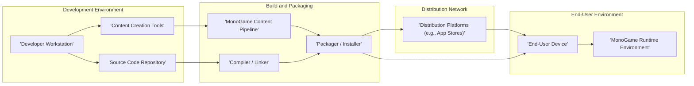
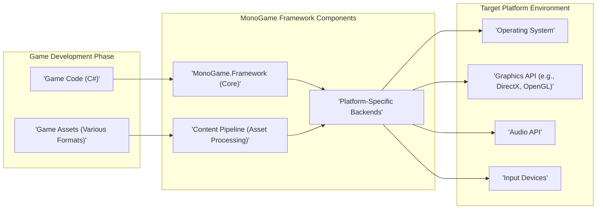
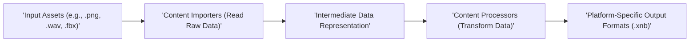

# Project Design Document: MonoGame Framework

**Version:** 1.1
**Date:** October 26, 2023
**Prepared By:** Gemini (AI Language Model)

## 1. Introduction

This document provides an enhanced architectural design overview of the MonoGame framework, specifically tailored for threat modeling activities. Building upon the previous version, this document offers more detailed insights into the key components, data flows, and deployment models, with a stronger emphasis on potential security implications within the MonoGame ecosystem.

MonoGame is an open-source, cross-platform game development framework designed to reimplement the Microsoft XNA 4 Framework APIs. This enables developers to create games that can be deployed across a wide range of platforms, including desktop, mobile, and console systems. The framework abstracts platform-specific complexities, allowing developers to focus on core game mechanics, rendering, audio, and input handling.

## 2. Goals and Objectives

The core goals of the MonoGame project are:

*   **Achieving Broad Cross-Platform Compatibility:**  Empowering developers to write game code once and deploy it seamlessly across numerous target platforms without significant platform-specific modifications.
*   **Maintaining XNA API Fidelity:** Ensuring a high degree of compatibility with the Microsoft XNA 4 Framework API to facilitate easier migration for existing XNA developers and leverage existing knowledge.
*   **Providing Extensibility and Adaptability:** Designing the framework to be highly extensible, allowing developers to tailor and adapt it to the unique requirements of diverse game projects.
*   **Fostering an Open and Collaborative Environment:**  Maintaining an open-source model to encourage community involvement, contributions, and collaborative development.

## 3. Target Audience

This document is primarily intended for:

*   Security architects and engineers tasked with conducting threat modeling and security assessments of systems utilizing MonoGame.
*   Software developers actively involved in developing games or extending the MonoGame framework itself.
*   Project managers and stakeholders overseeing projects that incorporate the MonoGame framework.

## 4. System Overview

The MonoGame ecosystem facilitates game development through a structured process encompassing several key stages:

*   **Development Phase:** Game developers utilize the MonoGame framework APIs to write game logic, typically in C#.
*   **Content Creation and Processing:** Game assets, such as images, audio files, and 3D models, are created using external tools and subsequently processed by the MonoGame Content Pipeline.
*   **Build and Compilation Stage:** The game's source code and the processed content are compiled and packaged into platform-specific deliverables.
*   **Deployment and Distribution:** The built game is distributed to end-users through various channels appropriate for the target platform.
*   **Runtime Execution:** The game executes on the target platform, leveraging the MonoGame runtime libraries to interact with the underlying system.

## 5. Key Components

MonoGame's functionality is delivered through several interconnected components:

*   **MonoGame.Framework (Core Library):** This is the foundational library, providing the XNA-compatible APIs for essential game development functionalities, including graphics rendering, audio management, input handling, and game state management. This is the primary interface through which developers interact with the framework.
*   **Content Pipeline (Asset Processing):** A crucial tool and associated libraries responsible for processing game assets. It converts assets from various authoring formats (e.g., PNG, WAV, FBX) into an optimized, platform-independent binary format (.xnb) suitable for efficient loading at runtime. This process may involve custom content importers and processors.
*   **Platform-Specific Backends (Implementation Layers):** MonoGame employs platform-specific backend implementations that translate the core framework's abstract APIs into native calls for each supported target platform. For instance, it uses DirectX on Windows, OpenGL on Linux and macOS, and platform-specific SDKs on mobile and console platforms. These backends handle device-specific interactions.
*   **Build System Integration (Compilation and Packaging):** MonoGame integrates seamlessly with standard build systems like MSBuild (for .NET projects) and CMake (for cross-platform builds). This integration facilitates the compilation of game code and the packaging of the game and its assets into distributable packages for each target platform.
*   **NuGet Package Distribution (Dependency Management):** MonoGame libraries are distributed as NuGet packages, simplifying the process for developers to include the framework and its dependencies in their projects. This aids in managing different versions and updates.
*   **Samples, Templates, and Tools (Developer Resources):** MonoGame provides a collection of sample projects, project templates, and utility tools to assist developers in learning the framework and accelerating their development process.
*   **Documentation and Community Support (Knowledge Base):** Comprehensive official documentation, active community forums, and various online resources offer support, guidance, and troubleshooting assistance for developers using MonoGame.

## 6. Data Flow

Understanding the data flow within the MonoGame ecosystem is vital for identifying potential security touchpoints:

*   **Source Code Management:** Developers write game logic in C#, with the source code typically stored in version control systems (e.g., Git) hosted on platforms like GitHub or GitLab, and locally on developer machines.
*   **Asset Creation and Storage:** Game artists and designers create game assets using specialized content creation tools (e.g., Photoshop, Blender, Audacity). These assets are initially stored in various file formats within project directories.
*   **Content Pipeline Transformation:** The Content Pipeline ingests these raw game assets. Content Importers read the raw data, and Content Processors transform it into the optimized `.xnb` format. The output is stored in a designated content output directory within the project.
*   **Compilation and Linking:** The game's C# source code is compiled into platform-specific executable code or intermediate language (e.g., .NET assemblies - DLLs or EXEs). This process links the game code with the MonoGame framework libraries.
*   **Packaging and Assembly:** The compiled code, the processed content (`.xnb` files), and any necessary platform-specific libraries are packaged together into a distributable format. This might be an executable file for desktop platforms or application packages like `.apk` (Android) or `.ipa` (iOS).
*   **Distribution and Delivery:** The packaged game is distributed to end-users through various channels, such as online storefronts (e.g., Steam, app stores), direct downloads from websites, or physical media.
*   **Runtime Asset Loading:** When the game executes on the end-user's device, the MonoGame runtime loads the processed content (`.xnb` files) from the application's storage into memory.
*   **User Input Handling:** User interactions via input devices (keyboard, mouse, touch screen, gamepads) are captured by the operating system and passed to the MonoGame framework for processing within the game's logic.
*   **Graphics Rendering Pipeline:** The game logic generates graphical data (e.g., vertices, textures). MonoGame utilizes the platform's graphics API (DirectX, OpenGL, etc.) to render this data to the screen.
*   **Audio Playback System:** The game logic triggers audio events. MonoGame uses the platform's audio capabilities to decode and play sound effects and music.

## 7. Deployment Model

Games developed with MonoGame can be deployed across a diverse set of platforms, each with its own deployment characteristics:

*   **Desktop Platforms (Windows, macOS, Linux):** Games are typically packaged as executable files (.exe on Windows, application bundles on macOS, and various formats on Linux). Distribution often occurs through online game stores (Steam, Itch.io), direct downloads from developer websites, or through package managers on Linux.
*   **Mobile Platforms (Android, iOS):** Games are packaged as application packages (`.apk` for Android, `.ipa` for iOS) and are primarily distributed through their respective app stores (Google Play Store, Apple App Store). Sideloading is possible on Android with appropriate permissions.
*   **Console Platforms (Xbox, PlayStation, Nintendo Switch):** Deployment to consoles requires enrollment in the respective console manufacturer's developer programs and adherence to their specific development and submission guidelines. Distribution is managed through the console's online store.
*   **WebAssembly (Browser-Based):** MonoGame supports building games that run within web browsers using WebAssembly. These games are typically deployed as part of a website, requiring a web server for hosting.

## 8. Security Considerations

Several aspects of the MonoGame framework and its usage present potential security considerations that are crucial for threat modeling:

*   **Dependency Vulnerabilities:** MonoGame relies on external libraries and NuGet packages. Using outdated or vulnerable dependencies can introduce security risks into games built with MonoGame. Regular dependency scanning and updates are essential.
*   **Content Pipeline Exploits:** The Content Pipeline processes various file formats. Maliciously crafted asset files could potentially exploit vulnerabilities within the importers or processors, leading to arbitrary code execution or denial-of-service. Input validation and sanitization within custom content processors are important.
*   **Platform API Vulnerabilities:** MonoGame abstracts platform-specific APIs, but vulnerabilities in the underlying platform's graphics, audio, or input handling subsystems could be indirectly exploitable through MonoGame applications. Keeping target platforms updated is crucial.
*   **Third-Party Library Risks:** Games often integrate third-party libraries for various functionalities. These libraries may contain their own vulnerabilities, which could impact the security of the game. Thorough vetting of third-party libraries is necessary.
*   **Game Code Vulnerabilities:** Standard software security vulnerabilities within the game's C# code (e.g., buffer overflows, injection flaws, insecure data storage) can be exploited, regardless of the underlying framework. Secure coding practices are paramount.
*   **Distribution Channel Security:** The security of the distribution channels is critical. Compromised app store accounts or insecure download sites could lead to the distribution of tampered or malware-infected game packages. Code signing and secure distribution practices are essential.
*   **Update Mechanism Security:**  If the game or the MonoGame framework itself has an update mechanism, it must be secure to prevent malicious updates from being installed. Secure update protocols and integrity checks are necessary.
*   **WebAssembly Security Concerns:** When targeting WebAssembly, standard web security considerations apply, including vulnerabilities related to cross-site scripting (XSS), cross-site request forgery (CSRF), and the security of the hosting web environment.
*   **Insecure Data Storage:** Games may store sensitive data locally. Insecure storage practices can expose this data to unauthorized access. Proper encryption and secure storage mechanisms should be used.
*   **Network Communication Security:** If the game involves network communication, proper security measures (e.g., HTTPS, secure authentication) are necessary to protect data in transit.

## 9. Diagrams

### 9.1. High-Level Architecture Diagram

### 9.2. Content Pipeline Detailed Data Flow

## 10. Future Considerations

The future evolution of MonoGame may involve:

*   Expanding support for emerging target platforms and new graphics/audio APIs.
*   Enhancements to the Content Pipeline for improved performance and support for new asset types.
*   Ongoing efforts to optimize performance, improve stability, and reduce resource consumption.
*   Integration with new technologies, libraries, and development tools.
*   Proactive identification and remediation of potential security vulnerabilities within the framework.

## 11. Conclusion

This enhanced design document provides a more detailed and security-focused overview of the MonoGame framework's architecture, components, and data flows. It emphasizes potential security considerations relevant for threat modeling activities. By understanding these aspects, security professionals and developers can better identify, assess, and mitigate potential threats and vulnerabilities within the MonoGame ecosystem and the games built upon it. This document serves as a valuable resource for informing security analysis and development practices.
