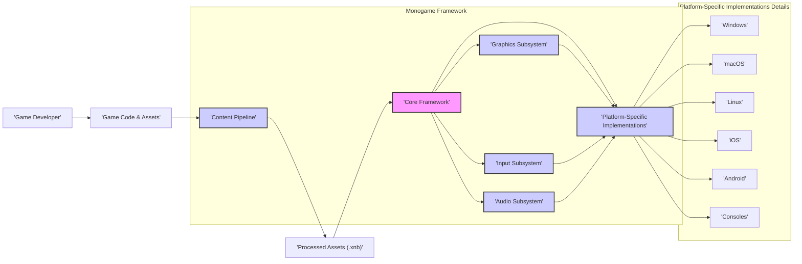
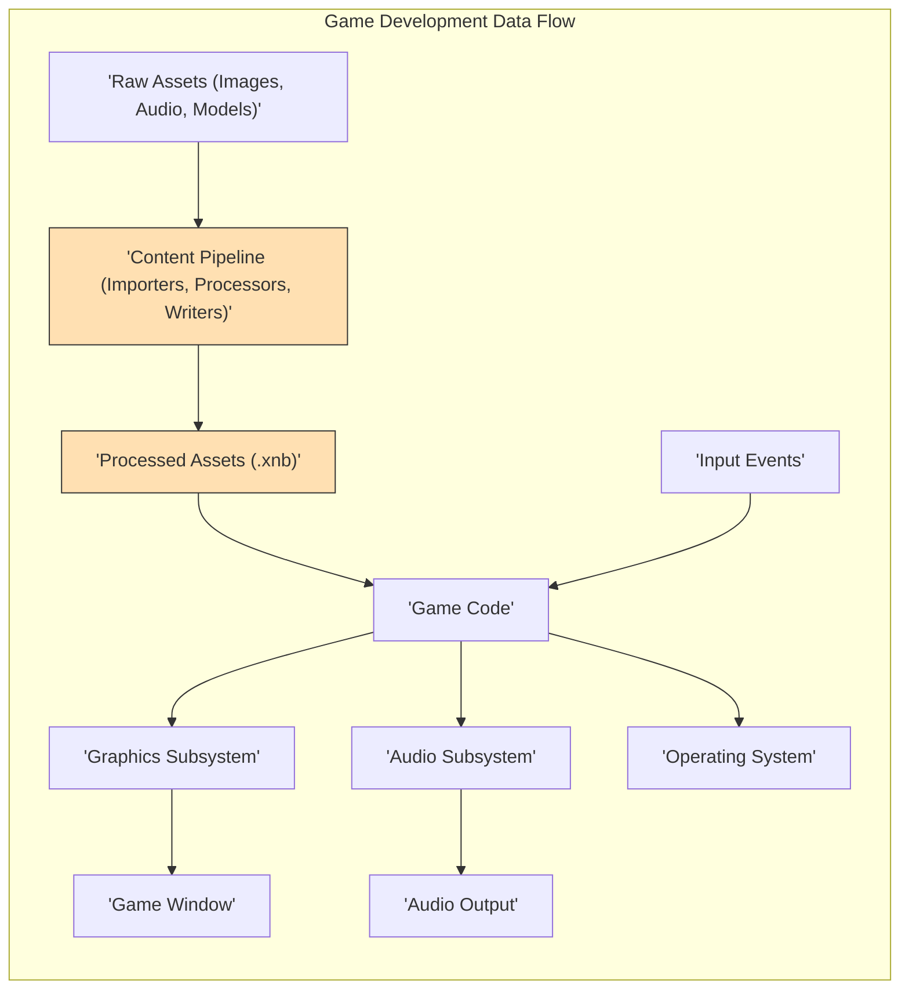

## Project Design Document: Monogame Framework

**Version:** 1.1
**Date:** October 26, 2023
**Author:** AI Software Architect

### 1. Introduction

This document provides an enhanced architectural overview of the Monogame framework, building upon the previous version. It details the key components, their interactions, and the overall system design with a stronger focus on aspects relevant to threat modeling. This document serves as a foundational resource for identifying potential security vulnerabilities and attack vectors within the Monogame ecosystem.

### 2. Project Overview

Monogame is a mature, open-source framework designed for cross-platform game development. It faithfully implements the Microsoft XNA 4 Application Programming Interface (API), enabling developers to write game logic once in C# and deploy it across a diverse range of platforms. This includes desktop operating systems (Windows, macOS, Linux), mobile platforms (iOS, Android), and various gaming consoles. The framework aims to provide a consistent and familiar development experience for those transitioning from XNA or starting new cross-platform projects.

### 3. Goals and Objectives

*   **Primary Goal:** Facilitate cross-platform game development with a unified codebase.
*   **API Compatibility:** Maintain a high degree of compatibility with the XNA 4 API to ease migration and reduce the learning curve.
*   **Performance:** Offer a performant and efficient runtime environment suitable for demanding game applications.
*   **Community Driven:** Foster an active and supportive open-source community for contributions, issue resolution, and knowledge sharing.
*   **Platform Reach:** Enable developers to target a broad spectrum of platforms with minimal platform-specific code.
*   **Extensibility:** Provide mechanisms for extending the framework's functionality through custom components and libraries.

### 4. Target Audience

*   **Game Developers:**  Both independent and studio-based developers creating 2D and 3D games.
*   **Educational Institutions:** Educators and students utilizing Monogame for teaching and learning game development principles.
*   **Hobbyist Programmers:** Individuals exploring game development as a personal interest.
*   **XNA Legacy Developers:** Developers seeking to bring their existing XNA projects to modern platforms.
*   **Software Engineers:** Professionals interested in the architecture and implementation of a cross-platform framework.

### 5. System Architecture

The Monogame framework is structured around several interconnected subsystems. Understanding these components is crucial for identifying potential threat surfaces.

*   **Core Framework (`Microsoft.Xna.Framework`):** The foundational layer providing essential game development abstractions.
    *   `Game` Class: Manages the game lifecycle, including initialization, update, and draw loops.
    *   `GraphicsDeviceManager` & `GraphicsDevice`:  Handles the creation and management of the graphics rendering context.
    *   `ContentManager`: Responsible for loading and managing game assets from storage.
    *   `Input` Classes (Keyboard, Mouse, Touch, GamePad): Provide access to user input events.
    *   `Audio` Classes (SoundEffect, Song, AudioEngine):  Manages audio playback and manipulation.
    *   Platform Abstraction Layer (Internal):  A critical internal component that isolates the core framework from platform-specific implementations. This layer defines interfaces that platform-specific code must implement.
*   **Graphics Subsystem:**  Dedicated to rendering visual content.
    *   `GraphicsDevice`:  An abstraction over the underlying graphics API (DirectX, OpenGL, Metal).
    *   Shaders (HLSL): Allows developers to write custom rendering logic executed on the GPU.
    *   Texture Management: Handles the loading, creation, and manipulation of image textures.
    *   `SpriteBatch`: An optimized component for rendering large numbers of 2D sprites efficiently.
    *   Render Targets:  Allows rendering to off-screen buffers for post-processing effects.
*   **Input Subsystem:**  Manages user interaction.
    *   Keyboard State: Provides the current state of keyboard keys.
    *   Mouse State:  Provides mouse position, button states, and scroll wheel data.
    *   Touch Collection:  Provides information about active touch points on touch-enabled devices.
    *   GamePad State:  Provides the state of connected game controllers.
*   **Audio Subsystem:**  Handles sound and music playback.
    *   `SoundEffect`:  Represents short audio samples loaded into memory.
    *   `Song`: Represents streamed audio tracks.
    *   `AudioEngine`, `WaveBank`, `SoundBank`:  More advanced components for managing complex audio assets (often used for XACT-based audio).
*   **Content Pipeline:**  A crucial pre-processing stage for game assets.
    *   Importers:  Modules responsible for reading various raw asset file formats (e.g., `.png`, `.wav`, `.fbx`).
    *   Processors: Modules that transform and optimize imported assets (e.g., texture compression, model optimization).
    *   Writers: Modules that serialize the processed assets into a binary format (`.xnb`) for efficient loading.
*   **Platform-Specific Implementations:**  Adapt the core framework to the nuances of each target platform.
    *   Windows Implementation: Typically utilizes DirectX or OpenGL.
    *   macOS Implementation: Uses OpenGL or Metal.
    *   Linux Implementation: Primarily uses OpenGL.
    *   iOS Implementation: Leverages OpenGL ES or Metal.
    *   Android Implementation: Utilizes OpenGL ES.
    *   Console Implementations:  Employ proprietary graphics and input APIs provided by console manufacturers.
*   **Developer Tools and Ecosystem:** While not part of the core runtime, these are essential for development.
    *   Visual Studio Integration: Project templates, debugging support, and NuGet package management.
    *   Command-Line Interface (CLI) Tools: For building, packaging, and managing Monogame projects.
    *   Community Libraries and Extensions: A wide array of community-developed libraries that extend Monogame's capabilities (e.g., UI frameworks, networking libraries).

### 6. Data Flow

Understanding how data flows through a Monogame application is critical for identifying potential points of vulnerability.

*   **Asset Creation and Processing:**
    *   Developers create raw assets using various tools.
    *   The Content Pipeline ingests these assets.
    *   Importers read the raw data. Potential vulnerabilities exist in the parsing logic of importers if they are not robust against malformed or malicious files.
    *   Processors transform and optimize the data. Vulnerabilities here could lead to unexpected behavior or even crashes during asset processing.
    *   Writers serialize the processed data into `.xnb` files.
*   **Game Initialization and Asset Loading:**
    *   When the game starts, the `ContentManager` loads `.xnb` files from storage.
    *   Vulnerabilities could arise if the loading process is susceptible to path traversal attacks or if the `.xnb` format itself has exploitable weaknesses.
*   **Input Handling:**
    *   The Input Subsystem receives raw input events from the operating system.
    *   This raw input is then processed and made available to the game logic.
    *   Insufficient input validation in the game code can lead to vulnerabilities like buffer overflows or command injection if the game interacts with external systems based on user input.
*   **Game Logic and State Updates:**
    *   Game code processes input and updates the game state.
    *   Logic flaws in the game code itself can be a significant source of vulnerabilities, although these are typically outside the scope of the framework itself.
*   **Rendering:**
    *   The game code provides rendering instructions to the Graphics Subsystem.
    *   The Graphics Subsystem interacts with the underlying graphics API to draw the scene.
    *   Vulnerabilities in the graphics drivers or the underlying graphics API could potentially be exploited, though this is less common within the framework itself.
    *   Improper use of shaders could introduce vulnerabilities, although this is primarily a concern for the game developer.
*   **Audio Playback:**
    *   The game code instructs the Audio Subsystem to play sounds and music.
    *   Vulnerabilities in the audio decoding libraries or the platform's audio system could be potential attack vectors.
*   **Platform Interaction:**
    *   The Platform-Specific Implementations handle interactions with the operating system (e.g., file access, network communication).
    *   Vulnerabilities in these platform-specific implementations could expose the game to security risks.

### 7. Security Considerations

Monogame, as a game development framework, presents a unique set of security considerations for developers. While the framework itself aims to be secure, its usage and the games built upon it can introduce vulnerabilities.

*   **Content Pipeline Vulnerabilities:**
    *   **Malicious Assets:**  Exploiting vulnerabilities in importers to inject malicious code or cause crashes during asset processing.
    *   **Denial of Service:**  Crafting overly complex assets that consume excessive resources during processing.
    *   **Path Traversal:**  Attempting to access files outside the intended content directory during import or processing.
*   **Dependency Management:**
    *   **Vulnerable NuGet Packages:** Games built with Monogame often rely on external libraries. Using outdated or vulnerable NuGet packages can introduce security risks.
    *   **Supply Chain Attacks:**  Compromised dependencies could inject malicious code into the game.
*   **Input Handling Vulnerabilities:**
    *   **Buffer Overflows:**  Insufficiently validating user input, potentially leading to memory corruption.
    *   **Injection Attacks:**  If the game interacts with external systems based on user input (e.g., online leaderboards), improper sanitization can lead to injection vulnerabilities.
*   **Platform-Specific Vulnerabilities:**
    *   **Exploiting OS-Level Flaws:**  Vulnerabilities in the underlying operating system or graphics drivers could be exploited by malicious actors.
    *   **Insecure Platform APIs:**  Improper use of platform-specific APIs could introduce security weaknesses.
*   **Code Security in Game Logic:**
    *   **Memory Management Issues:**  Bugs like dangling pointers or memory leaks can be exploited.
    *   **Logic Flaws:**  Vulnerabilities in the game's logic can be exploited for unfair advantages or to disrupt gameplay.
*   **Distribution and Integrity:**
    *   **Tampered Binaries:**  Malicious actors could modify the game executable after compilation.
    *   **Insecure Distribution Channels:**  Distributing the game through unofficial or compromised channels increases the risk of distributing malware.
*   **Reverse Engineering and Intellectual Property:**
    *   **Asset Extraction:**  Game assets stored in `.xnb` files can be extracted, potentially exposing intellectual property.
    *   **Code Analysis:**  The .NET nature of Monogame games makes them relatively easier to reverse engineer compared to natively compiled code. Obfuscation can mitigate this risk.
*   **Networking (If Implemented by the Game):**
    *   Standard networking vulnerabilities (e.g., man-in-the-middle attacks, replay attacks) are relevant if the game implements online features. This is outside the scope of the core framework but a crucial consideration for game developers.

### 8. Deployment Model

Monogame games are deployed as platform-specific applications.

*   **Desktop Platforms (Windows, macOS, Linux):** Typically deployed as standalone executable files or application bundles.
*   **Mobile Platforms (iOS, Android):** Deployed as application packages (`.ipa` for iOS, `.apk` for Android) distributed through app stores.
*   **Gaming Consoles:** Deployment processes are specific to each console manufacturer and usually involve closed distribution channels.

The deployment process involves compiling the C# code, packaging the processed assets, and creating the necessary installation or distribution packages for the target platform. Code signing is crucial for establishing trust and verifying the integrity of the application.

### 9. Technologies Used

*   **Primary Programming Language:** C#
*   **.NET Ecosystem:**  Built upon the .NET Framework or .NET (formerly .NET Core).
*   **Graphics APIs:** DirectX (Windows), OpenGL (Windows, macOS, Linux), OpenGL ES (iOS, Android), Metal (macOS, iOS).
*   **Audio APIs:** Platform-specific audio APIs (e.g., CoreAudio on macOS/iOS, OpenAL Soft, DirectSound on older Windows versions).
*   **Build System:** MSBuild.
*   **Integrated Development Environments (IDEs):** Primarily Visual Studio (Windows) and Visual Studio for Mac. Other compatible IDEs can also be used.
*   **Package Management:** NuGet for managing dependencies.

### 10. Assumptions and Constraints

*   This document focuses on the architectural design of the Monogame framework itself and common usage patterns. Specific game implementations will introduce their own unique complexities and security considerations.
*   The security considerations outlined are intended to be comprehensive but may not cover all potential vulnerabilities. Threat modeling should be an ongoing process.
*   The document assumes a basic understanding of software development principles and game development concepts.
*   The information is based on the current understanding of Monogame as of the document's creation date and is subject to change as the framework evolves.

### 11. Future Considerations

*   Conduct detailed threat modeling workshops based on this design document to identify specific vulnerabilities and attack vectors.
*   Perform security audits of the Monogame codebase, particularly focusing on the Content Pipeline and platform-specific implementations.
*   Develop and promote secure coding guidelines for developers using the Monogame framework.
*   Investigate potential security enhancements that could be incorporated directly into the framework, such as built-in asset validation or improved input sanitization helpers.
*   Continuously monitor for and address reported security vulnerabilities in dependencies and the underlying platforms.