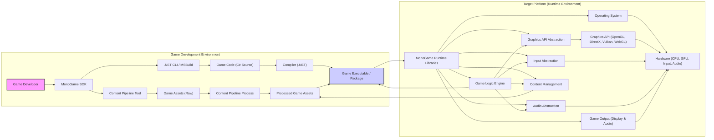
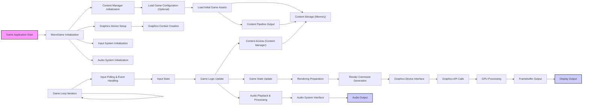

# Project Design Document: MonoGame Framework

**Version:** 1.1
**Date:** 2023-10-27
**Author:** Gemini (AI Expert)
**Project:** MonoGame Framework - Open Source Cross-Platform Game Development Framework
**GitHub Repository:** [https://github.com/monogame/monogame](https://github.com/monogame/monogame)

## 1. Introduction

This document provides a detailed design overview of the MonoGame framework, intended for use as a foundation for threat modeling and security analysis. MonoGame is a mature, open-source, cross-platform game development framework built upon the .NET ecosystem and inspired by Microsoft's XNA Framework. It empowers developers to create games in C# and deploy them across a wide spectrum of platforms, leveraging a familiar XNA-like API. This document elaborates on MonoGame's architecture, core components, data flow pathways, and underlying technology stack to facilitate a comprehensive understanding of the framework from a security perspective. It aims to identify potential security boundaries and areas of concern for further investigation.

## 2. Project Overview

**Purpose:** The primary purpose of MonoGame is to democratize game development by providing a free, open-source, and robust cross-platform framework. It significantly reduces the complexities of multi-platform game development, enabling developers to write game logic once and deploy it across diverse platforms, including desktop (Windows, macOS, Linux), mobile (iOS, Android), consoles (Xbox, PlayStation, Nintendo Switch), and web environments (via WebGL). This "write once, run anywhere" philosophy accelerates development cycles and broadens audience reach.

**Key Features:**

*   **Broad Cross-Platform Compatibility:**  MonoGame's core strength lies in its extensive platform support, minimizing the need for platform-specific code and streamlining the porting process.
*   **XNA-Inspired API:**  Adherence to the XNA Framework API provides a gentle learning curve for developers familiar with XNA, allowing them to leverage existing skills and codebases. This also benefits from the years of community knowledge and resources built around XNA.
*   **Advanced Content Pipeline:** A sophisticated content pipeline is integral to MonoGame, responsible for efficiently processing a wide array of game assets (textures, audio files, 3D models, fonts, shaders, etc.) into optimized, platform-specific formats. This pipeline handles asset compression, format conversion, and optimization for different target platforms.
*   **Versatile Graphics Rendering:** MonoGame offers comprehensive 2D and 3D graphics rendering capabilities, utilizing modern, performant graphics APIs such as OpenGL (cross-platform), DirectX (Windows/Xbox), and Vulkan (cross-platform, high-performance). This allows developers to target different performance levels and hardware capabilities.
*   **Unified Input System:**  A consistent and unified input system abstracts away platform-specific input handling complexities. It provides a single interface for managing input from various devices, including keyboards, mice, touchscreens, gamepads, and motion sensors.
*   **Comprehensive Audio Support:**  MonoGame supports a wide range of audio formats and provides functionalities for sound effects, background music, spatial audio, and audio processing.
*   **Open Source and Community-Driven:**  Licensed under the permissive MIT License, MonoGame benefits from a vibrant and active open-source community. This fosters transparency, collaborative development, rapid bug fixing, and continuous improvement.
*   **.NET Foundation and Ecosystem:** Built upon the robust .NET platform, MonoGame leverages its performance, extensive tooling (Visual Studio, .NET CLI), and rich ecosystem of libraries and resources. This provides developers with a modern and productive development environment.

## 3. System Architecture

The following diagram illustrates the high-level architecture of MonoGame, delineating the game development workflow and runtime execution environment.

**Detailed Component Description:**

*   **"Game Developer"**: The individual or team responsible for creating games using the MonoGame framework. Their activities include game design, coding, asset creation, and project management.
*   **"MonoGame SDK"**: The Software Development Kit provides all necessary tools and resources for MonoGame development. Key components include:
    *   **"Content Pipeline Tool"**: A standalone application (GUI and command-line) that processes game assets. It handles tasks like image compression, texture atlas generation, model format conversion, shader compilation, and audio encoding.
    *   **".NET CLI / MSBuild"**: Standard .NET build tools used to compile the C# game code, manage dependencies, and package the game for deployment.
    *   **Project Templates**: Pre-configured project structures for various target platforms, streamlining project setup.
    *   **MonoGame Framework Libraries**: The core .NET libraries that provide the MonoGame API, including classes for graphics, input, audio, content management, and game logic.
*   **"Game Assets (Raw)"**:  Unprocessed game resources in their original formats (e.g., PNG, JPG, WAV, MP3, FBX, OBJ). These are created by artists or sourced from asset stores.
*   **"Content Pipeline Process"**: The automated process within the Content Pipeline Tool that transforms raw game assets into optimized, platform-ready formats. This process is configurable and extensible, allowing developers to customize asset processing.
*   **"Processed Game Assets"**: Game assets that have been processed by the Content Pipeline. These are typically in platform-specific formats optimized for loading speed, memory usage, and rendering performance.
*   **"Game Code (C# Source)"**: The C# source code files written by the game developer, containing the game's logic, rendering routines, input handling, and overall game behavior.
*   **"Compiler (.NET)"**: The .NET compiler (Roslyn) that compiles the C# game code into intermediate language (IL) code and then potentially into platform-specific native code.
*   **"Game Executable / Package"**: The final output of the build process. This is a deployable package containing the compiled game code, processed assets, MonoGame runtime libraries, and any platform-specific dependencies. The format varies depending on the target platform (e.g., EXE for Windows, APK for Android, IPA for iOS).
*   **"MonoGame Runtime Libraries"**: Platform-specific native and managed libraries that implement the MonoGame API on each target platform. These libraries act as a bridge between the game code and the underlying operating system and hardware. They provide abstractions for:
    *   **"Graphics API Abstraction"**:  A layer that abstracts away the differences between various graphics APIs (OpenGL, DirectX, Vulkan, WebGL), allowing the game code to remain platform-agnostic.
    *   **"Graphics API (OpenGL, DirectX, Vulkan, WebGL)"**: The actual graphics rendering APIs used by MonoGame on different platforms.
    *   **"Input Abstraction"**:  Provides a unified interface for handling input from diverse input devices, masking platform-specific input mechanisms.
    *   **"Audio Abstraction"**:  Abstracts platform-specific audio systems, providing a consistent API for audio playback and management.
    *   **"Content Management"**:  Handles loading, caching, and managing processed game assets at runtime, using the `ContentManager` class.
    *   **"Game Logic Engine"**: The core runtime engine that executes the game logic, manages game loops, and orchestrates interactions between different MonoGame subsystems.
*   **"Operating System"**: The underlying operating system of the target platform (Windows, macOS, Linux, Android, iOS, etc.).
*   **"Hardware (CPU, GPU, Input, Audio)"**: The physical hardware components of the target platform, including the CPU, GPU, input devices (keyboard, mouse, touch, gamepad), and audio hardware (sound card, speakers).
*   **"Game Output (Display & Audio)"**: The visual and auditory output of the running game, presented to the player through the display screen and audio output devices.

## 4. Data Flow Diagram (Runtime)

This diagram details the runtime data flow within a MonoGame application, focusing on the critical paths of asset loading, input processing, game logic execution, and rendering.

**Detailed Data Flow Description:**

1.  **"Game Application Start"**: The game executable is launched by the user or operating system.
2.  **"MonoGame Initialization"**: The MonoGame runtime environment is initialized, setting up core subsystems and managers.
3.  **"Content Manager Initialization"**: The `ContentManager` is initialized. This component is responsible for loading and managing game assets at runtime.
4.  **"Load Game Configuration (Optional)"**: Game-specific configuration data (settings, preferences) may be loaded from files or storage.
5.  **"Load Initial Game Assets"**: The `ContentManager` loads essential game assets required for the initial game state (e.g., initial scene assets, UI textures).
6.  **"Content Storage (Memory)"**: Loaded game assets are stored in memory for efficient access during gameplay.
7.  **"Content Pipeline Output"**: The `ContentManager` accesses processed assets that were generated by the Content Pipeline during the development phase.
8.  **"Graphics Device Setup"**: The graphics device is initialized, establishing a connection to the GPU and configuring rendering parameters.
9.  **"Graphics Context Creation"**: A graphics context is created for the chosen graphics API (OpenGL, DirectX, Vulkan, WebGL), enabling rendering operations.
10. **"Input System Initialization"**: The input system is initialized, setting up listeners for input events from various devices.
11. **"Audio System Initialization"**: The audio system is initialized, preparing for audio playback and processing.
12. **"Game Loop Start"**: The main game loop begins, driving the game's execution.
13. **"Input Polling & Event Handling"**: The input system polls input devices and processes input events (keyboard presses, mouse movements, touch events, etc.).
14. **"Input State"**: The current state of input devices is captured and stored for use by the game logic.
15. **"Game Logic Update"**: The game logic is executed. This involves updating game state based on input, time elapsed, and game rules. This is where game mechanics, AI, physics, and other game systems are processed.
16. **"Game State Update"**: The game state is updated based on the results of the game logic update. This includes changes to object positions, animations, game variables, etc.
17. **"Rendering Preparation"**:  The rendering system prepares for the rendering of the current frame. This may involve scene graph traversal, visibility determination, and sorting of renderable objects.
18. **"Render Command Generation"**: Rendering commands are generated based on the prepared scene. These commands specify what to draw, where to draw it, and how to draw it (e.g., draw calls, shader parameters, texture bindings).
19. **"Graphics Device Interface"**: MonoGame's graphics device interface translates rendering commands into API-specific calls.
20. **"Graphics API Calls"**:  Calls are made to the underlying graphics API (OpenGL, DirectX, Vulkan, WebGL) to perform rendering operations.
21. **"GPU Processing"**: The GPU executes the rendering commands, performing vertex processing, rasterization, fragment shading, and other graphics pipeline stages.
22. **"Framebuffer Output"**: The rendered frame is written to the framebuffer, a memory buffer that stores the rendered image.
23. **"Display Output"**: The framebuffer is presented to the display, making the rendered frame visible to the player.
24. **"Audio Playback & Processing"**: Game audio is played back and processed. This may include mixing sound effects, playing background music, applying audio effects, and spatializing audio.
25. **"Audio System Interface"**: MonoGame's audio system interface interacts with the platform's audio API.
26. **"Audio Output"**: Audio is outputted through the audio output devices (speakers, headphones).
27. **"Content Access (Content Manager)"**: During the game loop, the game logic may request to load additional game assets using the `ContentManager` as needed (e.g., loading new levels, dynamically loading assets).
28. **"Game Loop Iteration"**: The game loop repeats, processing input, updating game logic, rendering the next frame, and handling audio, creating the continuous flow of the game.

## 5. Technology Stack (Detailed)

*   **Primary Programming Language:** C# (Core game logic and MonoGame framework code)
*   **.NET Runtime / Mono Runtime:**
    *   **.NET Framework (Windows):**  Historically used and still supported for Windows desktop development.
    *   **.NET (.NET Core / .NET 5+) (Cross-Platform):** The modern, cross-platform .NET runtime, used for macOS, Linux, Android, iOS, WebGL, and modern Windows development.
    *   **Mono Runtime (Cross-Platform, Legacy):**  Used for platforms where .NET Core/later versions were not initially available or for specific compatibility reasons. Still relevant for some older platform targets.
*   **Graphics APIs (Platform-Specific Implementations):**
    *   **OpenGL (Cross-Platform):** Primarily used on Linux, macOS, Android, iOS, and WebGL. MonoGame utilizes OpenGL ES on mobile platforms and WebGL in browsers.
    *   **DirectX 11 & DirectX 12 (Windows, Xbox):** Used for high-performance graphics on Windows and Xbox platforms. DirectX 12 provides lower-level access and improved performance.
    *   **Vulkan (Cross-Platform, Emerging):** Increasingly supported as a high-performance, cross-platform graphics API. MonoGame is adding more Vulkan support for platforms where it's beneficial.
    *   **WebGL (Web Browsers):**  Used for running MonoGame applications in web browsers, leveraging browser-based OpenGL ES.
*   **Build Tools and IDEs:**
    *   **MSBuild (Windows):**  Microsoft Build Engine, used for building .NET projects on Windows, often integrated with Visual Studio.
    *   **.NET CLI (Cross-Platform):**  .NET Command-Line Interface, used for building, running, and managing .NET projects across all supported platforms.
    *   **Visual Studio (Windows, macOS):**  Primary IDE for .NET development, offering excellent MonoGame project support, debugging, and tooling.
    *   **Visual Studio Code (Cross-Platform):**  Lightweight, cross-platform code editor with excellent .NET and C# support through extensions.
    *   **Other IDEs:** Rider, other .NET compatible IDEs can also be used.
*   **Content Pipeline Technology:**
    *   **Custom-Built Content Pipeline Tool (C#):**  MonoGame's Content Pipeline is implemented in C# and is extensible.
    *   **Asset Importers/Processors:**  Uses a plugin-based architecture for importing and processing various asset types. Importers handle format-specific parsing and conversion.
    *   **Serialization Formats:**  Processed assets are typically serialized into binary formats optimized for loading speed and runtime access.
*   **Platforms Supported (and underlying SDKs/Dependencies):**
    *   **Windows:** DirectX, .NET Framework/.NET, Windows SDK.
    *   **macOS:** OpenGL, .NET, macOS SDK, SDL2.
    *   **Linux:** OpenGL, .NET, SDL2, platform-specific libraries (e.g., for input, audio).
    *   **iOS:** OpenGL ES, .NET, iOS SDK, Objective-C/Swift interop, platform-specific Apple frameworks.
    *   **Android:** OpenGL ES, .NET, Android SDK, Java/Kotlin interop, Android NDK (for native components).
    *   **Xbox (Xbox One, Xbox Series X/S):** DirectX, UWP (Universal Windows Platform), Xbox SDK.
    *   **PlayStation (PS4, PS5):** Proprietary PlayStation SDK, platform-specific graphics and audio APIs, C++ interop (for parts of the runtime).
    *   **Nintendo Switch:** Proprietary Nintendo Switch SDK, platform-specific APIs, C++ interop.
    *   **Web (WebGL):** WebGL (OpenGL ES in browsers), JavaScript interop, HTML5 APIs, .NET (via WebAssembly - Blazor or similar).
*   **Key Libraries & Dependencies (Examples - Platform Dependent):**
    *   **SDL2 (Simple DirectMedia Layer):** Cross-platform library for windowing, input, audio, and threading. Used by MonoGame on many platforms (Linux, macOS, etc.).
    *   **OpenAL Soft (Audio):** Open-source implementation of OpenAL, used for cross-platform audio.
    *   **libVorbis/libOgg (Audio):** For Ogg Vorbis audio decoding.
    *   **libtheora (Video - potentially):** For Theora video decoding (less common now).
    *   **zlib (Compression):** For data compression.
    *   **Platform-Specific Graphics Driver Libraries:**  Vendor-provided drivers for OpenGL, DirectX, Vulkan.
    *   **.NET Base Class Libraries (BCL):** Core .NET libraries for fundamental functionalities.
    *   **NuGet Packages:**  MonoGame and games built with it may utilize various NuGet packages for extended functionality (e.g., networking, UI frameworks, physics engines).

## 6. Security Considerations (Expanded and Categorized)

This section provides a more detailed and categorized overview of security considerations relevant to the MonoGame framework and games developed using it.

**6.1. Content Pipeline Security Risks:**

*   **Malicious Asset Injection:**
    *   **Threat:** Game developers might unknowingly or maliciously include crafted game assets (images, models, audio, shaders) that exploit vulnerabilities in the Content Pipeline's asset processing logic.
    *   **Impact:** Could lead to denial of service (DoS) during asset processing, code execution during asset loading at runtime (if vulnerabilities exist in asset loaders), or data corruption.
    *   **Examples:**   специально crafted image files with buffer overflows in image decoders, malicious shader code injected into shader files, manipulated 3D models causing parser errors.
*   **Content Pipeline Tool Vulnerabilities:**
    *   **Threat:** Vulnerabilities within the Content Pipeline Tool itself (e.g., in its parsing libraries, file handling, or update mechanism).
    *   **Impact:** Could allow attackers to compromise the development environment, potentially leading to supply chain attacks by injecting malicious code into processed assets or the game project itself.
    *   **Examples:**  Buffer overflows in asset importers, vulnerabilities in the Content Pipeline Tool's update process allowing for malware distribution.
*   **Dependency Vulnerabilities (Content Pipeline):**
    *   **Threat:** The Content Pipeline relies on external libraries (image codecs, model loaders, audio decoders). These dependencies might contain known vulnerabilities.
    *   **Impact:**  Vulnerabilities in dependencies could be exploited through malicious assets processed by the Content Pipeline, leading to similar impacts as malicious asset injection.
    *   **Examples:**  Vulnerabilities in image decoding libraries (e.g., libpng, libjpeg), audio decoding libraries (e.g., libvorbis).

**6.2. Runtime Security Risks:**

*   **Graphics API and Driver Vulnerabilities:**
    *   **Threat:** Exploiting vulnerabilities in the underlying graphics drivers (OpenGL, DirectX, Vulkan) or the graphics APIs themselves through crafted rendering commands generated by MonoGame or the game code.
    *   **Impact:** Could lead to driver crashes (DoS), privilege escalation (if driver vulnerabilities allow), or information disclosure.
    *   **Examples:**  Crafted shader code exploiting shader compiler vulnerabilities, excessive draw calls causing driver instability, buffer overflows in driver-side rendering pipelines.
*   **Input Handling Vulnerabilities:**
    *   **Threat:**  Improper handling of input data, although MonoGame provides an abstraction layer, vulnerabilities could still arise in game code or within MonoGame's input system if not carefully implemented.
    *   **Impact:**  Less likely in MonoGame due to abstraction, but potential for DoS if input processing is computationally expensive and can be triggered by malicious input patterns. More relevant to game code vulnerabilities.
    *   **Examples:**  Denial of service by flooding the game with input events, input injection attacks (less relevant in typical game scenarios, more in networked games).
*   **Audio System Vulnerabilities:**
    *   **Threat:** Exploiting vulnerabilities in the audio system or audio codecs used by MonoGame.
    *   **Impact:**  Less critical, but could lead to audio glitches, crashes, or potentially more serious issues if vulnerabilities exist in low-level audio drivers.
    *   **Examples:**  Malicious audio files exploiting vulnerabilities in audio decoders, DoS through excessive audio playback requests.
*   **Dependency Vulnerabilities (Runtime Libraries):**
    *   **Threat:** MonoGame runtime libraries depend on platform-specific libraries (SDL2, platform SDKs, system libraries). These dependencies could have vulnerabilities.
    *   **Impact:**  Vulnerabilities in runtime dependencies could be exploited, potentially leading to code execution, privilege escalation, or DoS.
    *   **Examples:**  Vulnerabilities in SDL2, platform-specific system libraries used by MonoGame.
*   **Game Code Vulnerabilities (Developer Responsibility):**
    *   **Threat:** Vulnerabilities in the game code written by developers using MonoGame. This is the most common area for game security issues.
    *   **Impact:** Wide range of impacts depending on the vulnerability: code execution, data breaches, cheating, denial of service, game logic manipulation.
    *   **Examples:**  Buffer overflows in game code, SQL injection in networked games, logic flaws allowing cheating, insecure network communication protocols.

**6.3. Open Source and Supply Chain Risks:**

*   **Malicious Contributions:**
    *   **Threat:**  Malicious actors could attempt to contribute compromised code to the MonoGame project repository.
    *   **Impact:** If malicious code is merged into the main codebase, it could introduce vulnerabilities into the framework itself, affecting all games built with it.
    *   **Mitigation:** Robust code review processes, trusted maintainers, security audits.
*   **Compromised Dependencies (Upstream Supply Chain):**
    *   **Threat:**  Dependencies used by MonoGame (NuGet packages, external libraries) could be compromised at their source.
    *   **Impact:**  If a dependency is compromised, MonoGame and games built with it could inherit those vulnerabilities.
    *   **Mitigation:** Dependency scanning, using trusted package sources, verifying checksums, software bill of materials (SBOM).
*   **Insecure Update Mechanisms:**
    *   **Threat:**  If the update mechanism for MonoGame SDK or runtime libraries is insecure (e.g., unencrypted updates, lack of signature verification), it could be exploited to distribute malware disguised as updates.
    *   **Impact:**  Compromised development environments or runtime environments, leading to widespread game compromises.
    *   **Mitigation:** Secure update channels (HTTPS), code signing, integrity checks.

**6.4. Platform-Specific Security Considerations:**

*   **Mobile Platform Security (iOS, Android):**
    *   **Permissions:**  Games need to request appropriate permissions (storage, network, camera, etc.). Over-requesting permissions can be a security and privacy concern.
    *   **Sandboxing:** Mobile platforms enforce sandboxing, limiting access to system resources. Games need to operate within these sandbox constraints.
    *   **App Store Security:** App stores (Apple App Store, Google Play Store) have security review processes, but vulnerabilities can still slip through.
*   **Console Platform Security (Xbox, PlayStation, Nintendo Switch):**
    *   **Closed Ecosystems:** Consoles are typically closed ecosystems with stricter security controls. Development often requires approved developer accounts and SDKs.
    *   **Platform Security Features:** Consoles have built-in security features to prevent cheating and piracy. Games need to integrate with these features.
    *   **Security Audits:** Console platforms often require security audits for games before release.
*   **Web Platform Security (WebGL):**
    *   **Browser Security Model:** WebGL games run within the browser's security sandbox. Cross-origin resource sharing (CORS) and other browser security mechanisms need to be considered.
    *   **Web Vulnerabilities:** WebGL games are susceptible to typical web vulnerabilities (Cross-Site Scripting (XSS), etc.) if not developed securely, especially if interacting with external web services.

This expanded security considerations section provides a more comprehensive starting point for threat modeling. A detailed threat model should further analyze these areas, identify specific threats and vulnerabilities relevant to MonoGame, and propose appropriate mitigation strategies.