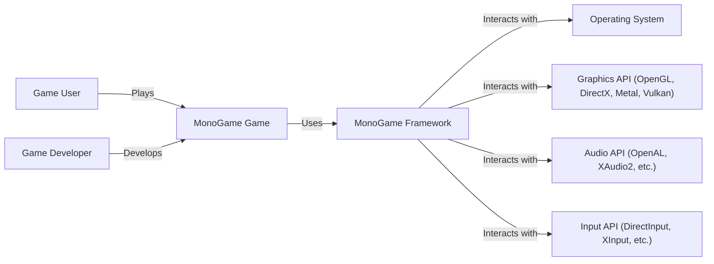
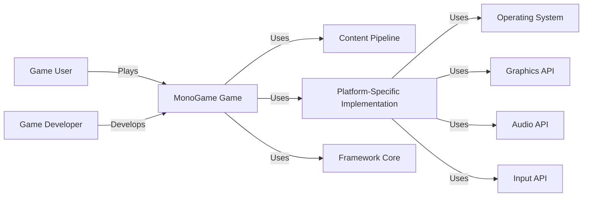
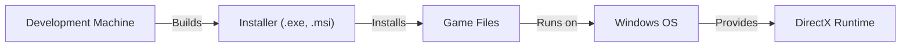
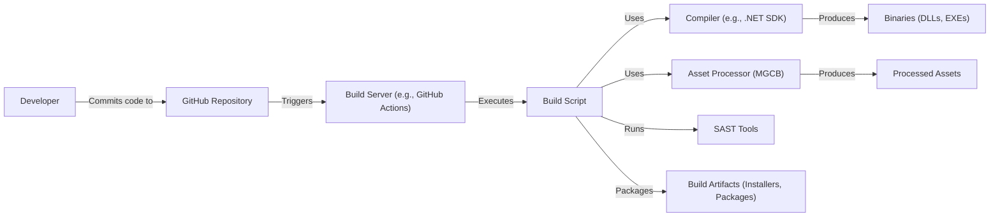

# BUSINESS POSTURE

Business Priorities and Goals:

*   Provide a cross-platform, open-source implementation of the Microsoft XNA 4 Framework.
*   Enable developers to create games for multiple platforms using a familiar and consistent API.
*   Maintain a vibrant and active community of developers and contributors.
*   Ensure the long-term sustainability and maintainability of the project.
*   Attract new developers and game studios to use MonoGame.
*   Facilitate the porting of existing XNA games to new platforms.

Business Risks:

*   Inconsistent implementation across platforms, leading to compatibility issues and developer frustration.
*   Security vulnerabilities that could be exploited in games built with MonoGame.
*   Lack of community engagement and contribution, leading to project stagnation.
*   Inability to keep up with advancements in game development technologies and platform requirements.
*   Competition from other game development frameworks and engines.
*   Legal challenges related to intellectual property or licensing.

# SECURITY POSTURE

Existing Security Controls:

*   security control: The project is open-source, allowing for community review and scrutiny of the codebase. (Described in: Project's GitHub repository)
*   security control: The project uses managed code (C#), which provides some inherent memory safety benefits. (Described in: Project's GitHub repository)
*   security control: The project appears to follow standard coding practices, although a formal secure coding guideline is not explicitly mentioned. (Described in: Project's GitHub repository)
*   accepted risk: The project does not appear to have a formal security vulnerability disclosure process.
*   accepted risk: The project does not have dedicated security personnel.
*   accepted risk: The project does not appear to undergo regular security audits or penetration testing.

Recommended Security Controls:

*   Implement a formal security vulnerability disclosure process.
*   Establish clear secure coding guidelines for contributors.
*   Integrate static analysis security testing (SAST) tools into the build process.
*   Consider dynamic analysis security testing (DAST) for platform-specific builds.
*   Perform regular security reviews of critical components.
*   Document security considerations for game developers using MonoGame.

Security Requirements:

*   Authentication:
    *   Not directly applicable to the framework itself, but guidance should be provided to developers on implementing secure authentication mechanisms in their games.
*   Authorization:
    *   Not directly applicable to the framework itself, but guidance should be provided to developers on implementing secure authorization mechanisms in their games.
*   Input Validation:
    *   The framework should provide mechanisms for validating user input to prevent common vulnerabilities like injection attacks.
    *   Guidance should be provided to developers on how to properly validate user input in their games.
*   Cryptography:
    *   The framework should provide secure implementations of cryptographic functions if used.
    *   Guidance should be provided to developers on using cryptography securely in their games, including key management best practices.

# DESIGN

## C4 CONTEXT

Element Descriptions:

*   Element:
    *   Name: Game User
    *   Type: Person
    *   Description: The end-user who plays the game created with MonoGame.
    *   Responsibilities: Interacts with the game.
    *   Security controls: N/A (External entity)

*   Element:
    *   Name: Game Developer
    *   Type: Person
    *   Description: The developer who creates games using the MonoGame framework.
    *   Responsibilities: Writes game code, manages assets, and builds the game for different platforms.
    *   Security controls: N/A (External entity)

*   Element:
    *   Name: MonoGame Game
    *   Type: Software System
    *   Description: A game built using the MonoGame framework.
    *   Responsibilities: Provides game logic, rendering, audio, and input handling.
    *   Security controls: Relies on MonoGame framework and developer-implemented security measures.

*   Element:
    *   Name: MonoGame Framework
    *   Type: Software System
    *   Description: The cross-platform game development framework.
    *   Responsibilities: Provides an API for game development, abstracting platform-specific details.
    *   Security controls: Open-source codebase, managed code (C#), standard coding practices.

*   Element:
    *   Name: Operating System
    *   Type: Software System
    *   Description: The underlying operating system (Windows, macOS, Linux, iOS, Android, etc.).
    *   Responsibilities: Provides system resources and services.
    *   Security controls: Relies on the OS's built-in security features.

*   Element:
    *   Name: Graphics API
    *   Type: Software System
    *   Description: The graphics API used for rendering (OpenGL, DirectX, Metal, Vulkan).
    *   Responsibilities: Handles low-level graphics rendering.
    *   Security controls: Relies on the API's and driver's security.

*   Element:
    *   Name: Audio API
    *   Type: Software System
    *   Description: The audio API used for sound playback and management (OpenAL, XAudio2, etc.).
    *   Responsibilities: Handles audio processing.
    *   Security controls: Relies on the API's security.

*   Element:
    *   Name: Input API
    *   Type: Software System
    *   Description: The input API used for handling user input (DirectInput, XInput, etc.).
    *   Responsibilities: Processes input from keyboard, mouse, gamepad, etc.
    *   Security controls: Relies on the API's security.

## C4 CONTAINER

Element Descriptions:

*   Element:
    *   Name: Game User
    *   Type: Person
    *   Description: The end-user who plays the game.
    *   Responsibilities: Interacts with the game.
    *   Security controls: N/A (External entity)

*   Element:
    *   Name: Game Developer
    *   Type: Person
    *   Description: The developer who creates games using the MonoGame framework.
    *   Responsibilities: Writes game code, manages assets, and builds the game for different platforms.
    *   Security controls: N/A (External entity)

*   Element:
    *   Name: MonoGame Game
    *   Type: Application
    *   Description: A game built using the MonoGame framework.
    *   Responsibilities: Provides game logic, rendering, audio, and input handling.
    *   Security controls: Relies on MonoGame framework and developer-implemented security measures.

*   Element:
    *   Name: Framework Core
    *   Type: Container
    *   Description: The core components of the MonoGame framework, providing platform-agnostic functionality.
    *   Responsibilities: Provides game loop, basic rendering, input handling, and other core features.
    *   Security controls: Managed code (C#), standard coding practices.

*   Element:
    *   Name: Platform-Specific Implementation
    *   Type: Container
    *   Description: The platform-specific code that interfaces with the underlying operating system and APIs.
    *   Responsibilities: Handles platform-specific rendering, audio, input, and other low-level tasks.
    *   Security controls: Relies on the security of the underlying OS and APIs.

*   Element:
    *   Name: Content Pipeline
    *   Type: Container
    *   Description: Processes and converts game assets (textures, models, sounds) into a format suitable for the target platform.
    *   Responsibilities: Loads, processes, and manages game assets.
    *   Security controls: Input validation for asset files, secure handling of asset data.

*   Element:
    *   Name: Operating System
    *   Type: Software System
    *   Description: The underlying operating system.
    *   Responsibilities: Provides system resources and services.
    *   Security controls: Relies on the OS's built-in security features.

*   Element:
    *   Name: Graphics API
    *   Type: Software System
    *   Description: The graphics API used for rendering.
    *   Responsibilities: Handles low-level graphics rendering.
    *   Security controls: Relies on the API's and driver's security.

*   Element:
    *   Name: Audio API
    *   Type: Software System
    *   Description: The audio API used for sound.
    *   Responsibilities: Handles audio processing.
    *   Security controls: Relies on the API's security.

*   Element:
    *   Name: Input API
    *   Type: Software System
    *   Description: The input API used for handling user input.
    *   Responsibilities: Processes input from various devices.
    *   Security controls: Relies on the API's security.

## DEPLOYMENT

Possible Deployment Solutions:

1.  Desktop (Windows, macOS, Linux): Standalone executable or installer.
2.  Mobile (iOS, Android): App packages (.ipa, .apk).
3.  Web (HTML5): WebAssembly build deployed to a web server.
4.  Consoles (Xbox, PlayStation, Switch): Platform-specific deployment processes.

Chosen Deployment Solution (Desktop - Windows):

Element Descriptions:

*   Element:
    *   Name: Development Machine
    *   Type: Infrastructure Node
    *   Description: The developer's computer used for building the game.
    *   Responsibilities: Compiles code, processes assets, creates the installer.
    *   Security controls: Developer machine security best practices.

*   Element:
    *   Name: Installer (.exe, .msi)
    *   Type: Software
    *   Description: The installer package for the game.
    *   Responsibilities: Installs the game files on the user's system.
    *   Security controls: Code signing, integrity checks.

*   Element:
    *   Name: Game Files
    *   Type: Software
    *   Description: The executable and data files for the game.
    *   Responsibilities: Runs the game.
    *   Security controls: Relies on MonoGame framework and developer-implemented security measures.

*   Element:
    *   Name: Windows OS
    *   Type: Operating System
    *   Description: The Windows operating system.
    *   Responsibilities: Provides system resources and services.
    *   Security controls: Windows security features.

*   Element:
    *   Name: DirectX Runtime
    *   Type: Software
    *   Description: The DirectX runtime libraries.
    *   Responsibilities: Provides graphics and multimedia functionality.
    *   Security controls: Relies on Microsoft's security updates.

## BUILD

Build Process Description:

1.  Developers commit code changes to the GitHub repository.
2.  A build server (e.g., GitHub Actions) is triggered by the commit.
3.  The build server executes a build script.
4.  The build script uses the .NET SDK compiler to build the MonoGame framework and game code.
5.  The build script uses the MonoGame Content Builder (MGCB) to process game assets.
6.  SAST tools are integrated into the build script to scan for potential security vulnerabilities.
7.  The compiler produces binaries (DLLs, EXEs).
8.  The asset processor produces processed assets.
9.  The build script packages the binaries and assets into build artifacts (installers, app packages, etc.).

Security Controls:

*   security control: Use of a build server (GitHub Actions) for automated builds.
*   security control: Integration of SAST tools into the build process.
*   security control: Use of a managed code compiler (.NET SDK) which provides some inherent security benefits.
*   security control: Version control (GitHub) for tracking code changes.

# RISK ASSESSMENT

Critical Business Processes:

*   Game development and deployment.
*   Community engagement and contribution.
*   Maintenance and updates of the framework.

Data to Protect:

*   Source code (Low sensitivity - Publicly available on GitHub).
*   Game assets (Variable sensitivity - Depends on the specific game).
*   User data (if collected by games built with MonoGame) (Variable sensitivity - Depends on the data collected).
*   Contributor information (Low sensitivity - Publicly available on GitHub).

# QUESTIONS & ASSUMPTIONS

Questions:

*   Are there any specific compliance requirements (e.g., GDPR, COPPA) that need to be considered for games built with MonoGame?
*   What is the expected level of security expertise of developers using MonoGame?
*   What are the most common target platforms for MonoGame games?
*   Are there any existing security audits or penetration test reports for MonoGame or related projects?
*   What level of support is provided for developers regarding security best practices?

Assumptions:

*   BUSINESS POSTURE: The primary goal is to provide a stable and functional game development framework. Security is a concern, but not the top priority.
*   SECURITY POSTURE: The project relies heavily on the security of the underlying operating systems and APIs. Developers using MonoGame are expected to have some basic security knowledge.
*   DESIGN: The design is modular and allows for platform-specific implementations. The content pipeline is a critical component for asset management.