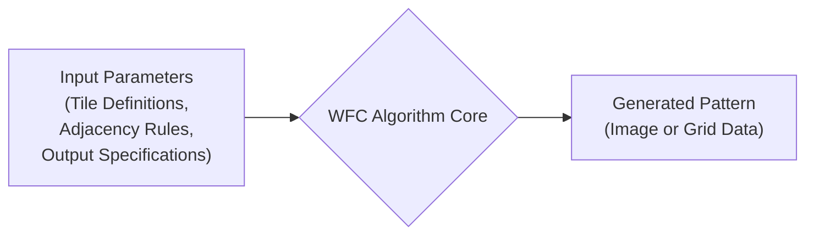
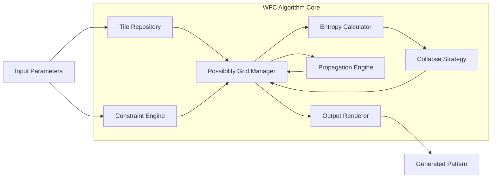

# Project Design Document: Wavefunction Collapse Implementation

**Version:** 1.1
**Date:** October 26, 2023
**Author:** AI Software Architect

## 1. Introduction

This document provides an enhanced design for the Wavefunction Collapse (WFC) algorithm implementation as found in the provided GitHub repository: [https://github.com/mxgmn/wavefunctioncollapse](https://github.com/mxgmn/wavefunctioncollapse). This revised document aims to provide a more detailed and precise description of the system's architecture, components, data flow, and key considerations, specifically tailored for effective threat modeling activities.

## 2. Goals and Objectives

*   Provide a clear and detailed description of the WFC implementation's architecture and components.
*   Precisely describe the data flow, including data types and transformations.
*   Clearly identify interaction points, trust boundaries, and external dependencies.
*   Offer sufficient technical detail to facilitate comprehensive threat modeling.
*   Document the technologies, libraries, and data formats involved.

## 3. System Overview

The system implements the Wavefunction Collapse algorithm as a single-process application. It takes a defined input, which includes tile definitions, adjacency constraints, and output specifications, and generates a pattern that adheres to these rules. The core of the algorithm involves iteratively reducing the possibilities (collapsing the wavefunction) for each cell in an output grid until a valid and consistent pattern is formed.

## 4. Architectural Design

The system operates as a self-contained application, primarily focused on the execution of the WFC algorithm.

### 4.1. High-Level Architecture

*   **Input Parameters:** This encompasses all the necessary information to drive the WFC process:
    *   **Tile Definitions:**  Representations of the individual building blocks (e.g., image data, metadata).
    *   **Adjacency Rules:**  Specifications defining which tiles can be placed next to each other in different directions. These are crucial constraints for the algorithm.
    *   **Output Specifications:**  Parameters defining the desired output, such as dimensions (width, height) and potentially starting conditions or specific tile placements.
*   **WFC Algorithm Core:** The central processing unit of the system. It orchestrates the steps of the WFC algorithm, including managing the grid of possibilities, selecting cells to collapse, and enforcing constraints. This component holds the core logic of the implementation.
*   **Generated Pattern:** The final result of the WFC process. This is typically an image composed of the input tiles or a data structure representing the arrangement of tiles in the output grid.

### 4.2. Low-Level Components

*   **Tile Repository:**  Manages the loading, storage, and retrieval of individual tile definitions. This might involve reading image files or data from configuration files.
*   **Constraint Engine:**  Responsible for interpreting and enforcing the adjacency rules provided as input. It determines valid tile placements based on neighboring tiles.
*   **Possibility Grid Manager:** Maintains the state of the output grid during the WFC process. Each cell in the grid initially holds a set of possible tiles. This component manages the updates to these possibilities as the algorithm progresses.
*   **Entropy Calculator:** Calculates the entropy (uncertainty) for each cell in the possibility grid. This is often used to determine the next cell to collapse, prioritizing cells with lower entropy.
*   **Collapse Strategy:** Implements the logic for selecting the next cell to collapse and the specific tile it will be collapsed to. This can involve different heuristics and random selection based on probabilities.
*   **Propagation Engine:**  After a cell is collapsed, this component updates the possibilities of its neighboring cells based on the newly placed tile and the defined constraints. This ensures consistency in the generated pattern.
*   **Output Renderer:**  Takes the final collapsed grid and generates the output, which could be an image file or a data representation of the tile arrangement.

## 5. Data Flow

The WFC process begins with the input parameters and proceeds through the following steps:

1. **Input Loading:** The **Tile Repository** loads tile definitions from specified sources (e.g., image files). The **Constraint Engine** parses and stores the adjacency rules.
2. **Grid Initialization:** The **Possibility Grid Manager** creates an empty output grid of the specified dimensions. Each cell is initialized with the set of all possible tiles.
3. **Entropy Calculation:** The **Entropy Calculator** determines the initial entropy for each cell in the grid.
4. **Collapse Selection:** The **Collapse Strategy** selects a cell to collapse based on its entropy or other criteria.
5. **Tile Assignment:** A specific tile is chosen for the selected cell, adhering to the constraints of its neighbors (if already collapsed).
6. **Constraint Propagation:** The **Propagation Engine** updates the possible tiles for the neighbors of the collapsed cell, removing tiles that violate the adjacency rules.
7. **Iteration:** Steps 4-6 are repeated until all cells in the grid have been collapsed to a single tile.
8. **Output Generation:** The **Output Renderer** takes the final grid state and generates the output pattern (e.g., an image where each cell corresponds to a tile).

## 6. Technology Stack and Dependencies

*   **Primary Programming Language:** C# (based on the linked repository).
*   **Core Libraries:**  Likely utilizes standard .NET libraries for file I/O, data structures (e.g., `List`, `Dictionary`), and potentially image manipulation (e.g., `System.Drawing`).
*   **Input Formats:**
    *   **Tile Definitions:** Typically image files (e.g., PNG, BMP). The specific format might be configurable.
    *   **Adjacency Rules:** Often defined in text-based formats like XML or JSON, specifying allowed neighbor relationships between tiles.
    *   **Output Specifications:** May be provided via command-line arguments or a configuration file, including dimensions and potentially output file format.
*   **Output Formats:**
    *   **Image Output:** Common image formats like PNG or BMP.
    *   **Data Output:** Potentially a text-based representation of the tile grid (e.g., a CSV file with tile indices).

## 7. Deployment Considerations

The WFC implementation is generally deployed as a standalone executable that can be run from the command line or integrated as a library into other applications.

*   **Standalone Application:** The user provides input parameters (tile sets, rules, output size) through command-line arguments or configuration files. The application processes the input and generates the output file.
*   **Integrated Library:** Other software can incorporate the WFC functionality by referencing the compiled library and calling its methods. This allows for programmatic generation of patterns within larger systems.

## 8. Security Considerations (Focused on Threat Modeling)

This section outlines potential security concerns and attack vectors relevant for threat modeling.

*   **Input Validation Vulnerabilities:**
    *   **Malicious Tile Sets:**  Crafted image files could contain embedded malicious code or trigger vulnerabilities in image processing libraries. Large or complex tile sets could lead to denial-of-service (DoS) through excessive resource consumption.
    *   **Invalid Adjacency Rules:**  Circular or overly complex rules could cause infinite loops or stack overflow errors during constraint propagation. Malicious rules could lead to unexpected or undesirable output.
    *   **Path Traversal:** If tile paths or output paths are taken directly from user input without proper sanitization, attackers could potentially read or write arbitrary files on the system.
    *   **Integer Overflow/Underflow:**  Parsing large output dimensions or tile counts from input could lead to integer overflow or underflow vulnerabilities, potentially causing crashes or unexpected behavior.
*   **Resource Exhaustion Attacks:**
    *   **Memory Exhaustion:**  Requesting extremely large output grids or processing a very large number of tiles could consume excessive memory, leading to application crashes or system instability.
    *   **CPU Exhaustion:**  Complex tile sets or intricate adjacency rules might result in computationally expensive constraint propagation, leading to CPU exhaustion and DoS.
*   **Code Vulnerabilities:**
    *   **Buffer Overflows:**  If the code doesn't properly handle the size of input data (e.g., tile data, rule definitions), buffer overflows could occur, potentially allowing for arbitrary code execution.
    *   **Injection Flaws:** If input data is used to construct commands or queries (though less likely in this specific application), injection vulnerabilities could arise.
    *   **Dependency Vulnerabilities:**  Vulnerabilities in any third-party libraries used for image processing or data parsing could be exploited.
*   **Output Integrity Issues:** While not a direct security threat, if the output generation process is flawed, it could lead to corrupted or unusable output, impacting the application's functionality.

## 9. Future Considerations

*   **Plugin Architecture:**  Designing the system to support plugins for different tile loaders, constraint solvers, or output renderers could enhance extensibility.
*   **Parallel Processing:** Implementing parallel processing for constraint propagation or entropy calculation could significantly improve performance for large grids.
*   **Advanced Constraint Types:** Exploring support for more complex constraint types beyond simple adjacency rules.
*   **GUI Interface:**  Developing a graphical user interface could make the application more user-friendly for non-technical users.

This enhanced design document provides a more detailed and security-focused overview of the Wavefunction Collapse implementation. The refined component descriptions, data flow details, and explicit enumeration of potential security considerations should provide a solid foundation for effective threat modeling activities.
