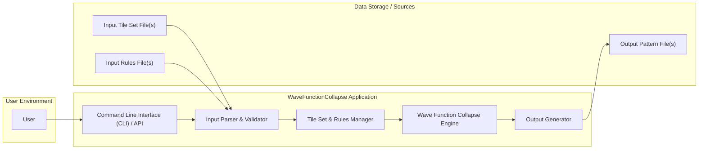
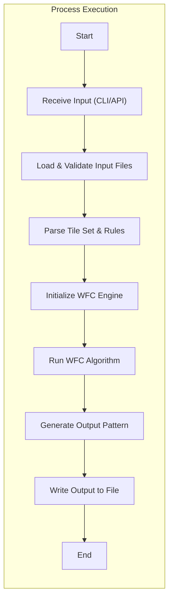

# Project Design Document: WaveFunctionCollapse Algorithm Implementation

**Version:** 1.1
**Date:** October 26, 2023
**Author:** AI Software Architect

## 1. Introduction

This document provides an enhanced design overview of the WaveFunctionCollapse (WFC) algorithm implementation found at [https://github.com/mxgmn/wavefunctioncollapse](https://github.com/mxgmn/wavefunctioncollapse). This revised document aims to offer a more detailed understanding of the system's architecture, components, and data flow, specifically tailored for effective threat modeling. The focus remains on the software architecture and its interactions, rather than the mathematical intricacies of the algorithm itself.

## 2. Project Goals

The primary goal of this project is to implement the WaveFunctionCollapse algorithm. Key objectives include:

- Generating coherent patterns based on a provided input sample.
- Supporting diverse tile sets and complex adjacency rules.
- Offering a modular and potentially extensible implementation for various use cases.

## 3. Scope

This design document encompasses the core software components and their interactions within the provided GitHub repository. It focuses on the logical architecture, data flow, and key interfaces of the application. It does not delve into the specific lines of C# code or the low-level implementation details of the WFC algorithm, except where they directly impact the architecture and potential security considerations.

## 4. High-Level Architecture

The application operates as a command-line tool or a library. It accepts input parameters and data, processes them using the WFC algorithm, and generates an output.

## 5. Detailed Component Design

This section provides a more detailed description of the key components, their responsibilities, and potential security considerations.

- **Command Line Interface (CLI) / API:**
    - **Responsibility:**  Provides the entry point for user interaction, either through command-line arguments or an Application Programming Interface (if exposed as a library).
    - **Security Considerations:**
        - **Argument Injection:**  Improper handling of command-line arguments could allow attackers to inject malicious commands.
        - **API Security:** If exposed as a library, proper access controls and input validation are necessary to prevent misuse.

- **Input Parser & Validator:**
    - **Responsibility:** Reads and interprets input parameters from the CLI/API and loads tile set and rule definitions from files. Crucially, it validates all input data.
    - **Security Considerations:**
        - **Path Traversal:**  Vulnerabilities in parsing file paths could allow access to arbitrary files on the system.
        - **Format String Bugs:** If input formats are not strictly controlled, format string vulnerabilities could be exploited.
        - **Deserialization Attacks:** If input files are deserialized, vulnerabilities in the deserialization process could lead to remote code execution.
        - **Denial of Service (DoS):**  Large or malformed input files could consume excessive memory or processing power.

- **Tile Set & Rules Manager:**
    - **Responsibility:**  Manages the internal representation of available tiles, their properties (e.g., visual representation, metadata), and the adjacency rules governing their placement.
    - **Security Considerations:**
        - **Data Integrity:**  Ensuring the integrity of tile set and rule data is crucial for predictable and secure operation. Tampered rules could lead to unexpected or malicious output.
        - **Resource Exhaustion:**  Extremely complex tile sets or rule sets could lead to excessive memory usage.

- **Wave Function Collapse Engine:**
    - **Responsibility:** Implements the core WFC algorithm logic. This involves maintaining the state of the collapsing wave function, selecting tiles based on constraints, and handling backtracking.
    - **Security Considerations:**
        - **Algorithmic Complexity Exploitation:**  Specifically crafted input rules or tile sets might exploit the algorithm's complexity, leading to performance degradation or DoS.
        - **Infinite Loops/Resource Exhaustion:**  Bugs in the algorithm's implementation could lead to infinite loops or excessive memory allocation.

- **Output Generator:**
    - **Responsibility:** Takes the generated pattern from the WFC engine and formats it into the desired output format (e.g., image file, data file).
    - **Security Considerations:**
        - **Output File Overwrite:**  Careless handling of output file paths could lead to unintentional overwriting of existing files.
        - **Path Traversal (Output):**  Vulnerabilities could allow writing the output to arbitrary locations on the file system.
        - **Injection Attacks (Output):** If the output format involves interpreting data (e.g., generating SVG), vulnerabilities could allow for injection of malicious content.

## 6. Data Flow

The following diagram illustrates the typical data flow within the application:

Detailed data flow description:

- **Initialization:**
    - The application starts execution.
    - The CLI/API component receives input parameters from the user.

- **Input Processing:**
    - The "Input Parser & Validator" loads and validates the specified input tile set and rules files.
    - The "Tile Set & Rules Manager" parses the validated data and creates internal representations of tiles and rules.

- **Core Algorithm Execution:**
    - The "Wave Function Collapse Engine" is initialized with the parsed tile set, rules, and desired output dimensions.
    - The core algorithm iteratively collapses the wave function, selecting and placing tiles based on the defined constraints.

- **Output Generation:**
    - Once the WFC algorithm completes, the resulting pattern is passed to the "Output Generator."
    - The "Output Generator" formats the pattern according to the desired output format.
    - The formatted output is written to the specified output file.

## 7. Data Handling

- **Input Data:**
    - **Tile Set Definition File(s):**  Likely in formats like XML, JSON, or a custom text-based format. Contains definitions of individual tiles, potentially including:
        - Tile identifier (name or ID)
        - Visual representation (e.g., file path to an image)
        - Metadata (optional properties)
    - **Adjacency Rules File(s):** Defines how tiles can connect, potentially specifying:
        - Allowed neighbor combinations for each tile and direction.
        - Weights or probabilities for different connections.
    - **Configuration Parameters (CLI/API):**
        - Input file paths for tile sets and rules.
        - Output file path and format.
        - Output dimensions (width, height).
        - Algorithm-specific parameters (e.g., number of iterations).

- **Processing Data:**
    - **Internal Tile Representation:** Data structures (e.g., objects, structs) representing individual tiles and their properties in memory.
    - **Adjacency Rule Representation:** Efficient data structures (e.g., graphs, matrices) to store and quickly query the allowed tile connections.
    - **Wave Function State:** A multi-dimensional array or grid representing the state of the collapsing pattern, storing the set of possible tiles for each cell.

- **Output Data:**
    - **Generated Pattern (In-Memory):** A representation of the final generated pattern, often as a grid of tile identifiers or references to tile objects.
    - **Output File(s):** The generated pattern written to a file, potentially in formats like:
        - Image formats (PNG, BMP, etc.) representing the visual output.
        - Data formats (CSV, JSON, etc.) representing the tile arrangement.

## 8. Deployment Considerations

The application is typically deployed as a standalone executable or as a library. Deployment involves:

- **Compilation:** Compiling the C# source code into an executable.
- **Distribution:** Distributing the executable along with any necessary configuration files, dependencies (e.g., .NET runtime), and potentially example input files.
- **Execution:**  Execution is primarily through the command line, providing the required input parameters. If deployed as a library, it would be integrated into another application's build process.

## 9. Security Considerations (Detailed)

This section expands on the initial security considerations, providing more specific examples of potential threats.

- **Input Validation Vulnerabilities:**
    - **Path Traversal:** An attacker could provide an input file path like `../../sensitive_data.txt` to the `--tileset` argument, potentially allowing the application to read sensitive files.
    - **Deserialization of Untrusted Data:** If the application uses deserialization (e.g., for JSON or XML input), providing a malicious payload could lead to remote code execution. For example, a crafted JSON file could instantiate arbitrary objects with harmful side effects.
    - **Buffer Overflow:**  If input parsing doesn't properly handle excessively long input strings (e.g., very long tile names), it could lead to buffer overflows and potentially arbitrary code execution.
    - **Integer Overflow:** Providing extremely large numbers for parameters like output dimensions could lead to integer overflows, potentially causing unexpected behavior or crashes.

- **File Handling Vulnerabilities:**
    - **Output File Overwrite:** If the application doesn't check for existing files before writing output, an attacker could trick a user into overwriting important data by providing a common file name as the output path.
    - **Path Traversal in Output:** An attacker could specify an output path like `/etc/cron.d/malicious_job` to potentially schedule malicious tasks on the system.
    - **Insecure Temporary File Handling:** If the application uses temporary files, failing to properly secure them could allow attackers to access or modify sensitive data.

- **Resource Management Vulnerabilities:**
    - **Algorithmic Complexity Exploitation:**  Crafting input rules that lead to a combinatorial explosion in the WFC algorithm could cause the application to consume excessive CPU and memory, leading to a denial of service.
    - **Memory Exhaustion:** Providing extremely large output dimensions could cause the application to allocate an excessive amount of memory, leading to crashes or system instability.

- **Dependency Vulnerabilities:**
    - If the application relies on external libraries (NuGet packages), vulnerabilities in those libraries could be exploited. Regularly updating dependencies and performing security audits is crucial.

- **Code Injection:**
    - If the application dynamically constructs and executes code based on user input (which is less likely in this specific project but a general concern), it could be vulnerable to code injection attacks.

## 10. Future Considerations

- **GUI Interface:** Introducing a GUI would require careful consideration of UI-specific security vulnerabilities, such as cross-site scripting (if web-based) or input validation issues in GUI components.
- **Network Capabilities:** If the application were to fetch resources over a network, security measures like TLS encryption, authentication, and authorization would become necessary. Vulnerabilities like man-in-the-middle attacks would need to be addressed.
- **Plugin System:**  A plugin system would introduce significant security challenges. Plugins would need to be sandboxed to prevent them from compromising the main application or the system. A robust mechanism for verifying the integrity and trustworthiness of plugins would be required.

This enhanced design document provides a more detailed and security-focused overview of the WaveFunctionCollapse algorithm implementation, serving as a strong foundation for comprehensive threat modeling activities.