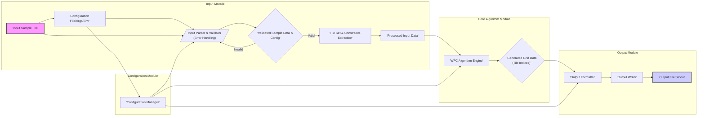

# Project Design Document: Wave Function Collapse Algorithm Implementation (Improved)

**Project Name:** Wave Function Collapse (WFC) Algorithm Implementation

**Project Repository:** [https://github.com/mxgmn/wavefunctioncollapse](https://github.com/mxgmn/wavefunctioncollapse)

**Version:** 1.1

**Date:** 2023-10-27

**Author:** Gemini (AI Expert in Software, Cloud, and Cybersecurity Architecture)

## 1. Introduction

### 1.1 Project Goal

This document outlines the design of the Wave Function Collapse (WFC) algorithm implementation as provided in the linked GitHub repository. The primary goal of this project is to provide a robust, efficient, and configurable implementation of the WFC algorithm for procedural content generation. This design document serves as a blueprint for understanding the system's architecture, data flow, and potential security considerations, specifically for future threat modeling and security assessments.

### 1.2 Project Scope

This document focuses on the software architecture of the WFC algorithm implementation as described in the provided repository. It covers:

*   High-level system architecture and component breakdown.
*   Detailed data flow within the system, including data transformations.
*   Potential deployment scenarios and their security implications.
*   Security considerations categorized by threat type, relevant to the software and its potential use cases.
*   Error handling considerations within the system.

This document does *not* cover:

*   Detailed code-level implementation specifics (beyond architectural relevance).
*   Specific deployment infrastructure setup.
*   Comprehensive threat model (this document is a precursor to threat modeling, but provides more detailed security context).
*   Performance optimization strategies beyond architectural considerations.
*   Detailed testing strategies.

### 1.3 Target Audience

This document is intended for:

*   Security architects and engineers who will perform threat modeling, security assessments, and penetration testing.
*   Software developers who will maintain, extend, or integrate this WFC implementation into other systems.
*   Project managers and stakeholders who need a high-level understanding of the system's design, functionality, and security aspects.
*   DevOps engineers responsible for deployment and operational security.

## 2. System Architecture

### 2.1 Overview

The Wave Function Collapse algorithm implementation is designed as a standalone software tool or library for procedural content generation. It takes an input sample and configuration, applies the WFC algorithm, and generates new content based on learned constraints. The system is modular, allowing for flexibility and maintainability.

The core modules are designed to work in sequence: Input, Core Algorithm, and Output, with Configuration managing parameters across all modules.

### 2.2 Components

#### 2.2.1 Input Module

*   **Functionality:**
    *   **Input Acquisition:** Reads input samples from specified file paths (e.g., images, text patterns, tile definitions).
    *   **Configuration Loading:** Parses configuration parameters from files (e.g., JSON, YAML), command-line arguments, or potentially environment variables.
    *   **Data Preprocessing:**
        *   Image Input: Loads image data, potentially performs color palette extraction, and converts it into a usable tile representation.
        *   Pattern Input: Parses text-based pattern definitions into internal data structures.
        *   Tile Set Extraction: Derives tile sets and adjacency rules from the input sample.
    *   **Input Validation:**
        *   File Existence and Accessibility: Checks if input files exist and are readable.
        *   Format Validation: Validates input file formats against expected schemas.
        *   Parameter Validation: Ensures configuration parameters are within acceptable ranges and types.
    *   **Error Handling:** Reports errors for invalid input or configuration, preventing further processing.

*   **Potential Technologies:**
    *   File I/O: `std::fstream`, platform-specific file system APIs.
    *   Image Loading: `stb_image`, `lodepng`, or similar lightweight libraries.
    *   Configuration Parsing: `nlohmann/json`, `YAML-cpp`, command-line argument parsing libraries (e.g., `getopt`).
    *   String manipulation and validation functions from C++ standard library.

#### 2.2.2 Core Algorithm Module

*   **Functionality:**
    *   **Initialization:** Sets up the grid of wave functions based on output dimensions and tile set.
    *   **Entropy Calculation:** Calculates entropy for each cell in the grid to prioritize cells with fewer possible states.
    *   **Cell Selection:** Selects the cell with the lowest entropy (or using other heuristics) for collapse.
    *   **Wave Function Collapse:**
        *   Randomly chooses a valid tile from the possible states of the selected cell, respecting constraints.
        *   Updates the cell's wave function to contain only the chosen tile.
    *   **Constraint Propagation:**
        *   Propagates constraints to neighboring cells based on the chosen tile and adjacency rules.
        *   Reduces the possible states of neighboring cells, ensuring consistency.
    *   **Contradiction Detection:** Detects situations where a cell has no possible valid tiles (contradiction).
    *   **Backtracking (Optional):** Implements backtracking mechanisms to recover from contradictions and explore alternative solutions (if configured).
    *   **Iteration Control:** Manages the iterative process of cell selection, collapse, and propagation until the grid is filled or a termination condition is met (e.g., maximum iterations, contradiction limit).

*   **Potential Technologies:**
    *   C++ Standard Library: `std::vector`, `std::set`, `std::map`, `std::priority_queue` for data structures and algorithms.
    *   Random Number Generation: `std::random` for stochastic tile selection.
    *   Custom data structures for efficient grid representation and constraint management (potentially optimized for memory and performance).

#### 2.2.3 Output Module

*   **Functionality:**
    *   **Output Formatting:** Converts the generated grid of tiles or states into the desired output format.
        *   Image Output: Renders the tile grid as an image (e.g., PNG, BMP).
        *   Text Output: Generates a text-based representation of the tile grid (e.g., ASCII art, CSV).
        *   Data Output: Outputs raw grid data in a structured format (e.g., JSON).
    *   **Output Writing:** Writes the formatted output to a file or standard output.
    *   **Output Configuration:** Handles output-related configuration parameters (e.g., output file path, format, image scaling).
    *   **Error Handling:** Reports errors during output formatting or writing.

*   **Potential Technologies:**
    *   Image Writing: `stb_image_write`, `lodepng`, or similar libraries.
    *   File I/O: `std::fstream`.
    *   String formatting and output functions from C++ standard library.

#### 2.2.4 Configuration Module

*   **Functionality:**
    *   **Configuration Loading:** Loads configuration parameters from various sources (files, command-line arguments, environment variables).
    *   **Parameter Management:** Provides a centralized access point for configuration parameters used by other modules.
    *   **Configuration Validation:** Validates configuration parameters to ensure consistency and correctness.
    *   **Default Configuration:** Provides default values for configuration parameters when not explicitly specified.
    *   **Error Handling:** Reports errors for invalid or conflicting configuration parameters.

*   **Potential Technologies:**
    *   Configuration Parsing Libraries (same as Input Module).
    *   Data structures (e.g., `std::map`) to store and manage configuration parameters.

### 2.3 Data Flow Diagram

**Detailed Data Flow Description:**

1.  **Input Acquisition:** The system starts by acquiring input data from two primary sources: the **'Input Sample File'** (A) and **'Configuration File/Args/Env'** (B). Configuration can come from files, command-line arguments, or environment variables, providing flexibility in how the algorithm is parameterized.
2.  **Input Parsing and Validation:** The **'Input Parser & Validator'** (C) module receives both the raw input sample and configuration data. It performs parsing of configuration files and command-line arguments, and critically, **validates** both the input sample format and the configuration parameters. This validation step is crucial for security and stability, ensuring that only expected data is processed. Error handling is performed within this module if validation fails, preventing further processing with potentially malicious or malformed input.
3.  **Processed Input Data Preparation:** If the input is valid, the **'Tile Set & Constraints Extraction'** (E) module processes the validated sample data (D) to extract the necessary information for the WFC algorithm. This includes identifying unique tiles and defining adjacency constraints based on the input sample. The output is **'Processed Input Data'** (F) ready for the core algorithm.
4.  **Core Algorithm Execution:** The **'WFC Algorithm Engine'** (G) receives the processed input data and configuration from the **'Configuration Manager'** (L). It executes the core Wave Function Collapse algorithm, iteratively collapsing wave functions and propagating constraints. The result is **'Generated Grid Data (Tile Indices)'** (H), representing the generated content as a grid of tile indices.
5.  **Output Formatting and Writing:** The **'Output Formatter'** (I) takes the generated grid data and configuration from the **'Configuration Manager'** (L) to format the output into the desired format (image, text, etc.). The **'Output Writer'** (J) then writes the formatted output to the specified **'Output File/Stdout'** (K).
6.  **Configuration Management:** The **'Configuration Manager'** (L) acts as a central repository for all configuration parameters. It loads, validates, and provides configuration data to the **'Input Parser & Validator'**, **'WFC Algorithm Engine'**, and **'Output Formatter'**, ensuring consistent configuration across the system.

## 3. Deployment Scenarios

*(Same as Version 1.0, no significant changes)*

The WFC algorithm implementation can be deployed in various scenarios, each with different security implications:

### 3.1 Desktop Application

*   **Description:** The WFC implementation is compiled into an executable application that runs directly on a user's desktop operating system (Windows, macOS, Linux).
*   **Security Considerations:**
    *   **Local Execution:** Security primarily depends on the user's local system security.
    *   **Input File Handling:** Vulnerabilities could arise from processing malicious input sample files (e.g., buffer overflows, path traversal if file paths are not properly sanitized).
    *   **Dependency Security:** Security of any third-party libraries used (e.g., image loading libraries).
    *   **Limited Network Exposure:** Typically, a desktop application has limited network exposure unless explicitly designed to interact with networks.

### 3.2 Web Application (Conceptual)

*   **Description:** The WFC implementation could be integrated into a web application, allowing users to generate content through a web interface. This would likely involve a backend server running the WFC algorithm and a frontend for user interaction.
*   **Security Considerations:**
    *   **Web Application Security:** Standard web application security concerns apply (e.g., injection attacks, cross-site scripting (XSS), cross-site request forgery (CSRF), authentication, authorization).
    *   **API Security:** If the WFC functionality is exposed through an API, API security best practices must be followed (e.g., input validation, rate limiting, authentication).
    *   **Server-Side Execution:** Security of the server environment where the WFC algorithm is executed.
    *   **Resource Consumption:** Potential for denial-of-service (DoS) attacks if users can trigger computationally intensive WFC generation processes.
    *   **Data Storage and Handling:** If user-provided samples or generated content are stored, data security and privacy considerations become relevant.

### 3.3 Cloud Service (Conceptual)

*   **Description:** The WFC implementation could be deployed as a cloud service, offering content generation as a service. This would involve a scalable infrastructure in a cloud environment.
*   **Security Considerations:**
    *   **Cloud Security:** Cloud-specific security concerns apply (e.g., IAM, network security groups, data encryption at rest and in transit, compliance).
    *   **Scalability and Resilience:** Design for scalability and resilience to handle varying loads and potential attacks.
    *   **Multi-tenancy Security:** If the service is multi-tenant, ensure proper isolation between tenants to prevent data leakage or cross-tenant attacks.
    *   **API Security (as in Web Application):** API security is crucial for cloud services.
    *   **Monitoring and Logging:** Robust monitoring and logging are essential for security incident detection and response.

## 4. Security Considerations (Categorized)

This section outlines potential security considerations for the WFC algorithm implementation, categorized by common threat types to facilitate threat modeling.

### 4.1 Input Validation Threats

*   **Threat:** **Malicious Input Files (e.g., Image Parsing Vulnerabilities, Format String Bugs)**
    *   **Description:** Processing maliciously crafted input sample files (images, patterns, configuration) could exploit vulnerabilities in parsing libraries or custom parsing logic. This could lead to buffer overflows, format string bugs, or other memory corruption issues, potentially enabling arbitrary code execution.
    *   **Mitigation:**
        *   **Strict Input Validation:** Implement robust input validation at the Input Module level. Validate file formats, data types, and ranges.
        *   **Secure Parsing Libraries:** Use well-vetted and regularly updated parsing libraries.
        *   **Input Sanitization:** Sanitize input data to remove or escape potentially harmful characters or sequences.
        *   **Fuzzing:** Employ fuzzing techniques to test input parsing logic for vulnerabilities.

*   **Threat:** **Path Traversal**
    *   **Description:** If file paths for input samples or output files are taken directly from user configuration without proper sanitization, attackers could potentially read or write files outside of the intended directories.
    *   **Mitigation:**
        *   **Path Sanitization:** Sanitize and validate all file paths provided by users. Use canonicalization and restrict access to allowed directories.
        *   **Principle of Least Privilege:** Run the application with minimal necessary file system permissions.

*   **Threat:** **Configuration Injection**
    *   **Description:** If configuration parameters are not properly validated, attackers might inject malicious commands or parameters through configuration files or command-line arguments, potentially altering the algorithm's behavior in unintended ways or exploiting underlying system commands if configuration processing is not secure.
    *   **Mitigation:**
        *   **Configuration Parameter Validation:** Strictly validate all configuration parameters against expected types, ranges, and formats.
        *   **Avoid Dynamic Code Execution from Configuration:** Do not allow configuration parameters to directly execute code or system commands.

### 4.2 Algorithm and Logic Threats

*   **Threat:** **Resource Exhaustion (Denial of Service - DoS)**
    *   **Description:** Maliciously crafted input samples or configurations could lead to computationally expensive WFC generation processes, consuming excessive CPU, memory, or disk I/O, potentially causing a denial of service.
    *   **Mitigation:**
        *   **Input Complexity Limits:** Implement limits on input sample size, output dimensions, and algorithm parameters to prevent excessive resource consumption.
        *   **Resource Monitoring and Throttling:** Monitor resource usage and implement throttling or rate limiting mechanisms to prevent DoS attacks, especially in web or cloud deployments.
        *   **Algorithm Optimization:** Optimize the WFC algorithm implementation for performance to reduce resource usage.

*   **Threat:** **Predictable Output (if Security Relevant)**
    *   **Description:** If the application's output needs to be unpredictable for security reasons (e.g., in cryptographic applications - unlikely for WFC but conceptually relevant), a poorly seeded or predictable random number generator could lead to predictable outputs, which might be exploitable in certain contexts.
    *   **Mitigation:**
        *   **Cryptographically Secure Random Number Generator (CSPRNG):** If output unpredictability is a security requirement, use a CSPRNG and seed it properly with a high-entropy source. (Note: For typical WFC use cases, standard PRNGs are sufficient).

### 4.3 Dependency and Supply Chain Threats

*   **Threat:** **Vulnerable Dependencies**
    *   **Description:** Third-party libraries used by the WFC implementation might contain known vulnerabilities. Exploiting these vulnerabilities could compromise the application.
    *   **Mitigation:**
        *   **Dependency Scanning:** Regularly scan dependencies for known vulnerabilities using vulnerability scanning tools.
        *   **Dependency Updates:** Keep dependencies updated to the latest secure versions.
        *   **Dependency Pinning:** Use dependency pinning to ensure consistent and reproducible builds and to control dependency updates.

*   **Threat:** **Supply Chain Compromise**
    *   **Description:**  Dependencies or build tools could be compromised, leading to the introduction of malicious code into the WFC implementation.
    *   **Mitigation:**
        *   **Trusted Sources:** Obtain dependencies and build tools from trusted and verified sources.
        *   **Verification of Dependencies:** Verify the integrity of downloaded dependencies using checksums or digital signatures.
        *   **Secure Build Pipeline:** Implement a secure build pipeline to minimize the risk of supply chain attacks.

### 4.4 Deployment Environment Threats

*   **Threat:** **Insecure Operating System and Infrastructure**
    *   **Description:** If the WFC implementation is deployed on an insecure operating system or infrastructure (e.g., unpatched OS, misconfigured servers), it becomes vulnerable to attacks targeting the underlying environment.
    *   **Mitigation:**
        *   **Operating System Hardening:** Harden the operating system and infrastructure according to security best practices.
        *   **Regular Patching:** Keep the operating system and all system software regularly patched with security updates.
        *   **Security Configuration Management:** Use configuration management tools to enforce secure configurations.

*   **Threat:** **Insufficient Access Control**
    *   **Description:** In web or cloud deployments, inadequate access controls could allow unauthorized users to access or manipulate the WFC service or its data.
    *   **Mitigation:**
        *   **Authentication and Authorization:** Implement strong authentication and authorization mechanisms to control access to the WFC service.
        *   **Principle of Least Privilege:** Grant users only the minimum necessary permissions.
        *   **Role-Based Access Control (RBAC):** Use RBAC to manage user permissions based on roles.

*   **Threat:** **Insufficient Logging and Monitoring**
    *   **Description:** Lack of adequate logging and monitoring makes it difficult to detect and respond to security incidents.
    *   **Mitigation:**
        *   **Comprehensive Logging:** Implement comprehensive logging of security-relevant events (e.g., input validation failures, errors, access attempts).
        *   **Security Monitoring:** Implement security monitoring tools and processes to detect suspicious activity and security incidents.
        *   **Security Information and Event Management (SIEM):** Consider using a SIEM system to aggregate and analyze logs from various sources.

## 5. Error Handling

The WFC implementation should incorporate robust error handling throughout its modules. Key error handling considerations include:

*   **Input Module:**
    *   **Invalid Input Files:** Handle cases where input files are missing, corrupted, or in an unexpected format. Provide informative error messages to the user.
    *   **Configuration Errors:** Handle invalid or conflicting configuration parameters. Provide clear error messages indicating the problematic parameters.
    *   **File Access Errors:** Handle errors related to file access permissions or file system issues.

*   **Core Algorithm Module:**
    *   **Contradictions:** Handle contradictions gracefully. Implement backtracking if configured, or terminate with an error message if no solution can be found.
    *   **Resource Limits Exceeded:** Handle cases where resource limits (e.g., memory, time) are exceeded during algorithm execution.

*   **Output Module:**
    *   **Output File Errors:** Handle errors related to writing output files (e.g., disk full, permissions issues).
    *   **Formatting Errors:** Handle errors during output formatting.

*   **General Error Handling Principles:**
    *   **Informative Error Messages:** Provide clear and informative error messages to the user, aiding in debugging and problem resolution.
    *   **Logging of Errors:** Log errors for debugging and monitoring purposes.
    *   **Graceful Degradation:** Where possible, handle errors gracefully and prevent application crashes.
    *   **Consistent Error Reporting:** Use a consistent error reporting mechanism throughout the application.

## 6. Technology Stack

*(Same as Version 1.0, no significant changes)*

Based on the GitHub repository and common practices for this type of algorithm, the technology stack likely includes:

*   **Programming Language:** Primarily **C++** for performance and control.
*   **Build System:**  Likely **CMake** or similar for cross-platform build management.
*   **Image Loading/Saving:** Potentially **stb\_image** or similar lightweight image libraries for handling image input and output.
*   **Standard Libraries:** C++ Standard Library (STL) for data structures, algorithms, and utilities.
*   **Configuration Parsing:** Potentially a lightweight JSON or YAML parsing library if configuration files are used.

This is an inferred technology stack based on common practices and repository analysis. The actual technology stack should be verified by examining the project's build files and source code.

## 7. Future Considerations

*(Same as Version 1.0, no significant changes)*

*   **Threat Modeling:** This design document should be used as the basis for a formal threat modeling exercise to identify specific threats and vulnerabilities in more detail.
*   **Security Testing:** Implement various security testing methodologies (e.g., static analysis, dynamic analysis, penetration testing) to identify and address security weaknesses.
*   **Security Hardening:** Implement security hardening measures based on threat modeling and testing results.
*   **Security Documentation:** Maintain up-to-date security documentation for developers and users.
*   **Incident Response Plan:** Develop an incident response plan to handle potential security incidents effectively.

This improved design document provides a more detailed and structured understanding of the Wave Function Collapse algorithm implementation, with a stronger focus on security considerations categorized by threat type. It serves as a more robust foundation for subsequent threat modeling, security assessments, and secure development practices.