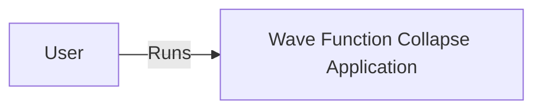
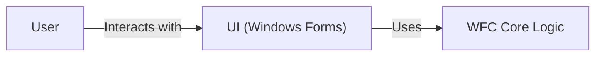
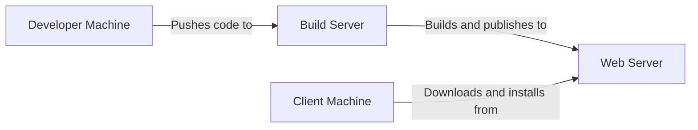
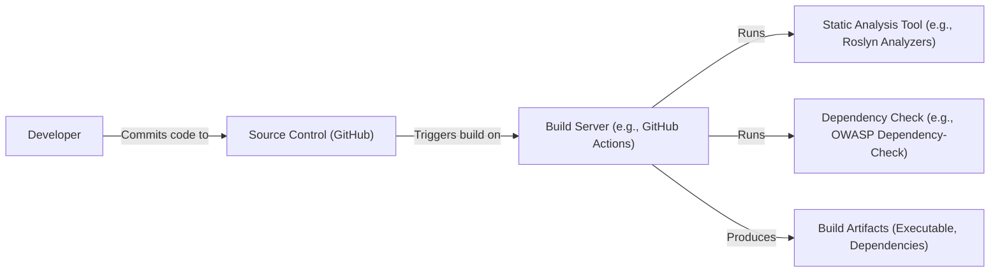

Okay, let's create a design document for the Wave Function Collapse project.

# BUSINESS POSTURE

Business Priorities and Goals:

*   Demonstrate the Wave Function Collapse (WFC) algorithm in a visually appealing and interactive way.
*   Provide a clear and understandable implementation of the WFC algorithm for educational purposes.
*   Offer a flexible and extensible codebase for experimentation and further development of WFC-related projects.
*   Showcase the developer's skills in software development and algorithm implementation.

Business Risks:

*   The project is primarily for demonstration and educational purposes, so the primary business risk is reputational. If the project is poorly implemented, buggy, or insecure, it could reflect negatively on the developer.
*   Since it's a public, open-source project, there's a minor risk of misuse, such as someone incorporating the code into a commercial product without proper attribution or licensing (though the MIT license is permissive).
*   Lack of ongoing maintenance could lead to the project becoming outdated and incompatible with newer technologies, diminishing its educational value over time.
*   Security vulnerabilities, while not a direct financial risk, could be exploited if the project were to be used in a more sensitive context than intended.

# SECURITY POSTURE

Existing Security Controls:

*   security control: The project uses the MIT License, which provides some legal protection and clarifies usage terms. (LICENSE file)
*   security control: The project is written in C#, which is a memory-safe language, reducing the risk of common memory-related vulnerabilities like buffer overflows. (Project files)
*   security control: The project appears to use a well-defined structure, separating concerns into different classes and modules, which can improve maintainability and reduce the likelihood of introducing vulnerabilities. (Project files)

Accepted Risks:

*   accepted risk: The project is a standalone desktop application, and as such, it does not expose any network services directly. This limits the attack surface considerably.
*   accepted risk: The project does not handle any sensitive user data. It primarily deals with generating patterns based on predefined rules.
*   accepted risk: The project does not implement any specific security measures beyond the inherent safety of the C# language and the .NET framework.
*   accepted risk: The project does not include any form of authentication or authorization, as it is not required for its intended use case.

Recommended Security Controls:

*   security control: Integrate static analysis tools (e.g., Roslyn analyzers, SonarQube) into the development workflow to identify potential code quality and security issues early on.
*   security control: Consider using a dependency analysis tool to check for known vulnerabilities in any third-party libraries used by the project.
*   security control: If the project is extended to load external configuration or input files, implement robust input validation and sanitization to prevent potential injection attacks.

Security Requirements:

*   Authentication: Not applicable for the current scope of the project.
*   Authorization: Not applicable for the current scope of the project.
*   Input Validation:
    *   If the project accepts any form of user input (e.g., configuration files, parameters), ensure that all input is validated against expected types, ranges, and formats.
    *   Implement appropriate error handling for invalid input.
*   Cryptography: Not applicable for the current scope of the project. If future features involve storing or transmitting sensitive data, appropriate cryptographic measures should be implemented.

# DESIGN

## C4 CONTEXT

Element Description:

*   Element:
    *   Name: User
    *   Type: Person
    *   Description: A person who interacts with the Wave Function Collapse application.
    *   Responsibilities: Runs the application, provides input (if any), and views the generated output.
    *   Security controls: None.

*   Element:
    *   Name: Wave Function Collapse Application
    *   Type: Software System
    *   Description: The desktop application that implements the Wave Function Collapse algorithm.
    *   Responsibilities: Executes the WFC algorithm, generates patterns, and displays the output to the user.
    *   Security controls: Relies on the inherent security of the C# language and .NET framework.

## C4 CONTAINER

Element Description:

*   Element:
    *   Name: User
    *   Type: Person
    *   Description: A person who interacts with the Wave Function Collapse application.
    *   Responsibilities: Runs the application, provides input (if any), and views the generated output.
    *   Security controls: None.

*   Element:
    *   Name: UI (Windows Forms)
    *   Type: Container: Windows Forms Application
    *   Description: The user interface of the application, built using Windows Forms.
    *   Responsibilities: Handles user interaction, displays the generated patterns, and communicates with the core logic.
    *   Security controls: Relies on the inherent security of Windows Forms and .NET framework. Input validation for any user-provided parameters.

*   Element:
    *   Name: WFC Core Logic
    *   Type: Container: .NET Class Library
    *   Description: Contains the core implementation of the Wave Function Collapse algorithm.
    *   Responsibilities: Executes the WFC algorithm, generates patterns based on input rules, and provides the results to the UI.
    *   Security controls: Relies on the inherent security of the C# language and .NET framework.

## DEPLOYMENT

Possible deployment solutions:

1.  Manual Copying: The simplest approach is to manually copy the compiled executable and any required dependencies to the target machine.
2.  ClickOnce Deployment: Windows Forms applications can be deployed using ClickOnce, which provides automatic updates and simplifies the installation process.
3.  Installer Package (MSI): Create an installer package using tools like Windows Installer XML (WiX) for a more traditional installation experience.

Chosen solution (ClickOnce Deployment):

Element Description:

*   Element:
    *   Name: Developer Machine
    *   Type: Infrastructure Node: Desktop Computer
    *   Description: The machine used by the developer to write and test the code.
    *   Responsibilities: Code development, testing, and pushing to the build server.
    *   Security controls: Standard development environment security practices (e.g., strong passwords, up-to-date antivirus).

*   Element:
    *   Name: Build Server
    *   Type: Infrastructure Node: Server
    *   Description: A server that automatically builds the application and creates the ClickOnce deployment package. Could be a service like Azure DevOps or a local Jenkins instance.
    *   Responsibilities: Building the application, running tests, creating the deployment package.
    *   Security controls: Secure access controls, regular security updates, code signing of the deployment package.

*   Element:
    *   Name: Web Server
    *   Type: Infrastructure Node: Server
    *   Description: A web server that hosts the ClickOnce deployment files.
    *   Responsibilities: Serving the deployment files to client machines.
    *   Security controls: Standard web server security practices (e.g., HTTPS, firewall, regular security updates).

*   Element:
    *   Name: Client Machine
    *   Type: Infrastructure Node: Desktop Computer
    *   Description: The machine where the application will be installed and run.
    *   Responsibilities: Downloading and installing the application from the web server, running the application.
    *   Security controls: Standard desktop security practices (e.g., strong passwords, up-to-date antivirus, firewall).

## BUILD

Build Process Description:

1.  Developer commits code changes to the GitHub repository.
2.  A build server (e.g., GitHub Actions, Azure DevOps) is triggered by the commit.
3.  The build server checks out the code from the repository.
4.  Static analysis tools (e.g., Roslyn analyzers) are run to identify code quality and potential security issues.
5.  Dependency analysis tools (e.g., OWASP Dependency-Check) are run to check for known vulnerabilities in third-party libraries.
6.  The build server compiles the code and produces the build artifacts (executable, dependencies).
7.  If any of the checks fail, the build is marked as failed, and the developer is notified.
8.  If all checks pass, the build is marked as successful, and the artifacts are ready for deployment.

Security Controls:

*   security control: Use of a build server (GitHub Actions) automates the build process and ensures consistency.
*   security control: Integration of static analysis tools (Roslyn analyzers) helps identify potential code quality and security issues early in the development lifecycle.
*   security control: Integration of dependency analysis tools (OWASP Dependency-Check) helps identify known vulnerabilities in third-party libraries.
*   security control: The build process can be configured to require code reviews and approvals before merging changes into the main branch.

# RISK ASSESSMENT

Critical Business Processes:

*   The primary business process is the demonstration of the WFC algorithm. The application must function correctly and produce visually appealing results.

Data Protection:

*   Data Sensitivity: The application does not handle any sensitive user data. The primary data involved are the input rules and the generated patterns, which are not considered sensitive.
*   Data to Protect: The source code and any configuration files should be protected from unauthorized modification.

# QUESTIONS & ASSUMPTIONS

Questions:

*   Are there any specific performance requirements for the application?
*   Are there any plans to extend the application with features that might handle user data or require network communication?
*   Is there a preferred deployment method or target environment?
*   Are there any specific coding standards or guidelines that should be followed?

Assumptions:

*   BUSINESS POSTURE: The project is primarily for demonstration and educational purposes.
*   SECURITY POSTURE: No sensitive data is handled by the application.
*   DESIGN: The application is a standalone desktop application with no network dependencies. The user interface is built using Windows Forms. The core logic is implemented in C#.