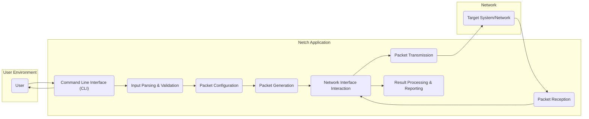
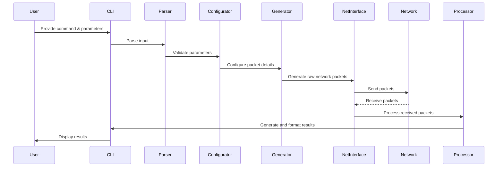

# Project Design Document: Netch Network Testing Tool

**Version:** 1.1
**Date:** October 26, 2023
**Author:** Gemini (AI Language Model)

## 1. Introduction

This document provides a detailed design overview of the `netch` network testing tool, as found in the GitHub repository [https://github.com/netchx/netch](https://github.com/netchx/netch). This document aims to clearly articulate the system's architecture, components, and data flow to facilitate subsequent threat modeling activities. The focus is on providing the necessary information to understand the system's boundaries, interactions, and potential attack surfaces.

## 2. Goals

The primary goals of this design document are to:

*   Provide a clear and comprehensive understanding of the `netch` tool's architecture and functionality.
*   Identify and describe the key components of the system and their interactions.
*   Illustrate the flow of data within the system, highlighting critical data pathways.
*   Serve as a well-defined foundation for identifying potential security threats, vulnerabilities, and attack vectors during subsequent threat modeling exercises.

## 3. High-Level Architecture

The `netch` tool functions as a command-line interface (CLI) application, enabling users to craft, send, and receive custom network packets. The core functionality involves user input processing, packet construction, network interaction, and result reporting.

## 4. Component Details

This section provides a detailed breakdown of the individual components within the `netch` application, outlining their specific responsibilities, inputs, and outputs.

### 4.1. User

*   **Description:** The external entity interacting with the `netch` tool to initiate and manage network tests.
*   **Responsibilities:**
    *   Provides commands and arguments to configure network tests (e.g., target IP address, port, protocol, payload, packet options).
    *   Initiates the execution of network testing operations.
    *   Receives and interprets the output and results of the executed tests.

### 4.2. Command Line Interface (CLI)

*   **Description:** The primary interface through which the user interacts with the `netch` application.
*   **Responsibilities:**
    *   Receives textual commands and arguments from the user.
    *   Passes the received input to the Input Parsing & Validation component.
    *   Receives processed results from the Result Processing & Reporting component and presents them to the user.

### 4.3. Input Parsing & Validation

*   **Description:** Responsible for interpreting and validating the user-provided commands and arguments.
*   **Responsibilities:**
    *   Parses the command-line input to extract parameters and options.
    *   Validates the syntax and semantics of the provided parameters (e.g., ensuring IP addresses are in the correct format, port numbers are within valid ranges, protocol types are supported).
    *   Handles invalid or malformed input by providing informative error messages to the user.

### 4.4. Packet Configuration

*   **Description:**  This component translates the validated user input into a structured representation of the network packet to be generated.
*   **Responsibilities:**
    *   Sets the values for various packet headers based on user specifications (e.g., source and destination IP addresses, source and destination ports, protocol type, flags).
    *   Defines the payload content of the packet, potentially allowing for custom data injection.
    *   Determines packet options and flags based on the selected protocol and user input.

### 4.5. Packet Generation

*   **Description:**  The core component responsible for constructing the raw network packets based on the configuration.
*   **Responsibilities:**
    *   Assembles the network packet headers and payload into the correct binary format according to the specified protocol.
    *   May implement features like packet fragmentation or manipulation of specific header fields.
    *   Prepares the packet for transmission by the Network Interface Interaction component.

### 4.6. Network Interface Interaction

*   **Description:**  Handles the low-level interaction with the operating system's network interfaces for sending and receiving packets.
*   **Responsibilities:**
    *   Selects the appropriate network interface to use for sending packets, potentially based on user configuration or system defaults.
    *   Utilizes system calls or networking libraries to transmit the raw, generated packets over the network.
    *   Captures incoming network packets from the designated network interface.
    *   Filters received packets based on criteria relevant to the initiated test.

### 4.7. Packet Transmission

*   **Description:** The process of physically sending the generated network packets onto the network.
*   **Responsibilities:**
    *   Transmits the configured packets through the selected network interface.
    *   May involve handling network-level details such as ARP resolution or routing.
    *   Potentially implements rate limiting or other traffic shaping mechanisms if configured.

### 4.8. Packet Reception

*   **Description:** The process of capturing and receiving network packets arriving at the system.
*   **Responsibilities:**
    *   Listens on the network interface for incoming network traffic.
    *   Identifies and captures packets relevant to the ongoing test, potentially based on source/destination addresses, ports, or protocol.

### 4.9. Result Processing & Reporting

*   **Description:** Analyzes the received packets and generates meaningful output and reports for the user.
*   **Responsibilities:**
    *   Parses the received packets to extract relevant information (e.g., response codes, latency, data content).
    *   Calculates metrics such as packet loss, round-trip time, or throughput.
    *   Formats the results into a human-readable format for display to the user through the CLI.
    *   May provide options for saving or exporting the test results.

## 5. Data Flow

This section illustrates the typical flow of data within the `netch` application during a network testing operation.

**Detailed Data Flow Steps:**

*   **User Input:** The user provides commands and configuration parameters to the `netch` tool via the CLI.
*   **Command Parsing and Validation:** The CLI component receives the input and passes it to the Input Parsing & Validation component for processing. This stage ensures the input is syntactically and semantically correct.
*   **Packet Configuration:** Based on the validated input, the Packet Configuration component determines the structure and content of the network packets to be sent, including headers and payload.
*   **Packet Generation:** The Packet Generation component constructs the raw network packets in the appropriate binary format based on the configuration.
*   **Network Interface Interaction (Transmission):** The Network Interface Interaction component utilizes the operating system's networking capabilities to send the generated packets through the selected network interface.
*   **Network Transmission:** The packets are transmitted over the network to the specified target system or network.
*   **Network Reception:** The `netch` application listens for and receives packets from the network interface.
*   **Network Interface Interaction (Reception):** The Network Interface Interaction component captures incoming packets.
*   **Result Processing & Reporting:** The Result Processing & Reporting component analyzes the received packets, calculates relevant metrics, and formats the results for presentation.
*   **Output to User:** The CLI component displays the processed results to the user.

## 6. Security Considerations (Focus for Threat Modeling)

This section highlights key security considerations relevant for threat modeling. These areas represent potential vulnerabilities and attack surfaces within the `netch` application.

*   **Input Validation Vulnerabilities:** Insufficient or improper validation of user-supplied input could lead to various attacks, including:
    *   Command injection: Malicious commands embedded within input parameters.
    *   Buffer overflows: Providing overly long input strings that exceed buffer limits.
    *   Format string vulnerabilities: Exploiting format string specifiers in user-controlled input.
*   **Privilege Escalation:** The tool likely requires elevated privileges to interact with raw sockets. Mismanagement of these privileges could allow unauthorized actions.
*   **Network Interface Exploitation:** Improper handling of network interface interactions could potentially lead to:
    *   Denial-of-service (DoS) attacks by flooding the network.
    *   Spoofing attacks by forging source IP addresses or MAC addresses.
    *   Information leakage by inadvertently capturing or exposing sensitive network traffic.
*   **Data Handling and Storage:** If the tool stores or logs test results or configurations, vulnerabilities in data handling could lead to:
    *   Information disclosure if data is not properly secured.
    *   Tampering with test results.
*   **Dependency Vulnerabilities:**  The security of external libraries and dependencies is critical. Outdated or vulnerable dependencies could introduce security flaws.
*   **Error Handling and Information Disclosure:** Verbose or insecure error messages could reveal sensitive information about the system's internal workings.
*   **Man-in-the-Middle (MITM) Attacks:** If `netch` communicates with external resources or if test scenarios involve network communication, it could be susceptible to MITM attacks if communication is not properly secured.

## 7. Deployment Considerations

The `netch` tool is intended to be deployed as a command-line application, likely requiring specific permissions and dependencies.

*   **Operating System Compatibility:**  Consider the target operating systems (e.g., Linux, macOS, Windows) and ensure compatibility.
*   **Required Permissions:**  Document the necessary permissions (e.g., `CAP_NET_RAW` on Linux, administrator privileges on Windows) required to run the tool effectively, especially for raw socket operations.
*   **Dependency Management:**  Clearly define and document any required dependencies (e.g., packet capture libraries like `libpcap`). Provide instructions for installation.
*   **Installation Process:**  Outline the steps for installing and configuring the `netch` tool.

## 8. Future Considerations

This section outlines potential future enhancements and areas for development.

*   **Graphical User Interface (GUI):**  Developing a GUI to provide a more user-friendly interface.
*   **Advanced Reporting and Visualization:** Implementing more sophisticated reporting features, including graphical representations of test results.
*   **Scripting and Automation:**  Adding support for scripting languages to automate complex testing scenarios.
*   **Expanded Protocol Support:**  Increasing the number of supported network protocols.
*   **Built-in Security Auditing Features:**  Integrating features to assist with security assessments and vulnerability analysis.
*   **Plugin Architecture:**  Allowing for extensibility through a plugin system.

This improved design document provides a more detailed and structured overview of the `netch` network testing tool, specifically tailored to facilitate effective threat modeling. The enhanced descriptions and clear articulation of data flow and security considerations will aid in identifying and mitigating potential risks.
