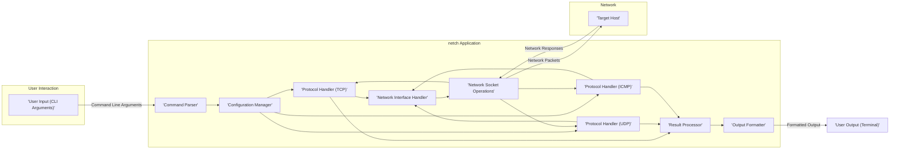

## Project Design Document: netch - Network Testing Tool (Improved)

**1. Introduction**

This document provides an enhanced and more detailed design overview of the `netch` project, a command-line network testing tool. It elaborates on the system's architecture, components, data flow, and crucial security considerations to facilitate a comprehensive threat modeling process. This refined documentation aims to offer an even deeper understanding of the system's mechanics, enabling more precise identification of potential security vulnerabilities and attack vectors.

**2. Project Goals**

* Provide a highly flexible and extensible command-line interface for a diverse range of network testing functionalities, including but not limited to ping, traceroute, and port scanning.
* Offer robust support for core network protocols such as TCP, UDP, and ICMP, with potential for future expansion to other protocols.
* Enable users to precisely specify target hosts (by IP address or hostname), ports, and various protocol-specific parameters (e.g., packet size, timeout values, number of probes).
* Present test results in a clear, informative, and easily parsable manner, potentially including options for different output formats.
* Ensure ease of installation and usability across multiple operating systems (Linux, macOS, Windows) with minimal dependencies.

**3. High-Level Architecture**

The `netch` application is designed with a modular architecture to promote separation of concerns and maintainability. This design cleanly divides responsibilities for command interpretation, network interaction management, and the presentation of results.

**4. Component Details**

* **User Input (CLI Arguments):**
    * **Purpose:**  To capture commands and associated parameters entered by the user through the command-line interface. This is the initial point of interaction with the application.
    * **Inputs:**  Raw command-line arguments provided by the user, such as `netch ping google.com`, `netch tcp 192.168.1.1 80`.
    * **Outputs:**  The complete string of raw command-line arguments, passed directly to the Command Parser for interpretation.
    * **Responsibilities:**  Presenting the command-line interface to the user and capturing their input.

* **Command Parser:**
    * **Purpose:**  To analyze the raw command-line arguments, understand the user's intended action (e.g., ping, TCP connect), and extract all necessary parameters for the requested operation.
    * **Inputs:**  The raw string of command-line arguments from the User Input component.
    * **Outputs:**  A structured data representation of the command, including the specific operation requested (e.g., "ping", "tcp"), the target host, port (if applicable), and any other specified options (e.g., packet size, timeout).
    * **Responsibilities:**  Validating the syntax of the command, identifying the core operation, extracting and categorizing parameters, and raising errors for invalid or missing arguments. Examples of parsed commands: `{ "operation": "ping", "target": "google.com" }`, `{ "operation": "tcp", "target": "192.168.1.1", "port": 80 }`.

* **Configuration Manager:**
    * **Purpose:**  To manage and validate the configuration settings for the network test based on the parsed command. This component ensures that all necessary parameters are present and within acceptable ranges.
    * **Inputs:**  The structured command data from the Command Parser.
    * **Outputs:**  A configuration object or dictionary containing validated parameters for the network test, such as the target IP address, port number, protocol to use, payload size, timeout values, and the number of test iterations. It also handles default values for unspecified parameters.
    * **Responsibilities:**  Storing and retrieving configuration settings, applying default values for missing parameters, validating the data types and ranges of parameters (e.g., ensuring the port number is within the valid range), and raising errors for invalid configurations.

* **Protocol Handler (TCP, UDP, ICMP):**
    * **Purpose:**  To implement the protocol-specific logic required for interacting with the network. Separate handlers exist for each supported protocol (TCP, UDP, ICMP).
    * **Inputs:**  The validated configuration object from the Configuration Manager.
    * **Outputs:**
        * Network packets formatted according to the specific protocol to be sent to the target host.
        * Received network responses from the target host.
        * Raw data extracted from the responses, ready for processing by the Result Processor.
    * **Responsibilities:**  Constructing protocol-specific network packets (e.g., TCP SYN packets, UDP datagrams, ICMP echo requests), managing socket connections (for TCP), sending and receiving data over the network using the Network Interface Handler, handling protocol-specific errors (e.g., TCP connection refused, ICMP destination unreachable), and extracting relevant data from received packets.

* **Network Interface Handler:**
    * **Purpose:**  To manage the interaction with the underlying network interfaces of the operating system. This component abstracts away the operating system-specific details of network access.
    * **Inputs:**  Network packets ready to be sent from the Protocol Handlers.
    * **Outputs:**  Received network packets from the network interface.
    * **Responsibilities:**  Selecting the appropriate network interface for sending and receiving packets (potentially based on user configuration or system defaults), handling low-level network operations such as binding to specific interfaces or IP addresses, and potentially managing network interface states.

* **Network Socket Operations:**
    * **Purpose:**  To perform the fundamental operations of sending and receiving network packets using operating system-level sockets. This is the core networking functionality.
    * **Inputs:**  Constructed network packets from the Protocol Handlers.
    * **Outputs:**  Raw network responses received from the network.
    * **Responsibilities:**  Creating, binding, and connecting network sockets (TCP), sending data through sockets, receiving data from sockets, and handling basic socket-level errors. This component interacts directly with the operating system's networking API.

* **Result Processor:**
    * **Purpose:**  To analyze the raw network responses received from the Protocol Handlers and extract meaningful information about the test results.
    * **Inputs:**  Raw network responses from the Protocol Handlers.
    * **Outputs:**  Structured data representing the test results, such as latency measurements (round-trip time), packet loss statistics, error messages, connection status, and other protocol-specific metrics. Examples: `{ "latency": "25ms", "packet_loss": "0%" }`, `{ "status": "connected" }`.
    * **Responsibilities:**  Parsing network response packets, calculating relevant metrics (e.g., average latency, jitter), identifying errors or anomalies in the responses, and preparing the processed data for the Output Formatter.

* **Output Formatter:**
    * **Purpose:**  To transform the structured test results into a user-friendly and easily understandable output format for display on the terminal.
    * **Inputs:**  Structured result data from the Result Processor.
    * **Outputs:**  A formatted string representing the test results, ready to be displayed to the user. This could be plain text, or potentially other formats like JSON or CSV.
    * **Responsibilities:**  Presenting the results in a clear and readable manner, potentially supporting different output formats based on user preferences or command-line flags, and ensuring the information is presented logically.

* **Target Host:**
    * **Purpose:** The remote network device or service that `netch` is interacting with for testing purposes.
    * **Inputs:** Network packets sent by `netch`.
    * **Outputs:** Network responses sent back to `netch`.
    * **Responsibilities:**  Responding to network requests according to the rules of the specified network protocol.

* **User Output (Terminal):**
    * **Purpose:** To display the formatted test results to the user on their command-line interface.
    * **Inputs:** The formatted output string from the Output Formatter.
    * **Outputs:**  The visual representation of the test results displayed on the user's terminal screen.
    * **Responsibilities:**  Presenting the information to the user in a clear and understandable way.

**5. Data Flow**

The typical sequence of data flow during a network test execution with `netch` is as follows:

1. The user enters a command and parameters through the **'User Input (CLI Arguments)'**.
2. The raw command-line arguments are passed to the **'Command Parser'**.
3. The **'Command Parser'** analyzes the input and extracts the command and its parameters, generating structured command data.
4. The structured command data is then passed to the **'Configuration Manager'**.
5. The **'Configuration Manager'** validates the parameters and creates a configuration object containing the settings for the test.
6. Based on the specified protocol in the configuration, the configuration object is passed to the appropriate **'Protocol Handler'** (either 'TCP', 'UDP', or 'ICMP').
7. The selected **'Protocol Handler'** constructs network packets according to the protocol specifications.
8. The network packets are then handed over to the **'Network Interface Handler'**.
9. The **'Network Interface Handler'** manages the interaction with the operating system's network interfaces.
10. **'Network Socket Operations'** sends the packets to the **'Target Host'**.
11. The **'Target Host'** processes the packets and sends back network responses.
12. **'Network Socket Operations'** receives the network responses.
13. The received responses are passed back to the corresponding **'Protocol Handler'**.
14. The **'Protocol Handler'** extracts relevant data from the responses.
15. The extracted data is then sent to the **'Result Processor'**.
16. The **'Result Processor'** analyzes the data and generates structured result data.
17. The structured result data is passed to the **'Output Formatter'**.
18. The **'Output Formatter'** formats the results into a user-friendly output string.
19. Finally, the formatted output string is displayed to the user through the **'User Output (Terminal)'**.

**6. Security Considerations (For Threat Modeling)**

This section expands upon the initial security considerations, providing more specific examples and potential attack scenarios to aid in threat modeling.

* **Command Injection:**
    * **Threat:**  If user-supplied input used in commands executed by the application is not properly sanitized, attackers could inject malicious commands.
    * **Example:**  A vulnerability in parsing the target host could allow an attacker to provide an input like ``; rm -rf /`` which, if executed directly by the system, could have devastating consequences.
    * **Mitigation:**  Strict input validation, avoiding direct execution of shell commands based on user input, using parameterized commands or secure APIs.

* **Denial of Service (DoS):**
    * **Threat:**  The tool's network capabilities could be abused to launch DoS attacks against target hosts.
    * **Example:**  An attacker could use `netch` to send a large number of SYN packets to a target, overwhelming its resources and making it unavailable. Improperly configured options could allow for excessive packet flooding.
    * **Mitigation:**  Implementing rate limiting for packet sending, restricting the number of concurrent operations, and potentially adding warnings or confirmations for actions that could lead to DoS.

* **Information Disclosure:**
    * **Threat:**  Error messages, verbose output, or debugging logs could inadvertently reveal sensitive information about the network configuration, internal workings of `netch`, or the target host.
    * **Example:**  An error message might reveal the internal IP address of the server running `netch` or details about the network infrastructure.
    * **Mitigation:**  Carefully review and sanitize error messages, avoid displaying overly verbose debugging information in production environments, and ensure proper logging practices.

* **Privilege Escalation:**
    * **Threat:**  If `netch` requires elevated privileges for certain operations (e.g., raw socket access), vulnerabilities in privilege management could allow an attacker to gain unauthorized access.
    * **Example:**  A bug in how `netch` handles user input related to network interfaces could allow a low-privileged user to execute code with root privileges.
    * **Mitigation:**  Adhere to the principle of least privilege, carefully manage permissions required for different operations, and thoroughly audit code that handles privilege elevation.

* **Man-in-the-Middle (MITM) Attacks:**
    * **Threat:**  For protocols without encryption (like unencrypted HTTP or raw TCP/UDP), communication between `netch` and the target host could be intercepted and potentially manipulated by an attacker.
    * **Example:**  An attacker on the same network could intercept the packets sent by `netch` and the responses from the target, potentially gaining insights into the communication or even altering the data.
    * **Mitigation:**  Educate users about the risks of using unencrypted protocols, encourage the use of secure protocols (HTTPS, TLS), and potentially provide warnings when using insecure protocols.

* **Input Validation Vulnerabilities:**
    * **Threat:**  Insufficient validation of user-provided parameters (e.g., target host, port, packet size) could lead to unexpected behavior, crashes, or even security vulnerabilities.
    * **Example:**  Providing a negative value for packet size or an extremely large port number could cause errors or be exploited. Failing to validate the target host could lead to attempts to connect to internal or restricted networks.
    * **Mitigation:**  Implement robust input validation for all user-provided parameters, including type checking, range checks, and format validation.

* **Dependency Vulnerabilities:**
    * **Threat:**  The libraries and dependencies used by `netch` might contain known security vulnerabilities that could be exploited.
    * **Example:**  An outdated version of a networking library might have a buffer overflow vulnerability that could be triggered by crafted network responses.
    * **Mitigation:**  Regularly update dependencies to their latest secure versions, use dependency scanning tools to identify potential vulnerabilities, and carefully evaluate the security of third-party libraries.

**7. Technologies Used**

* **Programming Language:**  Likely Python, chosen for its strong networking capabilities, extensive libraries, and ease of development for command-line tools.
* **Networking Libraries:**
    * `socket`:  Python's built-in module for low-level network interface access and socket programming, essential for sending and receiving data over various protocols.
    * `asyncio` (potentially): For asynchronous network operations, allowing `netch` to handle multiple connections or tests concurrently without blocking.
    * Libraries for specific protocol handling (if needed for more complex operations):  Potentially `struct` for packing and unpacking binary data in packets.
* **Command-line Argument Parsing:**  `argparse` (or a similar library) in Python for efficiently handling and validating command-line arguments and options.

**8. Future Considerations**

* **Expanded Protocol Support:**  Adding support for additional network protocols beyond TCP, UDP, and ICMP, such as HTTP, DNS, or TLS handshake analysis.
* **Advanced Packet Crafting:**  Enabling users to create and send highly customized network packets with fine-grained control over packet headers and payloads.
* **Reporting and Logging Enhancements:**  Implementing more comprehensive reporting features, including saving test results to various file formats (e.g., JSON, CSV) and detailed logging of application events.
* **Graphical User Interface (GUI):**  Developing a GUI as an alternative to the command-line interface for users who prefer a visual approach.
* **Plugin Architecture:**  Designing a plugin system to allow users or developers to extend the functionality of `netch` with custom modules for specific testing scenarios or protocols.
* **Integration with Security Tools:**  Exploring possibilities for integrating `netch` with other security tools or frameworks for automated testing and vulnerability analysis.

This improved design document provides a more comprehensive and detailed understanding of the `netch` project, offering valuable insights for conducting a thorough and effective threat modeling exercise. The enhanced descriptions of components, data flow, and security considerations will aid in identifying and mitigating potential security risks.