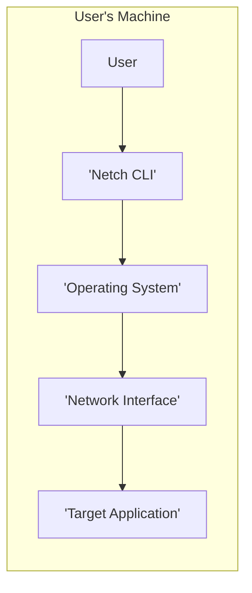
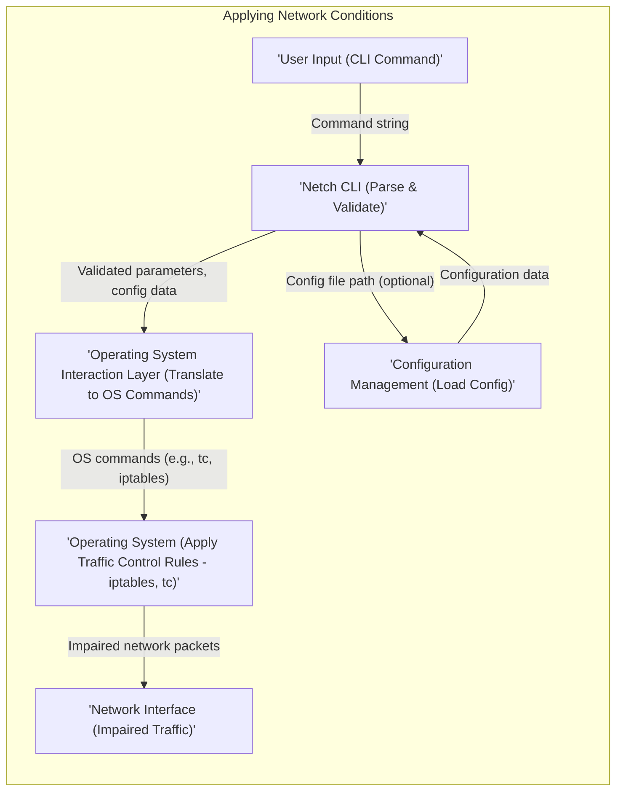
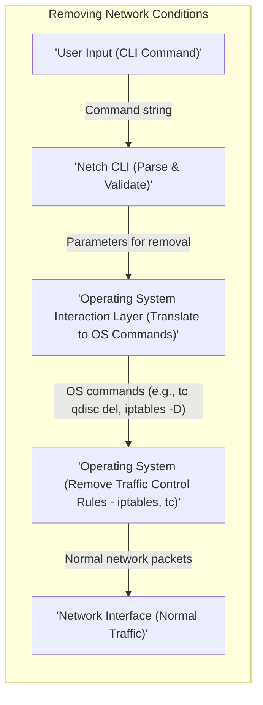

## Project Design Document: Netch - Network Condition Emulator

**1. Introduction**

This document provides a detailed design overview of the `netch` project, a command-line tool for simulating various network conditions. This document is intended to serve as a foundation for subsequent threat modeling activities. It outlines the system's architecture, components, data flow, and deployment considerations.

**2. Goals**

*   Provide a comprehensive description of the `netch` project's architecture and functionality.
*   Identify key components and their interactions, detailing their responsibilities.
*   Describe the data flow within the system, including the types of data exchanged.
*   Outline the deployment model and relevant considerations.
*   Highlight initial security considerations and potential vulnerabilities.

**3. Scope**

This document covers the design of the `netch` command-line interface (CLI) and its underlying mechanisms for network emulation on Linux-based operating systems using `iptables` and `tc`. It focuses on the core functionality of applying and removing network impairments such as latency, packet loss, and packet corruption. This document does not cover potential future features like a graphical user interface or support for other operating systems.

**4. System Overview**

`Netch` is a command-line tool that allows users to simulate network conditions like latency, packet loss, and packet corruption on a specified network interface. It achieves this by interacting with the operating system's traffic control mechanisms, primarily `iptables` for packet filtering and `tc` (traffic control) for shaping. The user interacts with the `Netch CLI`, which then orchestrates the necessary system calls to apply the desired network impairments to the target network interface.

**5. Component Details**

*   **Netch CLI:**
    *   **Description:** The primary interface for users to interact with `netch`. It is responsible for receiving user commands, parsing them, validating the provided input, and then orchestrating the application or removal of network conditions.
    *   **Functionality:**
        *   **Command Parsing:** Interprets user commands (e.g., `netch --interface eth0 --latency 100ms`).
        *   **Input Validation:** Ensures that provided parameters (interface names, latency values, packet loss percentages, etc.) are within acceptable ranges and formats. This is crucial for preventing unexpected behavior and potential security issues.
        *   **Configuration Management:**  Loads and manages configuration settings, potentially from configuration files (e.g., specifying default impairment values or interface names).
        *   **Orchestration:**  Translates user commands and configuration into specific instructions for the Operating System Interaction Layer.
        *   **Status Display:** Provides feedback to the user on the success or failure of applying or removing network conditions.
        *   **Logging:**  Records actions and errors for debugging and auditing purposes.
    *   **Technology:** Primarily implemented in Python, leveraging libraries for argument parsing (e.g., `argparse`) and potentially configuration file handling (e.g., `PyYAML`, `json`).
    *   **Inputs:**
        *   Command-line arguments specifying the target network interface, the type of impairment (latency, packet loss, corruption), and their specific parameters (e.g., milliseconds for latency, percentage for packet loss).
        *   Optional configuration files in formats like YAML or JSON, containing predefined settings.
    *   **Outputs:**
        *   Success or error messages displayed on the console.
        *   Status updates indicating the current network conditions applied.
        *   Log entries recording actions and potential errors.

*   **Operating System Interaction Layer:**
    *   **Description:** This layer acts as an intermediary between the `Netch CLI` and the underlying operating system's network management tools. It is responsible for translating the abstract requests from the CLI into concrete system commands.
    *   **Functionality:**
        *   **Command Translation:** Converts `netch`'s internal representation of network impairments into specific commands for tools like `iptables` and `tc`. For example, a request to add 100ms of latency might be translated into a `tc qdisc add ... delay 100ms` command.
        *   **System Command Execution:** Executes the generated system commands using libraries like Python's `subprocess` module.
        *   **State Management:**  Keeps track of the currently applied network conditions to facilitate removal and modification. This might involve storing the specific `iptables` rules and `tc` configurations.
        *   **Error Handling:**  Captures and handles errors returned by the system commands, providing informative feedback to the `Netch CLI`.
        *   **Idempotency (Desired):** Ideally, this layer should be designed to handle repeated requests gracefully, avoiding unintended side effects.
    *   **Technology:** Primarily relies on system calls and external utilities provided by the operating system (specifically `iptables` and `tc` on Linux). Python's `subprocess` module is likely used for executing these commands.
    *   **Inputs:**
        *   Abstract representations of network impairments and their parameters from the `Netch CLI`.
        *   Information about the target network interface.
    *   **Outputs:**
        *   Status codes indicating the success or failure of executing the system commands.
        *   Error messages from the system commands, if any.

*   **Configuration Management:**
    *   **Description:** This component is responsible for loading, parsing, and validating configuration settings that can influence `netch`'s behavior.
    *   **Functionality:**
        *   **Configuration File Loading:** Reads configuration data from files in formats like YAML, JSON, or potentially others.
        *   **Configuration Parsing:**  Interprets the data from the configuration files into a usable format.
        *   **Schema Validation:**  Ensures that the configuration data adheres to a predefined schema, preventing errors due to malformed configuration files.
        *   **Providing Configuration Data:** Makes the parsed and validated configuration data available to other components, such as the `Netch CLI` for setting default values.
    *   **Technology:**  Potentially uses libraries like `PyYAML` for YAML parsing, `json` for JSON parsing, and potentially schema validation libraries.
    *   **Inputs:**
        *   Configuration files specified by the user or located in default locations.
    *   **Outputs:**
        *   Parsed and validated configuration data structures.
        *   Error messages if the configuration file is invalid.

**6. Data Flow**

The following outlines the typical data flow for applying network conditions:

The following outlines the typical data flow for removing network conditions:

**7. Deployment Architecture**

*   **Deployment Model:** `Netch` is primarily intended to be run directly on the user's local machine or within a testing environment where network conditions need to be simulated. It is expected to be executed from the command line.
*   **Installation:** Typically installed via `pip`, the Python package installer, after cloning the repository. A `setup.py` file would manage dependencies. Alternatively, users might run it directly from the source code.
*   **Dependencies:**
    *   Python (version 3.6 or higher recommended).
    *   Operating system utilities: `iptables` and `tc` (typically pre-installed on Linux distributions).
    *   Python libraries specified in `requirements.txt` (e.g., `argparse`, potentially `PyYAML` or `json`).
*   **Execution Environment:** Requires a Linux-based operating system with appropriate permissions to execute `iptables` and `tc` commands (typically requiring `sudo` or root privileges).

**8. Security Considerations (Initial)**

*   **Privilege Escalation:** `Netch` requires elevated privileges (typically `sudo`) to modify network traffic control rules. This is a critical security consideration. If `netch` itself were compromised, an attacker could gain root privileges on the system.
    *   **Mitigation:**  Clearly document the privilege requirements. Consider security auditing of the codebase to minimize vulnerabilities. Explore options for minimizing the required privileges if possible (though this is inherently difficult with network manipulation).
*   **Command Injection:** Improper validation of user-provided input (interface names, impairment parameters) could lead to command injection vulnerabilities. An attacker could potentially inject arbitrary commands that would be executed with the privileges of the `netch` process (likely root).
    *   **Mitigation:** Implement robust input validation and sanitization for all user-provided parameters. Avoid directly embedding user input into system commands; use parameterized commands or safer alternatives.
*   **Dependency Vulnerabilities:**  Vulnerabilities in third-party Python libraries used by `netch` could be exploited.
    *   **Mitigation:** Regularly update dependencies and use tools to scan for known vulnerabilities in dependencies. Pin specific versions of dependencies in `requirements.txt` to ensure consistent and tested versions are used.
*   **Configuration File Security:** If configuration files are used, their storage and access permissions need to be considered. Maliciously crafted configuration files could potentially be used to execute unintended commands or cause denial-of-service.
    *   **Mitigation:**  Store configuration files in secure locations with restricted access permissions. Validate the schema and content of configuration files rigorously.
*   **Denial of Service:**  Incorrectly configured network impairments or malicious use of `netch` could lead to a denial of service on the local machine or the network it is connected to.
    *   **Mitigation:** Implement safeguards to prevent extreme or unbounded impairment values. Provide clear warnings about the potential impact of network modifications.
*   **Information Disclosure:** Logging mechanisms might inadvertently log sensitive information.
    *   **Mitigation:** Carefully review logging practices to ensure that sensitive data is not being logged unnecessarily.

**9. Assumptions and Constraints**

*   It is assumed that the user has the necessary understanding of networking concepts and the potential impact of modifying network traffic control rules.
*   The tool relies on the availability and correct functioning of the `iptables` and `tc` utilities on the target system.
*   The accuracy of the network emulation is limited by the capabilities of the underlying operating system's traffic control mechanisms.
*   This design primarily targets Linux-based systems.

**10. Future Considerations**

*   Support for simulating more complex network conditions (e.g., packet reordering, bandwidth limitations).
*   Integration with testing frameworks and CI/CD pipelines for automated network testing.
*   A graphical user interface (GUI) to provide a more user-friendly interface for configuring network impairments.
*   Support for other operating systems (e.g., macOS, Windows).
*   Containerization (e.g., using Docker) to provide a more isolated and reproducible environment for running `netch`.
*   Enhanced logging and reporting capabilities, including the ability to export simulation results.
*   More granular control over which traffic is affected by the emulated conditions.