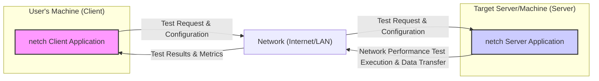

# Project Design Document: netch - Network Performance Testing Tool

## 1. Project Overview

### 1.1. Project Goal
The `netch` project aims to develop a robust and efficient command-line network performance testing tool named `netch`.  The primary objective is to empower users with the capability to accurately measure critical network metrics, including bandwidth, latency, packet loss, and jitter, across various network protocols. `netch` is designed to be cross-platform, user-friendly, and scriptable, making it an invaluable asset for network engineers, system administrators, and developers for network diagnostics, performance benchmarking, and configuration validation.

### 1.2. Target Audience
The intended users of `netch` are diverse and include:

* **Network Engineers:** For in-depth network troubleshooting, performance analysis, capacity planning, and validation of network infrastructure configurations and changes.
* **System Administrators:** To monitor server network health, diagnose application performance issues related to network bottlenecks, ensure service availability and responsiveness, and optimize server network settings.
* **Software Developers:** To rigorously test the network performance of applications during development, identify and resolve network-related bugs, optimize network communication patterns within applications, and ensure a smooth user experience.
* **DevOps Engineers:** To seamlessly integrate network performance testing into Continuous Integration/Continuous Delivery (CI/CD) pipelines, automate network performance monitoring as part of infrastructure as code, and proactively ensure consistent application performance across different deployment environments.
* **Security Professionals:** To gain a deeper understanding of network behavior under various load conditions, identify potential network vulnerabilities related to performance degradation or anomalies, and validate the impact of security configurations (firewalls, intrusion detection systems) on network performance.
* **Quality Assurance (QA) Engineers:** To incorporate network performance testing into overall application testing strategies, ensuring applications meet performance requirements under different network conditions and user loads.

### 1.3. Key Features
`netch` is designed to provide a comprehensive suite of network testing functionalities:

* **Bandwidth Measurement (Throughput):** Accurately quantify the maximum data transfer rate achievable between two network endpoints, crucial for assessing network capacity.
* **Latency Measurement (Round-Trip Time - RTT, One-Way Delay):** Precisely measure the delay in network communication, essential for real-time applications and interactive services.
* **Packet Loss Detection and Quantification:** Identify and measure the percentage of data packets lost during transmission, a key indicator of network congestion or instability.
* **Jitter Measurement (Packet Delay Variation):** Analyze the variability in packet delay to assess network suitability for real-time applications like VoIP and video conferencing, where consistent latency is critical.
* **Multi-Protocol Support:**  Versatile support for multiple network protocols, including TCP (for reliable, connection-oriented testing), UDP (for connectionless, low-overhead testing), and HTTP/3 (for modern web performance testing), enabling comprehensive testing across different network layers and application types.
* **Command-Line Interface (CLI):**  A user-friendly and scriptable command-line interface, facilitating easy integration into automated scripts, CI/CD pipelines, and remote management systems.
* **Cross-Platform Compatibility:**  Designed for broad compatibility across major operating systems (Linux, macOS, Windows), ensuring accessibility and usability across diverse environments.
* **Highly Configurable Test Parameters:**  Extensive customization options for test parameters, including packet size, test duration, protocol selection, target endpoints (IP addresses, hostnames, ports), and test type selection, providing flexibility for diverse testing scenarios and network conditions.
* **Detailed and Structured Output & Reporting:** Provide clear, comprehensive, and easily interpretable output of test results directly to the console.  Support for structured output formats like JSON and CSV for seamless integration with other tools for data analysis, visualization, and reporting.
* **Error Handling and Logging:** Robust error handling to gracefully manage unexpected situations during testing. Comprehensive logging capabilities for debugging and troubleshooting, aiding in identifying and resolving issues during test execution.

## 2. System Architecture

### 2.1. High-Level Architecture Diagram

This diagram illustrates the fundamental client-server architecture of `netch`. The `netch Client Application`, running on the user's machine, initiates network performance tests by sending requests and configurations across the `Network` to the `netch Server Application` on the target machine. The server executes the tests and sends back `Test Results & Metrics` to the client for reporting.

### 2.2. Component Description

#### 2.2.1. netch Client Application

* **Functionality:**
    * **User Input Handling:** Parses command-line arguments provided by the user, defining the test type, target, protocol, and various test parameters.
    * **Parameter Validation and Configuration:** Validates user-provided parameters to ensure they are within acceptable ranges and formats. Configures the test execution based on these parameters.
    * **Test Request Generation and Serialization:** Constructs structured test request messages based on the configured parameters. Serializes these requests into a format suitable for network transmission (e.g., JSON, Protocol Buffers, or a custom binary format).
    * **Network Communication (Client-Side):** Establishes network connections (TCP, UDP, HTTP/3) with the `netch Server Application` on the target machine. Sends serialized test requests to the server. Receives serialized test results from the server.
    * **Result Deserialization and Processing:** Deserializes the received test results from the network format back into data structures. Processes the raw results to calculate and format key performance metrics (bandwidth, latency, packet loss, jitter).
    * **Output and Reporting (CLI):** Presents the processed test results to the user in a clear and human-readable format on the command-line interface. Offers options to output results in structured formats (JSON, CSV) for further analysis or integration.
    * **Error Handling and User Feedback:** Handles potential errors during test execution (e.g., network connection failures, invalid server responses). Provides informative error messages to the user.

* **Data Flow (Client-Side):**
    * **Input:** User commands and parameters via CLI.
    * **Processing:** Parsing commands, validating parameters, configuring test, generating test requests, serializing requests, network communication (sending requests, receiving results), deserializing results, processing results, formatting output.
    * **Output:** Displaying formatted test results on the console, optionally writing results to files in structured formats.

* **Technologies:**
    * **Programming Language:** Go (based on the GitHub repository).
    * **Libraries:**
        * Standard Go libraries: `flag` (command-line parsing), `net` (networking - TCP, UDP sockets), `net/http` (HTTP client), `golang.org/x/net/http3` (HTTP/3 client).
        * Potentially: Libraries for serialization (e.g., `encoding/json`, `protobuf`).
        * Logging library (e.g., `log`, `logrus`).

#### 2.2.2. netch Server Application

* **Functionality:**
    * **Network Listening (Server-Side):** Listens for incoming test requests from `netch Client Applications` on a configurable port and protocol (TCP, UDP, HTTP/3).
    * **Request Reception and Deserialization:** Receives serialized test requests from clients over the network. Deserializes these requests to extract test parameters and instructions.
    * **Test Execution Engine:** Executes the requested network performance tests based on the received parameters. This involves:
        * **Bandwidth Test:** Sending and receiving data streams to measure throughput.
        * **Latency Test:** Exchanging timestamped packets to measure round-trip time.
        * **Packet Loss Test:** Sending a sequence of packets and tracking lost packets.
        * **Jitter Test:** Measuring the variation in packet arrival times.
    * **Data Measurement and Metric Calculation:**  During test execution, accurately measures relevant network metrics (timestamps, packet counts, data volumes). Calculates performance metrics (bandwidth, latency, packet loss percentage, jitter) from the measured data.
    * **Result Generation and Serialization:**  Aggregates the calculated metrics and generates structured test result messages. Serializes these results into a format suitable for network transmission.
    * **Result Transmission (Server-Side):** Transmits the serialized test results back to the requesting `netch Client Application`.
    * **Error Handling and Logging:** Handles errors during request processing and test execution. Logs events and errors for debugging and monitoring.

* **Data Flow (Server-Side):**
    * **Input:** Serialized test requests from `netch Client`.
    * **Processing:** Network listening, request reception, deserialization, test execution, data measurement, metric calculation, result generation, serialization.
    * **Output:** Serialized test results sent back to the `netch Client`.

* **Technologies:**
    * **Programming Language:** Go (based on the GitHub repository).
    * **Libraries:**
        * Standard Go libraries: `net` (networking - TCP, UDP listeners, sockets), `net/http` (HTTP server), `golang.org/x/net/http3` (HTTP/3 server).
        * Potentially: Libraries for serialization (e.g., `encoding/json`, `protobuf`).
        * Logging library (e.g., `log`, `logrus`).

#### 2.2.3. Network Communication Protocol

* **Protocols:**
    * **TCP:**  For reliable, connection-oriented bandwidth and latency tests where guaranteed delivery is important.
    * **UDP:** For connectionless bandwidth, latency, packet loss, and jitter tests, suitable for simulating real-time traffic and measuring network characteristics without TCP overhead.
    * **HTTP/3:** For testing network performance in modern web scenarios, leveraging QUIC for multiplexing, low latency, and security.
* **Communication Model:** Client-Server, request-response model. The client initiates a connection and sends a test request. The server processes the request and sends back a response containing the test results.
* **Data Format for Requests and Results:**  A well-defined data format is needed for serializing test requests and results. Potential options include:
    * **JSON:** Human-readable, widely supported, easy to implement in Go using `encoding/json`.
    * **Protocol Buffers (protobuf):**  Binary format, more efficient for serialization/deserialization and network transmission, requires schema definition.
    * **Custom Binary Format:**  Potentially more compact and performant, but requires more effort to design and implement.
    * **Choice:** The specific format should be chosen based on performance requirements, complexity, and maintainability. JSON offers simplicity, while Protocol Buffers offer efficiency.
* **Security:**  Currently, communication is assumed to be unencrypted.  Future enhancements should strongly consider adding encryption (e.g., TLS/SSL) to protect the confidentiality and integrity of test requests and results, especially when transmitting over untrusted networks. Authentication and authorization mechanisms are also crucial for securing the `netch Server`.

#### 2.2.4. Data Storage (Ephemeral)

* **Purpose:** `netch` is primarily designed for real-time, on-demand network testing. Persistent data storage is not a core requirement.
* **Temporary In-Memory Storage:** Both `netch Client` and `netch Server` will utilize in-memory data structures to temporarily store test data during execution.
    * **Server:** Stores received test requests, measured network data (timestamps, packet counts), and intermediate calculation results before generating the final test results.
    * **Client:** Stores received test results from the server before processing and displaying them to the user.
* **No Persistent Database:**  No persistent database is used for storing test results, configurations, or historical data in the current design. Users are expected to capture and store the output of the `netch Client` if they need to persist test results for later analysis or reporting.  Future enhancements could include options for logging results to files or databases.

#### 2.2.5. Reporting and Visualization (CLI & Structured Output)

* **Reporting Mechanism:** Primarily through the command-line interface of the `netch Client`.
* **Output Format (CLI):**  Presents test results in a clear, formatted textual output on the console. Includes key metrics with descriptive labels and units (e.g., "Bandwidth: 100 Mbps", "Latency: 20 ms", "Packet Loss: 0.5%").
* **Structured Output Formats (Optional):** Supports outputting test results in structured formats like JSON and CSV.
    * **JSON:**  For easy parsing and integration with other applications, scripting languages, and data analysis tools.
    * **CSV:**  For importing results into spreadsheets or data analysis software for further processing and visualization.
* **Customization:**  Potentially allows users to customize the output format and the set of metrics displayed, either through command-line options or configuration files.
* **Future Visualization Enhancements:**  Future development could explore integration with visualization libraries or tools to generate graphs and charts from test results, providing a more visual representation of network performance trends.

## 3. Data Flow

### 3.1. Detailed Data Flow Diagram

```mermaid
graph LR
    subgraph "netch Client Application"
        A["User Input: CLI Command & Parameters"] --> B["CLI Input Parsing & Validation"]
        B --> C["Test Configuration Object Creation"]
        C --> D["Test Request Serialization (e.g., JSON)"]
        D --> E["Network Socket (TCP/UDP/HTTP3) - Send Request"]
        G["Network Socket (TCP/UDP/HTTP3) - Receive Results"] --> H["Test Result Deserialization (e.g., JSON)"]
        H --> I["Result Processing & Metric Calculation"]
        I --> J["Formatted CLI Output: Test Results"]
        I --> K["Optional: Structured Output (JSON/CSV)"]
    end

    subgraph "Network"
        E -- "Serialized Test Request" --> F["Network Transit"]
        F -- "Serialized Test Results" --> G
    end

    subgraph "netch Server Application"
        L["Network Socket (TCP/UDP/HTTP3) - Receive Request"] --> M["Test Request Deserialization (e.g., JSON)"]
        M --> N["Test Execution Engine (TCP/UDP/HTTP3 Specific)"]
        N --> O["Data Measurement & Metric Calculation"]
        O --> P["Test Result Serialization (e.g., JSON)"]
        P --> Q["Network Socket (TCP/UDP/HTTP3) - Send Results"]
    end

    F -- "Serialized Test Request" --> L
    Q -- "Serialized Test Results" --> F

    style A fill:#eee,stroke:#333,stroke-width:1px
    style J fill:#eee,stroke:#333,stroke-width:1px
    style K fill:#eee,stroke:#333,stroke-width:1px
    style L fill:#eee,stroke:#333,stroke-width:1px
    style Q fill:#eee,stroke:#333,stroke-width:1px
```

This diagram provides a more granular view of the data flow within `netch`. It details the steps involved in processing user input, generating and serializing test requests, network communication, test execution on the server, result generation and serialization, and finally, result processing and output on the client side.  Serialization and deserialization steps are explicitly shown, and the distinction between client and server network sockets is clarified.

### 3.2. Data Description

* **User Input (CLI Command & Parameters):** Textual commands and arguments entered by the user via the command-line interface. These define the test to be performed and its configuration.
* **Test Configuration Object:** An in-memory data structure created by the `netch Client` to represent the parsed and validated test parameters.
* **Serialized Test Request:** A structured message (e.g., JSON, Protocol Buffers) representing the test request, ready for network transmission. Contains all necessary parameters for the `netch Server` to execute the test.
* **Test Data (Network Transit):** Data packets exchanged between the `netch Client` and `netch Server` during test execution. The content and nature of this data depend on the test type and protocol. For bandwidth tests, it's typically pseudo-random data. For latency tests, it includes timestamps.
* **Serialized Test Results:** A structured message (e.g., JSON, Protocol Buffers) containing the measured network performance metrics, sent from the `netch Server` back to the `netch Client`.
* **Test Result Object:** An in-memory data structure created by the `netch Client` after deserializing the `Serialized Test Results`. Holds the raw and processed test metrics.
* **Formatted CLI Output:** Human-readable textual output displayed on the command-line, presenting the key test metrics to the user.
* **Structured Output (JSON/CSV):**  Optional output files in JSON or CSV format, containing the test results in a structured, machine-readable format.

## 4. Technology Stack

* **Programming Language:** Go (Golang) - Chosen for its performance, concurrency features, networking capabilities, and cross-platform support.
* **Networking Libraries:**
    * `net` package (Go standard library): Core networking functionalities for TCP and UDP socket programming, IP address manipulation, DNS resolution.
    * `net/http` package (Go standard library): HTTP client and server implementations, essential for HTTP/3 support and potentially for client-server communication if HTTP-based protocols are used for control messages.
    * `golang.org/x/net/http3` (Go extension library): Implementation of the HTTP/3 protocol, enabling `netch` to test modern web performance.
* **Serialization Libraries (Potentially):**
    * `encoding/json` (Go standard library): For JSON serialization and deserialization, if JSON is chosen as the data format for test requests and results.
    * `github.com/golang/protobuf/proto` (Protocol Buffers library): If Protocol Buffers are chosen for more efficient serialization.
* **Command-Line Interface (CLI) Library:**
    * `flag` package (Go standard library): For parsing command-line arguments and options.
    * Potentially:  `github.com/spf13/cobra` or `github.com/urfave/cli` for more advanced CLI features if needed in the future.
* **Logging Library:**
    * `log` package (Go standard library): Basic logging functionalities.
    * Potentially: `github.com/sirupsen/logrus` or `go.uber.org/zap` for more structured and feature-rich logging if required.
* **Operating Systems:**
    * Cross-platform support: Linux, macOS, Windows. Go's cross-compilation capabilities make it well-suited for this.

## 5. Deployment Model

* **Client-Server Architecture:** `netch` is deployed as a client-server application.
    * **netch Client:** Distributed as a standalone executable binary for each supported operating system. Users download and run the client binary on their local machines or testing infrastructure.
    * **netch Server:** Also distributed as a standalone executable binary. Users deploy and run the server binary on target machines they want to test network performance against.
* **Executable Binaries (Distribution):**  Binaries will be compiled for Linux (various distributions), macOS, and Windows architectures (e.g., amd64, arm64). Distribution could be via GitHub releases, package managers (e.g., `apt`, `brew`, `choco`), or direct download.
* **Installation (Minimal):** Installation is typically straightforward: download the appropriate binary for the target OS and architecture, make it executable (if necessary), and run it from the command line. No complex installation procedures or external dependencies beyond the Go runtime are expected.
* **Deployment Scenarios (Expanded):**
    * **Local Network Performance Testing:** Deploy `netch Client` and `netch Server` on machines within the same LAN to test internal network segments, switches, routers, and local server performance.
    * **Wide Area Network (WAN) Testing:** Test network performance across geographically distributed locations by deploying `netch Server` in remote data centers or cloud regions and running `netch Client` from a different location.
    * **Internet Performance Measurement:** Deploy `netch Server` on a publicly accessible server (e.g., cloud instance with a public IP) to measure internet connection performance from a user's machine running `netch Client`.
    * **Cloud Environment Testing (Intra- and Inter-Cloud):** Deploy `netch Client` and `netch Server` within the same cloud provider (intra-cloud) or across different cloud providers (inter-cloud) to test network performance between virtual machines, containers, or cloud services.
    * **Containerized Deployments:** Both `netch Client` and `netch Server` can be containerized (e.g., using Docker) for easier deployment and management in containerized environments like Kubernetes.

## 6. Security Considerations (Detailed)

Expanding on the initial security considerations, a more detailed threat analysis is necessary:

* **Confidentiality Threats:**
    * **Eavesdropping on Communication:**  Unencrypted communication between `netch Client` and `netch Server` exposes test requests and results to potential eavesdropping, especially over public networks. While test data itself might not be highly sensitive, information about network infrastructure and performance characteristics could be valuable to attackers.
    * **Mitigation:** Implement TLS/SSL encryption for all client-server communication to protect confidentiality. Use HTTPS for HTTP/3 based tests and consider TLS for custom TCP/UDP protocols.

* **Integrity Threats:**
    * **Man-in-the-Middle (MITM) Attacks:** Without encryption and authentication, an attacker could intercept and modify test requests or results in transit, leading to inaccurate performance measurements or potentially injecting malicious commands.
    * **Data Tampering on Server:** If the `netch Server` is compromised, an attacker could manipulate test execution or alter results before sending them back to the client, providing misleading information.
    * **Mitigation:** TLS/SSL encryption protects against MITM attacks. Implement input validation and output sanitization on both client and server. Consider digital signatures for test requests and results to ensure integrity. Secure server infrastructure and access controls.

* **Availability Threats:**
    * **Denial of Service (DoS) Attacks on Server:**
        * **Unauthenticated Access:** Lack of authentication allows any client to send test requests, potentially overwhelming the `netch Server` with excessive requests and causing resource exhaustion (CPU, memory, bandwidth).
        * **Malicious Test Requests:** Attackers could craft requests designed to consume excessive server resources (e.g., very large packet sizes, long test durations, high request rates).
    * **Resource Exhaustion on Client:**  A compromised `netch Server` could send back large volumes of data or crafted responses that could overwhelm the `netch Client`, leading to resource exhaustion or crashes.
    * **Mitigation:** Implement authentication and authorization mechanisms for the `netch Server` to restrict access to authorized clients. Implement rate limiting and request throttling on the server to prevent DoS attacks. Input validation to prevent malicious parameters. Resource quotas and limits on server-side test execution. Implement client-side resource limits and error handling to prevent client-side DoS. Deploy `netch Server` behind firewalls and intrusion detection/prevention systems.

* **Authentication and Authorization Vulnerabilities:**
    * **Lack of Authentication:** Currently, no authentication is mentioned. This means any entity that can reach the `netch Server` can initiate tests.
    * **Lack of Authorization:** Even if authentication is added, there might be no authorization controls to restrict which tests a client can perform or what resources they can access.
    * **Mitigation:** Implement a robust authentication mechanism (e.g., API keys, mutual TLS, OAuth 2.0) to verify the identity of `netch Clients`. Implement authorization policies to control which clients are allowed to perform specific types of tests or access certain server resources.

* **Input Validation Vulnerabilities:**
    * **Buffer Overflows:**  Improperly validated input parameters (e.g., packet size, test duration) could lead to buffer overflows in both client and server if not handled correctly in memory allocation and data processing.
    * **Format String Bugs:**  If user-provided input is directly used in format strings without proper sanitization, it could lead to format string vulnerabilities.
    * **Command Injection:**  Although less likely in this design, if there are any scenarios where user input is used to construct system commands, command injection vulnerabilities could arise.
    * **Mitigation:** Implement rigorous input validation on both client and server for all user-provided parameters. Use safe string handling practices to prevent buffer overflows and format string bugs. Avoid constructing system commands from user input.

* **Logging and Monitoring:**
    * **Insufficient Logging:** Lack of adequate logging can hinder security incident detection, response, and forensic analysis.
    * **Exposure of Sensitive Information in Logs:** Logs might inadvertently contain sensitive information if not properly configured.
    * **Mitigation:** Implement comprehensive logging on both client and server, recording relevant events, errors, and security-related activities. Securely store and manage logs. Sanitize logs to prevent exposure of sensitive information. Implement monitoring and alerting for suspicious activity.

These security considerations will form the basis for a detailed threat model and guide the implementation of appropriate security controls in the `netch` project.  Security should be a continuous process throughout the development lifecycle.