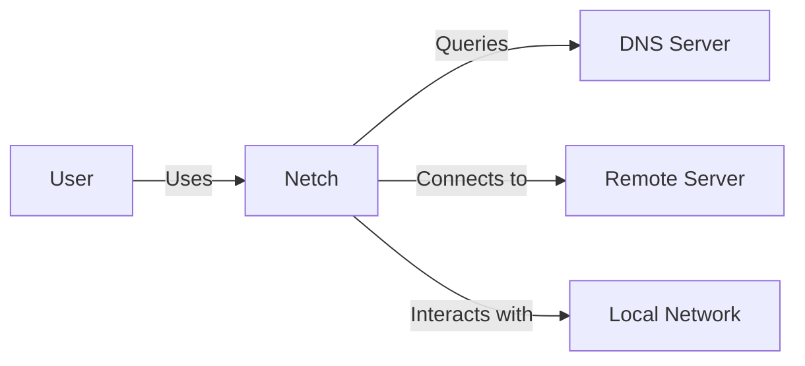
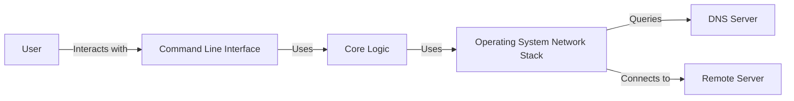
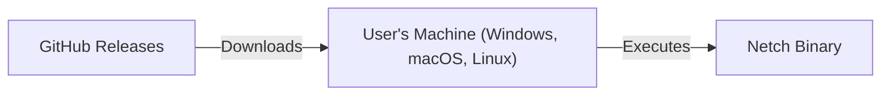
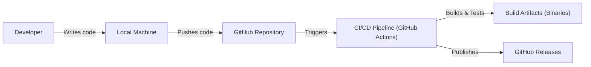

Okay, let's create a detailed design document for the `netch` project, focusing on aspects relevant for threat modeling.

# BUSINESS POSTURE

Business Priorities and Goals:

*   Provide a simple, user-friendly network utility for common networking tasks.
*   Offer a cross-platform tool compatible with Windows, macOS, and Linux.
*   Enable users to perform network diagnostics and troubleshooting.
*   Potentially serve as a learning tool for network concepts.
*   Reduce the need to use multiple, platform-specific tools for basic network checks.

Most Important Business Risks:

*   Malicious use of the tool: `netch` could be used for malicious purposes, such as network scanning or denial-of-service attacks. The project itself doesn't directly mitigate this, as it's a general-purpose tool.  The risk lies in how users choose to employ it.
*   Incorrect or Misleading Output:  If `netch` provides incorrect information, users might make incorrect decisions based on that data, leading to misconfigured networks or unresolved issues.
*   Security Vulnerabilities:  Vulnerabilities in `netch` itself (e.g., buffer overflows, command injection) could be exploited by attackers to compromise the user's system.
*   Supply Chain Attacks: Compromised dependencies or build processes could introduce malicious code into `netch`.
*   Reputational Damage:  Security incidents or widespread bugs could damage the reputation of the project and its maintainers.

# SECURITY POSTURE

Existing Security Controls:

*   security control: Code Reviews: The GitHub repository indicates the use of pull requests, suggesting that code reviews are part of the development process. Location: GitHub repository.
*   security control: Static Analysis: The presence of `.github/workflows` suggests the potential use of automated static analysis tools, although the specific tools used are not detailed in the provided information. Location: `.github/workflows` directory (implied).
*   security control: Dependency Management: The project uses Go modules, which provides a mechanism for managing dependencies and their versions. Location: `go.mod` and `go.sum` files.
*   security control: Least Privilege: The tool likely operates with the privileges of the user executing it, rather than requiring elevated permissions (although some functionality might require admin/root on certain OSes). Location: Implicit in the design.
*   security control: Input Validation: The tool must perform some level of input validation to handle user-provided addresses, ports, and other parameters correctly. Location: Source code (specific locations not yet analyzed).

Accepted Risks:

*   accepted risk: User Misuse: The tool can be used for malicious purposes; this is an inherent risk of providing network utilities.
*   accepted risk: Limited Error Handling: The tool may not handle all possible network error conditions gracefully, potentially leading to unexpected behavior or crashes.
*   accepted risk: Platform-Specific Variations: Network behavior can vary across operating systems, and `netch` may not perfectly abstract all these differences.

Recommended Security Controls:

*   security control: Comprehensive Static Analysis: Implement a robust static analysis pipeline, including SAST (Static Application Security Testing) tools specifically designed for Go, to identify potential vulnerabilities like buffer overflows, command injection, and other common security flaws.
*   security control: Fuzz Testing: Introduce fuzz testing to provide a wide range of invalid, unexpected, or random inputs to the application and identify potential crashes or vulnerabilities.
*   security control: Dependency Security Scanning: Integrate a tool like `dependabot` or `snyk` to automatically scan dependencies for known vulnerabilities and generate alerts or pull requests for updates.
*   security control: Code Signing: Digitally sign releases of `netch` to ensure that users can verify the authenticity and integrity of the downloaded binaries.
*   security control: Sandboxing (where feasible): Explore the possibility of using sandboxing techniques (e.g., containers, seccomp) to limit the potential impact of any vulnerabilities that might be exploited.

Security Requirements:

*   Authentication: Not directly applicable, as `netch` is a command-line utility that doesn't involve user authentication in the traditional sense. It operates under the user's existing credentials.
*   Authorization: Not directly applicable, as `netch` doesn't manage access to resources beyond the user's existing network permissions.
*   Input Validation:
    *   Validate IP addresses and hostnames to ensure they conform to expected formats.
    *   Validate port numbers to ensure they are within the valid range (1-65535).
    *   Sanitize user input to prevent command injection vulnerabilities, especially if any input is used to construct shell commands.
    *   Implement appropriate timeouts and error handling for network operations to prevent resource exhaustion or denial-of-service conditions.
*   Cryptography:
    *   If `netch` implements any features involving encryption (e.g., TLS connections), use well-established cryptographic libraries and algorithms (e.g., Go's `crypto/tls` package).
    *   Avoid implementing custom cryptographic protocols or algorithms.
    *   Ensure proper handling of cryptographic keys and certificates, if applicable.

# DESIGN

## C4 CONTEXT

Element Descriptions:

*   Element:
    *   Name: User
    *   Type: Person
    *   Description: A person who uses Netch to perform network diagnostics.
    *   Responsibilities: Provides input to Netch, interprets the output.
    *   Security controls: Operates Netch within their existing user account privileges.

*   Element:
    *   Name: Netch
    *   Type: Software System
    *   Description: The Netch network utility.
    *   Responsibilities: Executes network commands, processes results, displays output to the user.
    *   Security controls: Input validation, dependency management, potential static analysis, code reviews.

*   Element:
    *   Name: DNS Server
    *   Type: External System
    *   Description: A Domain Name System server used to resolve hostnames to IP addresses.
    *   Responsibilities: Responds to DNS queries from Netch.
    *   Security controls: Relies on the security of the configured DNS server.

*   Element:
    *   Name: Remote Server
    *   Type: External System
    *   Description: A remote server that Netch connects to (e.g., for ping, TCP connection tests).
    *   Responsibilities: Responds to network requests from Netch.
    *   Security controls: Relies on the security of the remote server.

*   Element:
    *   Name: Local Network
    *   Type: External System
    *   Description: The local network that Netch is running on.
    *   Responsibilities: Provides network connectivity.
    *   Security controls: Relies on the security of the local network configuration.

## C4 CONTAINER

Element Descriptions:

*   Element:
    *   Name: User
    *   Type: Person
    *   Description: A person who uses Netch.
    *   Responsibilities: Provides input, interprets output.
    *   Security controls: Operates within existing user account privileges.

*   Element:
    *   Name: Command Line Interface
    *   Type: Container
    *   Description: The interface through which the user interacts with Netch.
    *   Responsibilities: Parses command-line arguments, displays output.
    *   Security controls: Input validation, sanitization.

*   Element:
    *   Name: Core Logic
    *   Type: Container
    *   Description: The main application logic of Netch.
    *   Responsibilities: Implements network functions, processes results.
    *   Security controls: Input validation, dependency management, potential static analysis, code reviews.

*   Element:
    *   Name: Network Stack
    *   Type: Container (Operating System)
    *   Description: The operating system's network stack.
    *   Responsibilities: Provides low-level network access.
    *   Security controls: Relies on the security of the operating system.

*   Element:
    *   Name: DNS Server
    *   Type: External System
    *   Description: A Domain Name System server.
    *   Responsibilities: Responds to DNS queries.
    *   Security controls: Relies on the security of the configured DNS server.

*   Element:
    *   Name: Remote Server
    *   Type: External System
    *   Description: A remote server that Netch connects to.
    *   Responsibilities: Responds to network requests.
    *   Security controls: Relies on the security of the remote server.

## DEPLOYMENT

Possible Deployment Solutions:

1.  Manual Download and Execution: Users download pre-built binaries for their operating system and execute them directly.
2.  Package Managers: Distribution through package managers like `apt`, `yum`, `brew`, `choco`, etc.
3.  Containerization: Packaging `netch` within a Docker container for consistent execution across different environments.
4.  Build from Source: Users clone the repository and build the executable themselves.

Chosen Solution (for detailed description): Manual Download and Execution

Element Descriptions:

*   Element:
    *   Name: User's Machine (Windows, macOS, Linux)
    *   Type: Deployment Node
    *   Description: The user's computer where `netch` will be executed.
    *   Responsibilities: Runs the `netch` binary.
    *   Security controls: Relies on the user's operating system security and user account privileges.

*   Element:
    *   Name: GitHub Releases
    *   Type: Deployment Node
    *   Description: The GitHub Releases page for the `netch` project.
    *   Responsibilities: Hosts pre-built binaries for different operating systems.
    *   Security controls: Relies on GitHub's security infrastructure, potential code signing of releases.

*   Element:
    *   Name: Netch Binary
    *   Type: Artifact
    *   Description: The compiled executable for `netch`.
    *   Responsibilities: Performs network functions.
    *   Security controls: Input validation, dependency management, potential static analysis, code reviews, code signing.

## BUILD

Build Process Description:

1.  Developers write code and commit it to their local Git repository.
2.  Changes are pushed to the central GitHub repository.
3.  A push to specific branches (e.g., `main`, `release`) triggers the CI/CD pipeline (likely GitHub Actions, based on the presence of `.github/workflows`).
4.  The CI pipeline performs the following steps:
    *   Checks out the code.
    *   Sets up the Go environment.
    *   Runs static analysis tools (SAST, linters).
    *   Runs unit and integration tests.
    *   Builds the `netch` binaries for different target operating systems (cross-compilation).
    *   Potentially creates a release on GitHub and uploads the built binaries as assets.
5.  Build artifacts (binaries) are stored as GitHub Releases.

Security Controls in Build Process:

*   security control: Automated Build: The build process is automated using a CI/CD pipeline, reducing the risk of manual errors and ensuring consistency.
*   security control: Static Analysis: SAST and linters are (or should be) integrated into the build process to identify potential security vulnerabilities and code quality issues.
*   security control: Dependency Management: Go modules are used to manage dependencies and their versions, reducing the risk of using outdated or vulnerable libraries.
*   security control: Version Control: All code changes are tracked in a Git repository, providing an audit trail and enabling rollbacks if necessary.
*   security control: (Recommended) Software Bill of Materials (SBOM): Generate an SBOM during the build process to document all components and dependencies used in `netch`.
*   security control: (Recommended) Artifact Signing: Digitally sign the build artifacts to ensure their integrity and authenticity.

# RISK ASSESSMENT

Critical Business Processes:

*   Providing accurate network diagnostics: The core function of `netch` is to provide users with reliable information about their network connections.
*   Maintaining user trust: Users need to trust that `netch` is safe to use and will not compromise their systems.

Data Protection:

*   Data Sensitivity: `netch` itself does not handle highly sensitive data directly. However, it interacts with network infrastructure and could potentially expose information about network configurations, connected devices, and open ports.  The sensitivity of this information depends on the context in which `netch` is used.  For example, running `netch` on a home network is less sensitive than running it on a corporate network.
*   Data Types:
    *   IP addresses (source and destination)
    *   Hostnames
    *   Port numbers
    *   Network interface information
    *   DNS query results
    *   Ping response times
    *   TCP connection status

# QUESTIONS & ASSUMPTIONS

Questions:

*   What specific static analysis tools are currently used in the CI/CD pipeline?
*   Are there any plans to implement more advanced network diagnostic features (e.g., traceroute, TLS certificate inspection)?
*   What is the target audience for `netch` (e.g., home users, network administrators, developers)?
*   What level of error handling and logging is currently implemented?
*   Are there any specific security certifications or compliance requirements that `netch` needs to meet?
*   What is the process for handling security vulnerability reports?

Assumptions:

*   BUSINESS POSTURE: The project prioritizes simplicity and ease of use over advanced features or enterprise-grade security. The project is likely maintained by a small team or individual.
*   SECURITY POSTURE: The project has basic security measures in place (code reviews, dependency management), but there is room for improvement in terms of automated security testing and vulnerability management.
*   DESIGN: The design is relatively simple, with a clear separation between the command-line interface, core logic, and the operating system's network stack. The deployment model is straightforward, relying on pre-built binaries. The build process is automated using GitHub Actions.