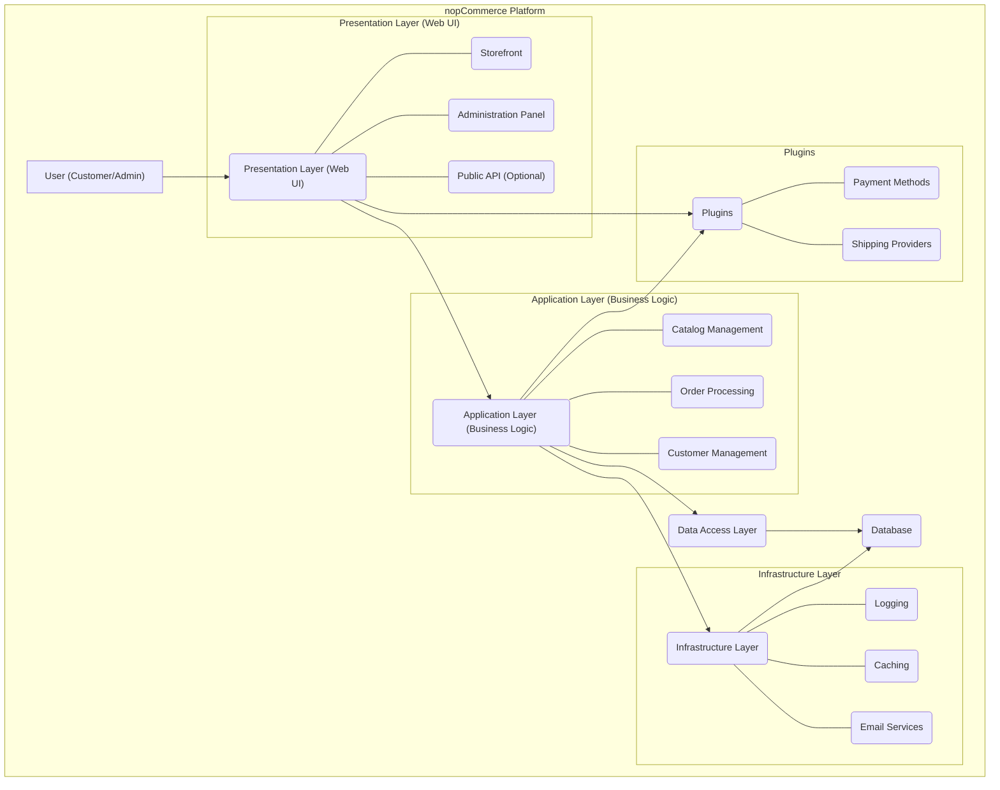
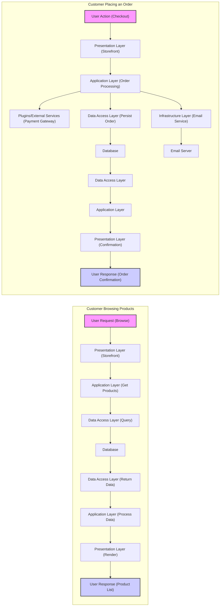
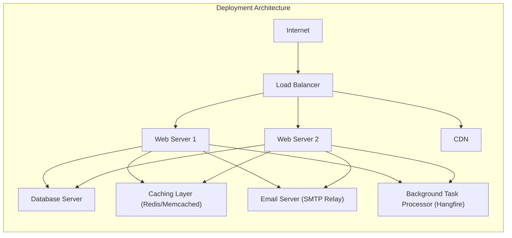

# Project Design Document: nopCommerce Platform

**Version:** 1.1
**Date:** October 26, 2023
**Prepared By:** AI Software Architect

## 1. Project Overview

This document provides an enhanced high-level design of the nopCommerce platform, an open-source e-commerce solution built on the ASP.NET Core framework. This design document is intended to be used as a foundation for subsequent threat modeling activities. It offers a detailed description of the key components, data flows, and technologies involved in the platform, with a focus on aspects relevant to security analysis.

## 2. Goals and Objectives

*   Provide a clear, comprehensive, and more detailed architectural overview of the nopCommerce platform.
*   Identify key components and their interactions with greater specificity.
*   Describe the data flow within the system, including more detailed scenarios.
*   Highlight potential areas of security concern with more concrete examples for future threat modeling.
*   Serve as a robust reference point for security assessments, development efforts, and onboarding new team members.

## 3. Target Audience

*   Security Engineers
*   Software Developers
*   DevOps Engineers
*   Threat Modeling Team
*   Technical Project Managers

## 4. System Architecture

The nopCommerce platform is designed with a layered architecture to promote separation of concerns, maintainability, and testability. The core components are:

*   **Presentation Layer (Web UI):**
    *   Responsible for rendering the user interface and handling user interactions.
    *   Built using ASP.NET Core MVC and Razor views, providing a dynamic web experience.
    *   Includes:
        *   **Storefront:** The public-facing interface for customers to browse products, manage their accounts, and place orders.
        *   **Administration Panel:** A secure interface for administrators to manage the store's catalog, customers, orders, settings, and more.
        *   **Public API (Optional):**  Allows for integration with external applications and services (can be enabled and configured).
    *   Handles:
        *   Receiving HTTP requests from users.
        *   Rendering HTML, CSS, and JavaScript to the browser.
        *   Sending requests to the Application Layer.
        *   Displaying responses received from the Application Layer.
*   **Application Layer (Business Logic):**
    *   Contains the core business logic and workflows that drive the e-commerce platform's functionality.
    *   Implements features such as:
        *   **Catalog Management:** Managing products, categories, manufacturers, and attributes.
        *   **Order Processing:** Handling order placement, payment processing, shipping, and order status updates.
        *   **Customer Management:** Managing customer accounts, roles, addresses, and order history.
        *   **Marketing Functionalities:** Implementing promotions, discounts, coupons, and email marketing.
        *   **Content Management:** Managing static content pages, blog posts, and news.
    *   Orchestrates interactions between the Presentation Layer and the Data Access Layer.
    *   Utilizes:
        *   **Services:** Encapsulate specific business functionalities (e.g., `IProductService`, `IOrderService`).
        *   **Managers:** Coordinate complex business processes involving multiple services.
        *   **Event Handlers:** Allow for decoupled execution of logic in response to system events.
*   **Data Access Layer:**
    *   Provides an abstraction layer for interacting with the underlying data storage mechanism.
    *   Uses Entity Framework Core (EF Core) as the Object-Relational Mapper (ORM) to map domain entities to database tables.
    *   Handles:
        *   Data retrieval (reading data from the database).
        *   Data persistence (saving, updating, and deleting data in the database).
        *   Querying the database using LINQ (Language Integrated Query).
    *   Defines:
        *   **Data Models (Entities):** Represent the structure of data in the application (e.g., `Product`, `Customer`, `Order`).
        *   **Database Context:**  Provides a session for interacting with the database.
        *   **Repositories (Optional):** Can be used to further abstract data access logic.
*   **Infrastructure Layer:**
    *   Contains cross-cutting concerns and supporting functionalities that are used throughout the application.
    *   Includes:
        *   **Logging:**  Records application events, errors, and security-related activities.
        *   **Caching:** Stores frequently accessed data in memory or a distributed cache to improve performance.
        *   **Email Services:** Handles sending emails for order confirmations, password resets, and marketing communications.
        *   **Background Tasks:** Executes asynchronous tasks, such as sending emails or processing scheduled jobs.
        *   **Security Utilities:**  Provides functionalities for encryption, hashing, and authentication.
        *   **Localization:** Supports multiple languages and cultures.
*   **Plugins:**
    *   Provides a modular and extensible architecture, allowing developers to add new features and integrations without modifying the core platform.
    *   Types of plugins:
        *   **Widgets:** Small UI components that can be added to various parts of the storefront.
        *   **Payment Methods:** Integrate with different payment gateways (e.g., PayPal, Stripe).
        *   **Shipping Providers:** Integrate with various shipping carriers (e.g., UPS, FedEx).
        *   **Tax Providers:** Calculate taxes based on different rules and jurisdictions.
        *   **External Authentication Methods:** Allow users to log in using third-party accounts (e.g., Google, Facebook).
        *   **Themes:** Customize the look and feel of the storefront.

## 5. Data Flow

The following describes the data flow for several common user interactions, providing more detail than the previous version:

*   **Customer Browsing Products:**
    *   User sends an HTTP GET request to the Presentation Layer (Web UI), specifically the Storefront, to view a product catalog or details.
    *   The Presentation Layer's controller action calls the appropriate service in the Application Layer (e.g., `IProductService.GetProducts()`).
    *   The Application Layer service utilizes the Data Access Layer's repository or database context to query the Database for product information (including details, images, pricing, etc.).
    *   The Database returns the requested product data to the Data Access Layer.
    *   The Data Access Layer maps the database results to domain entities and returns them to the Application Layer.
    *   The Application Layer processes the data (e.g., applies discounts, formats prices) and returns a data transfer object (DTO) to the Presentation Layer.
    *   The Presentation Layer's view engine renders the product information into HTML and sends it back to the user's browser as an HTTP response.
*   **Customer Adding Product to Cart:**
    *   User interacts with the Storefront (e.g., clicks an "Add to Cart" button), sending an HTTP POST request to the Presentation Layer.
    *   The Presentation Layer's controller action calls the Application Layer's shopping cart service (e.g., `IShoppingCartService.AddToCart()`).
    *   The Application Layer service retrieves the product information from the Data Access Layer.
    *   The service updates the shopping cart data, typically stored in the Database (for persistent carts) or in a session store (for temporary carts).
    *   If using a database, the Data Access Layer is used to persist the changes.
    *   The updated cart information (e.g., item count, total price) is returned to the Presentation Layer.
    *   The Presentation Layer updates the cart display on the user's interface.
*   **Customer Placing an Order:**
    *   User initiates the checkout process through the Storefront, involving multiple steps and interactions with the Presentation Layer.
    *   The Presentation Layer interacts with various services in the Application Layer for order processing steps:
        *   Address selection (`IAddressService`).
        *   Shipping method selection (`IShippingService`).
        *   Payment method selection and processing (`IPaymentService`, potentially involving Plugins for specific payment gateways).
    *   The Application Layer interacts with external services (e.g., payment gateways) through Plugins or direct integrations, securely transmitting payment information.
    *   Order details, including customer information, shipping details, and payment information, are persisted in the Database via the Data Access Layer.
    *   Inventory levels are updated in the Database.
    *   Confirmation emails are sent to the customer and administrator via the Infrastructure Layer's email service.
    *   The Presentation Layer displays an order confirmation page to the user.
*   **Administrator Managing Products:**
    *   Administrator logs into the Administration Panel (Presentation Layer) using secure authentication.
    *   Administrator interacts with the UI to create, update, or delete product information, sending HTTP requests to the Presentation Layer.
    *   The Presentation Layer's controller actions call the appropriate services in the Application Layer (e.g., `IProductService.CreateProduct()`, `IProductService.UpdateProduct()`, `IProductService.DeleteProduct()`).
    *   The Application Layer services use the Data Access Layer to modify product data in the Database.
    *   Changes are reflected in the Administration Panel's user interface.
    *   Audit logs are generated via the Infrastructure Layer's logging service to track administrative actions.

## 6. Key Technologies

*   **Programming Language:** C#
*   **Framework:** ASP.NET Core (.NET 6 or later recommended)
*   **Web Server:** Kestrel (cross-platform, default for ASP.NET Core), can be used with reverse proxies like IIS (Windows) or Nginx/Apache (Linux) in production environments.
*   **Database:** Supports various relational database management systems (RDBMS):
    *   Microsoft SQL Server
    *   MySQL
    *   PostgreSQL
    *   SQLite (primarily for development or small-scale deployments)
*   **ORM:** Entity Framework Core (EF Core)
*   **Frontend Technologies:** HTML5, CSS3, JavaScript (often with jQuery), potentially other JavaScript frameworks or libraries.
*   **Caching:**
    *   In-memory caching (using `IMemoryCache`).
    *   Distributed caching (e.g., Redis, Memcached) for scalability and multi-instance deployments.
*   **Dependency Injection:** Built-in ASP.NET Core dependency injection container for managing component dependencies.
*   **Plugin Architecture:** Based on .NET assembly loading and a well-defined plugin interface.
*   **Background Task Processing:**  Libraries like Hangfire or built-in ASP.NET Core background services for handling asynchronous tasks.
*   **Logging:**  Uses standard .NET logging abstractions (`ILogger`) with providers like Serilog or NLog.

## 7. Security Considerations (More Detailed)

This section expands on potential areas of security concern, providing more specific examples of threats and potential mitigation strategies:

*   **Authentication and Authorization:**
    *   **Threats:** Brute-force attacks on login forms, credential stuffing, session hijacking, privilege escalation.
    *   **Considerations:**
        *   Enforce strong password policies and complexity requirements.
        *   Implement multi-factor authentication (MFA).
        *   Use secure password hashing algorithms (e.g., Argon2).
        *   Implement account lockout policies after multiple failed login attempts.
        *   Securely manage session identifiers (e.g., using HTTP-only and secure cookies).
        *   Implement role-based access control (RBAC) to restrict access to administrative functionalities.
        *   Protect API endpoints with authentication and authorization mechanisms (e.g., OAuth 2.0).
*   **Input Validation and Sanitization:**
    *   **Threats:** SQL injection, cross-site scripting (XSS), cross-site request forgery (CSRF), command injection.
    *   **Considerations:**
        *   Validate all user inputs on both the client-side and server-side.
        *   Sanitize user-generated content before displaying it to prevent XSS attacks.
        *   Use parameterized queries or ORM features to prevent SQL injection.
        *   Implement anti-CSRF tokens to protect against CSRF attacks.
        *   Avoid directly executing user-provided input as commands.
*   **Data Protection:**
    *   **Threats:** Data breaches, unauthorized access to sensitive information, man-in-the-middle attacks.
    *   **Considerations:**
        *   Encrypt sensitive data at rest (e.g., customer PII, payment details) using appropriate encryption algorithms.
        *   Enforce HTTPS for all communication to protect data in transit.
        *   Securely store encryption keys and manage access to them.
        *   Comply with relevant data privacy regulations (e.g., GDPR, CCPA).
        *   Implement proper data masking or anonymization techniques when necessary.
*   **Session Management:**
    *   **Threats:** Session hijacking, session fixation.
    *   **Considerations:**
        *   Use strong, randomly generated session IDs.
        *   Regenerate session IDs after successful login to prevent session fixation.
        *   Set appropriate session timeouts.
        *   Store session data securely (e.g., using secure cookies or server-side storage).
        *   Invalidate sessions upon logout.
*   **Payment Processing Security:**
    *   **Threats:** Credit card fraud, data breaches involving payment information.
    *   **Considerations:**
        *   Adhere to PCI DSS standards if handling credit card information directly.
        *   Utilize secure payment gateways and tokenization to avoid storing sensitive payment data.
        *   Implement fraud detection mechanisms.
        *   Ensure secure communication with payment processors.
*   **Plugin Security:**
    *   **Threats:** Vulnerabilities in third-party plugins that can be exploited to compromise the platform.
    *   **Considerations:**
        *   Implement a mechanism for plugin verification and security scanning.
        *   Encourage the use of plugins from trusted sources.
        *   Isolate plugins to limit the impact of potential vulnerabilities.
        *   Regularly update plugins to patch known security issues.
*   **Security Misconfiguration:**
    *   **Threats:** Exposing sensitive information due to misconfigured servers or applications.
    *   **Considerations:**
        *   Follow security best practices for configuring web servers, databases, and other components.
        *   Disable unnecessary features and services.
        *   Regularly review security configurations.
        *   Implement security hardening measures.
*   **Dependency Vulnerabilities:**
    *   **Threats:** Exploiting known vulnerabilities in third-party libraries and frameworks.
    *   **Considerations:**
        *   Maintain an inventory of all dependencies.
        *   Regularly update dependencies to the latest secure versions.
        *   Use vulnerability scanning tools to identify and address known vulnerabilities.
*   **Error Handling and Logging:**
    *   **Threats:** Information leakage through verbose error messages, insufficient logging for security monitoring.
    *   **Considerations:**
        *   Implement secure error handling that does not expose sensitive information to users.
        *   Log security-related events (e.g., login attempts, failed authorization attempts, changes to critical data).
        *   Regularly review audit logs for suspicious activity.

## 8. Deployment Architecture (More Detailed)

A robust deployment architecture for nopCommerce, suitable for production environments, typically involves the following components:

*   **Web Server(s):**
    *   Purpose: Hosts the nopCommerce application and handles incoming user requests.
    *   Technology: Kestrel (as the core), often fronted by a reverse proxy like IIS (on Windows) or Nginx/Apache (on Linux) for enhanced security, load balancing, and SSL termination.
    *   Configuration: Should be hardened according to security best practices, with appropriate firewall rules and access controls.
*   **Database Server(s):**
    *   Purpose: Stores the persistent data for the nopCommerce application.
    *   Technology: Microsoft SQL Server, MySQL, or PostgreSQL, chosen based on scalability, performance, and organizational preferences.
    *   Configuration: Should be secured with strong passwords, restricted access, and potentially data-at-rest encryption. Consider database clustering or replication for high availability.
*   **Load Balancer:**
    *   Purpose: Distributes incoming traffic across multiple web servers to improve performance, availability, and fault tolerance.
    *   Technology: Hardware or software load balancers (e.g., HAProxy, Nginx, cloud-based load balancers).
    *   Configuration:  Should be configured for health checks and appropriate load balancing algorithms.
*   **Content Delivery Network (CDN):**
    *   Purpose: Caches static assets (images, CSS, JavaScript files) at geographically distributed locations to reduce latency and improve loading times for users.
    *   Technology: Cloudflare, Amazon CloudFront, Azure CDN, etc.
    *   Configuration:  Needs to be configured to serve static content efficiently and securely.
*   **Caching Layer:**
    *   Purpose: Improves application performance by storing frequently accessed data in a fast-access cache.
    *   Technology: Redis or Memcached are common choices for distributed caching.
    *   Configuration:  Should be secured and configured with appropriate eviction policies.
*   **Email Server (SMTP Relay):**
    *   Purpose: Handles sending transactional and marketing emails generated by the nopCommerce application.
    *   Technology:  Can be a dedicated SMTP server or a cloud-based email service (e.g., SendGrid, Mailgun).
    *   Configuration:  Requires secure authentication and proper SPF/DKIM/DMARC records to improve email deliverability and prevent spoofing.
*   **Background Task Processor:**
    *   Purpose: Executes asynchronous and scheduled tasks, such as sending emails, processing orders, or running maintenance jobs.
    *   Technology: Hangfire or ASP.NET Core background services.
    *   Configuration:  Needs to be configured for reliability and fault tolerance.

## 9. Assumptions and Constraints

*   This design document provides a general overview of the nopCommerce platform. Specific implementations and configurations may vary.
*   The security considerations outlined are intended to be comprehensive but may not cover all potential vulnerabilities. A thorough threat modeling exercise is necessary.
*   The deployment architecture is a typical example and can be adapted based on specific requirements, scale, and budget.
*   It is assumed that the development and deployment teams adhere to secure development lifecycle (SDLC) principles and security best practices.

This enhanced design document provides a more detailed and comprehensive understanding of the nopCommerce platform's architecture, which is essential for effective threat modeling and security analysis. The expanded descriptions of components, data flows, and security considerations offer a stronger foundation for identifying potential vulnerabilities and designing appropriate security controls.