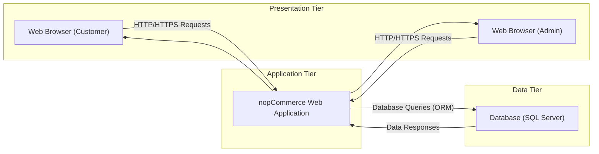
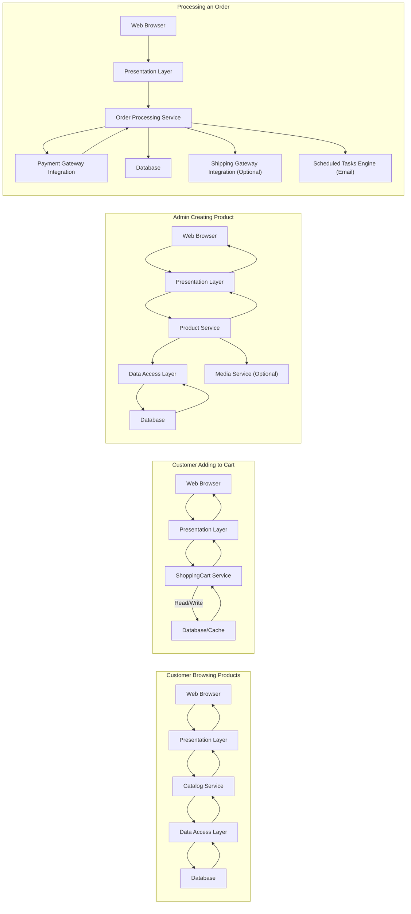

# Project Design Document: nopCommerce E-commerce Platform

**Version:** 1.1
**Date:** October 26, 2023
**Author:** AI Software Architecture Expert

## 1. Project Overview

nopCommerce is a comprehensive, free, and open-source e-commerce platform built on ASP.NET Core. It offers a wide range of features for creating and managing online stores of various sizes and complexities. This document provides an enhanced architectural overview, focusing on details relevant for thorough threat modeling.

## 2. Goals and Objectives

*   Provide a more granular architectural overview of nopCommerce, emphasizing security-relevant components.
*   Detail the interactions between key components with a focus on data flow and security boundaries.
*   Elaborate on potential security considerations, providing specific examples for threat identification.
*   Clearly define security boundaries within the architecture.
*   Serve as a robust foundation for detailed threat modeling exercises and subsequent security mitigation planning.

## 3. Target Audience

*   Security architects and engineers responsible for threat modeling and security assessments.
*   Development teams involved in customizing, extending, or maintaining nopCommerce.
*   IT operations personnel responsible for deploying, configuring, and securing nopCommerce environments.
*   Auditors and compliance officers assessing the security posture of nopCommerce deployments.

## 4. High-Level Architecture

nopCommerce employs a layered architecture, separating concerns for improved maintainability and security.

*   **Presentation Tier (Client-Side):**  The user interface rendered in web browsers.
    *   Customer-facing storefront.
    *   Administrative panel.
*   **Application Tier (Server-Side):** Hosts the core business logic and application services.
    *   Web application built on ASP.NET Core.
*   **Data Tier (Persistence):**  Manages persistent data storage.
    *   Relational database (typically SQL Server).

## 5. Component Details

This section provides a more detailed breakdown of the key components, crucial for identifying potential attack surfaces.

*   **Presentation Tier Components:**
    *   **Public Storefront (ASP.NET Core Razor Pages/MVC):**  Handles rendering product catalogs, user accounts, shopping carts, and checkout processes.
    *   **Administration Panel (ASP.NET Core MVC):** Provides interfaces for managing products, orders, customers, content, promotions, and system settings.
    *   **Themes and Plugins (Frontend Assets):**  Includes CSS, JavaScript, and image files that customize the look and functionality of the storefront and admin panel.

*   **nopCommerce Web Application Components (Application Tier):**
    *   **Presentation Layer (ASP.NET Core MVC Controllers and Views):**  Receives HTTP requests, orchestrates business logic calls, and returns responses.
    *   **Service Layer (C# Services):**  Implements core business logic for areas like catalog management, order processing, customer management, and payment handling.
    *   **Domain Layer (C# Entities):** Represents the core business objects and their relationships (e.g., `Product`, `Customer`, `Order`).
    *   **Data Access Layer (Entity Framework Core Context and Repositories):**  Provides an abstraction layer for interacting with the database, preventing direct SQL queries in most cases.
    *   **Plugin Infrastructure:**  Enables the development and integration of custom modules, potentially introducing security risks if not developed securely.
    *   **Scheduled Tasks Engine:**  Executes background jobs, such as sending emails, processing recurring payments, or updating data.
    *   **Authentication and Authorization Module (ASP.NET Core Identity):**  Manages user accounts, logins, roles, permissions, and password management.
    *   **Payment Gateway Integration Components:**  Handles communication with various third-party payment processors (e.g., PayPal, Stripe).
    *   **Shipping Gateway Integration Components:**  Manages communication with shipping providers (e.g., UPS, FedEx).
    *   **Caching Layer (In-Memory or Distributed Cache):**  Stores frequently accessed data to improve performance.
    *   **Logging Framework (e.g., Serilog):**  Records application events, errors, and security-related activities.
    *   **Message Queue Integration (Optional - e.g., RabbitMQ, Azure Service Bus):**  Facilitates asynchronous communication between components.
    *   **Event System:** Allows components to publish and subscribe to events within the application.
    *   **Localization and Globalization Module:**  Handles multi-language support and regional settings.

*   **Database Components (Data Tier):**
    *   **SQL Server Database Instance:** Stores all persistent data for the application.
        *   **Product Catalog Tables:**  Information about products, categories, manufacturers, attributes, and specifications.
        *   **Customer Management Tables:**  Details about customer accounts, addresses, roles, and shopping carts.
        *   **Order Management Tables:**  Information about orders, order items, shipping details, and payment transactions.
        *   **Content Management Tables:**  Data for pages, blog posts, news items, and polls.
        *   **Configuration Tables:**  Store settings for the store, themes, plugins, and security.
        *   **Security Tables:**  User accounts, roles, permissions, and access control lists.
        *   **Log Tables:**  Records of application events and errors.

## 6. Data Flow

This section elaborates on data flow for critical user interactions, highlighting the components involved and potential security implications.

*   **Customer Browsing Product Details:**
    *   `Web Browser (Customer)` sends an HTTP GET request to the `nopCommerce Web App (Presentation Layer)` (e.g., `/product/{id}`).
    *   The `Presentation Layer` invokes the `Catalog Service` in the `Service Layer`.
    *   The `Catalog Service` uses the `Product Repository` in the `Data Access Layer` to query the `Database` for product information.
    *   The `Database` returns the product data to the `Data Access Layer`.
    *   The `Data Access Layer` returns the data to the `Catalog Service`.
    *   The `Catalog Service` processes the data and returns it to the `Presentation Layer`.
    *   The `Presentation Layer` renders the product details view and sends the HTML response back to the `Web Browser`.

*   **Customer Adding a Product to the Shopping Cart:**
    *   `Web Browser (Customer)` sends an HTTP POST request (typically AJAX) to the `nopCommerce Web App (Presentation Layer)` (e.g., `/addtocart/{id}`).
    *   The `Presentation Layer` invokes the `ShoppingCart Service` in the `Service Layer`.
    *   The `ShoppingCart Service` retrieves product information (potentially from `Cache`) and validates the request.
    *   The `ShoppingCart Service` updates the shopping cart data in the `Database` (or session storage).
    *   The `ShoppingCart Service` returns a success or failure response to the `Presentation Layer`.
    *   The `Presentation Layer` updates the cart display in the `Web Browser`.

*   **Administrator Creating a New Product:**
    *   `Web Browser (Admin)` sends an HTTP POST request to the `nopCommerce Web App (Presentation Layer)` with product details.
    *   The `Authentication and Authorization Module` verifies the administrator's credentials and permissions.
    *   The `Presentation Layer` invokes the `Product Service` in the `Service Layer`.
    *   The `Product Service` validates the product data.
    *   The `Product Service` uses the `Product Repository` in the `Data Access Layer` to insert the new product information into the `Database`.
    *   The `Product Service` may interact with other services (e.g., `Media Service` for images).
    *   The `Product Service` returns a success or failure response to the `Presentation Layer`.
    *   The `Presentation Layer` updates the admin panel in the `Web Browser`.

*   **Processing an Order (Checkout Flow):**
    *   `Web Browser (Customer)` submits order details through the storefront.
    *   The `nopCommerce Web App` receives the order information.
    *   The `Order Processing Service` validates the order details (inventory, shipping address).
    *   The `Order Processing Service` interacts with the `Payment Gateway Integration Component` to process payment.
    *   Upon successful payment, the `Order Processing Service` creates the order record in the `Database`.
    *   The `Order Processing Service` may interact with the `Shipping Gateway Integration Component`.
    *   The `Order Processing Service` triggers events that may be handled by other components (e.g., sending confirmation emails via the `Scheduled Tasks Engine`).

## 7. Security Considerations (For Threat Modeling)

This section expands on potential security vulnerabilities and threats, providing specific examples for more effective threat modeling.

*   **Authentication and Authorization:**
    *   **Threats:** Brute-force attacks on login forms, credential stuffing using leaked credentials, weak password policies, insufficient protection against account lockout bypass, privilege escalation vulnerabilities, insecure session management (e.g., predictable session IDs, lack of HTTPOnly/Secure flags), vulnerabilities in multi-factor authentication implementations (if enabled).
    *   **Examples:** An attacker attempting to guess admin passwords, a user exploiting a flaw to gain access to another user's account, an unauthenticated user accessing administrative functionalities.

*   **Input Validation and Output Encoding:**
    *   **Threats:** Cross-Site Scripting (XSS) in product descriptions, user comments, or admin panel inputs; SQL Injection through vulnerable database queries in custom plugins or poorly written code; Cross-Site Request Forgery (CSRF) allowing attackers to perform actions on behalf of logged-in users; LDAP injection if integrated with LDAP directories; Command Injection if the application executes external commands based on user input; Path Traversal vulnerabilities allowing access to sensitive files.
    *   **Examples:** Injecting malicious JavaScript into a product description that executes when other users view the page, crafting a URL that forces a logged-in admin to perform an unintended action.

*   **Payment Processing Security:**
    *   **Threats:** Man-in-the-middle attacks intercepting payment information, vulnerabilities in payment gateway integrations leading to data breaches, insecure storage of sensitive payment data (though nopCommerce typically delegates this to payment processors), replay attacks on payment transactions, fraudulent order placement.
    *   **Examples:** An attacker intercepting credit card details during checkout, a vulnerability in a payment plugin allowing unauthorized access to transaction data.

*   **Data Protection and Privacy:**
    *   **Threats:** Data breaches exposing customer PII (names, addresses, emails, order history), insecure storage of sensitive data at rest (e.g., lack of encryption), insufficient protection of data in transit (e.g., not enforcing HTTPS), non-compliance with data privacy regulations (e.g., GDPR, CCPA).
    *   **Examples:** A database breach exposing customer addresses, lack of HTTPS allowing eavesdropping on user sessions.

*   **Plugin Security:**
    *   **Threats:** Vulnerabilities in third-party plugins (e.g., XSS, SQL Injection), malicious plugins designed to steal data or compromise the system, insecure plugin update mechanisms.
    *   **Examples:** A vulnerable plugin allowing an attacker to execute arbitrary code on the server, a malicious plugin injecting spam or malware.

*   **Dependency Management:**
    *   **Threats:** Exploiting known vulnerabilities in outdated third-party libraries and frameworks used by nopCommerce, insecure dependencies introduced through the plugin system.
    *   **Examples:** Using an old version of a library with a known security flaw, a plugin introducing a vulnerable dependency.

*   **Deployment and Infrastructure Security:**
    *   **Threats:** Misconfigured web server (e.g., exposing sensitive files), insecure database server configurations, weak server passwords, lack of network segmentation, insufficient access controls to the server infrastructure, vulnerabilities in the operating system.
    *   **Examples:** An attacker gaining access to the database server due to a weak password, a misconfigured web server exposing configuration files.

*   **Denial of Service (DoS) and Distributed Denial of Service (DDoS):**
    *   **Threats:** Resource exhaustion attacks targeting the web server or database, application-level DoS attacks exploiting specific functionalities, DDoS attacks overwhelming the server with traffic.
    *   **Examples:** An attacker sending a large number of requests to a resource-intensive page, a botnet flooding the website with traffic.

*   **Information Disclosure:**
    *   **Threats:** Exposure of sensitive information through error messages, verbose logging, insecure HTTP headers, publicly accessible backup files.
    *   **Examples:** Error messages revealing database connection details, publicly accessible database backups.

## 8. Security Boundaries

Identifying security boundaries is crucial for understanding trust relationships and potential attack vectors. Key security boundaries within nopCommerce include:

*   **Between the Web Browser and the Web Server:**  This boundary should be protected by HTTPS to ensure confidentiality and integrity of data in transit.
*   **Between the Web Application and the Database:**  Authentication and authorization mechanisms should secure database access. Input validation on the application side prevents malicious data from reaching the database.
*   **Between the nopCommerce Core and Plugins:** Plugins operate with the same privileges as the core application, making secure plugin development and vetting essential. This is a critical trust boundary.
*   **Between the nopCommerce Application and External Services (Payment/Shipping Gateways):** Secure communication protocols (e.g., HTTPS, API keys, signatures) are necessary to protect sensitive data exchanged with external services.
*   **Between the Public Storefront and the Administration Panel:**  Strong authentication and authorization mechanisms are required to prevent unauthorized access to the admin panel.

## 9. Deployment Model

nopCommerce offers flexibility in deployment options, each with its own security implications.

*   **On-Premise Deployment:**  The organization manages all aspects of the infrastructure, requiring robust security measures for servers, networks, and the application itself.
    *   **Example:** Hosting nopCommerce on physical servers within a corporate data center.
*   **Cloud-Based Deployment (IaaS, PaaS):** Leveraging cloud providers like Azure, AWS, or Google Cloud shifts some infrastructure security responsibilities to the provider but still requires careful configuration and management of the application and data.
    *   **Example (Azure):** Deploying nopCommerce to Azure App Service with Azure SQL Database.
    *   **Example (AWS):** Deploying nopCommerce to EC2 instances with Amazon RDS for SQL Server.
*   **Managed nopCommerce Hosting:**  A specialized hosting provider manages the infrastructure and often provides nopCommerce-specific security configurations and updates.
    *   **Example:** Utilizing a hosting provider that specializes in nopCommerce hosting on their infrastructure.

Deployment considerations include:

*   **Network Security:** Firewalls, intrusion detection/prevention systems.
*   **Server Hardening:** Secure operating system and web server configurations.
*   **Database Security:** Strong passwords, access controls, encryption at rest.
*   **Regular Security Updates and Patching:**  Applying updates to the nopCommerce platform, operating system, and dependencies.

## 10. Assumptions and Constraints

*   It is assumed that the nopCommerce codebase is the primary source of truth for architectural details.
*   This document focuses on the standard nopCommerce implementation and may not cover all possible customizations or third-party integrations.
*   Security best practices for the underlying infrastructure (operating system, web server, database) are assumed to be in place.
*   Threat modeling activities will utilize this document as a starting point and will involve further detailed analysis.

## 11. Future Enhancements (Potential Areas for Evolution with Security Implications)

*   **Microservices Architecture:**  While potentially improving scalability and resilience, introducing new inter-service communication channels and authentication/authorization challenges.
*   **Headless Commerce API:**  Exposing more backend functionality through APIs requires careful API security design and implementation (e.g., authentication, authorization, rate limiting).
*   **GraphQL API:**  While offering flexibility, requires careful consideration of security aspects like query complexity limits and authorization.
*   **Enhanced Plugin Isolation:**  Implementing mechanisms to isolate plugins and limit their access to system resources could improve overall security.

This improved design document provides a more comprehensive and detailed view of the nopCommerce architecture, specifically tailored for effective threat modeling. It highlights key components, data flows, security boundaries, and potential vulnerabilities, enabling security professionals to conduct thorough risk assessments and develop appropriate mitigation strategies.