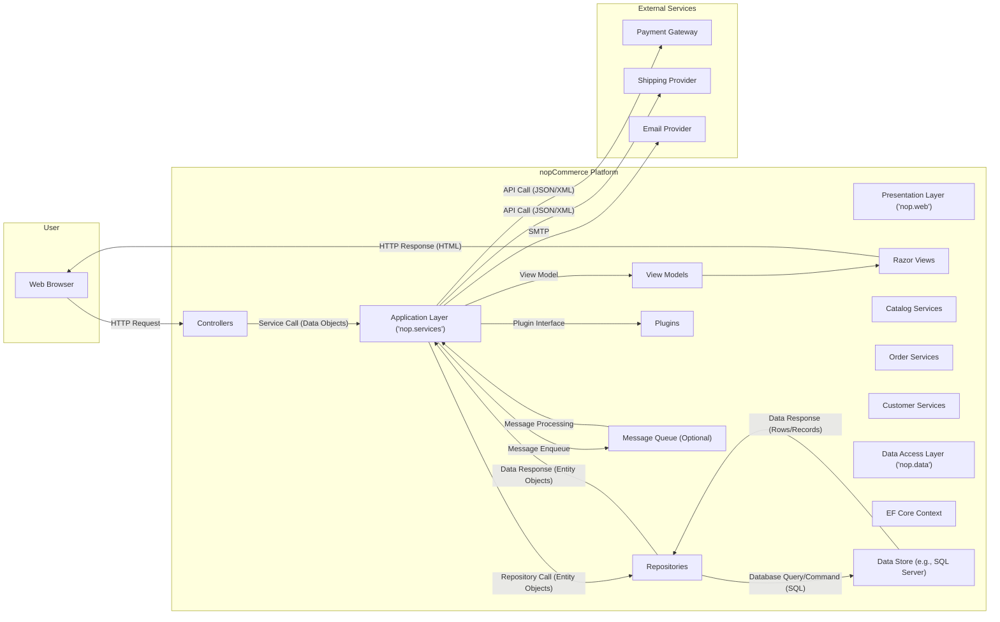
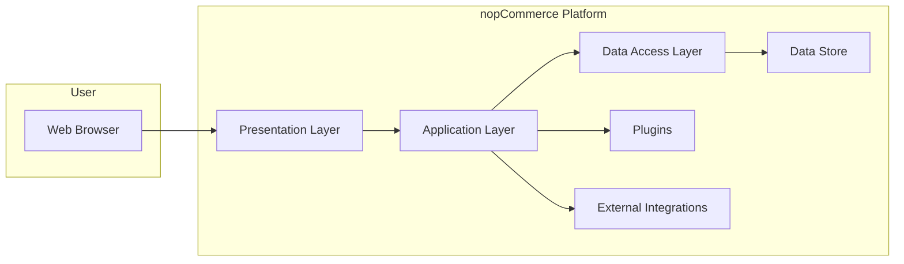
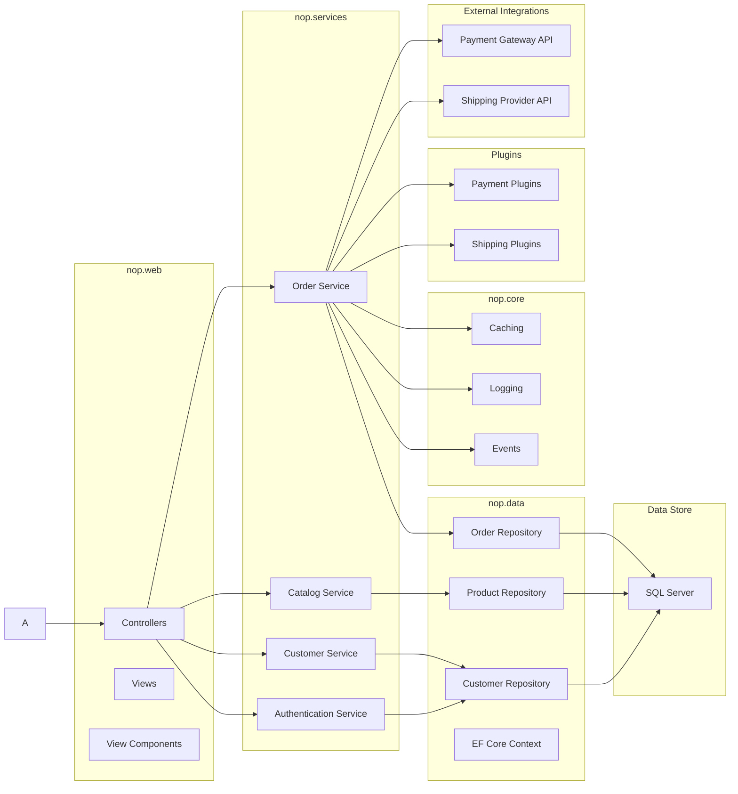

# Project Design Document: nopCommerce E-commerce Platform

**Version:** 1.1
**Date:** October 26, 2023
**Prepared By:** AI Software Architect

## 1. Introduction

This document provides an enhanced and more detailed architectural design of the nopCommerce open-source e-commerce platform. Building upon the previous version, it offers a deeper understanding of the system's components, interactions, and data flow, specifically tailored for comprehensive threat modeling activities. This document serves as a robust foundation for identifying potential security vulnerabilities and designing effective mitigation strategies.

## 2. Goals

*   Clearly and comprehensively define the architecture of the nopCommerce platform, including key sub-components.
*   Identify key components and their specific responsibilities with greater granularity.
*   Describe the interactions and data flow between components in detail, including specific data types.
*   Provide a robust and actionable basis for conducting thorough threat modeling exercises.
*   Serve as a detailed reference for security assessments, penetration testing, and design improvements.

## 3. Scope

This document covers the core architectural components of the nopCommerce platform as represented in the provided GitHub repository, with a focus on elements critical for security analysis. It delves deeper into the logical and physical structure of the application, including its web interface, business logic, data access layer, key integrations, and common extension points. While it still avoids feature-specific details, it provides more context on common plugin types and their interaction with the core.

## 4. Target Audience

This document is intended for:

*   Security architects and engineers responsible for in-depth threat modeling, security assessments, and penetration testing.
*   Development teams working on the core nopCommerce platform or developing extensions and integrations.
*   Cloud architects designing secure and scalable deployment environments for nopCommerce.
*   DevOps engineers responsible for the secure deployment and maintenance of nopCommerce instances.
*   Anyone requiring a highly detailed understanding of the nopCommerce architecture for security analysis.

## 5. Architectural Overview

nopCommerce is a sophisticated, extensible multi-tenant e-commerce platform built on the ASP.NET Core framework. It adheres to a well-defined layered architecture, rigorously separating concerns into distinct tiers for presentation, application logic, and data access. This modular design facilitates maintainability, testability, and security. The platform's extensibility through plugins and themes is a core architectural feature, impacting security considerations.

## 6. Key Components (Detailed)

*   **Presentation Layer (nop.web):**
    *   Responsible for all aspects of the user interface and user interaction handling.
    *   Built using ASP.NET Core MVC, leveraging the Model-View-Controller pattern.
    *   Utilizes Razor views for dynamic HTML generation, controllers for handling requests, and view models for data transfer.
    *   Handles HTTP requests and form submissions, managing the application's workflow from the user's perspective.
    *   Includes a theming engine allowing for extensive customization of the visual appearance and layout.
    *   **Sub-components:**
        *   Controllers (e.g., `ProductController`, `OrderController`, `CustomerController`).
        *   Razor Views (`.cshtml` files).
        *   View Models (specific data structures for views).
        *   Tag Helpers (for custom HTML rendering logic).
        *   Static Files (CSS, JavaScript, images).
*   **Application Layer (nop.services):**
    *   Encapsulates the core business logic and rules of the e-commerce platform.
    *   Implements key use cases such as product catalog management, shopping cart operations, order processing, customer account management, marketing campaigns, and promotions.
    *   Provides a set of services (interfaces and implementations) that are consumed by the presentation layer and other parts of the application.
    *   Contains domain entities representing core business concepts and their associated behaviors.
    *   Handles data validation and business rule enforcement.
    *   **Sub-components:**
        *   Catalog Services (e.g., `ProductService`, `CategoryService`).
        *   Order Services (e.g., `OrderProcessingService`, `ShoppingCartService`).
        *   Customer Services (e.g., `CustomerRegistrationService`, `CustomerAuthenticationService`).
        *   Payment Services (abstractions for payment gateway integration).
        *   Shipping Services (abstractions for shipping provider integration).
*   **Data Access Layer (nop.data):**
    *   Manages all interactions with the underlying data store, abstracting away database-specific details.
    *   Utilizes Entity Framework Core (EF Core) as the primary Object-Relational Mapper (ORM).
    *   Defines database entities (POCO classes) that map to database tables and their relationships.
    *   Provides repositories (interfaces and implementations) for performing data access operations (CRUD).
    *   Includes the EF Core `DbContext` which represents a session with the database.
    *   **Sub-components:**
        *   Entity Configurations (mapping entities to database schema).
        *   Repository Interfaces (e.g., `IRepository<Product>`).
        *   Repository Implementations (using EF Core).
        *   Database Context (`NopObjectContext`).
*   **Infrastructure Layer (nop.core, nop.framework):**
    *   Provides foundational components, utilities, and cross-cutting concerns used throughout the application.
    *   Includes common services for caching, logging, event handling, and dependency injection.
    *   Provides abstractions and interfaces for common functionalities, promoting loose coupling.
    *   Handles application startup and configuration.
    *   **Key components:**
        *   Dependency Injection (`IServiceCollection`, `IServiceProvider`).
        *   Caching Abstractions (`ICacheManager`).
        *   Logging Abstractions (`ILogger`, integration with libraries like Serilog).
        *   Event Bus (`IEventPublisher`, `IConsumer`).
        *   Settings Management.
        *   Security Utilities (e.g., encryption, hashing).
*   **Plugins:**
    *   A core architectural feature allowing for extensive customization and extension of nopCommerce functionality.
    *   Can introduce new features, integrate with external systems, add new payment or shipping methods, and modify existing behavior.
    *   Interact with the core platform through well-defined interfaces and extension points.
    *   Plugin types include:
        *   Widgets (display content on specific pages).
        *   Payment Methods (integrate with payment gateways like PayPal, Stripe, Authorize.Net).
        *   Shipping Providers (integrate with carriers like UPS, FedEx, USPS).
        *   Tax Providers.
        *   Authentication Methods (e.g., OAuth).
        *   Themes (customize the visual appearance).
*   **Data Store:**
    *   The persistent storage for all application data.
    *   Typically a relational database, with Microsoft SQL Server being the default and most common choice.
    *   Stores critical information such as product details, customer data, order history, configuration settings, and plugin data.
    *   Other database systems can be supported through custom data providers or plugins.
*   **Message Queue (Optional):**
    *   Used for asynchronous processing of tasks that do not require immediate feedback to the user.
    *   Improves performance and responsiveness by offloading time-consuming operations.
    *   Examples include RabbitMQ, Azure Service Bus, or other AMQP-compliant brokers.
    *   Used for tasks like sending emails, processing large imports/exports, or handling background jobs.
*   **External Integrations:**
    *   nopCommerce integrates with a wide range of external services to provide comprehensive e-commerce functionality.
    *   Examples include:
        *   Payment gateways (e.g., "PayPal", "Stripe", "Authorize.Net").
        *   Shipping providers (e.g., "UPS", "FedEx", "USPS").
        *   Tax calculation services.
        *   Email providers (SMTP servers, services like SendGrid or Mailgun).
        *   Analytics platforms (e.g., Google Analytics).
        *   CRM systems.
        *   ERP systems.

## 7. Data Flow (Detailed)

The following describes a more detailed user interaction flow, highlighting data types and component interactions:

1. **User Action:** A user interacts with the presentation layer (e.g., browsing products on the homepage, adding a "Product" to the shopping cart, initiating the checkout process).
2. **Presentation Layer Processing:** The presentation layer's "Controller" receives the "HTTP Request" (e.g., a GET request for a product page, a POST request to add an item to the cart). The controller may receive data as form parameters or route data.
3. **Application Layer Interaction:** The controller invokes a specific service method in the application layer (e.g., `IProductService.GetProductById(productId)`, `IShoppingCartService.AddToCart(customer, product, quantity)`). Data is passed as strongly-typed objects or primitive types.
4. **Business Logic Execution:** The application layer service executes the necessary business logic, potentially involving multiple domain entities and other services. For example, adding to the cart might involve checking product inventory, applying discounts, and calculating shipping costs.
5. **Data Access Layer Interaction:** The application layer service utilizes repository interfaces from the data access layer to interact with the data store (e.g., `_productRepository.GetById(productId)`, `_shoppingCartItemRepository.Insert(shoppingCartItem)`). Data is transferred as entity objects.
6. **Data Store Operation:** The data access layer, using EF Core, translates the repository calls into database queries (e.g., SELECT, INSERT, UPDATE, DELETE statements) and executes them against the "Data Store".
7. **Response:** The data retrieved from the database (or the result of a data modification) is returned through the layers back to the presentation layer as entity objects or DTOs (Data Transfer Objects).
8. **User Interface Update:** The presentation layer's controller processes the returned data and prepares a "View Model". The view model is then passed to the appropriate "Razor View" to render the "HTTP Response" (HTML) that is sent back to the user's "Web Browser".
9. **External Integration (Optional):** At various points, the application layer may interact with external services. For example, during checkout, the `IPaymentService` might call the "Payment Gateway API" to process a payment. Data exchanged with external services is typically in formats like JSON or XML.

## 8. Deployment Considerations

nopCommerce offers flexibility in deployment, but security considerations vary depending on the chosen environment:

*   **On-Premises:**
    *   Requires managing the entire infrastructure, including servers, networking, and security.
    *   Security responsibilities include physical security, server hardening, network segmentation, and access control.
*   **Cloud-Based:**
    *   **Infrastructure as a Service (IaaS) (e.g., Azure VMs, AWS EC2):** Provides more control over the infrastructure but still requires managing the operating system, web server, and application security.
    *   **Platform as a Service (PaaS) (e.g., Azure App Service):**  Reduces infrastructure management overhead, with the cloud provider handling some aspects of security. However, application-level security remains the responsibility of the developer.
    *   **Containerized (e.g., Docker, Kubernetes):** Offers portability and scalability but introduces new security considerations related to container image security, orchestration platform security, and network policies.

## 9. Technology Stack

*   **Programming Language:** C# (.NET)
*   **Framework:** ASP.NET Core
*   **Web Server:** Kestrel (typically used behind a reverse proxy like IIS on Windows or Nginx/Apache on Linux)
*   **Database:** Microsoft SQL Server (primary), with support for other databases like MySQL, PostgreSQL via plugins or custom data providers.
*   **ORM:** Entity Framework Core
*   **Frontend Technologies:** HTML, CSS, JavaScript, jQuery, potentially other JavaScript frameworks in custom themes or plugins.
*   **Dependency Injection:** Built-in ASP.NET Core Dependency Injection container.
*   **Caching:** In-memory caching, Redis (common via plugin), potentially other distributed caching solutions.
*   **Logging:** Built-in logging abstractions, often implemented with libraries like Serilog or NLog.

## 10. Security Considerations (Detailed for Threat Modeling)

This section provides more specific security considerations to guide the threat modeling process:

*   **Authentication and Authorization:**
    *   **Threats:** Brute-force attacks, credential stuffing, session hijacking, session fixation, insecure password storage, privilege escalation.
    *   **Considerations:**  Strength of password hashing algorithms (e.g., PBKDF2), use of salting, account lockout policies, multi-factor authentication (MFA), secure session management (HTTP-only, Secure flags on cookies), proper implementation of role-based access control (RBAC).
*   **Input Validation:**
    *   **Threats:** SQL injection, cross-site scripting (XSS), command injection, path traversal, XML External Entity (XXE) injection.
    *   **Considerations:**  Server-side validation of all user inputs, output encoding to prevent XSS, parameterized queries or ORM usage to prevent SQL injection, avoiding direct execution of user-provided commands, secure handling of file uploads.
*   **Session Management:**
    *   **Threats:** Session hijacking, session fixation.
    *   **Considerations:**  Using strong session IDs, regenerating session IDs after login, setting appropriate cookie flags (HTTP-only, Secure, SameSite), implementing session timeouts.
*   **Data Protection:**
    *   **Threats:** Data breaches, unauthorized access to sensitive data.
    *   **Considerations:**  Encryption of sensitive data at rest (e.g., using Transparent Data Encryption for SQL Server), encryption in transit (HTTPS), secure storage of API keys and connection strings, compliance with data privacy regulations (e.g., GDPR, CCPA).
*   **Cross-Site Scripting (XSS):**
    *   **Threats:** Stealing user credentials, performing actions on behalf of a user, defacing the website.
    *   **Considerations:**  Implementing Content Security Policy (CSP), using output encoding libraries, avoiding the use of `eval()` or similar functions with user-provided data.
*   **Cross-Site Request Forgery (CSRF):**
    *   **Threats:** Unauthorized actions performed on behalf of an authenticated user.
    *   **Considerations:**  Using anti-CSRF tokens (synchronizer tokens), implementing proper SameSite cookie attributes.
*   **Dependency Management:**
    *   **Threats:** Exploiting known vulnerabilities in third-party libraries.
    *   **Considerations:**  Regularly updating dependencies, using vulnerability scanning tools, following secure coding practices when integrating with external libraries.
*   **Plugin Security:**
    *   **Threats:** Malicious plugins, vulnerable plugins introducing security flaws.
    *   **Considerations:**  Careful vetting of third-party plugins, implementing a secure plugin development framework, sandboxing plugin execution (if feasible).
*   **Payment Processing Security:**
    *   **Threats:** Credit card theft, payment fraud.
    *   **Considerations:**  PCI DSS compliance if handling credit card data directly, using secure payment gateways, tokenization of sensitive payment information.
*   **API Security:**
    *   **Threats:** Unauthorized access to API endpoints, data breaches through APIs.
    *   **Considerations:**  Secure authentication and authorization mechanisms for APIs (e.g., OAuth 2.0), rate limiting, input validation, output encoding, proper error handling to avoid information leakage.
*   **Deployment Security:**
    *   **Threats:** Server compromise, unauthorized access to the deployment environment.
    *   **Considerations:**  Regular security patching of servers and operating systems, strong firewall rules, network segmentation, access control lists, secure configuration of web servers, secure storage of deployment credentials.

## 11. Diagrams

### 11.1 High-Level Architecture Diagram

### 11.2 Component Diagram

## 12. Future Considerations

*   Detailed design specifications for critical sub-systems, such as the payment processing pipeline and the shipping calculation engine.
*   Integration blueprints for connecting with specific enterprise resource planning (ERP) and customer relationship management (CRM) systems.
*   Comprehensive scalability and performance optimization strategies, including caching mechanisms and database optimization techniques.
*   Detailed monitoring and logging architectures for real-time system health and security event detection.
*   Security architecture for plugin development and management to mitigate risks associated with third-party extensions.

This enhanced document provides a more granular and security-focused understanding of the nopCommerce architecture, making it a valuable resource for in-depth threat modeling and security analysis. The detailed component descriptions, data flow diagrams, and specific security considerations will enable security professionals to identify potential vulnerabilities and design effective mitigation strategies.