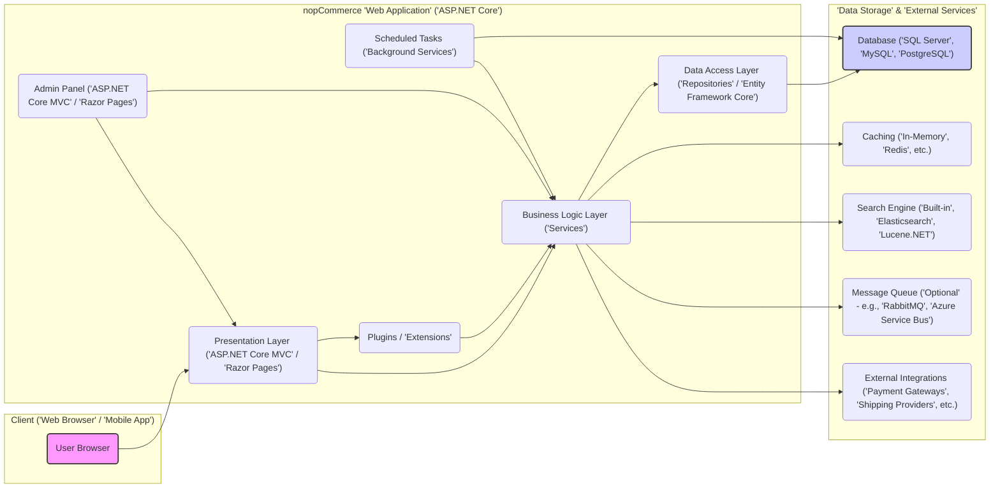
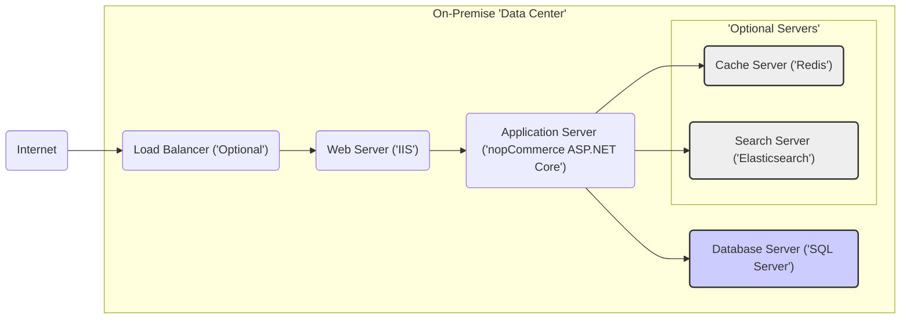
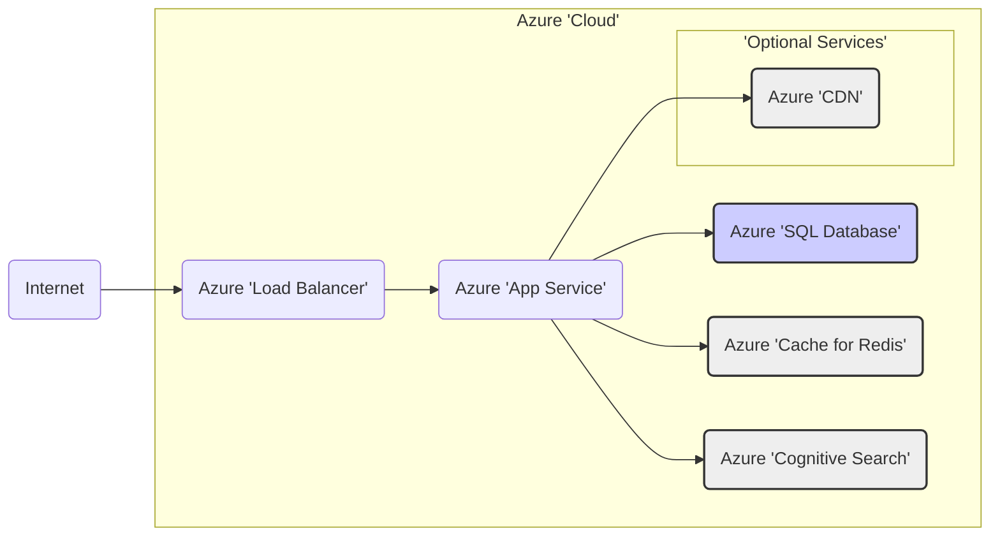
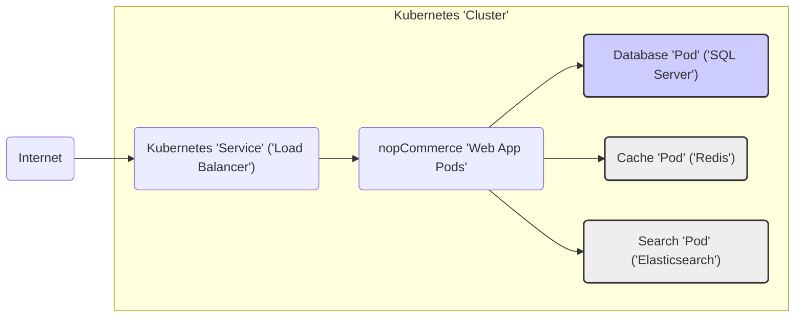

# Project Design Document: nopCommerce E-commerce Platform

**Project Name:** nopCommerce

**Project Repository:** [https://github.com/nopsolutions/nopcommerce](https://github.com/nopsolutions/nopcommerce)

**Document Version:** 1.1
**Date:** 2023-10-27
**Author:** AI Software Architecture Expert

**Changes from Version 1.0:**

*   Improved clarity and conciseness throughout the document.
*   Enhanced descriptions of components, especially security considerations.
*   Refined Mermaid diagrams for better readability and accuracy.
*   Added a section on "Assumptions and Constraints".
*   Minor formatting and grammatical improvements.

## 1. Introduction

This document provides a detailed design overview of the nopCommerce e-commerce platform, an open-source solution built on ASP.NET Core. It serves as a foundation for threat modeling, security analysis, and general system understanding. nopCommerce offers extensive features for online store creation and management, encompassing product catalogs, shopping carts, order processing, payment gateways, and marketing tools. This document outlines the software architecture, deployment options, and crucial security aspects of nopCommerce. It is intended for security professionals, developers, and anyone involved in the deployment and maintenance of nopCommerce.

## 2. System Overview

nopCommerce is a modular and extensible e-commerce platform employing a layered architecture. This design separates concerns into presentation, business logic, and data access tiers, promoting maintainability and scalability.  Its high degree of customization through plugins and themes allows for functional extensions and tailored storefront appearances.

**Core Capabilities:**

*   **Product Catalog Management:**  Comprehensive features for managing products, categories, attributes, manufacturers, and vendors.
*   **Shopping Cart and Checkout:**  Standard shopping cart functionality with a secure checkout process, supporting guest checkout.
*   **Order Lifecycle Management:**  Full order processing capabilities, including order history, shipment tracking, and returns management.
*   **Payment Gateway Integration:**  Seamless integration with a wide array of payment providers (e.g., PayPal, Stripe, Authorize.Net) via plugins.
*   **Shipping and Tax Configuration:**  Flexible shipping rate calculation, tax configuration, and integration with shipping carriers.
*   **Customer Relationship Management (CRM):**  Customer accounts, roles, address books, and customer service functionalities.
*   **Marketing and Promotional Tools:**  Discount rules, coupons, gift cards, and email marketing features to drive sales.
*   **Integrated Content Management System (CMS):**  Built-in CMS for managing news, blogs, forums, polls, and custom informational pages.
*   **Multi-Store and Multi-Vendor Platform:**  Supports managing multiple independent storefronts from a single installation and facilitates multi-vendor marketplace setups.
*   **Plugin and Theme Extensibility:**  Highly extensible architecture allowing for custom feature additions and storefront design modifications through plugins and themes.
*   **Administrative Control Panel:**  Web-based admin interface for comprehensive store management and configuration.
*   **Search Engine Optimization (SEO):**  Built-in features and configurations to enhance search engine visibility.
*   **Localization and Multi-Language Support:**  Supports multiple languages and currencies for global reach.

## 3. Architecture Design

### 3.1. High-Level Architecture Diagram

### 3.2. Component Description

#### 3.2.1. Presentation Layer ('ASP.NET Core MVC' / 'Razor Pages')

*   **Technology:** ASP.NET Core MVC and Razor Pages framework.
*   **Functionality:**
    *   Receives and processes user requests originating from web browsers.
    *   Renders the user interface using HTML, CSS, and JavaScript.
    *   Implements presentation-specific logic, including client-side input validation, UI navigation, and data formatting for display.
    *   Communicates with the Business Logic Layer to retrieve and manipulate data.
    *   Encompasses both the public storefront and the administrative backend interfaces.
*   **Security Considerations:**
    *   **XSS Vulnerabilities:** Susceptible to Cross-Site Scripting (XSS) attacks if input and output are not properly handled. Requires robust output encoding and input sanitization.
    *   **Authentication and Authorization Flaws:** Must enforce strict authentication and authorization mechanisms to control access to different application sections and functionalities.
    *   **Injection Attacks:**  Vulnerable to injection attacks (e.g., HTML injection) if user input is not validated and sanitized before rendering.

#### 3.2.2. Business Logic Layer ('Services')

*   **Technology:** C# services encapsulating core business rules and workflows.
*   **Functionality:**
    *   Contains the central business logic of the e-commerce platform, implementing core functionalities.
    *   Enforces data validation, manages business processes (e.g., order placement, payment processing, inventory management), and performs data transformations.
    *   Acts as an intermediary between the Presentation Layer and the Data Access Layer, abstracting data storage details.
    *   Orchestrates interactions with external services such as payment gateways, shipping APIs, and search engines.
*   **Security Considerations:**
    *   **Business Logic Flaws:** Potential for vulnerabilities arising from flaws in business rule implementation, leading to unauthorized actions or data manipulation.
    *   **Authorization Bypass:**  Requires rigorous authorization checks to prevent unauthorized access to sensitive business operations and data.
    *   **Sensitive Data Exposure:**  Must handle sensitive data (e.g., Personally Identifiable Information - PII, payment details) securely, ensuring proper encryption and access control.

#### 3.2.3. Data Access Layer ('Repositories' / 'Entity Framework Core')

*   **Technology:** Entity Framework Core (ORM) and C# repositories for database interaction.
*   **Functionality:**
    *   Provides an abstraction layer for database interactions, isolating the Business Logic Layer from database-specific details.
    *   Implements data access logic using repositories and Entity Framework Core, simplifying database operations.
    *   Handles database queries, data persistence, and retrieval operations.
    *   Supports multiple database systems (SQL Server, MySQL, PostgreSQL), offering deployment flexibility.
*   **Security Considerations:**
    *   **SQL Injection:**  Vulnerable to SQL Injection attacks if parameterized queries or ORM features are not correctly utilized. Requires careful query construction and ORM usage.
    *   **Database Access Control Weaknesses:**  Needs robust database access control to restrict access to sensitive data and prevent unauthorized database operations.
    *   **Data Integrity Issues:**  Must ensure data integrity and consistency through proper transaction management and data validation at the data layer.

#### 3.2.4. Database ('SQL Server', 'MySQL', 'PostgreSQL')

*   **Technology:** Relational Database Management System (RDBMS), supporting SQL Server, MySQL, and PostgreSQL.
*   **Functionality:**
    *   Persistently stores all application data, including:
        *   Product catalog information (products, categories, attributes, etc.)
        *   Customer data (user accounts, roles, addresses, etc.)
        *   Order details (orders, line items, payments, shipments, etc.)
        *   Content data (pages, blog posts, news articles, etc.)
        *   Configuration settings (application settings, themes, plugins, etc.)
        *   Operational logs and audit trails for tracking events and changes.
*   **Security Considerations:**
    *   **Data Breach Risk:**  Critical component for data confidentiality, integrity, and availability. Requires stringent security measures to prevent unauthorized access and data breaches.
    *   **Availability Concerns:**  Needs robust infrastructure and configurations to ensure high availability and prevent data loss. Regular backups and disaster recovery plans are essential.
    *   **Encryption at Rest:**  Should implement encryption at rest (e.g., Transparent Data Encryption - TDE) for sensitive data to protect against physical media theft or unauthorized access to database files.

#### 3.2.5. Plugins / 'Extensions'

*   **Technology:** ASP.NET Core class libraries (DLLs) developed in C#.
*   **Functionality:**
    *   Extend the core functionality of nopCommerce, enabling customization and feature additions.
    *   Allow developers to introduce new features, integrations, and modifications without altering the core platform code, promoting modularity.
    *   Plugins can be developed for diverse functionalities, including payment gateway integrations, shipping provider extensions, theme customizations, widget additions, and more.
    *   Dynamically loaded at runtime, providing flexibility and extensibility.
*   **Security Considerations:**
    *   **Malicious Plugin Risk:** Plugins can introduce security vulnerabilities if not developed with security best practices or if malicious plugins are installed. Untrusted plugins pose a significant security threat.
    *   **Plugin Management Weaknesses:**  Requires secure plugin management mechanisms, including verification, sandboxing, and permission controls.
    *   **Code Injection via Plugins:**  Poorly written plugins can introduce code injection vulnerabilities or bypass security controls of the core platform. Plugin security scanning and code reviews are crucial.

#### 3.2.6. Admin Panel ('ASP.NET Core MVC' / 'Razor Pages')

*   **Technology:** ASP.NET Core MVC and Razor Pages framework for the administrative interface.
*   **Functionality:**
    *   Provides a web-based interface for administrators to manage all aspects of the nopCommerce store.
    *   Offers features for:
        *   Managing product catalogs, orders, customers, and marketing campaigns.
        *   Configuring store settings, payment gateways, shipping methods, and tax rules.
        *   Managing plugins and themes, customizing the platform's functionality and appearance.
        *   Generating reports and analytics for store performance monitoring.
*   **Security Considerations:**
    *   **Admin Account Compromise:**  Requires strong authentication and authorization to protect sensitive administrative functions. Compromise of admin accounts can lead to full system compromise.
    *   **Insufficient Access Control:**  Should implement Role-Based Access Control (RBAC) to restrict access based on user roles and the principle of least privilege.
    *   **Admin Panel Vulnerabilities:**  Vulnerabilities in the admin panel can have a severe impact on the entire platform's security. Requires rigorous security testing and hardening.
    *   **Brute-Force Attacks:**  Susceptible to brute-force attacks on admin login pages. Implement account lockout policies and consider multi-factor authentication (MFA).

#### 3.2.7. Scheduled Tasks ('Background Services')

*   **Technology:** ASP.NET Core Background Services or similar task scheduling mechanisms.
*   **Functionality:**
    *   Executes background tasks and scheduled operations automatically, without direct user interaction.
    *   Examples include:
        *   Sending automated emails (e.g., order confirmations, newsletters, abandoned cart reminders).
        *   Processing recurring payments and subscriptions.
        *   Updating product indexes for search functionality.
        *   Cleaning up temporary data and system maintenance tasks.
*   **Security Considerations:**
    *   **Privilege Escalation:** Scheduled tasks may run with elevated privileges and interact with sensitive data or external systems. Secure configuration and execution are crucial.
    *   **Task Tampering:**  Ensure that scheduled tasks cannot be tampered with or modified by unauthorized users.
    *   **Logging and Monitoring Gaps:**  Requires proper logging and monitoring of scheduled task execution to detect failures or malicious activities.

#### 3.2.8. Caching ('In-Memory', 'Redis', etc.)

*   **Technology:** In-memory caching (e.g., `MemoryCache` in ASP.NET Core), distributed caching (e.g., Redis, Memcached).
*   **Functionality:**
    *   Enhances performance by storing frequently accessed data in memory for faster retrieval.
    *   Reduces database load and improves application responsiveness.
    *   Used for caching product data, category information, configuration settings, and other frequently accessed data.
*   **Security Considerations:**
    *   **Cache Poisoning:**  Potential for cache poisoning attacks if caching mechanisms are not properly secured, leading to serving incorrect or malicious content.
    *   **Sensitive Data in Cache:**  Cached data may contain sensitive information. Ensure that caching mechanisms are properly configured and do not expose sensitive data unintentionally. Secure caching configurations and access controls are needed.
    *   **Cache Side-Channel Attacks:** In shared caching environments, consider potential side-channel attacks where information might be leaked through cache access patterns.

#### 3.2.9. Search Engine ('Built-in', 'Elasticsearch', 'Lucene.NET')

*   **Technology:** Built-in search functionality (likely using database full-text search), with optional integration with external search engines like Elasticsearch or Lucene.NET.
*   **Functionality:**
    *   Provides search capabilities for customers to find products and content within the store efficiently.
    *   May support advanced search features like faceted search, auto-completion, and relevance ranking.
    *   External search engine integrations offer enhanced search capabilities and scalability for large catalogs.
*   **Security Considerations:**
    *   **Denial of Service (DoS):** Search functionality can be a target for Denial-of-Service (DoS) attacks if not properly implemented. Limit query complexity and implement rate limiting.
    *   **Search Injection:**  Ensure that search queries are properly sanitized to prevent search query injection attacks that could potentially bypass security controls or expose data.
    *   **Data Exposure via Search:**  Consider security implications of indexing sensitive data in the search engine. Control what data is indexed and ensure appropriate access controls.

#### 3.2.10. Message Queue ('Optional' - e.g., 'RabbitMQ', 'Azure Service Bus')

*   **Technology:** Message queue systems like RabbitMQ, Azure Service Bus, or similar asynchronous messaging infrastructure (optional and configurable).
*   **Functionality:**
    *   Enables asynchronous processing of tasks, decoupling components, and improving system scalability and resilience.
    *   Use cases include:
        *   Background order processing and fulfillment workflows.
        *   Asynchronous email sending to improve responsiveness.
        *   Integration with external systems and services via message-based communication.
*   **Security Considerations:**
    *   **Message Interception/Tampering:** Message queues can handle sensitive data in messages. Secure communication channels (e.g., TLS) should be used to protect message confidentiality and integrity.
    *   **Unauthorized Access to Queue:**  Access control and authentication for message queues are critical to prevent unauthorized access, message injection, or message consumption.
    *   **Message Queue Injection:**  Ensure that messages processed from the queue are validated and sanitized to prevent message queue injection vulnerabilities.

#### 3.2.11. External Integrations ('Payment Gateways', 'Shipping Providers', etc.)

*   **Technology:** HTTP APIs, SDKs, and standard protocols for interacting with external services.
*   **Functionality:**
    *   Integrates with various external services to provide essential e-commerce functionalities:
        *   **Payment Gateways:** Securely process online payments (e.g., PayPal, Stripe, Authorize.Net), handling sensitive financial transactions.
        *   **Shipping Providers:** Calculate shipping rates, manage shipments, and track deliveries (e.g., UPS, FedEx, USPS).
        *   **Tax Calculation Services:** Automate sales tax calculation based on location and tax rules.
        *   **Email Marketing Services:** Integrate with email marketing platforms for customer communication and promotions.
        *   **Analytics Platforms:** Integrate with analytics tools for website traffic analysis, user behavior tracking, and performance monitoring.
*   **Security Considerations:**
    *   **Third-Party API Vulnerabilities:** Integrations with external services introduce dependencies on third-party security. Vulnerabilities in third-party APIs can impact nopCommerce.
    *   **Data Leakage to Third Parties:**  Data exchanged with external services may contain sensitive information. Ensure data minimization and secure data transfer protocols (HTTPS).
    *   **Credential Management for External APIs:** API keys and credentials for external services must be stored and managed securely, using secrets management best practices to prevent unauthorized access.
    *   **Man-in-the-Middle Attacks:** Secure communication channels (HTTPS) must be enforced for all external API calls to prevent Man-in-the-Middle (MitM) attacks and data interception.

## 4. Deployment Architecture

nopCommerce offers flexible deployment options, ranging from traditional on-premises setups to cloud-based and containerized deployments.

### 4.1. On-Premise Deployment

*   **Infrastructure:** Organization-managed physical servers or virtual machines within a private data center.
*   **Components:**
    *   Web Server (IIS on Windows Server recommended) hosting the nopCommerce ASP.NET Core application.
    *   Database Server (SQL Server, MySQL, or PostgreSQL) hosting the nopCommerce database.
    *   Optional: Caching server (Redis, Memcached) deployed on a separate server for performance optimization.
    *   Optional: Search engine server (Elasticsearch, Lucene.NET) on a dedicated server for advanced search capabilities.
*   **Deployment Diagram ('On-Premise'):**

### 4.2. Cloud Deployment ('Example': 'Azure')

*   **Infrastructure:** Cloud platform services (e.g., Azure, AWS, Google Cloud) leveraging managed services.
*   **Components ('Azure Example'):**
    *   Azure App Service: Platform-as-a-Service (PaaS) for hosting the nopCommerce ASP.NET Core application.
    *   Azure SQL Database: Managed SQL Server database service, simplifying database administration.
    *   Azure Cache for Redis: Managed Redis caching service for improved performance and scalability.
    *   Azure Cognitive Search (or Elasticsearch on Azure VMs): Managed search service for advanced search functionalities.
    *   Azure Load Balancer: Integrated load balancing within Azure App Service for high availability and scalability.
    *   Azure CDN ('Content Delivery Network') ('Optional'): For caching and delivering static assets globally, improving performance for geographically distributed users.
*   **Deployment Diagram ('Cloud' - 'Azure Example'):**

### 4.3. Containerized Deployment ('Docker', 'Kubernetes')

*   **Infrastructure:** Container orchestration platform (e.g., Kubernetes, Docker Swarm) for managing containerized applications.
*   **Components:**
    *   Docker containers encapsulating the nopCommerce web application, database, caching server, and search engine, promoting portability and consistency.
    *   Kubernetes (or similar) for container orchestration, automated scaling, health management, and simplified deployment management.
*   **Deployment Diagram ('Containerized' - 'Kubernetes Example'):**

## 5. Security Architecture

Security is a paramount concern in nopCommerce design. The platform incorporates multiple security measures across different architectural layers.

### 5.1. Authentication and Authorization

*   **Authentication Mechanisms:**
    *   **Forms Authentication:**  Standard username/password authentication for customer and administrator logins.
    *   **External Authentication Providers:** Plugin-based integration with external identity providers (e.g., OAuth 2.0, OpenID Connect) for social logins and enterprise SSO.
    *   **Two-Factor Authentication (2FA):**  Available as a plugin, adding an extra layer of security for administrator accounts using time-based one-time passwords (TOTP) or other methods.
*   **Authorization Framework:**
    *   **Role-Based Access Control (RBAC):**  Users are assigned roles (e.g., administrators, vendors, customers, registered users) with predefined sets of permissions.
    *   **Permissions System:** Fine-grained permission control governs access to specific features and functionalities within the admin panel and storefront, allowing granular access management.
    *   **Access Control Lists (ACLs):**  Potentially used internally for managing access to specific data entities or resources, providing more granular control in certain areas.

### 5.2. Input Validation and Output Encoding

*   **Input Validation Strategies:**
    *   **Server-Side Validation:**  ASP.NET Core model validation attributes and custom validation logic are enforced on the server-side to validate all user inputs before processing. This is the primary defense against injection attacks.
    *   **Client-Side Validation:**  JavaScript-based validation provides immediate feedback to users in the browser, improving user experience but is not a security control and is bypassed by attackers.
*   **Output Encoding Techniques:**
    *   **Razor Engine Encoding:**  The Razor view engine in ASP.NET Core automatically encodes output by default to prevent common XSS attacks by escaping HTML characters.
    *   **Anti-XSS Libraries:**  Can integrate with or utilize anti-XSS libraries (e.g., Microsoft.AspNetCore.Mvc.Razor.TagHelpers) for more robust output encoding in complex scenarios or when dealing with rich text content.

### 5.3. Data Protection

*   **HTTPS Enforcement:**  Mandatory HTTPS for all communication between clients and the server, encrypting data in transit and protecting against eavesdropping and MitM attacks.
*   **Database Encryption at Rest:**
    *   **Transparent Data Encryption (TDE):**  Supported by SQL Server and other databases to encrypt the entire database at rest, protecting data stored on disk.
    *   **Data Protection API:**  ASP.NET Core Data Protection API can be used to encrypt sensitive application-level data at rest, such as connection strings, API keys, and configuration secrets, providing an additional layer of security.
*   **Sensitive Data Handling Practices:**
    *   **PCI DSS Compliance:** Payment information processing is typically delegated to PCI DSS compliant payment gateways, minimizing the storage of sensitive payment card data within nopCommerce and reducing PCI scope.
    *   **Password Hashing:**  Sensitive customer credentials like passwords are never stored in plain text. They are securely hashed and salted using strong hashing algorithms (e.g., bcrypt, Argon2) before being stored in the database.

### 5.4. Session Management

*   **Cookie-Based Sessions:**  Uses HTTP cookies for session management to maintain user session state and track logged-in users.
*   **Session State Management:**  ASP.NET Core session state mechanisms (e.g., in-memory, Redis-backed) are used to store session-specific data securely.
*   **Session Timeout Configuration:**  Configurable session timeout settings to automatically invalidate inactive sessions, limiting the window of opportunity for session hijacking.
*   **Secure Cookie Attributes:**  Cookies are configured with `HttpOnly` and `Secure` flags to mitigate XSS and session hijacking risks. `HttpOnly` prevents client-side JavaScript access, and `Secure` ensures cookies are only transmitted over HTTPS.

### 5.5. Access Control and Network Security

*   **Firewall Protection:**  Network firewalls should be deployed to restrict network access to the web server and database server, allowing only necessary ports and traffic from trusted sources.
*   **Database Access Control:**  Database user accounts should be granted the minimum necessary privileges required for application functionality, following the principle of least privilege.
*   **Principle of Least Privilege Implementation:**  Apply the principle of least privilege across all user accounts, services, and system components, limiting access rights to only what is strictly necessary for their function.

### 5.6. Auditing and Logging

*   **Comprehensive Application Logging:**  Detailed logging of application events, errors, security-related activities, and user actions. Logs should include sufficient information for security monitoring and incident response.
*   **Audit Trails for Critical Actions:**  Detailed audit trails should be maintained for administrative actions, data modifications, and changes to critical configurations, enabling accountability and forensic analysis.
*   **Security-Focused Logging:**  Specific logging of security-relevant events, such as authentication attempts (successful and failed), authorization failures, suspicious activities, and security exceptions.
*   **Centralized Log Management:**  Consider implementing centralized log management systems (e.g., ELK stack, Splunk) for efficient log aggregation, analysis, alerting, and security monitoring across the entire nopCommerce deployment.

### 5.7. Vulnerability Management

*   **Regular Security Updates:**  Maintain nopCommerce and all its dependencies (ASP.NET Core runtime, NuGet packages, database system, operating system) up-to-date with the latest security patches and updates to address known vulnerabilities.
*   **Proactive Security Scanning:**  Conduct regular vulnerability scanning of the application code, infrastructure, and dependencies using automated security scanning tools to identify potential weaknesses.
*   **Periodic Security Audits and Penetration Testing:**  Engage external security experts to perform periodic security audits and penetration testing to identify and validate vulnerabilities in the application and infrastructure from an attacker's perspective.
*   **Community Security Reporting and Response:**  Leverage the open-source community and nopCommerce security channels for security vulnerability reporting, disclosure, and timely patching. Stay informed about security advisories and best practices.

## 6. Technology Stack

*   **Core Language:** C# (primary development language)
*   **Web Framework:** ASP.NET Core (.NET platform for web application development)
*   **Object-Relational Mapper (ORM):** Entity Framework Core (for database interaction abstraction)
*   **Database Systems:** SQL Server (primary and recommended), MySQL, PostgreSQL (supported database options)
*   **Web Server Options:** IIS (Internet Information Services - Windows-based), Kestrel (cross-platform, lightweight web server)
*   **Caching Technologies:** In-Memory Cache (`MemoryCache` in ASP.NET Core), Redis, Memcached (for performance caching)
*   **Search Engine Options:** Built-in database full-text search (basic search), Elasticsearch, Lucene.NET (for advanced search capabilities)
*   **Frontend Technologies:** HTML, CSS, JavaScript, jQuery (legacy), modern JavaScript frameworks (potentially used in plugins/themes), Bootstrap (or similar CSS framework for responsive design)
*   **Build and Deployment Tools:** .NET CLI (command-line interface), MSBuild (build engine), Docker (for containerization), Kubernetes (for orchestration)
*   **Package Management:** NuGet (package manager for .NET libraries and dependencies)

## 7. Threat Modeling Considerations

This design document provides a structured and detailed overview of the nopCommerce architecture, forming a solid foundation for effective threat modeling exercises. When conducting threat modeling, consider the following guidelines:

*   **Define Threat Modeling Scope:** Clearly define the scope of the threat modeling exercise. Focus on specific components, functionalities, or user flows based on risk assessment, business priorities, and regulatory compliance requirements.
*   **Choose a Threat Modeling Methodology:** Select a structured threat modeling methodology suitable for the project, such as STRIDE (Spoofing, Tampering, Repudiation, Information Disclosure, Denial of Service, Elevation of Privilege), PASTA (Process for Attack Simulation and Threat Analysis), or others.
*   **Identify Threat Actors and Motivations:**  Enumerate potential threat actors who might target nopCommerce and analyze their motivations (e.g., financial gain, data theft, disruption, reputational damage). Consider both external attackers and insider threats.
*   **Analyze Attack Vectors and Attack Surface:**  For each component and data flow path, analyze potential attack vectors and identify the attack surface exposed to threat actors. Consider network-based attacks, application-level attacks, and social engineering.
*   **Identify Potential Vulnerabilities:**  Based on the design, technology stack, and common web application vulnerabilities (OWASP Top 10), identify potential vulnerabilities in each component and interaction point. Consider configuration weaknesses, code flaws, and dependency vulnerabilities.
*   **Assess Security Impact and Risk Prioritization:**  Evaluate the potential impact of successful attacks on confidentiality, integrity, and availability of the nopCommerce system and its data. Prioritize identified threats based on their likelihood and impact to focus mitigation efforts effectively.
*   **Develop Security Mitigations and Countermeasures:**  For each identified threat and vulnerability, develop and document appropriate security mitigations, countermeasures, and security controls to reduce risk to an acceptable level. Consider preventative, detective, and corrective controls.

**Practical Guidance for Threat Modeling with this Document:**

1.  **Component-Centric Threat Analysis:**  Systematically review each component described in Section 3.2 (Presentation Layer, Business Logic Layer, etc.) and brainstorm potential threats and vulnerabilities specific to that component's functionality and technology.
2.  **Data Flow Diagram (DFD) Based Threat Analysis:**  Utilize the architecture diagrams (Section 3.1 and Deployment Architectures) to trace data flows through the system. Identify potential points of vulnerability along each data path where data is processed, transmitted, or stored.
3.  **Security Architecture Review and Gap Analysis:**  Thoroughly review the security measures outlined in Section 5 (Security Architecture) and conduct a gap analysis to identify any missing or insufficient security controls. Assess the effectiveness of existing security mechanisms.
4.  **Deployment Scenario Specific Threat Modeling:**  Consider the specific deployment architecture (Section 4 - On-Premise, Cloud, Containerized) being used. Identify threats and vulnerabilities that are particularly relevant to the chosen deployment environment and infrastructure.
5.  **Plugin Ecosystem Security Focus:**  Pay close attention to the plugin ecosystem (Section 3.2.5) during threat modeling. Plugins represent a significant potential attack surface. Analyze plugin security risks, plugin management processes, and potential vulnerabilities introduced by third-party plugins.

By leveraging this comprehensive design document as a reference and following a structured threat modeling approach, organizations can proactively identify and mitigate potential security risks in their nopCommerce e-commerce platform deployments, leading to a more secure and resilient online business.

## 8. Assumptions and Constraints

*   **Assumptions:**
    *   It is assumed that nopCommerce is deployed and configured according to security best practices outlined in official documentation and security guides.
    *   External services and APIs integrated with nopCommerce are assumed to be reasonably secure and maintained by reputable providers.
    *   Underlying infrastructure (operating systems, network devices, cloud platforms) is assumed to be properly secured and hardened.
*   **Constraints:**
    *   This document provides a general design overview. Specific implementations and customizations may introduce variations and additional security considerations.
    *   The security of plugins and themes developed by third parties is outside the direct control of the nopCommerce core platform.
    *   The threat landscape is constantly evolving. Continuous security monitoring, updates, and adaptation are necessary to maintain a strong security posture.