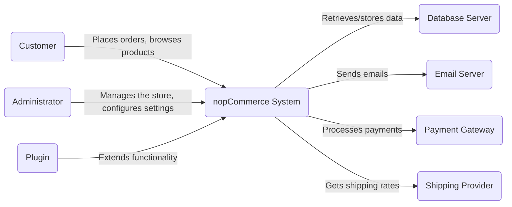
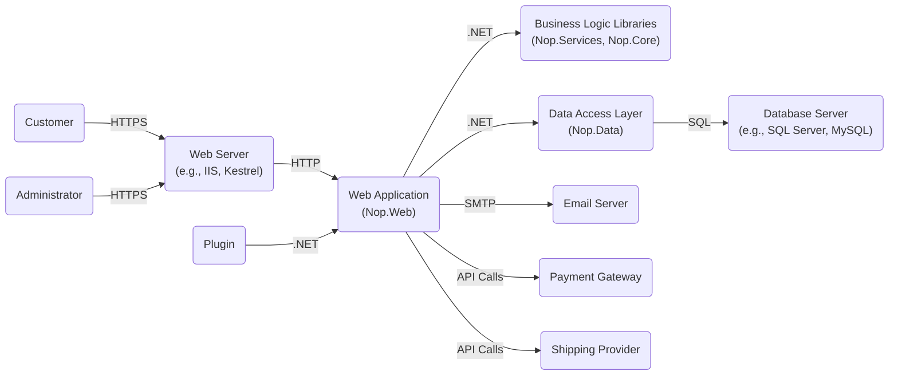
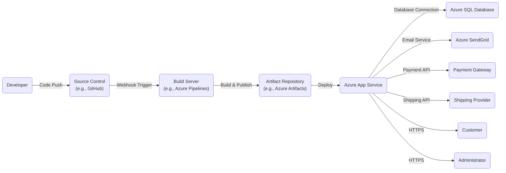
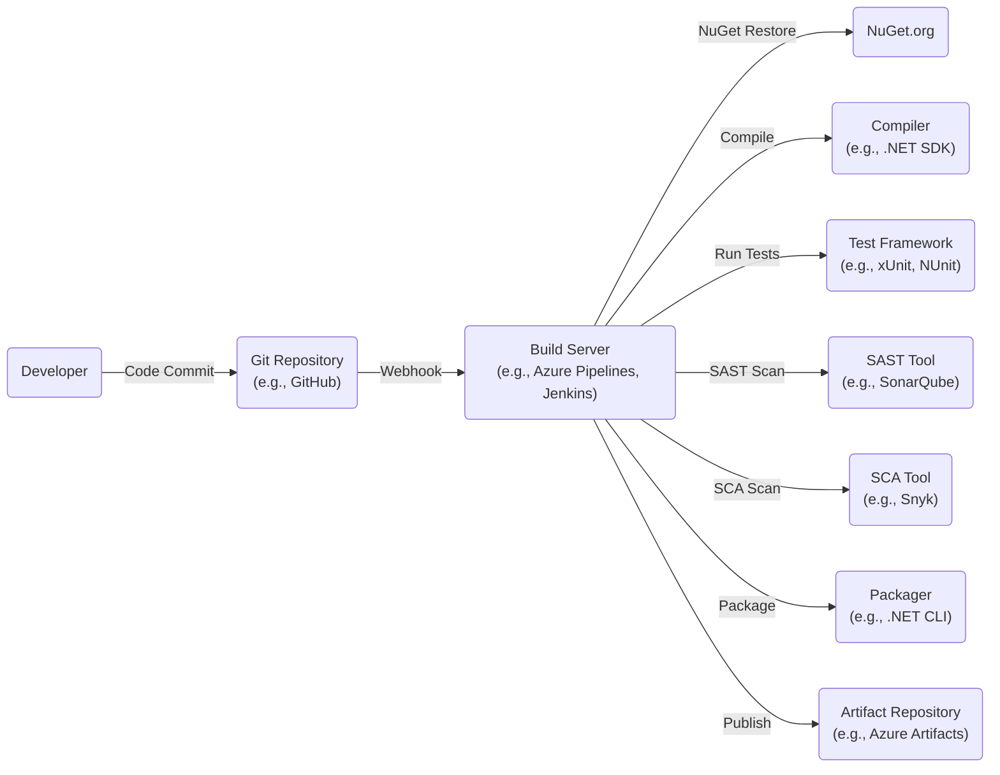

Okay, let's create a design document for the nopCommerce project.

# BUSINESS POSTURE

nopCommerce is an open-source e-commerce platform.  The business priorities revolve around providing a stable, feature-rich, and customizable platform for businesses of all sizes to create and manage online stores.  The project aims to be a viable alternative to both commercial and other open-source e-commerce solutions.  Success is measured by adoption rate, community contributions, and the number of successful online stores powered by the platform.  Given its open-source nature and wide range of users, the business likely has a moderate risk appetite, balancing rapid feature development with the need for stability and security.  A large enterprise using nopCommerce would have a lower risk appetite than a small startup.

Business Priorities:

*   Provide a robust and reliable e-commerce platform.
*   Offer a wide range of features out-of-the-box.
*   Enable extensive customization and extensibility.
*   Maintain a strong and active community.
*   Attract and retain users (businesses setting up online stores).
*   Ensure the platform is performant and scalable.
*   Provide good documentation and support.

Business Goals:

*   Increase market share in the e-commerce platform space.
*   Become a leading open-source e-commerce solution.
*   Foster a thriving ecosystem of developers and partners.
*   Generate revenue through related services (e.g., hosting, support, custom development).

Most Important Business Risks:

*   Security vulnerabilities leading to data breaches (customer data, financial information).
*   Performance issues impacting user experience and sales.
*   Lack of scalability hindering growth of businesses using the platform.
*   Complexity of customization discouraging adoption.
*   Competition from other e-commerce platforms.
*   Inability to keep up with evolving e-commerce trends and regulations.
*   Reputational damage due to security incidents or platform instability.

# SECURITY POSTURE

Based on the GitHub repository and common practices for e-commerce platforms, here's an assessment of the likely security posture:

Existing Security Controls:

*   security control: Input validation: Implemented throughout the application to prevent common web vulnerabilities like Cross-Site Scripting (XSS) and SQL injection. (Evidenced by data annotations, model validation, and use of parameterized queries in the codebase).
*   security control: Authentication: Uses ASP.NET Core Identity for user management, including password hashing, account lockout, and two-factor authentication. (Visible in the `Nop.Web` project, particularly in the authentication-related controllers and services).
*   security control: Authorization: Role-based access control (RBAC) is implemented to restrict access to administrative features and sensitive data. (Evidenced by the use of authorization attributes and policies in the controllers).
*   security control: Output encoding: Implemented to prevent XSS vulnerabilities when rendering user-supplied data. (Visible in the Razor views and view components).
*   security control: HTTPS: Enforced for secure communication. (Configuration in `appsettings.json` and likely enforced at the deployment level).
*   security control: Data protection: ASP.NET Core Data Protection API is used to protect sensitive data at rest, such as connection strings and API keys. (Configuration in `Startup.cs` and usage in various services).
*   security control: Anti-forgery tokens: Used to prevent Cross-Site Request Forgery (CSRF) attacks. (Automatically included in ASP.NET Core MVC forms).
*   security control: Regular updates: The project appears to be actively maintained, with regular updates and bug fixes, including security patches. (Visible in the commit history and release notes).
*   security control: Dependency management: Uses NuGet for package management, allowing for tracking and updating of third-party libraries. (Visible in the `.csproj` files).
*   security control: Logging and auditing: Implemented to track user activity and potential security events. (Usage of logging frameworks like Serilog or NLog is likely, although specific configuration details would be in the deployment environment).

Accepted Risks:

*   accepted risk: The open-source nature of the project means the codebase is publicly visible, potentially making it easier for attackers to find vulnerabilities. This is mitigated by the large community and frequent security audits.
*   accepted risk: Reliance on third-party plugins and themes introduces a risk of vulnerabilities in those components. Users are responsible for vetting the plugins and themes they install.
*   accepted risk: The platform's flexibility and customizability mean that misconfiguration by users could lead to security weaknesses. This is mitigated by providing good documentation and security best practices.

Recommended Security Controls (High Priority):

*   Implement a Content Security Policy (CSP) to mitigate XSS and data injection attacks.
*   Implement HTTP Strict Transport Security (HSTS) to enforce HTTPS connections.
*   Implement Subresource Integrity (SRI) to ensure that fetched resources haven't been tampered with.
*   Regularly conduct penetration testing and security audits.
*   Implement a robust vulnerability disclosure program.
*   Consider implementing a Web Application Firewall (WAF) at the deployment level.
*   Implement automated security scanning tools in the CI/CD pipeline (SAST, DAST, SCA).

Security Requirements:

*   Authentication:
    *   Strong password policies (length, complexity, expiration).
    *   Multi-factor authentication (MFA) support.
    *   Account lockout after multiple failed login attempts.
    *   Secure password reset mechanism.
    *   Session management with secure, HTTP-only cookies.

*   Authorization:
    *   Fine-grained role-based access control (RBAC).
    *   Principle of least privilege (users should only have access to the resources they need).
    *   Secure handling of API keys and access tokens.

*   Input Validation:
    *   Validate all user inputs on the server-side.
    *   Use a whitelist approach whenever possible (allow only known good characters).
    *   Sanitize user inputs to prevent XSS and other injection attacks.

*   Cryptography:
    *   Use strong, industry-standard cryptographic algorithms (e.g., AES, RSA, SHA-256).
    *   Securely store cryptographic keys (e.g., using Azure Key Vault or AWS KMS).
    *   Use HTTPS for all communication.
    *   Properly handle encryption of sensitive data at rest and in transit.

# DESIGN

## C4 CONTEXT

C4 Context Element Descriptions:

*   Element:
    *   Name: Customer
    *   Type: Person
    *   Description: A person who interacts with the nopCommerce system to browse products, place orders, and manage their account.
    *   Responsibilities: Browsing products, adding items to cart, placing orders, managing account details, viewing order history.
    *   Security controls: Authentication, authorization, input validation, output encoding, HTTPS, anti-forgery tokens.

*   Element:
    *   Name: Administrator
    *   Type: Person
    *   Description: A person who manages the nopCommerce system, configures settings, manages products, orders, and customers.
    *   Responsibilities: Configuring store settings, managing products, managing orders, managing customers, managing plugins, viewing reports.
    *   Security controls: Authentication (strong password, MFA), authorization (RBAC), input validation, output encoding, HTTPS, anti-forgery tokens, audit logging.

*   Element:
    *   Name: nopCommerce System
    *   Type: Software System
    *   Description: The core e-commerce platform that provides the functionality for online stores.
    *   Responsibilities: Handling user requests, managing products, orders, and customers, processing payments, sending emails, interacting with external systems.
    *   Security controls: All listed security controls.

*   Element:
    *   Name: Database Server
    *   Type: Software System
    *   Description: The database server that stores the data for the nopCommerce system (e.g., product information, customer data, orders).
    *   Responsibilities: Storing and retrieving data, ensuring data integrity and consistency.
    *   Security controls: Access control, encryption at rest, regular backups, auditing.

*   Element:
    *   Name: Email Server
    *   Type: Software System
    *   Description: The email server used by nopCommerce to send transactional emails (e.g., order confirmations, password reset emails).
    *   Responsibilities: Sending emails, managing email queues.
    *   Security controls: Secure authentication, TLS encryption, spam filtering.

*   Element:
    *   Name: Payment Gateway
    *   Type: Software System
    *   Description: A third-party service that processes payments for the nopCommerce system (e.g., PayPal, Stripe).
    *   Responsibilities: Processing payments, handling sensitive financial data.
    *   Security controls: PCI DSS compliance, encryption, tokenization.

*   Element:
    *   Name: Shipping Provider
    *   Type: Software System
    *   Description: A third-party service that provides shipping rates and label generation (e.g., UPS, FedEx).
    *   Responsibilities: Providing shipping rates, generating shipping labels, tracking shipments.
    *   Security controls: Secure API communication, authentication.

*   Element:
    *   Name: Plugin
    *   Type: Software System
    *   Description: A software component that extends the functionality of the nopCommerce system.
    *   Responsibilities: Providing additional features and integrations.
    *   Security controls: Depends on the specific plugin; should be vetted by the user.

## C4 CONTAINER

C4 Container Element Descriptions:

*   Element:
    *   Name: Web Server
    *   Type: Web Server
    *   Description: The web server that hosts the nopCommerce web application (e.g., IIS, Kestrel).
    *   Responsibilities: Handling HTTP requests, serving static content, routing requests to the web application.
    *   Security controls: HTTPS, TLS configuration, request filtering, WAF (recommended).

*   Element:
    *   Name: Web Application (Nop.Web)
    *   Type: Web Application
    *   Description: The ASP.NET Core MVC application that handles user interactions and presents the user interface.
    *   Responsibilities: Handling user requests, rendering views, interacting with business logic libraries, managing user sessions.
    *   Security controls: Authentication, authorization, input validation, output encoding, anti-forgery tokens, session management.

*   Element:
    *   Name: Business Logic Libraries (Nop.Services, Nop.Core)
    *   Type: Libraries
    *   Description: Libraries containing the core business logic of the application.
    *   Responsibilities: Implementing business rules, managing data, interacting with external systems.
    *   Security controls: Input validation, data validation, secure handling of sensitive data.

*   Element:
    *   Name: Data Access Layer (Nop.Data)
    *   Type: Library
    *   Description: The layer responsible for interacting with the database.
    *   Responsibilities: Retrieving and storing data, executing database queries.
    *   Security controls: Parameterized queries (to prevent SQL injection), data validation.

*   Element:
    *   Name: Database Server
    *   Type: Database
    *   Description: The database server that stores the data for the nopCommerce system.
    *   Responsibilities: Storing and retrieving data, ensuring data integrity and consistency.
    *   Security controls: Access control, encryption at rest, regular backups, auditing.

*   Element:
    *   Name: Email Server
    *   Type: Software System
    *   Description: The email server used by nopCommerce to send transactional emails.
    *   Responsibilities: Sending emails, managing email queues.
    *   Security controls: Secure authentication, TLS encryption, spam filtering.

*   Element:
    *   Name: Payment Gateway
    *   Type: Software System
    *   Description: A third-party service that processes payments.
    *   Responsibilities: Processing payments, handling sensitive financial data.
    *   Security controls: PCI DSS compliance, encryption, tokenization.

*   Element:
    *   Name: Shipping Provider
    *   Type: Software System
    *   Description: A third-party service that provides shipping rates and label generation.
    *   Responsibilities: Providing shipping rates, generating shipping labels, tracking shipments.
    *   Security controls: Secure API communication, authentication.

*   Element:
    *   Name: Plugin
    *   Type: Software System
    *   Description: A software component that extends the functionality of the nopCommerce system.
    *   Responsibilities: Providing additional features and integrations.
    *   Security controls: Depends on the specific plugin; should be vetted by the user.

## DEPLOYMENT

Possible Deployment Solutions:

1.  **Traditional Hosting (VPS/Dedicated Server):**  Deploying the application to a virtual private server (VPS) or a dedicated server running IIS (Internet Information Services) on Windows Server or using Kestrel with a reverse proxy (like Nginx or Apache) on Linux.
2.  **Cloud Hosting (Azure/AWS/Google Cloud):** Deploying the application to a cloud platform like Azure App Service, AWS Elastic Beanstalk, or Google App Engine. This offers scalability, managed infrastructure, and other cloud benefits.
3.  **Containerized Deployment (Docker/Kubernetes):**  Packaging the application and its dependencies into Docker containers and deploying them to a container orchestration platform like Kubernetes. This provides portability, scalability, and efficient resource utilization.
4.  **Hybrid Cloud:** A combination of on-premises and cloud deployment, potentially using containers for portability.

Chosen Solution (for detailed description): **Cloud Hosting (Azure App Service)**

This is a common and recommended approach for nopCommerce due to its ease of deployment, scalability, and management features.

Deployment Element Descriptions:

*   Element:
    *   Name: Developer
    *   Type: Person
    *   Description: The developer who writes and commits code to the source control repository.
    *   Responsibilities: Writing code, testing, committing changes.
    *   Security controls: Code reviews, secure coding practices.

*   Element:
    *   Name: Source Control (e.g., GitHub)
    *   Type: Software System
    *   Description: The source code repository where the application code is stored.
    *   Responsibilities: Version control, code collaboration, branching, merging.
    *   Security controls: Access control, branch protection rules, code review policies.

*   Element:
    *   Name: Build Server (e.g., Azure Pipelines)
    *   Type: Software System
    *   Description: The build server that automates the build, test, and deployment process.
    *   Responsibilities: Building the application, running tests, creating deployment packages.
    *   Security controls: Secure build environment, access control, vulnerability scanning (SAST, SCA).

*   Element:
    *   Name: Artifact Repository (e.g., Azure Artifacts)
    *   Type: Software System
    *   Description: The repository where the build artifacts (deployment packages) are stored.
    *   Responsibilities: Storing build artifacts, versioning.
    *   Security controls: Access control, retention policies.

*   Element:
    *   Name: Azure App Service
    *   Type: PaaS
    *   Description: The Azure App Service that hosts the nopCommerce web application.
    *   Responsibilities: Running the web application, providing scalability, managing infrastructure.
    *   Security controls: HTTPS, TLS configuration, WAF (optional), network security groups (optional).

*   Element:
    *   Name: Azure SQL Database
    *   Type: PaaS
    *   Description: The Azure SQL Database that stores the data for the nopCommerce system.
    *   Responsibilities: Storing and retrieving data, ensuring data integrity and consistency.
    *   Security controls: Access control, encryption at rest, transparent data encryption (TDE), auditing, firewall rules.

*   Element:
    *   Name: Azure SendGrid
    *   Type: SaaS
    *   Description: Azure service for sending emails.
    *   Responsibilities: Sending emails.
    *   Security controls: API Key authentication.

*   Element:
    *   Name: Payment Gateway
    *   Type: Software System
    *   Description: A third-party service that processes payments.
    *   Responsibilities: Processing payments, handling sensitive financial data.
    *   Security controls: PCI DSS compliance, encryption, tokenization.

*   Element:
    *   Name: Shipping Provider
    *   Type: Software System
    *   Description: A third-party service that provides shipping rates and label generation.
    *   Responsibilities: Providing shipping rates, generating shipping labels, tracking shipments.
    *   Security controls: Secure API communication, authentication.

*   Element:
    *   Name: Customer
    *   Type: Person
    *   Description: A person who interacts with the nopCommerce system.
    *   Responsibilities: Browsing products, adding items to cart, placing orders, managing account details, viewing order history.
    *   Security controls: Authentication, authorization, input validation, output encoding, HTTPS, anti-forgery tokens.

*   Element:
    *   Name: Administrator
    *   Type: Person
    *   Description: A person who manages the nopCommerce system.
    *   Responsibilities: Configuring store settings, managing products, managing orders, managing customers, managing plugins, viewing reports.
    *   Security controls: Authentication (strong password, MFA), authorization (RBAC), input validation, output encoding, HTTPS, anti-forgery tokens, audit logging.

## BUILD

The build process for nopCommerce typically involves the following steps:

1.  **Code Checkout:** The build server checks out the latest code from the source control repository (e.g., GitHub).
2.  **Dependency Restoration:** NuGet packages are restored to ensure all required libraries are available.
3.  **Compilation:** The code is compiled into executable assemblies.
4.  **Testing:** Unit tests and integration tests are executed to verify the functionality of the code.
5.  **Packaging:** The compiled code and dependencies are packaged into a deployment package (e.g., a zip file or a Docker image).
6.  **Publishing:** The deployment package is published to an artifact repository (e.g., Azure Artifacts) or directly to the deployment environment.

Security Controls in the Build Process:

*   **Source Code Management:** Use of a secure source code repository (e.g., GitHub, Azure DevOps) with access control and branch protection rules.
*   **Dependency Management:** Use of NuGet with package signing and vulnerability scanning (e.g., using tools like Snyk or OWASP Dependency-Check).
*   **Static Application Security Testing (SAST):** Integration of SAST tools (e.g., SonarQube, Fortify) into the build pipeline to identify potential security vulnerabilities in the code.
*   **Software Composition Analysis (SCA):** Use of SCA tools to identify known vulnerabilities in third-party libraries.
*   **Build Automation:** Use of a secure build server (e.g., Azure Pipelines, Jenkins) with access control and audit logging.
*   **Secure Build Environment:** Ensuring the build server is running in a secure environment with limited access and up-to-date security patches.
*   **Artifact Signing:** Signing the deployment package to ensure its integrity and authenticity.

# RISK ASSESSMENT

Critical Business Processes to Protect:

*   **Order Processing:** Ensuring orders are processed securely and efficiently, without data loss or corruption.
*   **Payment Processing:** Protecting sensitive financial information during payment transactions.
*   **Customer Account Management:** Securely managing customer accounts and personal data.
*   **Inventory Management:** Maintaining accurate inventory levels and preventing unauthorized access to inventory data.
*   **Website Availability:** Ensuring the website is available and responsive to customers.

Data to Protect and Sensitivity:

*   **Customer Personally Identifiable Information (PII):** Names, addresses, email addresses, phone numbers (High sensitivity).
*   **Payment Card Information (PCI):** Credit card numbers, expiration dates, CVV codes (Highest sensitivity - subject to PCI DSS compliance).
*   **Order Information:** Order details, shipping addresses, purchase history (Medium sensitivity).
*   **Account Credentials:** Usernames and passwords (High sensitivity).
*   **Website Content:** Product descriptions, images, pricing information (Low to medium sensitivity).
*   **Business Data:** Sales data, analytics, internal reports (Medium to high sensitivity).

# QUESTIONS & ASSUMPTIONS

Questions:

*   What specific payment gateways are supported and used? This impacts the specific security requirements and integration points.
*   What are the specific logging and monitoring configurations? This helps understand the level of visibility into security events.
*   Are there any existing security audit reports or penetration testing results?
*   What is the process for handling security vulnerabilities reported by external researchers or users?
*   What are the specific compliance requirements (e.g., GDPR, CCPA)?
*   Are there any custom-developed plugins or themes in use? These need to be assessed separately for security vulnerabilities.
*   What is the disaster recovery and business continuity plan?
*   Is there a formal incident response plan in place?

Assumptions:

*   BUSINESS POSTURE: Assumes a moderate risk appetite, balancing rapid development with security and stability.
*   SECURITY POSTURE: Assumes basic security controls are in place (as evidenced by the codebase), but there's room for improvement. Assumes compliance with basic security best practices.
*   DESIGN: Assumes a standard ASP.NET Core MVC architecture with common components (database, email server, payment gateway). Assumes deployment to a cloud environment (Azure App Service) for scalability and ease of management. Assumes use of a CI/CD pipeline for automated builds and deployments.