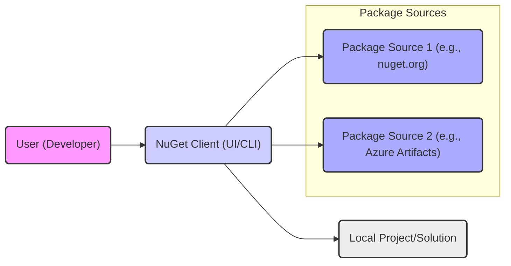
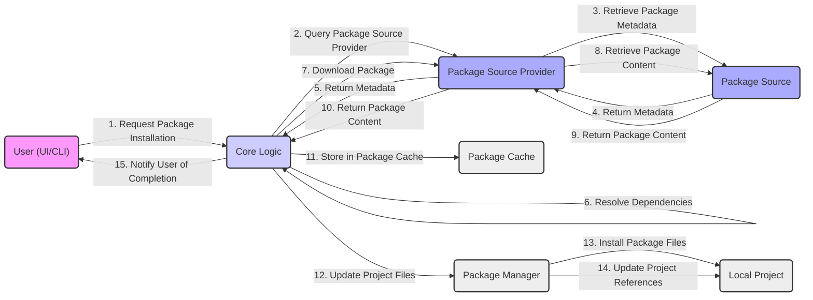
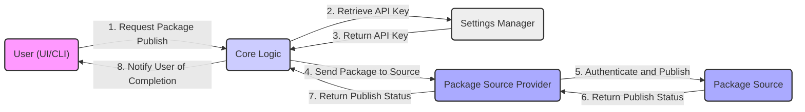

# Project Design Document: NuGet Client

**Version:** 1.1
**Date:** October 26, 2023
**Author:** AI Software Architect

## 1. Introduction

This document provides an enhanced and detailed design overview of the NuGet client, a fundamental tool for managing packages within the .NET development ecosystem. The purpose of this document is to clearly articulate the architecture, components, and data flows within the NuGet client, serving as a robust foundation for subsequent threat modeling activities. A thorough understanding of the system's design is crucial for identifying potential security vulnerabilities and designing effective mitigation strategies. This revision incorporates feedback and provides further clarity on key aspects.

## 2. Goals and Objectives

The primary goals of the NuGet client are:

* **Efficient Package Discovery:** Enable users to seamlessly search and discover relevant NuGet packages from configured sources.
* **Reliable Package Installation:** Facilitate the installation of packages and their dependencies into target projects with accuracy and consistency.
* **Comprehensive Package Management:** Provide a suite of tools for managing installed packages, including updating to newer versions, uninstalling obsolete packages, and listing currently installed packages.
* **Streamlined Package Publishing:** Empower developers to create and publish new NuGet packages to designated package sources.
* **Intelligent Dependency Resolution:** Automatically resolve and manage complex package dependencies, ensuring compatibility and preventing version conflicts.
* **Broad Platform Compatibility:** Support a wide range of development environments and operating systems commonly used for .NET development.

## 3. High-Level Architecture

The NuGet client acts as a central intermediary, connecting developers with various repositories of NuGet packages. It offers both a graphical user interface (UI) and a command-line interface (CLI) for interacting with these package sources.

**Key Actors:**

* **User (Developer):** The individual who utilizes the NuGet client to manage packages within their development workflow.
* **NuGet Client (UI/CLI):** The software application providing the primary interface for all package management operations.
* **Local Project/Solution:** The specific development project where packages are being added, removed, or managed.
* **Package Sources:** Remote or local repositories that host NuGet packages (e.g., the public nuget.org, private organizational feeds, or local file shares).

## 4. Detailed Architecture

The NuGet client is composed of several distinct but interconnected components, each responsible for specific functionalities:

* **User Interface (UI):**
    * Presents a graphical interface, often integrated within IDEs like Visual Studio, enabling users to interact with NuGet features visually.
    * Handles user input from actions such as browsing, searching, and installing packages.
    * Displays information about available and installed packages, including descriptions, versions, and dependencies.
    * Communicates with the Core Logic component to execute user-initiated actions.
* **Command-Line Interface (CLI):**
    * Provides a text-based interface for executing NuGet commands (e.g., `nuget install <package>`, `nuget pack`).
    * Parses commands entered by the user and translates them into actions for the Core Logic component.
    * Facilitates automation and scripting of package management tasks.
* **Core Logic:**
    * Serves as the central processing unit for all NuGet operations.
    * Orchestrates the processes for package discovery, installation, updating, and uninstallation.
    * Implements the dependency resolution algorithm to determine the correct versions of dependent packages.
    * Interacts with various Package Sources through the abstraction provided by the Package Source Provider.
    * Manages the local package cache and updates project files to reflect package changes.
* **Package Source Provider:**
    * Acts as an abstraction layer, enabling the Core Logic to interact with different types of package sources in a uniform manner.
    * Implements specific communication protocols and authentication mechanisms required for each package source type (e.g., NuGet v3 API over HTTP(S), NuGet v2 API, interaction with file shares).
    * Handles communication with remote servers, including authentication, authorization, and error handling.
* **Package Manager:**
    * Focuses on managing the packages within the context of a specific project.
    * Modifies project files (e.g., .csproj, packages.config, .nuspec) to add, remove, or update package references.
    * Oversees the physical installation and removal of package files within the project directory structure.
* **Settings Manager:**
    * Responsible for managing NuGet's configuration settings.
    * Stores and retrieves information such as configured package source URLs, API keys for publishing packages, default installation locations, proxy server settings, and authentication credentials.
    * Provides mechanisms for users to modify these settings.
* **Package Cache:**
    * A local directory on the user's machine where downloaded NuGet packages are stored.
    * Improves performance by allowing the client to retrieve packages from the local cache instead of re-downloading them from remote sources.
    * Can be configured and cleared by the user to manage disk space.
* **Credential Provider:**
    * Manages and securely stores credentials required for accessing authenticated package sources.
    * May integrate with operating system-level credential management systems (e.g., Windows Credential Manager, macOS Keychain) for enhanced security.

## 5. Data Flow Diagrams

### 5.1 Package Installation

### 5.2 Package Publishing

## 6. Security Considerations

Security is a paramount concern for the NuGet client due to its role in managing software dependencies. Potential vulnerabilities could have significant impact on the security of applications built using NuGet packages.

* **Secure Communication (HTTPS):** All communication with remote package sources MUST be conducted over HTTPS to ensure confidentiality and integrity of data in transit, protecting against eavesdropping and man-in-the-middle attacks.
* **Package Integrity (Package Signing):** NuGet utilizes package signing to verify the authenticity and integrity of packages. The client MUST validate these signatures against trusted certificates to ensure that packages have not been tampered with and originate from a trusted publisher. Failure to validate signatures could lead to the installation of malicious packages.
* **Authentication and Authorization:**
    * **Accessing Private Feeds:**  Access to private or organizational package sources requires robust authentication mechanisms. The client needs to securely manage and transmit credentials (e.g., API keys, username/password, tokens) using secure protocols. Weak credential management can lead to unauthorized access to sensitive packages.
    * **Publishing Packages:** Publishing new packages requires strong authentication and authorization to prevent unauthorized individuals from uploading malicious or compromised packages. API keys used for publishing should be treated as sensitive secrets.
* **Credential Management:** API keys, passwords, and other credentials used for accessing package sources MUST be stored securely. Avoid storing credentials in plain text configuration files. Leveraging operating system credential stores or secure key management systems is crucial.
* **Dependency Confusion Mitigation:** The client should implement robust mechanisms to mitigate dependency confusion attacks. This involves prioritizing internal or private feeds over public repositories when resolving dependencies with the same name, preventing the accidental installation of malicious public packages intended to replace legitimate internal ones.
* **Code Injection Prevention:** The client needs to be resilient against attacks that attempt to inject malicious code through package content or metadata. This includes careful validation and sanitization of package metadata and content before installation.
* **Local File System Security:** The client interacts extensively with the local file system to download, cache, and install packages. Proper file system permissions and validation of file paths are necessary to prevent malicious actors from exploiting vulnerabilities to overwrite or modify sensitive files.
* **Configuration Security:** NuGet configuration settings, particularly package source URLs and API keys, should be protected from unauthorized access or modification. Configuration files should have appropriate permissions to prevent tampering.
* **Vulnerability Management (Client Itself):** The NuGet client application itself needs to be regularly updated to patch any security vulnerabilities discovered in its own code or in its dependencies. Keeping the client up-to-date is essential for maintaining a secure development environment.
* **Content Security Policy (CSP) for UI:** If the NuGet client includes a web-based UI component, implementing a strong Content Security Policy can help mitigate the risk of cross-site scripting (XSS) attacks.

## 7. Deployment

The NuGet client is typically deployed and utilized in several ways:

* **Integrated within Integrated Development Environments (IDEs):**  Seamlessly integrated as a core feature within popular IDEs such as Visual Studio, providing a user-friendly interface for package management directly within the development environment.
* **Standalone Command-Line Interface (CLI) Tool:** Distributed as a standalone executable (`nuget.exe` or platform-specific variants), allowing developers to manage packages from the command line, enabling automation and scripting.
* **Part of the .NET Software Development Kit (SDK):** Included as a component of the .NET SDK, ensuring that developers have access to the NuGet client when working with .NET projects.

## 8. Future Considerations

* **Enhanced Security Features:**  Continuously explore and implement more advanced security features, such as more granular package verification options, integration with vulnerability scanning services, and improved mechanisms for detecting and preventing malicious packages.
* **Improved Performance and Efficiency:**  Focus on optimizing package download, installation, and dependency resolution processes to reduce build times and improve developer productivity.
* **Support for Emerging Package Formats and Standards:**  Adapt to evolving package formats and industry standards to ensure compatibility and future-proof the NuGet ecosystem.
* **Deeper Cloud Integration:**  Explore tighter integration with cloud-based package repositories and services, potentially leveraging cloud-native security and scalability features.

This revised document provides a more detailed and comprehensive overview of the NuGet client's design, with a stronger emphasis on security considerations. This information is intended to be a valuable resource for conducting thorough threat modeling exercises and implementing appropriate security measures.
