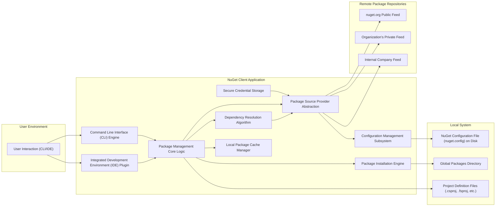
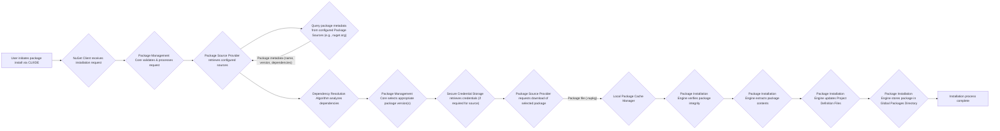

# Project Design Document: NuGet Client

**Version:** 1.1
**Date:** October 26, 2023
**Author:** AI Software Architect

## 1. Introduction

This document provides an enhanced design overview of the NuGet client, a critical tool for .NET developers facilitating the discovery, installation, and management of packages from various sources. This revised document aims to offer a more detailed and refined understanding of the client's architecture, key components, and data flow, specifically tailored to support comprehensive threat modeling activities. This document is based on the publicly available source code of the NuGet client project.

## 2. Goals and Objectives

The primary goals of the NuGet client are:

*   **Robust Package Management:** To enable users to reliably install, update, uninstall, and manage NuGet packages within their .NET projects.
*   **Efficient Package Discovery:** To provide intuitive and effective mechanisms for users to search and browse available packages from configured package sources.
*   **Intelligent Dependency Resolution:** To automatically and accurately manage package dependencies, ensuring compatibility, preventing conflicts, and optimizing the dependency graph.
*   **Flexible Package Source Management:** To allow users to seamlessly configure and manage diverse package sources, encompassing nuget.org, private feeds, and local directories.
*   **Secure Credential Management:** To securely store and manage credentials necessary for accessing authenticated package sources, adhering to security best practices.
*   **Extensible Architecture:** To maintain a modular and extensible architecture that facilitates the integration of new features, functionalities, and extensions.

## 3. Architectural Overview

The NuGet client employs a modular architecture, promoting separation of concerns, testability, and maintainability. It primarily interacts with remote package sources and the local file system, acting as an intermediary for package management operations.

## 4. Key Components

*   **Command Line Interface (CLI) Engine:** Provides a command-line interface for users to interact with NuGet functionalities through commands like `nuget install`, `nuget restore`, etc. This component handles parsing commands and invoking the core logic.
*   **Integrated Development Environment (IDE) Plugin:**  Integrates seamlessly with IDEs like Visual Studio, offering a graphical user interface for package management operations, enhancing developer convenience.
*   **Package Management Core Logic:** The central orchestrator responsible for managing all package-related operations. It receives requests from the CLI or IDE, coordinates with other components, and ensures the successful execution of package management tasks.
*   **Package Source Provider Abstraction:** Defines an abstraction layer that allows the client to interact with various types of package sources (e.g., HTTP-based feeds, local folders) in a uniform manner. This promotes extensibility and supports diverse repository implementations.
*   **Secure Credential Storage:**  Responsible for securely storing and retrieving credentials (e.g., API keys, user credentials) required to access authenticated package sources. This component is critical for maintaining the confidentiality of sensitive information.
*   **Configuration Management Subsystem:** Manages the client's configuration settings, including the list of configured package sources, default preferences, and API keys. These settings are typically persisted in `nuget.config` files.
*   **Local Package Cache Manager:**  Manages the local cache of downloaded packages. It optimizes performance by avoiding redundant downloads and provides a local copy of packages for offline scenarios.
*   **Package Installation Engine:** Handles the process of downloading package files from package sources, verifying their integrity, and extracting their contents to the appropriate locations on the local file system.
*   **Dependency Resolution Algorithm:** Implements the logic for analyzing package dependencies, resolving conflicts, and determining the optimal set of packages to install based on project requirements and compatibility constraints.
*   **Project Definition Files (.csproj, .fsproj, etc.):**  XML-based files that define the structure, dependencies, and build configuration of a specific .NET project. The NuGet client modifies these files to manage package references.
*   **Global Packages Directory:** A centralized location on the user's machine where downloaded packages are stored. This allows multiple projects to share the same package versions, saving disk space and ensuring consistency.
*   **NuGet Configuration File (nuget.config) on Disk:** An XML-based file that stores configuration settings for the NuGet client, including package sources, API keys, and package management behavior. This file can exist at different levels (machine-wide, user-specific, project-specific).

## 5. Data Flow (Package Installation)

The following diagram illustrates a typical data flow for installing a NuGet package, highlighting key interactions and data transformations:

**Detailed Data Flow Description (Package Installation):**

1. **User Initiation:** The user initiates a package installation request through the command-line interface or the integrated development environment.
2. **Request Reception:** The NuGet client receives the installation request, identifying the target package and any specified version constraints.
3. **Request Processing:** The Package Management Core validates the request, ensuring the project context is valid and necessary information is available.
4. **Source Retrieval:** The Package Source Provider retrieves the list of configured package sources from the NuGet configuration files.
5. **Metadata Query:** The Package Source Provider queries the configured package sources for metadata related to the requested package, including available versions and dependencies.
6. **Metadata Retrieval:** The package sources respond with package metadata, providing information necessary for dependency resolution and package selection.
7. **Dependency Analysis:** The Dependency Resolution Algorithm analyzes the dependencies of the requested package and its transitive dependencies to determine a compatible set of packages.
8. **Version Selection:** The Package Management Core selects the appropriate versions of the package and its dependencies based on the resolution results and any user-specified constraints.
9. **Credential Retrieval (Conditional):** If the selected package source requires authentication, the Secure Credential Storage component retrieves the necessary credentials.
10. **Download Request:** The Package Source Provider requests the download of the selected package file (`.nupkg`) from the appropriate package source.
11. **Package Download:** The package source streams the package file to the NuGet client.
12. **Local Caching:** The downloaded package file is stored in the Local Package Cache Manager.
13. **Integrity Verification:** The Package Installation Engine verifies the integrity of the downloaded package (e.g., using cryptographic signatures) to ensure it hasn't been tampered with.
14. **Package Extraction:** The Package Installation Engine extracts the contents of the package file to a temporary location.
15. **Project File Update:** The Package Installation Engine updates the project definition files (e.g., `.csproj`) to include references to the newly installed package.
16. **Global Package Storage:** The Package Installation Engine moves the extracted package contents to the Global Packages Directory.
17. **Installation Completion:** The installation process is complete, and the user is notified of the successful installation.

## 6. Security Considerations (Pre-Threat Modeling)

Prior to conducting a formal threat modeling exercise, it's crucial to highlight potential areas of security vulnerability and concern:

*   **Compromised Upstream Package Sources:** The risk of malicious actors compromising public or private package repositories to inject malware or vulnerable packages.
*   **Insufficient Package Integrity Verification:**  Weak or missing verification mechanisms for ensuring that downloaded packages haven't been tampered with during transit.
*   **Insecure Credential Management Practices:** Vulnerabilities in how credentials for accessing private feeds are stored, managed, or transmitted, potentially leading to unauthorized access.
*   **Local Cache Poisoning Attacks:**  The possibility of an attacker manipulating the local package cache to serve malicious packages instead of legitimate ones.
*   **Man-in-the-Middle (MITM) Attacks on Package Downloads:**  The risk of attackers intercepting and modifying package downloads if secure communication protocols (HTTPS) are not enforced.
*   **Dependency Confusion/Substitution Attacks:**  Attackers exploiting the package resolution process to trick users into installing malicious packages with names similar to internal or private packages.
*   **Configuration Tampering Vulnerabilities:**  The potential for malicious actors to modify NuGet configuration files (`nuget.config`) to redirect package installations to untrusted sources.
*   **Software Vulnerabilities within the NuGet Client:**  Bugs or security flaws in the NuGet client application itself that could be exploited by attackers.
*   **Lack of Secure Handling of API Keys:**  Risks associated with accidentally exposing API keys used for accessing private feeds.
*   **Vulnerabilities in Dependency Resolution Logic:**  Flaws in the dependency resolution algorithm that could be exploited to force the installation of vulnerable dependency versions.

## 7. Assumptions and Constraints

*   This design document primarily focuses on the core functionalities and common use cases of the NuGet client.
*   It assumes that users have appropriate permissions to modify project files and the global packages directory.
*   The security of the underlying operating system and network infrastructure is considered to be outside the scope of this document.
*   Specific implementation details and security features may vary across different versions and distributions of the NuGet client.

## 8. Future Considerations

*   Implementation of more robust and granular package validation and verification mechanisms.
*   Enhanced integration with vulnerability scanning tools and services to identify vulnerable packages.
*   Support for more advanced authentication and authorization protocols for accessing package sources.
*   Improvements in the performance and efficiency of package management operations, especially for large projects.
*   Exploration of decentralized package management approaches and technologies.
*   Further enhancements to the security of local caching mechanisms.
*   More detailed logging and auditing capabilities for package management activities.

This improved design document provides a more detailed and security-focused overview of the NuGet client's architecture and functionality. It serves as a valuable resource for understanding the system's components, data flows, and potential security considerations, ultimately facilitating a more effective threat modeling process.