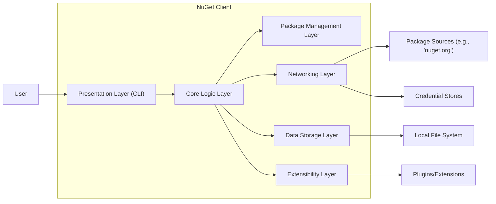
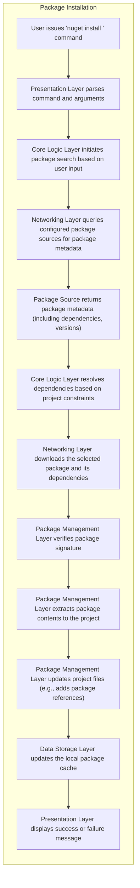
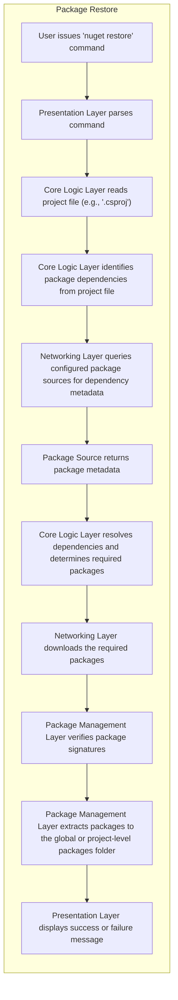

# Project Design Document: NuGet Client

**Version:** 1.1
**Date:** October 26, 2023
**Author:** AI Software Architect

## 1. Introduction

This document provides an enhanced and more detailed design overview of the NuGet client project, based on the codebase at [https://github.com/nuget/nuget.client](https://github.com/nuget/nuget.client). This iteration aims to provide a deeper understanding of the architectural components, data flows, and interactions within the system, specifically tailored for threat modeling purposes.

## 2. Project Overview

The NuGet client is a crucial tool for .NET development, functioning as both a command-line interface (CLI) and a set of libraries. It empowers developers to seamlessly integrate and manage external packages within their projects. This includes discovering, installing, updating, and removing packages from various package sources. The client's core responsibility is to manage dependencies and ensure a consistent and reliable build process.

## 3. Architectural Overview

The NuGet client employs a layered architecture, promoting modularity and separation of concerns. The key layers and components are:

*   **Presentation Layer:**  Responsible for user interaction, primarily through the command-line interface. It interprets user commands and presents information back to the user.
*   **Core Logic Layer:**  The heart of the NuGet client, containing the business logic for package management operations, dependency resolution, and interaction orchestration.
*   **Package Management Layer:** A specialized part of the Core Logic Layer focused on the mechanics of installing, uninstalling, and updating packages.
*   **Networking Layer:** Handles all network communication with package sources and other external services.
*   **Data Storage Layer:** Manages access to local data, including package caches, configuration files, and project files.
*   **Extensibility Layer:** Provides mechanisms for extending the client's functionality through plugins and extensions.

## 4. Detailed Component Description

### 4.1. Presentation Layer (CLI)

*   **Purpose:** To provide the primary interface for users to interact with NuGet functionalities.
*   **Key Responsibilities:**
    *   Receiving and parsing commands and arguments entered by the user.
    *   Validating the syntax and semantics of user input.
    *   Presenting formatted output, including package information, progress updates, and error messages.
    *   Handling interactive prompts for user input, such as authentication credentials.
*   **Key Components:**
    *   Command-line argument parsing libraries (e.g., a custom parser or a library like CommandLineParser).
    *   Output formatting and display logic, potentially using console output streams.
    *   Command dispatching mechanism to route commands to the appropriate Core Logic components.

### 4.2. Core Logic Layer

*   **Purpose:** To orchestrate the core functionalities of NuGet, acting as the central coordinator.
*   **Key Responsibilities:**
    *   Initiating and managing package discovery processes.
    *   Performing dependency resolution to determine the correct versions of packages to install.
    *   Coordinating package download, installation, update, and removal operations.
    *   Managing NuGet configuration settings and profiles.
    *   Handling error conditions and exceptions during operations.
*   **Key Components:**
    *   `NuGet.Commands`: Contains implementations for various NuGet commands (e.g., `install`, `update`, `restore`).
    *   `NuGet.Resolver`: Implements the dependency resolution algorithms.
    *   `NuGet.Configuration`: Manages the loading and application of NuGet configuration settings.
    *   `NuGet.ProjectModel`: Represents the project's package dependencies and related information.

### 4.3. Package Management Layer

*   **Purpose:** To handle the low-level details of package manipulation.
*   **Key Responsibilities:**
    *   Downloading package files from package sources.
    *   Verifying package integrity (e.g., through signature verification).
    *   Extracting package contents to the appropriate locations within a project.
    *   Updating project files (e.g., `.csproj`) to reflect package changes.
    *   Managing the local package cache.
*   **Key Components:**
    *   `NuGet.PackageManagement`: Contains classes for installing, uninstalling, and updating packages.
    *   `NuGet.Packaging`: Deals with the structure and content of NuGet packages (`.nupkg` files).
    *   `NuGet.PackageExtraction`: Handles the extraction of package contents.
    *   `NuGet.SignatureVerification`: Verifies the digital signatures of NuGet packages.

### 4.4. Networking Layer

*   **Purpose:** To manage all network communication required by the NuGet client.
*   **Key Responsibilities:**
    *   Making HTTP/HTTPS requests to package sources to retrieve package metadata and download package files.
    *   Handling authentication with package sources.
    *   Managing proxy server configurations.
    *   Implementing retry logic for network requests.
*   **Key Components:**
    *   `NuGet.Protocol`: Implements the NuGet client protocol for interacting with package sources.
    *   `System.Net.Http.HttpClient`:  The underlying HTTP client used for network requests.
    *   Credential providers for handling authentication.

### 4.5. Data Storage Layer

*   **Purpose:** To manage access to local data used by the NuGet client.
*   **Key Responsibilities:**
    *   Reading and writing NuGet configuration files (`nuget.config`).
    *   Managing the global and local package caches.
    *   Accessing project files (e.g., `.csproj`, `packages.config`).
    *   Storing and retrieving temporary files.
*   **Key Components:**
    *   File system access utilities (e.g., `System.IO`).
    *   Cache management logic.
    *   Configuration file parsing and serialization mechanisms.

### 4.6. Extensibility Layer

*   **Purpose:** To allow developers to extend the functionality of the NuGet client.
*   **Key Responsibilities:**
    *   Loading and managing plugins or extensions.
    *   Providing well-defined extension points and APIs for extensions to interact with the client.
    *   Ensuring the security and stability of the client when extensions are loaded.
*   **Key Components:**
    *   Plugin discovery and loading mechanisms (e.g., using MEF - Managed Extensibility Framework).
    *   Extension interfaces and base classes.

## 5. Key Data Flows

### 5.1. Package Installation (Detailed)

### 5.2. Package Restore (Detailed)

## 6. External Dependencies and Interactions (Expanded)

The NuGet client relies on and interacts with a variety of external systems and resources:

*   **Package Sources (e.g., nuget.org, Azure Artifacts, MyGet, private feeds):** These are the primary sources for NuGet packages. Communication occurs over HTTPS, and authentication may be required.
*   **Local File System:**  Extensive interaction for reading project files, configuration, and managing the package cache. Permissions and access controls are relevant here.
*   **Credential Stores (e.g., Windows Credential Manager, macOS Keychain, Azure DevOps Personal Access Tokens):** Used for securely storing and retrieving credentials for accessing authenticated package sources. The client needs appropriate permissions to access these stores.
*   **Proxy Servers:** If configured, all network traffic to package sources will be routed through proxy servers. The client needs to be able to authenticate with the proxy if required.
*   **Operating System:** The client relies on the OS for core functionalities like file system access, network communication, and access to credential stores.
*   **.NET Runtime:** The NuGet client is a .NET application and requires the .NET runtime to execute. The security of the runtime environment is also a factor.
*   **Telemetry Services (Optional):** The NuGet client may send telemetry data to Microsoft for usage analysis and improvement. This interaction needs to be considered from a privacy perspective.

## 7. Security Considerations (More Specific)

Building upon the initial thoughts, here are more specific security considerations:

*   **Package Source Spoofing/Compromise:**  Mitigating the risk of connecting to malicious or compromised package sources. This includes verifying source URLs and using HTTPS.
*   **Package Content Tampering:** Ensuring the integrity of downloaded packages through signature verification. Weak or missing signature verification is a critical vulnerability.
*   **Credential Theft/Exposure:** Protecting stored credentials for authenticated feeds. Weak encryption or insecure storage mechanisms are risks.
*   **Man-in-the-Middle (MITM) Attacks:**  Ensuring secure communication channels (HTTPS) to prevent interception of package data or credentials.
*   **Local File System Vulnerabilities:**  Preventing malicious packages from exploiting vulnerabilities through file system operations (e.g., path traversal, writing to protected locations).
*   **Dependency Confusion Attacks:**  Protecting against scenarios where a malicious package with the same name as an internal package is introduced on a public feed.
*   **Vulnerabilities in NuGet Client Dependencies:** Regularly updating the NuGet client's own dependencies to patch known security vulnerabilities.
*   **Insecure Plugin Development/Loading:**  Ensuring that the plugin architecture does not introduce vulnerabilities through malicious or poorly written plugins. Sandboxing or code signing for plugins could be considered.
*   **Command Injection Vulnerabilities:**  Preventing attackers from injecting malicious commands through NuGet configuration or package metadata. Input validation and sanitization are crucial.
*   **Denial of Service (DoS) Attacks:**  Protecting against attacks that could overload package sources or the client itself, preventing legitimate usage. Rate limiting and resource management are important.
*   **Telemetry Data Privacy:** Ensuring that any telemetry data collected is anonymized and handled according to privacy best practices.

## 8. Diagrams

The architectural and data flow diagrams in sections 3, 5.1, and 5.2 provide visual representations of the system's structure and operation.

## 9. Future Considerations

*   Detailed analysis of error handling mechanisms and their security implications.
*   In-depth examination of the NuGet API and its security considerations for programmatic access.
*   Security analysis of the NuGet client's build and release pipeline.
*   Consideration of security features like package vulnerability scanning integration.

This enhanced design document provides a more comprehensive understanding of the NuGet client, specifically focusing on aspects relevant to threat modeling. It will serve as a valuable resource for identifying potential security vulnerabilities and developing appropriate mitigation strategies.