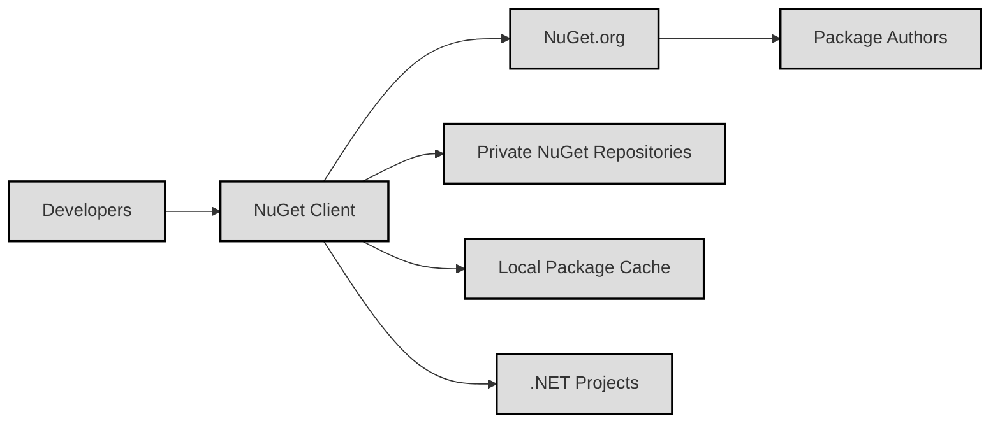
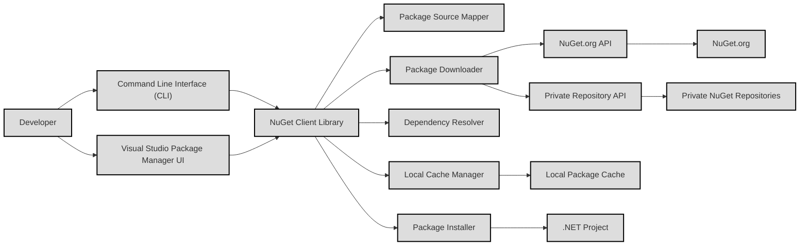
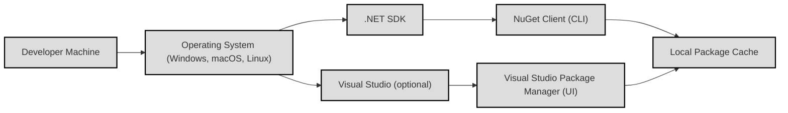
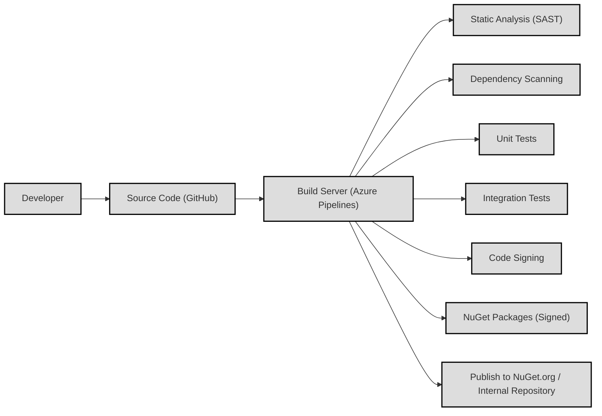

# Project Design Document: NuGet Client

## BUSINESS POSTURE

NuGet Client is a crucial component of the .NET ecosystem, enabling developers to discover, install, and manage packages. The primary business priorities and goals are:

*   Enable efficient and reliable package management for .NET developers.
*   Provide a secure and trustworthy mechanism for distributing and consuming packages.
*   Maintain compatibility with the NuGet.org package repository and other package sources.
*   Support a wide range of .NET project types and platforms.
*   Offer a consistent and user-friendly experience across different development environments (Visual Studio, command-line interface, etc.).

The most important business risks that need to be addressed are:

*   **Malicious Packages:** The introduction of malicious packages into the ecosystem could compromise the security of applications built using NuGet.
*   **Supply Chain Attacks:** Compromise of the NuGet client itself or its dependencies could lead to widespread vulnerabilities.
*   **Availability and Performance:** Downtime or performance issues with the NuGet client or the NuGet.org repository can disrupt developer workflows.
*   **Package Integrity:** Ensuring that packages are not tampered with during download and installation is critical.
*   **Dependency Confusion:** Attackers might exploit similar package names to trick developers into installing malicious packages.

## SECURITY POSTURE

Existing security controls and accepted risks, based on the provided GitHub repository, are inferred as follows:

*   security control: Code signing of NuGet client binaries. (Inferred from common practice and NuGet's importance)
*   security control: Use of HTTPS for communication with package repositories. (Inferred from common practice and NuGet documentation)
*   security control: Package signature verification. (Described in NuGet documentation and client features)
*   security control: Static analysis tools used during development. (Inferred from the presence of build scripts and common practice)
*   security control: Vulnerability scanning of dependencies. (Inferred from common practice and Microsoft's security policies)
*   security control: Code reviews and pull request process. (Observed in the GitHub repository)
*   security control: Two-factor authentication for maintainers with publishing rights to NuGet.org. (Inferred from NuGet.org policies)
*   accepted risk: Reliance on third-party package authors to maintain the security of their packages. (Inherent risk in the open-source package ecosystem)
*   accepted risk: Potential for zero-day vulnerabilities in the NuGet client or its dependencies. (Inherent risk in any software)
*   accepted risk: Limited control over the security practices of private NuGet repositories. (NuGet client can connect to various repositories)

Recommended security controls (high priority):

*   security control: Implement a comprehensive Software Bill of Materials (SBOM) for the NuGet client and its dependencies.
*   security control: Integrate dynamic analysis (fuzzing) into the development process.
*   security control: Conduct regular penetration testing of the NuGet client and its interactions with NuGet.org.
*   security control: Enhance supply chain security by implementing in-toto or a similar framework.
*   security control: Implement robust telemetry and monitoring to detect and respond to security incidents.

Security Requirements:

*   Authentication:
    *   The client must support secure authentication mechanisms for accessing private package repositories (e.g., API keys, personal access tokens, OAuth).
    *   The client must securely store and manage credentials used for authentication.
*   Authorization:
    *   The client must respect access control policies defined by package repositories.
    *   The client should support granular permissions for different operations (e.g., installing, updating, publishing packages).
*   Input Validation:
    *   The client must validate all user inputs, including package names, versions, and repository URLs.
    *   The client must sanitize inputs to prevent injection attacks.
    *   The client must handle malformed package metadata gracefully.
*   Cryptography:
    *   The client must use strong cryptographic algorithms and protocols for secure communication (HTTPS with TLS 1.2 or higher).
    *   The client must verify the integrity of downloaded packages using digital signatures.
    *   The client must securely store any cryptographic keys used for signing or encryption.

## DESIGN

### C4 CONTEXT

Element Descriptions:

*   Element:
    *   Name: Developers
    *   Type: Person
    *   Description: Software developers who use NuGet to manage dependencies in their .NET projects.
    *   Responsibilities: Use the NuGet client to search, install, update, and manage packages.
    *   Security controls: Use strong passwords and enable two-factor authentication where available.
*   Element:
    *   Name: NuGet Client
    *   Type: Software System
    *   Description: The client-side tool that interacts with package repositories and manages package installations.
    *   Responsibilities: Download packages, verify signatures, resolve dependencies, install packages into projects.
    *   Security controls: Package signature verification, HTTPS communication, input validation, secure credential storage.
*   Element:
    *   Name: NuGet.org
    *   Type: Software System
    *   Description: The official public NuGet package repository.
    *   Responsibilities: Host packages, provide search functionality, manage package metadata.
    *   Security controls: HTTPS, access controls, vulnerability scanning, intrusion detection.
*   Element:
    *   Name: Private NuGet Repositories
    *   Type: Software System
    *   Description: Privately hosted NuGet repositories used by organizations to share internal packages.
    *   Responsibilities: Host packages, provide search functionality, manage package metadata.
    *   Security controls: HTTPS, access controls, authentication, authorization (implementation varies).
*   Element:
    *   Name: Local Package Cache
    *   Type: Software System
    *   Description: A local cache on the developer's machine that stores downloaded packages.
    *   Responsibilities: Store downloaded packages to speed up subsequent installations.
    *   Security controls: File system permissions, potentially package signature verification upon retrieval.
*   Element:
    *   Name: .NET Projects
    *   Type: Software System
    *   Description: .NET projects that consume NuGet packages.
    *   Responsibilities: Utilize the functionality provided by the installed packages.
    *   Security controls: Dependent on the security practices of the project and the packages it uses.
*   Element:
    *   Name: Package Authors
    *   Type: Person
    *   Description: Developers who create and publish packages to NuGet.org.
    *   Responsibilities: Develop and maintain packages, follow security best practices.
    *   Security controls: Use strong passwords, enable two-factor authentication for their NuGet.org accounts, follow secure coding practices.

### C4 CONTAINER

Element Descriptions:

*   Element:
    *   Name: Developer
    *   Type: Person
    *   Description: Software developer interacting with NuGet.
    *   Responsibilities: Initiates package management operations.
    *   Security controls: Uses secure development environment.
*   Element:
    *   Name: Command Line Interface (CLI)
    *   Type: Container: Application
    *   Description: Provides a command-line interface for interacting with NuGet (e.g., dotnet CLI).
    *   Responsibilities: Parses commands, interacts with the NuGet Client Library.
    *   Security controls: Input validation, secure communication with the library.
*   Element:
    *   Name: Visual Studio Package Manager UI
    *   Type: Container: Application
    *   Description: Graphical user interface integrated into Visual Studio.
    *   Responsibilities: Provides a visual interface for managing packages, interacts with the NuGet Client Library.
    *   Security controls: Input validation, secure communication with the library.
*   Element:
    *   Name: NuGet Client Library
    *   Type: Container: Library
    *   Description: Core library that implements NuGet functionality.
    *   Responsibilities: Manages package sources, downloads, resolves dependencies, installs packages.
    *   Security controls: Input validation, signature verification, secure communication.
*   Element:
    *   Name: Package Source Mapper
    *   Type: Container: Component
    *   Description: Maps package IDs to configured package sources.
    *   Responsibilities: Determines where to download a package from.
    *   Security controls: Validate package source URLs.
*   Element:
    *   Name: Package Downloader
    *   Type: Container: Component
    *   Description: Downloads packages from remote repositories.
    *   Responsibilities: Retrieves package files, verifies integrity.
    *   Security controls: HTTPS, signature verification, retry mechanisms.
*   Element:
    *   Name: Dependency Resolver
    *   Type: Container: Component
    *   Description: Resolves package dependencies.
    *   Responsibilities: Determines the correct versions of all required packages.
    *   Security controls: Handles version conflicts, avoids vulnerable versions (if vulnerability data is available).
*   Element:
    *   Name: Package Installer
    *   Type: Container: Component
    *   Description: Installs packages into .NET projects.
    *   Responsibilities: Adds package references, copies files.
    *   Security controls: Verifies package integrity before installation.
*   Element:
    *   Name: Local Cache Manager
    *   Type: Container: Component
    *   Description: Manages the local package cache.
    *   Responsibilities: Stores and retrieves downloaded packages.
    *   Security controls: File system permissions.
*   Element:
    *   Name: NuGet.org API
    *   Type: Container: API
    *   Description: API endpoint for interacting with NuGet.org.
    *   Responsibilities: Provides package metadata, download links.
    *   Security controls: HTTPS, API rate limiting.
*   Element:
    *   Name: Private Repository API
    *   Type: Container: API
    *   Description: API endpoint for interacting with private NuGet repositories.
    *   Responsibilities: Provides package metadata, download links.
    *   Security controls: HTTPS, authentication, authorization (implementation varies).
*   Element:
    *   Name: NuGet.org
    *   Type: Container: External System
    *   Description: The official public NuGet package repository.
    *   Responsibilities: Hosts packages.
    *   Security controls: See Context Diagram.
*   Element:
    *   Name: Private NuGet Repositories
    *   Type: Container: External System
    *   Description: Privately hosted NuGet repositories.
    *   Responsibilities: Hosts packages.
    *   Security controls: See Context Diagram.
*   Element:
    *   Name: Local Package Cache
    *   Type: Container: File System
    *   Description: Local storage for downloaded packages.
    *   Responsibilities: Stores packages.
    *   Security controls: See Context Diagram.
*   Element:
    *   Name: .NET Project
    *   Type: Container: Application
    *   Description: The project receiving the NuGet packages.
    *   Responsibilities: Uses the installed packages.
    *   Security controls: Dependent on project and package security.

### DEPLOYMENT

Possible deployment solutions:

1.  **Developer Machine:** NuGet client is typically installed as part of the .NET SDK or Visual Studio.
2.  **Build Server:** NuGet client is used on build servers (e.g., Azure DevOps, Jenkins) to restore packages during the build process.
3.  **Containerized Environments:** NuGet client can be used within Docker containers for building and running .NET applications.

Chosen solution (Developer Machine):

Element Descriptions:

*   Element:
    *   Name: Developer Machine
    *   Type: Node: Device
    *   Description: The developer's workstation.
    *   Responsibilities: Runs the operating system, .NET SDK, and development tools.
    *   Security controls: Operating system security, firewall, antivirus.
*   Element:
    *   Name: Operating System (Windows, macOS, Linux)
    *   Type: Node: Operating System
    *   Description: The underlying operating system.
    *   Responsibilities: Provides the foundation for running software.
    *   Security controls: OS updates, user account management, file system permissions.
*   Element:
    *   Name: .NET SDK
    *   Type: Node: Software
    *   Description: The .NET Software Development Kit.
    *   Responsibilities: Provides tools for building and running .NET applications, includes the NuGet client CLI.
    *   Security controls: Regularly updated, code-signed binaries.
*   Element:
    *   Name: Visual Studio (optional)
    *   Type: Node: Software
    *   Description: The Visual Studio IDE.
    *   Responsibilities: Provides a development environment, includes the NuGet Package Manager UI.
    *   Security controls: Regularly updated, code-signed binaries.
*   Element:
    *   Name: NuGet Client (CLI)
    *   Type: Node: Software
    *   Description: The command-line interface for NuGet.
    *   Responsibilities: See Container Diagram.
    *   Security controls: See Container Diagram.
*   Element:
    *   Name: Visual Studio Package Manager (UI)
    *   Type: Node: Software
    *   Description: The graphical user interface for NuGet within Visual Studio.
    *   Responsibilities: See Container Diagram.
    *   Security controls: See Container Diagram.
*   Element:
    *   Name: Local Package Cache
    *   Type: Node: File System
    *   Description: Local storage for downloaded packages.
    *   Responsibilities: See Container Diagram.
    *   Security controls: See Container Diagram.

### BUILD

Build Process Description:

1.  **Developer:** A developer commits code changes to the GitHub repository.
2.  **Source Code (GitHub):** The source code is hosted on GitHub.
3.  **Build Server (Azure Pipelines):** Azure Pipelines is used as the CI/CD system. A build pipeline is triggered by commits to the repository.
4.  **Static Analysis (SAST):** Static analysis tools are run to identify potential security vulnerabilities in the code.
5.  **Dependency Scanning:** The build process scans dependencies for known vulnerabilities.
6.  **Unit Tests:** Unit tests are executed to verify the functionality of individual components.
7.  **Integration Tests:** Integration tests are executed to verify the interaction between different components.
8.  **Code Signing:** The built NuGet client binaries are code-signed to ensure authenticity and integrity.
9.  **NuGet Packages (Signed):** The output of the build process is a set of signed NuGet packages.
10. **Publish to NuGet.org / Internal Repository:** The signed packages are published to NuGet.org or an internal repository.

Security Controls in Build Process:

*   security control: Static analysis (SAST) to identify code vulnerabilities.
*   security control: Dependency scanning to detect known vulnerable dependencies.
*   security control: Code signing to ensure the authenticity and integrity of the binaries.
*   security control: Automated build process to ensure consistency and repeatability.
*   security control: Use of a secure build environment (Azure Pipelines).
*   security control: Limited access to build server and publishing credentials.

## RISK ASSESSMENT

*   Critical Business Processes:
    *   Package Acquisition: Developers must be able to reliably and securely acquire packages for their projects.
    *   Package Publishing: Package authors must be able to securely publish packages to repositories.
    *   Dependency Management: The NuGet client must accurately and securely manage project dependencies.

*   Data to Protect:
    *   Package Content: The actual code and assets within NuGet packages. (Sensitivity: Varies from public open-source code to proprietary code)
    *   Package Metadata: Information about packages, including dependencies, versions, and authors. (Sensitivity: Public for public packages, potentially sensitive for private packages)
    *   Credentials: API keys, access tokens, and other credentials used to access private repositories. (Sensitivity: High)
    *   User Data: Information about developers and package authors (e.g., email addresses). (Sensitivity: Medium)

## QUESTIONS & ASSUMPTIONS

*   Questions:
    *   What specific static analysis tools are used in the build process?
    *   What is the process for handling reported vulnerabilities in the NuGet client or its dependencies?
    *   What are the specific security requirements for private NuGet repositories that the client interacts with?
    *   Are there any specific compliance requirements (e.g., FedRAMP, HIPAA) that the NuGet client needs to adhere to?
    *   What is the process for rotating code signing certificates?
    *   What kind of dynamic analysis is performed?
    *   What is the frequency of penetration testing?

*   Assumptions:
    *   The NuGet client uses HTTPS for all communication with package repositories.
    *   The NuGet client verifies package signatures before installation.
    *   The build process includes static analysis and dependency scanning.
    *   Developers and package authors follow security best practices.
    *   NuGet.org implements appropriate security controls to protect its infrastructure and data.
    *   Private NuGet repository administrators are responsible for securing their own repositories.
    *   The .NET SDK and Visual Studio are regularly updated to the latest versions.
    *   Azure Pipelines is configured securely.