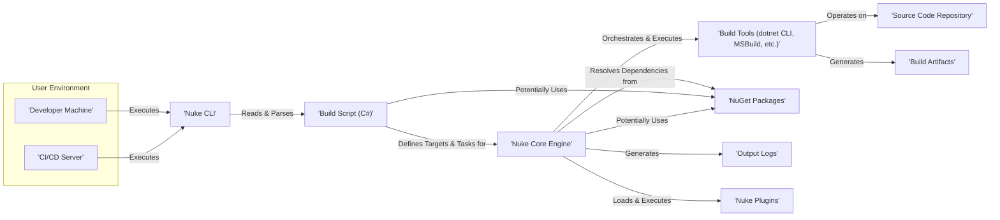
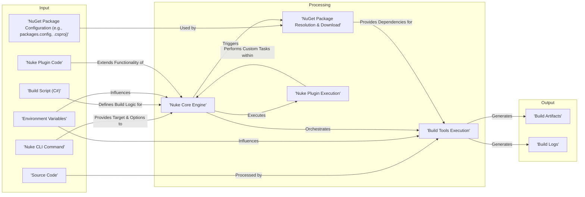

# Project Design Document: Nuke Build System

**Version:** 1.1
**Date:** October 26, 2023
**Author:** AI Software Architect

## 1. Introduction

This document provides a detailed design overview of the Nuke build system (as represented by the GitHub repository: [https://github.com/nuke-build/nuke](https://github.com/nuke-build/nuke)). This document aims to clearly outline the system's architecture, key components, and data flow to facilitate subsequent threat modeling activities. The focus is on providing the necessary context for identifying potential security vulnerabilities.

## 2. System Overview

Nuke is a cross-platform, extensible build automation system primarily designed for .NET projects. Its core strength lies in defining build processes declaratively using C# as the scripting language. This approach offers strong typing, code reusability, and seamless integration with the .NET ecosystem. Nuke simplifies complex build workflows by providing a structured way to define build targets and their dependencies. Upon execution, Nuke intelligently analyzes the build definition and orchestrates the execution of necessary steps in the correct order.

## 3. System Architecture

The following diagram illustrates the high-level architecture of the Nuke build system, highlighting key interactions:

## 4. Data Flow

The typical data flow within the Nuke build system involves the following stages:

*   **Invocation:** A user or an automated system (like a CI/CD pipeline) invokes the Nuke CLI, specifying the desired build target.
*   **Script Loading and Parsing:** The Nuke CLI locates and loads the build script (a C# file). The Nuke Core Engine then parses this script to understand the defined build process.
*   **Dependency Resolution:** The Nuke Core Engine analyzes the build script, identifies the requested target, and resolves all its dependencies (both target dependencies and external package dependencies via NuGet).
*   **Task Execution:** Based on the resolved dependencies and the build script definition, the Nuke Core Engine orchestrates the execution of individual build tasks. These tasks often involve invoking external build tools.
*   **Tool Interaction:** Build tools interact with the source code repository to access necessary files, and they might download NuGet packages as required dependencies.
*   **Artifact Generation:** Build tools perform their designated actions (e.g., compilation, testing, packaging) and generate build artifacts.
*   **Logging:** The Nuke Core Engine and the invoked build tools generate output logs, providing information about the build process.

## 5. Key Components

This section provides a more detailed explanation of the core components within the Nuke build system:

*   **Nuke CLI:** The primary interface for interacting with Nuke. Its responsibilities include:
    *   Parsing command-line arguments provided by the user.
    *   Locating and loading the build script from the project directory.
    *   Bootstrapping and initializing the Nuke Core Engine.
    *   Presenting build progress, status, and results to the user.

*   **Build Script (C#):** This is a crucial component, a C# file that declaratively defines the entire build process. It encompasses:
    *   Definitions of build targets (e.g., `Compile`, `Test`, `Pack`, `Publish`).
    *   Declarations of dependencies between these targets, establishing the execution order.
    *   Implementation of tasks within each target, often involving the invocation of external build tools or custom logic.
    *   Configuration parameters and properties that influence the build process.
    *   Potential usage of NuGet packages to extend build functionality or for project dependencies.

*   **Nuke Core Engine:** The central orchestrator of the build process. Its key functions are:
    *   Parsing the build script and constructing an internal representation of the build workflow.
    *   Resolving dependencies between build targets to determine the correct execution sequence.
    *   Orchestrating the execution of individual build tasks, ensuring they run in the required order.
    *   Providing a plugin mechanism for extending Nuke's capabilities.
    *   Managing the build state, logging output, and handling errors.

*   **Build Tools:** External command-line applications invoked by Nuke to perform specific build-related actions. Examples include:
    *   `dotnet CLI`: Used for building, testing, restoring NuGet packages, and publishing .NET projects.
    *   `MSBuild`: The Microsoft Build Engine, primarily used for building traditional .NET Framework projects.
    *   `git`: For interacting with version control systems.
    *   `Docker`: For containerization tasks.
    *   Other specialized tools for tasks like code generation, static analysis, and deployment.

*   **NuGet Packages:**  A package management system utilized by Nuke and build scripts for:
    *   **Nuke Plugins:** Extending Nuke's functionality with pre-built tasks and integrations.
    *   **Build Dependencies:**  Packages required by the build process itself (e.g., testing frameworks, code analysis tools).
    *   **Project Dependencies:** Libraries and components required by the project being built.

*   **Nuke Plugins:**  Extend the core functionality of Nuke by providing reusable tasks, integrations with other tools, and custom logic. Plugins are typically distributed and consumed as NuGet packages.

## 6. Security Considerations

This section outlines potential security considerations relevant to the Nuke build system, providing a foundation for subsequent threat modeling:

*   **Build Script Execution:** The build script, being C# code, has the potential to execute arbitrary commands on the build machine. Maliciously crafted or compromised build scripts could:
    *   Execute harmful system commands.
    *   Exfiltrate sensitive data from the build environment.
    *   Modify the build environment or source code.
    *   Introduce vulnerabilities into the build artifacts.
*   **Dependency Vulnerabilities (NuGet):** Nuke and build scripts rely on NuGet packages. Compromised or vulnerable NuGet packages introduced as dependencies could:
    *   Introduce security flaws into the build process or the final application.
    *   Expose the build environment to malicious code execution.
    *   Lead to supply chain attacks.
*   **Build Tool Vulnerabilities:**  The external build tools invoked by Nuke might contain security vulnerabilities. If exploited, these vulnerabilities could compromise the build process or the resulting artifacts.
*   **Plugin Security:** Nuke plugins, being external code, pose a similar risk to build scripts. Malicious plugins could compromise the build process or the build environment.
*   **Input Validation and Sanitization:**  Nuke needs to handle various inputs, including command-line arguments, environment variables, and configuration files. Insufficient validation of these inputs could lead to vulnerabilities like command injection or path traversal.
*   **Secrets Management:** Build processes often require access to sensitive credentials (e.g., API keys, passwords). Improper handling or storage of these secrets could lead to their exposure.
*   **Permissions and Access Control:** The permissions under which Nuke and the build tools execute are critical. Overly permissive configurations could allow unauthorized access or modifications.
*   **Logging Security:** Build logs might contain sensitive information. Securely storing and managing these logs is important to prevent unauthorized access.
*   **Build Environment Security:** The security posture of the environment where Nuke is executed (developer machine or CI/CD agent) directly impacts the overall security of the build process. A compromised build environment can undermine all other security measures.

## 7. Deployment Considerations

Nuke is commonly used in the following deployment scenarios, each with its own security implications:

*   **Local Developer Machines:** Developers execute Nuke locally during development. Security considerations include:
    *   The security of the developer's machine itself.
    *   The trustworthiness of build scripts and dependencies used locally.
*   **Continuous Integration/Continuous Deployment (CI/CD) Systems:** Nuke is frequently integrated into CI/CD pipelines for automated builds. Security considerations here include:
    *   The security of the CI/CD platform and build agents.
    *   Secure storage and management of secrets used in the build process.
    *   Isolation of build environments to prevent cross-contamination.
    *   Auditing and logging of build activities.

## 8. Future Considerations

This design document provides a comprehensive overview of the Nuke build system. Future enhancements could include:

*   More detailed diagrams focusing on specific workflows or component interactions.
*   An in-depth analysis of the Nuke plugin architecture and its security implications.
*   A discussion of different Nuke execution modes and their respective security considerations.
*   Integration with specific security tools and practices (e.g., static analysis, vulnerability scanning).

This document serves as a solid foundation for performing a thorough threat model of the Nuke build system, enabling the identification and mitigation of potential security risks associated with its design and operation.
