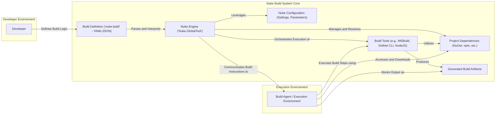
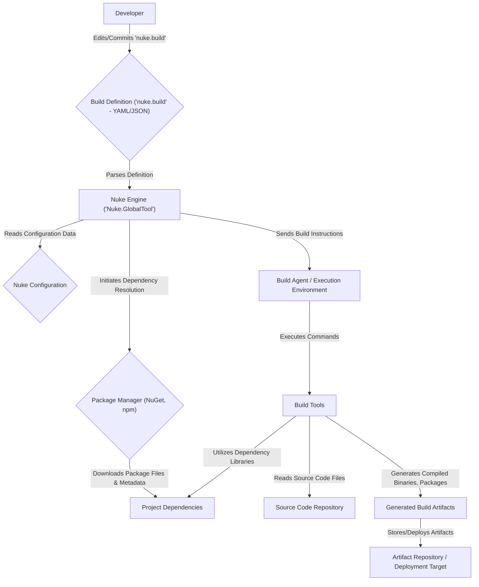

# Project Design Document: Nuke Build System

**Version:** 1.1
**Date:** October 26, 2023
**Author:** AI Software Architect

## 1. Introduction

This document provides an enhanced and more detailed design overview of the Nuke build system (as represented by the GitHub repository: https://github.com/nuke-build/nuke). This revised document aims to offer a deeper understanding of the system's architecture, components, and data flow, serving as a robust foundation for subsequent threat modeling activities. Improvements include more specific details on component functionality and potential security implications.

## 2. Goals

*   Clearly and comprehensively define the architecture and components of the Nuke build system with greater technical detail.
*   Describe the interactions between different components, including the nature of the communication.
*   Outline the data flow within the system, specifying the types of data exchanged.
*   Identify key technologies, dependencies, and their potential security relevance.
*   Provide a more detailed and actionable basis for identifying potential security vulnerabilities and threats.

## 3. System Overview

Nuke is a cross-platform build automation system designed to streamline and standardize build processes. It empowers developers to define build workflows declaratively, typically using human-readable formats like YAML or JSON. The system orchestrates the execution of these defined build steps across diverse environments, ensuring consistency and reproducibility.

Here's a refined high-level architectural diagram:

**Key Components:**

*   **Developer:** The individual responsible for authoring and maintaining the build definition files, and for initiating build processes.
*   **Build Definition ('nuke.build' - YAML/JSON):** A declarative file, typically named `nuke.build`, that meticulously outlines the build steps, project dependencies, and configuration parameters. This file serves as the blueprint for the entire build process.
*   **Nuke Engine ('Nuke.GlobalTool'):** The central processing unit of the Nuke build system. This component, often implemented as a global command-line tool, is responsible for parsing the build definition, resolving dependencies, orchestrating the execution of build steps, and managing the overall build lifecycle.
*   **Build Tools (e.g., MSBuild, DotNet CLI, NodeJS):** External, specialized tools invoked by the Nuke Engine to perform specific build tasks. These tools handle actions like code compilation, linking, packaging, testing, and deployment.
*   **Project Dependencies (NuGet, npm, etc.):** External software libraries, packages, and other resources required by the project being built. These dependencies are typically managed by package managers like NuGet for .NET projects or npm for Node.js projects.
*   **Generated Build Artifacts:** The tangible outputs of the build process. These can include executables, libraries, installable packages, container images, and other deployable units.
*   **Nuke Configuration (Settings, Parameters):**  Settings and parameters that influence the behavior of the Nuke Engine and the overall build process. These can include target platforms, build modes (debug/release), API keys, and other environment-specific configurations.
*   **Build Agent / Execution Environment:** The specific machine or environment where the actual build steps are executed. This could be a developer's local machine, a dedicated CI/CD server, or a dynamically provisioned cloud-based build agent.

## 4. Component Details

This section provides a more in-depth description of each key component, focusing on their functionality and interactions.

### 4.1. Developer

*   **Role:** Creates, modifies, and maintains the `nuke.build` definition files. Initiates build processes through command-line interfaces or integrated development environments (IDEs).
*   **Interactions:** Directly interacts with the `nuke.build` file (typically stored in the project repository) and interacts with the Nuke Engine via command-line tools (e.g., `nuke`).
*   **Data Handled:** Creates and modifies YAML/JSON build definition files, potentially containing sensitive information like API endpoint URLs or script paths.

### 4.2. Build Definition ('nuke.build' - YAML/JSON)

*   **Role:** Serves as the declarative specification of the entire build process, defining targets, dependencies (both project and external), and individual tasks with their associated commands and parameters.
*   **Functionality:** Provides a structured and human-readable way to describe the build workflow, allowing for version control and collaboration.
*   **Data Handled:** Contains instructions for the build process, including task definitions (potentially containing inline scripts), dependency declarations (specifying package names and versions), and configuration settings. This data can be sensitive if it includes credentials or internal paths.
*   **Technology:** Primarily YAML or JSON format, leveraging the syntax and features of these languages.

### 4.3. Nuke Engine ('Nuke.GlobalTool')

*   **Role:** The core orchestrator responsible for interpreting the build definition and driving the entire build process.
*   **Functionality:**
    *   **Parsing:** Reads and parses the `nuke.build` file to understand the defined build workflow.
    *   **Dependency Resolution:** Resolves both project-level dependencies and external package dependencies using configured package managers.
    *   **Task Scheduling:** Determines the order of execution for build steps based on dependencies and defined execution plans.
    *   **Build Tool Invocation:** Invokes the necessary Build Tools with specific commands, arguments, and environment variables.
    *   **Environment Management:** Sets up and manages the build environment, including environment variables and working directories.
    *   **Error Handling:** Manages and reports errors encountered during the build process.
    *   **Logging:** Generates detailed logs of the build process, including timestamps, executed commands, and output from Build Tools.
*   **Interactions:** Interacts with the `nuke.build` file, Build Tools, Project Dependencies, Nuke Configuration, and the Build Agent/Execution Environment.
*   **Data Handled:** Processes the `nuke.build` definition, manages dependency information (including potentially downloading package metadata), and generates build logs (which might contain sensitive information).

### 4.4. Build Tools

*   **Role:** Execute the specific tasks defined in the build process, such as compiling code, running tests, and packaging applications.
*   **Functionality:** Performs the core actions of the build process based on the instructions provided by the Nuke Engine.
*   **Examples:** MSBuild (for .NET projects), DotNet CLI (for .NET Core and later), NodeJS (for JavaScript projects), Docker CLI (for containerization).
*   **Interactions:** Invoked by the Nuke Engine with specific commands, arguments, and environment variables. They read source code, configuration files, and potentially download additional resources.
*   **Data Handled:** Processes source code, configuration files, and generates intermediate and final build artifacts. They might also interact with external services or repositories.

### 4.5. Project Dependencies (NuGet, npm, etc.)

*   **Role:** Provide external software components required for the project to build and function correctly.
*   **Functionality:** Offer reusable code, libraries, frameworks, and other resources, reducing development effort and promoting code reuse.
*   **Management:** Typically managed through package managers like NuGet (for .NET), npm (for Node.js), Maven (for Java), or pip (for Python). These managers handle downloading, installing, and updating dependencies.
*   **Interactions:** Accessed by Build Tools during the compilation, linking, and packaging stages of the build process. The Nuke Engine might also interact with package managers to resolve and download dependencies.
*   **Data Handled:** Downloaded package files (which could potentially be malicious if the source is compromised), package metadata, and dependency graphs.

### 4.6. Generated Build Artifacts

*   **Role:** The final products of the build process, ready for deployment, distribution, or further processing.
*   **Functionality:** Represent the compiled and packaged application or library.
*   **Examples:** Executable files (.exe, .dll), library files (.jar, .so), installable packages (.nupkg, .deb), container images (Docker images).
*   **Interactions:** Generated by Build Tools and potentially stored in artifact repositories, deployed to target environments, or packaged for distribution.
*   **Data Handled:** The compiled application code, associated resources, and metadata.

### 4.7. Nuke Configuration (Settings, Parameters)

*   **Role:** Provides customizable settings and parameters that influence the behavior of the Nuke Engine and the build process.
*   **Functionality:** Allows tailoring the build for different environments (development, staging, production), target platforms, and build configurations (debug, release).
*   **Examples:** Target framework versions, build output directories, API keys (ideally managed securely), environment-specific variables.
*   **Interactions:** Read by the Nuke Engine during the build process to configure its behavior and the commands passed to Build Tools.
*   **Data Handled:** Configuration settings and parameters, which may include sensitive information like API keys, database connection strings, or deployment credentials.

### 4.8. Build Agent / Execution Environment

*   **Role:** Provides the necessary computational resources and software environment to execute the build steps.
*   **Functionality:** Executes the commands issued by the Nuke Engine, providing CPU, memory, disk space, and the required software (e.g., SDKs, runtimes).
*   **Examples:** A developer's local machine, a dedicated CI/CD server (e.g., Jenkins, GitHub Actions runners, Azure DevOps agents), cloud-based build agents (e.g., AWS CodeBuild, Google Cloud Build).
*   **Interactions:** Receives instructions from the Nuke Engine, executes Build Tools, accesses Project Dependencies, and stores Generated Build Artifacts.
*   **Data Handled:** Executes build commands, accesses source code and dependencies, and stores build artifacts. It also handles temporary files and build logs.

## 5. Data Flow

The typical data flow within the Nuke build system, with more detail on the data types, is as follows:

**Detailed Data Flow:**

1. The **Developer** edits and commits the `nuke.build` file (containing build logic in YAML/JSON format) to the **Source Code Repository**.
2. The **Nuke Engine** parses the **Build Definition** file to understand the build process.
3. The **Nuke Engine** reads **Nuke Configuration** settings (e.g., target frameworks, API keys).
4. The **Nuke Engine** initiates **Dependency Resolution** using the specified **Package Manager**.
5. The **Package Manager** downloads **Package Files & Metadata** for the required **Project Dependencies**.
6. The **Nuke Engine** sends specific **Build Instructions** (commands, arguments) to the **Build Agent / Execution Environment**.
7. The **Build Agent / Execution Environment** executes the commands for the specified **Build Tools**.
8. **Build Tools** read **Source Code Files** from the **Source Code Repository**.
9. **Build Tools** utilize **Dependency Libraries** downloaded earlier.
10. **Build Tools** generate **Compiled Binaries, Packages** as **Generated Build Artifacts**.
11. **Generated Build Artifacts** are stored in an **Artifact Repository** or deployed to a **Deployment Target**.

## 6. Security Considerations

This section expands on the initial security considerations, providing more specific examples and potential attack vectors.

*   **Build Definition Tampering:**
    *   **Threat:** Malicious actors could modify the `nuke.build` file to inject malicious build steps, download compromised dependencies, or exfiltrate sensitive data.
    *   **Attack Vector:** Compromising the developer's workstation or gaining unauthorized access to the source code repository.
    *   **Impact:** Introduction of vulnerabilities into the build artifacts, deployment of malicious code, or leakage of secrets.
*   **Dependency Vulnerabilities:**
    *   **Threat:** The project relies on external dependencies that may contain known security vulnerabilities.
    *   **Attack Vector:** Exploiting vulnerabilities in outdated or unpatched dependencies.
    *   **Impact:** Inclusion of vulnerable code in the final build artifacts, potentially leading to application compromise.
*   **Supply Chain Attacks:**
    *   **Threat:** Compromised dependencies or build tools could introduce malicious code into the build process without direct modification of the `nuke.build` file.
    *   **Attack Vector:** Using compromised package repositories or downloading malicious versions of build tools.
    *   **Impact:** Introduction of backdoors, malware, or other malicious components into the build artifacts.
*   **Insecure Configuration:**
    *   **Threat:** Sensitive information (e.g., API keys, database credentials, deployment secrets) stored insecurely in the Nuke Configuration or `nuke.build` file.
    *   **Attack Vector:** Accessing configuration files or environment variables on the build agent or in the source code repository.
    *   **Impact:** Unauthorized access to external services, data breaches, or compromise of deployment environments.
*   **Build Agent Compromise:**
    *   **Threat:** If the Build Agent/Execution Environment is compromised, attackers could gain control over the build process.
    *   **Attack Vector:** Exploiting vulnerabilities in the build agent's operating system or software, or through compromised credentials.
    *   **Impact:** Injection of malicious code, modification of build artifacts, or exfiltration of sensitive data.
*   **Code Injection:**
    *   **Threat:** Vulnerabilities in the Nuke Engine or Build Tools could allow for the injection of arbitrary code during the build process.
    *   **Attack Vector:** Exploiting parsing vulnerabilities in the Nuke Engine or command injection flaws in Build Tools.
    *   **Impact:** Execution of arbitrary commands on the build agent, potentially leading to system compromise.
*   **Unauthorized Access:**
    *   **Threat:** Lack of proper access controls to the build system and its components could allow unauthorized users to modify build definitions, access sensitive information, or trigger builds.
    *   **Attack Vector:** Weak authentication mechanisms or insufficient authorization policies.
    *   **Impact:** Malicious modifications to the build process, unauthorized access to secrets, or denial of service.
*   **Logging and Auditing:**
    *   **Threat:** Insufficient logging and auditing could make it difficult to detect and respond to security incidents.
    *   **Attack Vector:** Lack of visibility into build activities and potential malicious actions.
    *   **Impact:** Delayed detection of security breaches, making incident response more challenging.

## 7. Assumptions and Constraints

*   The `nuke.build` files are stored in a version control system with appropriate access controls and history tracking.
*   The Build Agent/Execution Environment has necessary network access to download dependencies from trusted repositories and potentially deploy artifacts to secure locations.
*   The Nuke Engine and the invoked Build Tools are assumed to be legitimate and not compromised.
*   Developers have appropriate and least-privilege access rights to modify build definitions and trigger builds.
*   Secure secret management practices are employed for handling sensitive configuration data, avoiding direct embedding in configuration files.

## 8. Future Considerations

*   **Integration with Security Scanning Tools:** Implement automated security scanning of dependencies and generated build artifacts to identify potential vulnerabilities early in the development lifecycle.
*   **Secure Secret Management Integration:** Integrate with secure secret management solutions (e.g., HashiCorp Vault, Azure Key Vault) to securely manage and inject sensitive configuration data during the build process, avoiding hardcoding secrets.
*   **Enhanced Access Control Mechanisms:** Implement more granular access control mechanisms within the Nuke build system to manage permissions for modifying build definitions, triggering builds, and accessing build logs.
*   **Improved Logging and Auditing:** Enhance logging and auditing capabilities to provide a comprehensive audit trail of build activities, including who triggered builds, what changes were made, and any errors encountered.
*   **Support for Signed and Verified Dependencies:** Explore and implement mechanisms for verifying the integrity and authenticity of downloaded dependencies to mitigate supply chain risks.
*   **Immutable Build Agents:** Consider using immutable build agents (e.g., containerized build environments) to reduce the attack surface and ensure a consistent and secure build environment.
*   **Regular Security Audits:** Conduct regular security audits of the Nuke build system and its configuration to identify and address potential vulnerabilities.

This improved document provides a more detailed and comprehensive design overview of the Nuke build system, offering a stronger foundation for subsequent threat modeling activities. The enhanced descriptions of components, data flow, and security considerations will facilitate a more thorough and effective identification of potential vulnerabilities and the development of robust mitigation strategies.