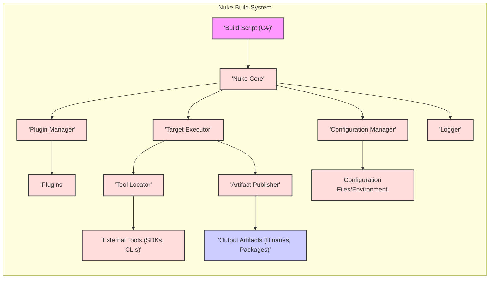
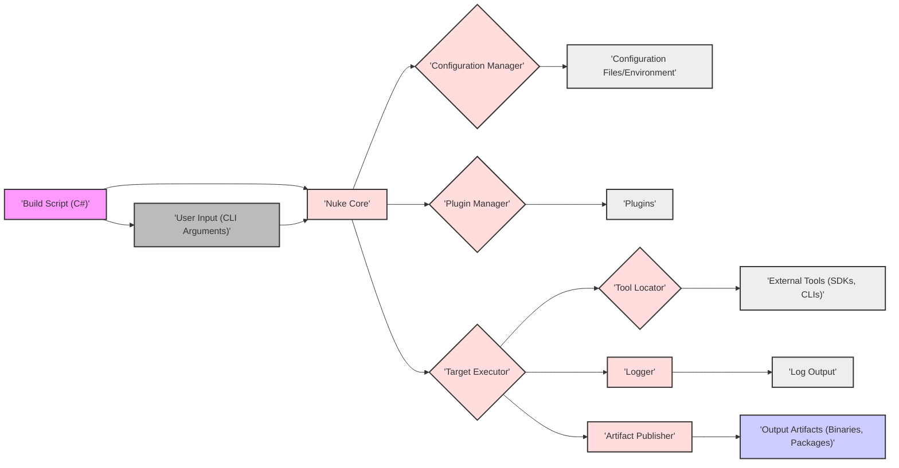

# Project Design Document: Nuke Build System

## 1. Introduction

### 1.1 Project Overview

Nuke (NUKE - **N**uke **U**ltimate **K**ernel **E**xtension) is a sophisticated, cross-platform build automation system. It distinguishes itself by offering a strongly-typed, maintainable, and highly extensible alternative to traditional build tools like Make, MSBuild, or Cake.  Nuke build definitions are crafted using C#, leveraging the full power and flexibility of the .NET ecosystem. This approach enables developers to define intricate build processes with clarity and precision, promoting maintainability and reducing the likelihood of errors common in script-based or configuration-heavy build systems.

### 1.2 Purpose of this Document

This document serves as a comprehensive design blueprint for the Nuke Build System. Its primary objective is to provide a clear and detailed understanding of Nuke's architecture, its constituent components, and their respective functionalities.  Crucially, this document is specifically structured to facilitate effective threat modeling. By outlining the system's design in detail, it empowers security teams to systematically identify potential security vulnerabilities, assess associated risks, and develop appropriate mitigation strategies. This document will be the foundation for subsequent security analysis and risk assessment activities.

### 1.3 Target Audience

This document is designed to be accessible and informative for a diverse range of stakeholders:

*   **Security Teams:**  To gain an in-depth understanding of Nuke's internal workings, enabling them to conduct thorough threat modeling, security audits, and vulnerability assessments.
*   **Development Teams:** To acquire a deeper appreciation of Nuke's design principles and operational mechanisms. This knowledge will empower them to utilize Nuke more effectively, customize build processes, and contribute to its extension and improvement.
*   **Operations Teams:** To understand how Nuke integrates into CI/CD pipelines and infrastructure, enabling them to manage deployment environments, monitor build processes, and ensure the secure operation of automated build workflows.

## 2. System Overview

### 2.1 High-Level Description

Nuke functions as a build automation engine that interprets and executes build scripts written in C#. These scripts meticulously define the entire build process as a structured sequence of targets and tasks. Nuke provides a robust framework and underlying infrastructure to:

*   **Define Build Processes Programmatically:**  Empower users to express build logic using C# code, allowing for complex conditional logic, loops, and data manipulation within build definitions.
*   **Orchestrate Build Target Execution:** Manage the execution order of build targets based on defined dependencies, ensuring that targets are executed in the correct sequence and dependencies are satisfied automatically.
*   **Seamless Tool Integration:** Facilitate interaction with a wide array of development tools, SDKs, and external command-line interfaces (CLIs) essential for modern software development workflows (compilers, linters, test runners, package managers, etc.).
*   **Extend Functionality via Plugins:** Offer a plugin architecture that allows for extending Nuke's core capabilities to support specific technologies, programming languages, platforms, or custom build workflows.
*   **Generate Comprehensive Reports and Logs:** Provide detailed and structured logs of build executions, including timestamps, target execution status, warnings, and errors. Generate reports summarizing build outcomes for monitoring, debugging, and auditing purposes.

### 2.2 Key Features and Use Cases

*   **Strongly-Typed Build Definitions (C#):**  Leverage the benefits of C# including static typing, robust refactoring capabilities, and rich IDE support (IntelliSense, debugging). This significantly enhances build script maintainability, reduces runtime errors, and improves developer productivity.
*   **Cross-Platform by Design:**  Nuke is engineered for cross-platform compatibility, running seamlessly on Windows, macOS, and Linux operating systems wherever a compatible .NET runtime is available. This ensures consistent build processes across diverse development environments.
*   **Extensible Plugin Ecosystem:**  Plugins are central to Nuke's extensibility, enabling support for a vast range of languages (e.g., JavaScript/Node.js, Python, Go), frameworks (e.g., React, Angular, Spring Boot), and specialized tools (e.g., Docker, Kubernetes, cloud deployment tools).
*   **Integrated Dependency Management:**  Nuke seamlessly integrates with .NET's NuGet package manager to manage dependencies for both build tools (Nuke itself, plugins) and build scripts. This ensures consistent and reproducible build environments.
*   **Parallel Build Execution:**  Nuke is capable of executing independent build targets concurrently, significantly reducing overall build times, especially for large projects with many independent components.
*   **CI/CD Pipeline Ready:**  Nuke is designed for seamless integration into Continuous Integration and Continuous Delivery (CI/CD) pipelines. Its command-line interface and robust scripting capabilities make it ideal for automated build, test, and deployment workflows.
*   **Code Generation and Bootstrapping:**  Nuke can automate the generation of boilerplate code for build scripts and project infrastructure, streamlining project setup and reducing repetitive tasks.

### 2.3 Target Users

Nuke is primarily intended for:

*   **Software Developers:**  To automate the entire software development lifecycle, from compilation and testing to packaging and deployment, improving efficiency and reducing manual errors.
*   **DevOps Engineers:**  To construct and manage robust and automated CI/CD pipelines, leveraging Nuke's flexibility and programmability to orchestrate complex deployment workflows.
*   **Build Engineers:**  To design, implement, and maintain sophisticated build processes for large-scale and diverse software projects, ensuring build consistency, reliability, and performance.

## 3. Architecture

### 3.1 Component Diagram

**Component Descriptions:**

*   **"'Build Script (C#)'"**:  This is the heart of a Nuke build. It's the user-authored C# code that meticulously defines the entire build process, specifying build targets, individual tasks within those targets, and dependencies between them. It acts as the configuration and entry point for Nuke.  *Security Note:* This component is a primary area of security concern as it executes arbitrary code.
*   **"'Nuke Core'"**: The central processing unit of Nuke. It's responsible for parsing the build script, managing the lifecycle of build targets, orchestrating the overall build execution flow, and coordinating interactions between other components.
*   **"'Target Executor'"**:  This component is dedicated to the execution of build targets. It determines the correct execution order based on target dependencies, manages parallel execution where applicable, and invokes the necessary tasks within each target.
*   **"'Plugin Manager'"**:  Responsible for discovering, loading, initializing, and managing Nuke plugins. It provides a mechanism for extending Nuke's core functionality dynamically at runtime. *Security Note:* Plugin management is a security-sensitive area as plugins can introduce new code and capabilities into the build process.
*   **"'Configuration Manager'"**:  Handles the loading, parsing, and management of configuration settings for both Nuke itself and the build process. It reads configuration from various sources, including configuration files, environment variables, and command-line arguments, prioritizing them according to a defined hierarchy. *Security Note:* Configuration sources can be manipulated to alter build behavior, making secure configuration management crucial.
*   **"'Logger'"**:  Provides comprehensive logging capabilities throughout the build execution. It captures informational messages, warnings, and errors, allowing for monitoring build progress, debugging issues, and auditing build activities.
*   **"'Plugins'"**:  These are modular extensions that augment Nuke's base functionality. They can provide support for specific tools, languages, platforms, or introduce custom build tasks and reporting mechanisms. *Security Note:* Plugins represent an extension point that can introduce security vulnerabilities if not carefully managed and sourced.
*   **"'Tool Locator'"**:  Responsible for locating and managing external tools (SDKs, CLIs, etc.) that are dependencies for the build process. It ensures that required tools are available in the execution environment and accessible to build tasks. *Security Note:* The Tool Locator's mechanisms for finding and executing tools need to be secure to prevent malicious tool substitution.
*   **"'External Tools (SDKs, CLIs)'"**:  These are external software development kits, command-line interfaces, and other utilities that Nuke interacts with during the build process. Examples include compilers (e.g., `csc.exe`, `javac`), test runners (e.g., `dotnet test`, `pytest`), and package managers (e.g., `nuget.exe`, `npm`). *Security Note:* External tools are a potential attack vector if compromised or if Nuke is configured to use untrusted tool sources.
*   **"'Artifact Publisher'"**:  Handles the process of publishing build artifacts (e.g., compiled binaries, packages, documentation) to various destinations. Destinations can include local directories, network shares, package repositories (e.g., NuGet Gallery, npm registry), or cloud storage services. *Security Note:* Secure artifact publishing is essential to prevent unauthorized modification or access to build outputs.
*   **"'Output Artifacts (Binaries, Packages)'"**:  These are the final products of the build process. They can include executable files, libraries, software packages, container images, documentation, and other distributable components. *Security Note:* Output artifacts are the ultimate target of many build processes and must be protected from tampering and unauthorized access.
*   **"'Configuration Files/Environment'"**:  These are the sources of configuration data for Nuke. They include configuration files (typically located in a `.nuke` directory within the project), environment variables set in the execution environment, and command-line arguments passed to the Nuke executable. *Security Note:* These configuration sources are potential points of manipulation and need to be managed securely.

### 3.2 Data Flow Diagram

**Data Flow Description:**

1.  **"'User Input (CLI Arguments)'"** and **"'Build Script (C#)'"** serve as the primary inputs to the **"'Nuke Core'"**. The build script defines the core build logic, while CLI arguments allow users to customize or override build behavior at runtime.
2.  **"'Nuke Core'"** interacts with the **"'Configuration Manager'"** to load and parse configuration settings. The **"'Configuration Manager'"** retrieves configuration data from **"'Configuration Files/Environment'"**, prioritizing sources based on a defined order.
3.  **"'Nuke Core'"** utilizes the **"'Plugin Manager'"** to load and initialize **"'Plugins'"**. Plugins extend Nuke's functionality and are loaded at the start of the build process.
4.  The **"'Nuke Core'"** delegates the execution of the build process to the **"'Target Executor'"**.
5.  The **"'Target Executor'"** relies on the **"'Tool Locator'"** to find and access **"'External Tools (SDKs, CLIs)'"** that are required for executing build tasks.
6.  Throughout the build execution, the **"'Target Executor'"** sends logging information to the **"'Logger'"**. The **"'Logger'"** generates **"'Log Output'"**, which can be displayed on the console, written to files, or sent to other logging systems.
7.  Upon successful completion of build targets, the **"'Target Executor'"** invokes the **"'Artifact Publisher'"** to publish **"'Output Artifacts (Binaries, Packages)'"** to designated locations.

### 3.3 Technology Stack

*   **Primary Programming Language:** C# (.NET) -  The core Nuke system and build scripts are written in C#, leveraging the .NET ecosystem.
*   **.NET Runtime Dependency:** Requires a compatible .NET runtime environment.  This can be the full .NET Framework (on Windows) or cross-platform .NET (formerly .NET Core).
*   **Dependency Management System:** NuGet - Used for managing .NET package dependencies for Nuke itself, plugins, and build scripts.
*   **Platform Compatibility:** Cross-platform by design, supporting Windows, macOS, and Linux operating systems.
*   **Configuration Mechanisms:** Flexible configuration through configuration files (YAML, JSON, C# code), environment variables, and command-line arguments.
*   **Logging Infrastructure:** Utilizes standard .NET logging mechanisms, with extensibility through plugins to integrate with custom logging solutions or reporting tools.

## 4. Key Functionalities

### 4.1 Build Process Lifecycle

A typical Nuke build process unfolds through these distinct stages:

1.  **Initialization Phase:** The Nuke Core is initialized. It loads and parses the user-provided build script (C# file). Plugins are discovered, loaded, and initialized. Configuration settings are loaded from various sources and resolved.
2.  **Target Discovery and Analysis:** Nuke analyzes the build script to identify all defined build targets and their declared dependencies. This phase builds an internal representation of the build graph.
3.  **Dependency Resolution and Execution Plan:** Nuke resolves target dependencies to determine the optimal execution order. It constructs an execution plan, potentially enabling parallel execution of independent targets to optimize build time.
4.  **Target Execution Phase:** The Target Executor takes over and executes build targets according to the determined plan. For each target, it executes the associated tasks in sequence.
5.  **Task Execution within Targets:** Within each target, individual tasks (C# code blocks within the build script) are executed. These tasks often involve interacting with external tools (compilers, linters, etc.) via the Tool Locator.
6.  **Real-time Logging and Reporting:** Throughout the build process, the Logger captures and outputs build progress, warnings, and errors. This information is typically displayed on the console and can be written to log files.
7.  **Artifact Publishing (Post-Build):** Upon successful completion of the build process (or specific targets), the Artifact Publisher is invoked to publish the generated output artifacts to configured destinations.
8.  **Cleanup and Finalization:**  After artifact publishing, Nuke may perform cleanup operations, such as deleting temporary files or directories created during the build. The build process concludes, and Nuke exits.

### 4.2 Plugin System

Nuke's plugin system is a cornerstone of its extensibility, allowing for a wide range of customizations and integrations:

*   **Tooling Support Plugins:** Plugins can provide pre-built abstractions, wrappers, and helper functions for interacting with specific external tools and SDKs. Examples include plugins for Docker, Kubernetes, various cloud platforms (AWS, Azure, GCP), and specialized compilers or linters.
*   **Reusable Task Library Plugins:** Plugins can encapsulate and offer reusable libraries of build tasks for common build operations. These might include tasks for code signing, packaging applications in specific formats (e.g., MSI, DEB, RPM), deployment tasks, or integration with specific testing frameworks.
*   **Enhanced Reporting and Analytics Plugins:** Plugins can extend Nuke's reporting capabilities. They can provide custom report formats, integrate with external reporting tools or dashboards, or offer more detailed build analytics and performance metrics.
*   **Custom Configuration Extensions:** Plugins can introduce new configuration options and settings to Nuke, allowing for plugin-specific configuration and customization of build behavior.

Plugins are typically distributed as NuGet packages, making them easy to discover, install, and manage within a Nuke build project.  *Security Note:* The plugin system requires careful consideration from a security perspective, as plugins from untrusted sources can introduce malicious code or vulnerabilities. Plugin vetting and secure sourcing are crucial.

### 4.3 Configuration Management

Nuke employs a layered configuration management approach, providing flexibility and control over build settings:

1.  **Default Configuration Baseline:** Nuke provides sensible default settings for most aspects of the build process. These defaults are designed to work well in common scenarios.
2.  **Configuration Files (Project-Specific):** Project-specific configuration can be defined in files located within the `.nuke` directory at the project root. Common formats include YAML, JSON, or C# based configuration files. This allows for project-level customization of build behavior.
3.  **Environment Variables (Environment-Specific):** Environment variables provide a mechanism for environment-specific configuration. Settings defined in environment variables can override configuration file settings, allowing for different configurations in development, testing, and production environments.
4.  **Command-Line Arguments (Runtime Overrides):** Command-line arguments passed to the `nuke` executable offer the highest level of precedence. They can override settings from configuration files and environment variables, providing runtime control over build execution.

This layered approach ensures a balance between default behavior, project-specific settings, environment-specific configurations, and runtime overrides. *Security Note:* Secure management of configuration sources is vital. Configuration files should be version-controlled and access to environment variables and command-line arguments should be controlled to prevent unauthorized modification of build behavior.

### 4.4 Dependency Management

Nuke leverages the robust .NET NuGet package manager for managing dependencies at multiple levels:

*   **Nuke Tooling Dependencies:** Nuke itself, including its core components and the Nuke CLI, is distributed as NuGet packages. This simplifies installation and updates of the Nuke build system.
*   **Plugin Dependencies:** Nuke plugins are also distributed as NuGet packages. This allows for easy discovery, installation, and management of plugins. Plugin dependencies are also managed by NuGet.
*   **Build Script Dependencies:** Build scripts written in C# can declare dependencies on NuGet packages. This allows build scripts to utilize external libraries, tools, and SDKs available as NuGet packages.
*   **Tool Resolution via NuGet:** Nuke's Tool Locator can utilize NuGet to download and manage external tools, especially when those tools are packaged and distributed as NuGet tools. This ensures consistent tool versions and simplifies tool acquisition.

This deep integration with NuGet simplifies dependency management, ensures reproducible build environments, and leverages the vast ecosystem of .NET packages. *Security Note:* Dependency management is a critical security area. Vulnerable dependencies can introduce security risks. Nuke's dependency management should include mechanisms for vulnerability scanning and secure dependency resolution.

### 4.5 Reporting and Logging

Nuke provides comprehensive reporting and logging features to monitor, debug, and audit build processes:

*   **Real-time Console Logging:**  Provides immediate feedback on build progress, displaying informational messages, warnings, and errors directly in the console during build execution.
*   **Persistent File Logging:**  Offers the option to write detailed logs to files. This allows for persistent records of build executions, enabling post-build analysis, debugging, and auditing. Log files can be configured to include different levels of detail.
*   **Structured Logging Capabilities:**  Logs can be structured in formats suitable for parsing and integration with log management systems (e.g., JSON logs). This facilitates automated analysis and monitoring of build logs.
*   **Build Summary Reports:**  Nuke can generate summary reports after build execution. These reports typically include information about build duration, success/failure status of targets, and summaries of warnings and errors encountered.
*   **Extensible Reporting via Plugins:**  The reporting system is extensible through plugins. Plugins can provide custom report formats, integrate with external reporting services, or add specialized reporting features tailored to specific needs.

These logging and reporting features are essential for understanding build behavior, diagnosing issues, and ensuring the reliability and auditability of build processes. *Security Note:* Log data can contain sensitive information. Secure storage and access control for log files are important security considerations.

## 5. Deployment Model

### 5.1 Execution Environment Scenarios

Nuke is designed to be versatile and can be executed in various environments:

*   **Local Development Workstations:** Developers commonly execute Nuke locally on their personal workstations (Windows, macOS, Linux) for iterative development, local builds, and testing. This provides a rapid feedback loop during development.
*   **Dedicated CI/CD Servers:** Nuke is ideally suited for integration into CI/CD pipelines. It can be executed on dedicated CI/CD servers (e.g., Azure DevOps Agents, GitHub Actions runners, Jenkins agents, GitLab CI runners) to automate builds, tests, and deployments as part of a continuous integration and delivery workflow.
*   **Cloud-Based Build Environments:** Nuke can be executed in cloud-based build environments. This includes cloud build services offered by cloud providers (e.g., AWS CodeBuild, Azure DevOps Pipelines, Google Cloud Build) or on virtual machines or containers running in cloud environments. Cloud environments offer scalability and on-demand build resources.

### 5.2 Installation and Setup Procedure

Setting up and using Nuke typically involves these steps:

1.  **.NET SDK Installation:** Ensure a compatible .NET SDK (Software Development Kit) is installed on the target execution environment. The specific .NET SDK version compatibility depends on the Nuke version being used.
2.  **Nuke CLI Installation:** Install the Nuke Command-Line Interface (CLI). This is usually done as a .NET global tool using the `dotnet tool install` command. Alternatively, the Nuke CLI can be installed locally within a project.
3.  **Build Script Creation:** Create a C# build script file within the project's root directory. This file typically follows a naming convention like `Build.cs` or `build.nuke.cs`. This script will contain the C# code defining the build process.
4.  **Project Bootstrapping (Optional but Recommended):** For new projects, Nuke provides bootstrapping commands to generate initial project files and a basic build script structure. This simplifies project setup.
5.  **Execution via CLI:**  Navigate to the project root directory in a command-line terminal and execute the `nuke` command. Nuke will then discover and execute the build script. Command-line arguments can be used to specify targets, configuration options, and other build parameters.

The precise installation and setup steps might vary slightly depending on the operating system, .NET SDK version, and specific project requirements. Detailed instructions are available in the official Nuke documentation.

## 6. Security Considerations (Detailed)

This section expands on the initial security considerations, providing a more detailed analysis of potential threats and mitigation strategies for the Nuke Build System.

*   **Build Script Security - Code Injection and Secrets Exposure (STRIDE: Tampering, Information Disclosure):**
    *   **Threat:** Malicious code injection into build scripts. Since build scripts are C# code, they can execute arbitrary commands on the build agent. Untrusted or compromised build scripts could be used to inject malicious code into the build process, potentially compromising the build environment, build artifacts, or even downstream systems.
    *   **Threat:** Accidental or intentional exposure of secrets (API keys, credentials, private keys) within build scripts. Hardcoding secrets in build scripts or logging them inadvertently can lead to information disclosure.
    *   **Mitigation:**
        *   **Code Review and Version Control:** Implement rigorous code review processes for build scripts. Store build scripts in version control systems and track changes.
        *   **Principle of Least Privilege:** Grant build scripts only the necessary permissions to perform their tasks. Avoid running build processes with overly permissive accounts.
        *   **Secret Management:** Never hardcode secrets in build scripts. Utilize secure secret management solutions (e.g., Azure Key Vault, HashiCorp Vault, environment variables in secure CI/CD systems) to store and access sensitive information.
        *   **Input Validation and Sanitization:** If build scripts accept external input, implement robust input validation and sanitization to prevent injection attacks.
        *   **Static Analysis Security Testing (SAST):** Employ SAST tools to scan build scripts for potential security vulnerabilities, including code injection risks and secret exposure.

*   **Plugin Security - Malicious Plugins and Plugin Vulnerabilities (STRIDE: Tampering, Elevation of Privilege, Denial of Service):**
    *   **Threat:** Installation and use of malicious plugins from untrusted sources. Malicious plugins could contain code designed to compromise the build environment, steal secrets, or inject vulnerabilities into build artifacts.
    *   **Threat:** Vulnerabilities in legitimate plugins. Even well-intentioned plugins might contain security vulnerabilities that could be exploited by attackers.
    *   **Mitigation:**
        *   **Plugin Source Verification:** Only use plugins from trusted and reputable sources. Verify plugin publishers and signatures when possible.
        *   **Plugin Vetting and Auditing:** Implement a process for vetting and auditing plugins before they are approved for use in build processes.
        *   **Plugin Security Scanning:** Scan plugins for known vulnerabilities using vulnerability scanning tools.
        *   **Principle of Least Privilege for Plugins:**  If possible, run plugins with restricted permissions to limit the potential impact of a compromised plugin.
        *   **Plugin Update Management:** Keep plugins updated to the latest versions to patch known vulnerabilities.

*   **External Tool Security - Compromised Tools and Tool Version Vulnerabilities (STRIDE: Tampering, Elevation of Privilege):**
    *   **Threat:** Compromised external tools. If external tools used by Nuke (compilers, linters, etc.) are compromised (e.g., supply chain attacks, malicious updates), they could introduce vulnerabilities into the build process.
    *   **Threat:** Using outdated or vulnerable versions of external tools. Known vulnerabilities in older tool versions could be exploited.
    *   **Mitigation:**
        *   **Secure Tool Sourcing:** Obtain external tools from official and trusted sources. Verify tool checksums or signatures when possible.
        *   **Tool Version Pinning:** Pin specific versions of external tools used in the build process to ensure consistency and prevent unexpected updates that might introduce vulnerabilities.
        *   **Vulnerability Scanning for Tools:** Regularly scan external tools for known vulnerabilities.
        *   **Tool Isolation:** Consider isolating external tools in sandboxed environments or containers to limit the impact of a compromised tool.
        *   **Regular Tool Updates:** Keep external tools updated to the latest secure versions, while carefully managing updates to avoid breaking changes.

*   **Dependency Security - Vulnerable Dependencies and Dependency Confusion (STRIDE: Tampering, Information Disclosure, Denial of Service):**
    *   **Threat:** Vulnerable NuGet packages used by Nuke, plugins, or build scripts. Dependencies might contain known security vulnerabilities that could be exploited.
    *   **Threat:** Dependency confusion attacks. Attackers might attempt to introduce malicious packages with names similar to internal or private dependencies, hoping to trick the build system into using the malicious package.
    *   **Mitigation:**
        *   **Dependency Scanning:** Implement dependency scanning tools to identify known vulnerabilities in NuGet packages used by Nuke, plugins, and build scripts.
        *   **Software Composition Analysis (SCA):** Utilize SCA tools to gain visibility into all dependencies and their associated risks.
        *   **Dependency Pinning and Locking:** Use dependency pinning or lock files (e.g., `packages.lock.json`) to ensure consistent dependency versions and prevent unexpected dependency updates.
        *   **Private Package Repositories:** For internal dependencies, use private NuGet package repositories to reduce the risk of dependency confusion attacks.
        *   **Dependency Source Restriction:** Configure NuGet to only use trusted package sources and prevent access to public repositories if only private packages should be used.

*   **Configuration Security - Sensitive Data and Configuration Tampering (STRIDE: Tampering, Information Disclosure):**
    *   **Threat:** Exposure of sensitive configuration data (e.g., connection strings, API endpoints) in configuration files or environment variables.
    *   **Threat:** Unauthorized tampering with configuration files or environment variables to alter build behavior maliciously.
    *   **Mitigation:**
        *   **Secure Configuration Storage:** Store sensitive configuration data securely. Avoid storing secrets directly in configuration files. Use environment variables or dedicated secret management solutions.
        *   **Access Control for Configuration:** Restrict access to configuration files and environment variables to authorized personnel and processes.
        *   **Configuration Validation:** Implement configuration validation to ensure that configuration settings are within expected ranges and formats, preventing unexpected or malicious configurations.
        *   **Configuration Auditing:** Audit changes to configuration files and environment variables to track modifications and detect unauthorized changes.

*   **Output Artifact Security - Artifact Tampering and Secure Storage (STRIDE: Tampering, Information Disclosure):**
    *   **Threat:** Tampering with build artifacts after they are generated but before they are deployed or distributed. Attackers might try to inject malicious code or modify artifacts to compromise downstream systems.
    *   **Threat:** Unauthorized access to or disclosure of build artifacts if they are not stored and distributed securely.
    *   **Mitigation:**
        *   **Artifact Signing and Verification:** Sign build artifacts cryptographically to ensure their integrity and authenticity. Implement verification mechanisms to check signatures before deployment or distribution.
        *   **Secure Artifact Storage:** Store build artifacts in secure storage locations with appropriate access controls. Use encrypted storage if necessary.
        *   **Secure Artifact Distribution Channels:** Use secure channels (e.g., HTTPS, signed packages) for distributing build artifacts.
        *   **Artifact Provenance Tracking:** Track the provenance of build artifacts to ensure traceability and accountability.

*   **Access Control and Authorization - Build Environment and Plugin Management (STRIDE: Elevation of Privilege, Unauthorized Access):**
    *   **Threat:** Unauthorized access to the build environment, allowing attackers to modify build scripts, configuration, or plugins.
    *   **Threat:** Unauthorized installation or modification of plugins, potentially introducing malicious plugins into the build system.
    *   **Mitigation:**
        *   **Role-Based Access Control (RBAC):** Implement RBAC to control access to the build environment, Nuke configuration, and plugin management functions.
        *   **Authentication and Authorization:** Enforce strong authentication and authorization mechanisms for accessing the build environment and managing Nuke settings.
        *   **Audit Logging of Access:** Log all access attempts and modifications to the build environment, configuration, and plugins for auditing and security monitoring.
        *   **Principle of Least Privilege for Access:** Grant users and processes only the minimum necessary permissions to perform their build-related tasks.

## 7. Threat Modeling Scope (Actionable)

For effective threat modeling of the Nuke Build System, consider using a structured methodology like **STRIDE (Spoofing, Tampering, Repudiation, Information Disclosure, Denial of Service, Elevation of Privilege)**.  The scope encompasses the following components and assets:

**Components for Threat Modeling:**

*   **"'Build Script (C#)'"**:  Focus on threats related to code injection, secrets exposure, and malicious logic within user-defined scripts. *Example Threats (STRIDE):* Tampering (malicious script modification), Information Disclosure (secret leakage in logs).
*   **"'Nuke Core'"**: Analyze for vulnerabilities in the core engine that could lead to Denial of Service or Elevation of Privilege. *Example Threats (STRIDE):* Denial of Service (resource exhaustion), Elevation of Privilege (vulnerability in core logic).
*   **"'Plugin Manager'"**:  Focus on threats related to malicious plugins, plugin vulnerabilities, and unauthorized plugin installation. *Example Threats (STRIDE):* Tampering (malicious plugin injection), Elevation of Privilege (plugin vulnerability exploitation).
*   **"'Configuration Manager'"**:  Analyze for threats related to configuration tampering, exposure of sensitive configuration data, and unauthorized configuration changes. *Example Threats (STRIDE):* Tampering (configuration file modification), Information Disclosure (secrets in config files).
*   **"'Tool Locator'"**:  Focus on threats related to malicious tool substitution, compromised tool sources, and vulnerabilities in tool resolution mechanisms. *Example Threats (STRIDE):* Tampering (malicious tool path injection), Spoofing (tool source spoofing).
*   **"'Artifact Publisher'"**:  Analyze for threats related to artifact tampering during publishing, insecure artifact storage, and unauthorized access to published artifacts. *Example Threats (STRIDE):* Tampering (artifact modification during publish), Information Disclosure (insecure artifact storage).
*   **"'External Tools (SDKs, CLIs)'"**:  Consider threats originating from compromised external tools or vulnerabilities in specific tool versions. *Example Threats (STRIDE):* Tampering (compromised compiler injecting malware), Denial of Service (vulnerable test runner causing build failures).
*   **"'Configuration Files/Environment'"**:  Analyze these as potential attack vectors for configuration tampering and information disclosure. *Example Threats (STRIDE):* Tampering (environment variable manipulation), Information Disclosure (secrets in environment variables).

**Key Assets to Protect (Reiterated and Actionable):**

*   **Build Environment Integrity:**  Prevent unauthorized modifications to the build environment (tools, configuration, scripts). *Threat Modeling Focus:* Tampering, Elevation of Privilege.
*   **Build Process Integrity:**  Ensure the build process executes as intended and is not manipulated to produce malicious or incorrect artifacts. *Threat Modeling Focus:* Tampering, Denial of Service.
*   **Output Artifact Integrity and Authenticity:**  Guarantee that build artifacts are genuine, unmodified, and free from injected malware. *Threat Modeling Focus:* Tampering, Spoofing.
*   **Confidentiality of Secrets:**  Protect sensitive information (API keys, credentials) used during the build process from unauthorized disclosure. *Threat Modeling Focus:* Information Disclosure.
*   **Availability of Build System:**  Maintain the availability of the build system to prevent disruptions to development and deployment workflows. *Threat Modeling Focus:* Denial of Service.

**Actionable Threat Modeling Steps:**

1.  **Decompose the System:** Use the component and data flow diagrams in this document to break down Nuke into manageable components.
2.  **Identify Threats (STRIDE per Component):** For each component, systematically apply the STRIDE categories to identify potential threats. Consider how an attacker might attempt to Spoof, Tamper, Repudiate, gain Information Disclosure, cause Denial of Service, or achieve Elevation of Privilege within each component's context.
3.  **Assess Risks:** Evaluate the likelihood and impact of each identified threat. Prioritize threats based on risk level.
4.  **Develop Mitigation Strategies:** For each significant threat, define mitigation strategies. These strategies should align with the mitigations outlined in the "Security Considerations" section.
5.  **Validate Mitigations:** Test and validate the effectiveness of implemented mitigation strategies.
6.  **Document and Review:** Document the threat model, risk assessments, and mitigation strategies. Regularly review and update the threat model as the Nuke system or its usage evolves.

## 8. Conclusion

This enhanced design document provides a more detailed and security-focused overview of the Nuke Build System. It elaborates on the architecture, functionalities, and deployment model, and significantly expands the security considerations section with specific threats and actionable mitigation strategies.  By using this document as a foundation and applying a structured threat modeling approach like STRIDE, security teams can effectively identify, assess, and mitigate potential security risks associated with the Nuke Build System, ensuring a more secure and reliable software build and release process. The next crucial step is to actively engage in the threat modeling process, utilizing the detailed information provided here to proactively address security concerns.