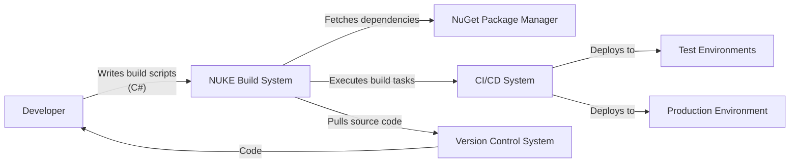
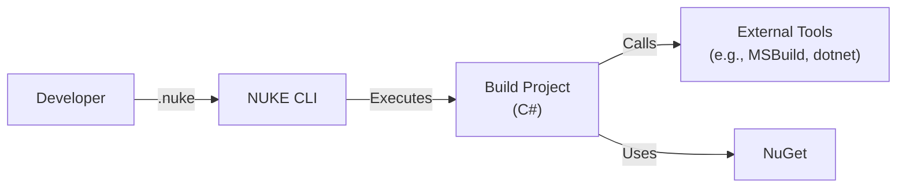
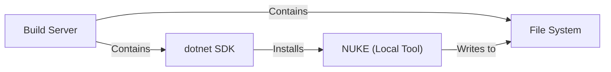
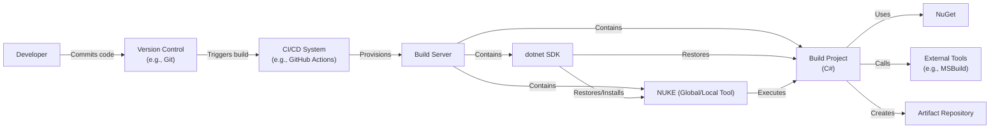

Okay, let's create a design document for the NUKE Build project, focusing on aspects relevant for threat modeling.

# BUSINESS POSTURE

NUKE Build is a cross-platform, open-source build automation system.  It aims to simplify the creation of complex build processes using C#.  The primary business goals and priorities are:

*   Provide a reliable and consistent build experience across different operating systems (Windows, macOS, Linux).
*   Enable developers to define builds in a strongly-typed language (C#), leveraging existing .NET skills and tooling.
*   Offer a user-friendly and maintainable alternative to complex shell scripts or XML-based build configurations.
*   Foster a strong community and ecosystem around the project.
*   Reduce the learning curve for build automation, making it accessible to a wider range of developers.
*   Ensure build processes are testable and debuggable.
*   Facilitate integration with various CI/CD systems.

Based on these priorities, the most important business risks are:

*   Malicious code injection into the build process, potentially compromising build artifacts or the build environment itself.
*   Vulnerabilities in NUKE or its dependencies that could be exploited to disrupt builds or gain unauthorized access.
*   Inconsistent or unreliable build results, leading to deployment issues or software defects.
*   Lack of adoption due to complexity or perceived lack of features compared to other build systems.
*   Supply chain attacks targeting NUKE's dependencies or distribution channels.
*   Compromised build server leading to leakage of sensitive information (e.g., API keys, signing certificates).

# SECURITY POSTURE

Existing security controls and accepted risks (as inferred from the repository and general best practices):

*   security control: Code signing of releases (likely, but needs verification). Where: Release process.
*   security control: Use of static analysis tools (likely, but needs verification). Where: Build process.
*   security control: Dependency management using NuGet. Where: Project files (.csproj).
*   security control: Community contributions and code reviews. Where: GitHub pull requests.
*   security control: Use of HTTPS for communication with external services (assumed). Where: Network communication within build scripts.
*   accepted risk: Reliance on third-party NuGet packages, introducing potential supply chain risks.
*   accepted risk: Potential for user-introduced vulnerabilities in build scripts (C# code).
*   accepted risk: Limited control over the security of individual developer workstations.

Recommended security controls (high priority):

*   security control: Implement a Software Bill of Materials (SBOM) generation process for each release.
*   security control: Integrate Software Composition Analysis (SCA) tools to identify known vulnerabilities in dependencies.
*   security control: Enforce strong authentication and authorization for access to the build server and related resources.
*   security control: Implement regular security audits and penetration testing of the build infrastructure.
*   security control: Provide clear security guidelines and best practices for writing secure build scripts.
*   security control: Use of sandboxing or containerization to isolate build processes.

Security Requirements:

*   Authentication:
    *   Build scripts should not store credentials directly. Use environment variables or secure configuration mechanisms.
    *   Access to the build server should require strong authentication (e.g., multi-factor authentication).
*   Authorization:
    *   Restrict access to sensitive build operations and resources based on the principle of least privilege.
    *   Implement role-based access control (RBAC) for managing build server permissions.
*   Input Validation:
    *   Validate all inputs to build scripts, including parameters, environment variables, and file paths.
    *   Sanitize user-provided data to prevent code injection vulnerabilities.
*   Cryptography:
    *   Use strong cryptographic algorithms and protocols for secure communication and data protection.
    *   Securely manage cryptographic keys and certificates.
    *   Sign build artifacts to ensure integrity and authenticity.
*   Output validation:
    *   Validate output of all external tools.

# DESIGN

## C4 CONTEXT

Element Descriptions:

*   Element:
    *   Name: Developer
    *   Type: Person
    *   Description: A software developer who writes and maintains the build scripts using C#.
    *   Responsibilities: Writing build logic, configuring build parameters, integrating with external tools.
    *   Security controls: Secure coding practices, strong authentication to development tools.

*   Element:
    *   Name: NUKE Build System
    *   Type: Software System
    *   Description: The core build automation system that executes the build scripts.
    *   Responsibilities: Parsing build scripts, managing dependencies, executing build tasks, reporting results.
    *   Security controls: Input validation, dependency management, secure execution environment (sandboxing/containerization - recommended).

*   Element:
    *   Name: NuGet Package Manager
    *   Type: External System
    *   Description: The package manager for .NET libraries, used to manage NUKE's dependencies.
    *   Responsibilities: Providing access to a repository of .NET packages.
    *   Security controls: Package signing, vulnerability scanning (SCA - recommended).

*   Element:
    *   Name: CI/CD System
    *   Type: External System
    *   Description: A continuous integration and continuous delivery system (e.g., GitHub Actions, Jenkins, Azure DevOps).
    *   Responsibilities: Triggering builds, running tests, deploying artifacts.
    *   Security controls: Strong authentication, access control, secure configuration.

*   Element:
    *   Name: Version Control System
    *   Type: External System
    *   Description: A system for managing source code (e.g., Git).
    *   Responsibilities: Storing source code, tracking changes, managing branches.
    *   Security controls: Access control, branch protection rules.

*   Element:
    *   Name: Test Environments
    *   Type: External System
    *   Description: Environments used for testing the software being built.
    *   Responsibilities: Running automated tests, providing feedback on build quality.
    *   Security controls: Isolation from production, secure configuration.

*   Element:
    *   Name: Production Environment
    *   Type: External System
    *   Description: The environment where the final software is deployed and used.
    *   Responsibilities: Running the production software.
    *   Security controls: Strong security hardening, monitoring, intrusion detection.

## C4 CONTAINER

Element Descriptions:

*   Element:
    *   Name: Developer
    *   Type: Person
    *   Description: A software developer.
    *   Responsibilities: Writing and maintaining build scripts.
    *   Security controls: Secure coding practices.

*   Element:
    *   Name: NUKE CLI
    *   Type: Application
    *   Description: The command-line interface for interacting with NUKE.
    *   Responsibilities: Parsing commands, loading build projects, initiating build execution.
    *   Security controls: Input validation.

*   Element:
    *   Name: Build Project (C#)
    *   Type: Application
    *   Description: The C# project containing the build logic.
    *   Responsibilities: Defining build targets, tasks, and dependencies.
    *   Security controls: Secure coding practices, input validation, dependency management.

*   Element:
    *   Name: External Tools (e.g., MSBuild, dotnet)
    *   Type: Application
    *   Description: External tools used by the build process.
    *   Responsibilities: Compiling code, running tests, packaging applications.
    *   Security controls: Secure configuration, regular updates.

*   Element:
    *   Name: NuGet
    *   Type: External System
    *   Description: The NuGet package manager.
    *   Responsibilities: Providing access to .NET packages.
    *   Security controls: Package signing, vulnerability scanning (SCA - recommended).

## DEPLOYMENT

NUKE itself is a .NET tool and can be deployed in several ways:

1.  **Global Tool:** Installed globally on a machine using `dotnet tool install -g Nuke.GlobalTool`.
2.  **Local Tool:** Installed locally within a project using `dotnet new tool-manifest` and `dotnet tool install Nuke.GlobalTool`.
3.  **Project Dependency:** Referenced as a regular NuGet package within a project.

The most common and recommended approach is to use a **local tool**. This ensures that the correct version of NUKE is used for each project and avoids conflicts between different projects. We will describe this approach.

Element Descriptions:

*   Element:
    *   Name: Build Server
    *   Type: Infrastructure
    *   Description: The machine where the build process runs.
    *   Responsibilities: Providing the environment for executing builds.
    *   Security controls: Strong authentication, access control, regular security updates, firewall.

*   Element:
    *   Name: dotnet SDK
    *   Type: Software
    *   Description: The .NET SDK, used to build and run .NET applications.
    *   Responsibilities: Providing the tools for building and running .NET code.
    *   Security controls: Regular updates, secure configuration.

*   Element:
    *   Name: NUKE (Local Tool)
    *   Type: Software
    *   Description: The NUKE build tool, installed as a local tool.
    *   Responsibilities: Executing the build scripts.
    *   Security controls: Input validation, secure execution environment (sandboxing/containerization - recommended).

*   Element:
    *   Name: File System
    *   Type: Infrastructure
    *   Description: The file system of the build server.
    *   Responsibilities: Storing source code, build artifacts, and temporary files.
    *   Security controls: Access control, encryption (if sensitive data is stored).

## BUILD

The build process for NUKE itself (and projects using NUKE) typically involves the following steps:

1.  **Developer:** A developer writes or modifies the build script (C# code) on their local machine.
2.  **Version Control:** The developer commits and pushes the changes to a version control system (e.g., Git).
3.  **CI/CD Trigger:** A CI/CD system (e.g., GitHub Actions) detects the changes and triggers a build.
4.  **Build Server:** The CI/CD system provisions a build server (or uses a pre-configured one).
5.  **Source Code Retrieval:** The build server retrieves the source code from the version control system.
6.  **Dependency Restoration:** The build server restores NuGet packages (including NUKE, if it's a project dependency, or installs it as a global/local tool).
7.  **Build Execution:** The build server executes the NUKE build script (using `dotnet nuke` or similar).
8.  **Testing:** The build script executes tests.
9.  **Artifact Creation:** The build script creates build artifacts (e.g., NuGet packages, executables, deployment packages).
10. **Artifact Publishing:** The build script publishes the artifacts to a repository (e.g., NuGet.org, a private artifact repository).
11. **Deployment (Optional):** The CI/CD system deploys the artifacts to a target environment.

Security Controls in the Build Process:

*   security control: Version control: Use of a secure version control system with access control and branch protection.
*   security control: CI/CD system: Secure configuration of the CI/CD system, including strong authentication and authorization.
*   security control: Dependency management: Use of NuGet with package signing and vulnerability scanning (SCA - recommended).
*   security control: Static analysis: Use of static analysis tools to identify potential code vulnerabilities (SAST - recommended).
*   security control: Dynamic analysis: Use of dynamic analysis tools during testing (DAST - recommended).
*   security control: Artifact signing: Signing build artifacts to ensure integrity and authenticity.
*   security control: Secure build server: Hardening and regular security updates for the build server.
*   security control: Supply chain security: SBOM generation and SCA (recommended).

# RISK ASSESSMENT

*   Critical Business Processes:
    *   Software development and release: NUKE is crucial for automating the build and release process, ensuring consistency and reliability.
    *   Continuous integration and delivery: NUKE integrates with CI/CD systems to enable automated builds, testing, and deployment.

*   Data to Protect:
    *   Source code: The source code of the software being built, which may contain intellectual property or sensitive information.  Sensitivity: High.
    *   Build scripts: The C# code defining the build process, which could be a target for malicious code injection. Sensitivity: High.
    *   Build artifacts: The output of the build process (e.g., executables, libraries, packages), which could be tampered with. Sensitivity: High.
    *   Credentials and secrets: API keys, passwords, and other secrets used during the build process (should not be stored in the code or build scripts). Sensitivity: Critical.
    *   Dependency information: Information about the dependencies used by the project, which could be used to identify vulnerabilities. Sensitivity: Medium.

# QUESTIONS & ASSUMPTIONS

*   Questions:
    *   What specific CI/CD systems are used with NUKE in practice?
    *   What are the current practices for code signing releases?
    *   Are static analysis tools currently used in the build process?
    *   What is the level of security awareness and training among developers using NUKE?
    *   What are the specific security requirements for different projects using NUKE?
    *   Are there any existing security audits or penetration testing reports for NUKE or related infrastructure?
    *   What is process of reporting security vulnerabilities?

*   Assumptions:
    *   Developers are using secure development practices when writing build scripts.
    *   HTTPS is used for all network communication with external services.
    *   The build server is reasonably secure, with basic security measures in place.
    *   Developers are aware of the risks of using third-party NuGet packages.
    *   The project follows semantic versioning.
    *   Basic logging is implemented.