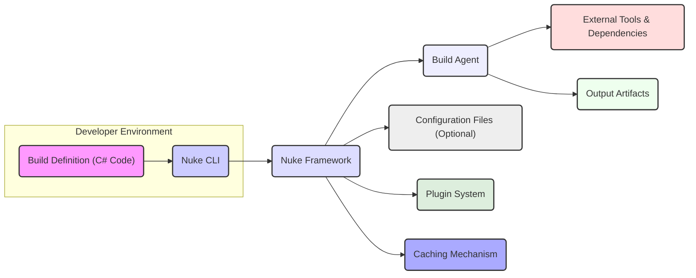
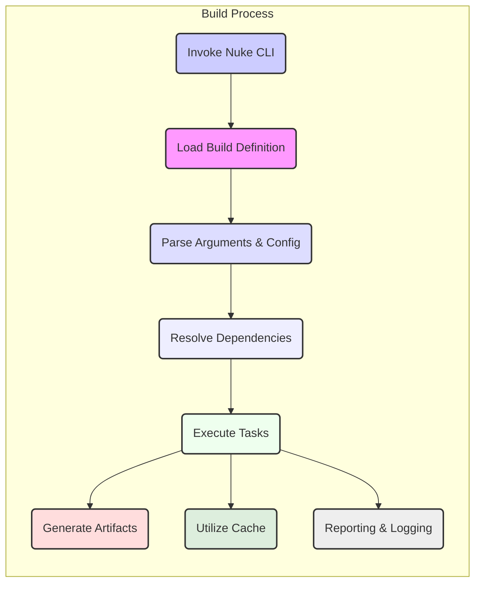

# Project Design Document: Nuke Build System

**Version:** 1.1
**Date:** October 26, 2023
**Author:** AI Software Architect

## 1. Project Overview

This document outlines the high-level design of the Nuke build system, as represented by the project available at [https://github.com/nuke-build/nuke](https://github.com/nuke-build/nuke). Nuke is a cross-platform, extensible build automation system primarily targeting .NET projects. It empowers developers to define build processes using strongly-typed C# code, offering a robust and maintainable alternative to traditional scripting approaches. This document serves as a foundational artifact for subsequent threat modeling activities and provides a comprehensive understanding of the system's architecture.

## 2. Goals and Objectives of this Document

*   To provide a clear, concise, and accurate overview of the Nuke build system's architecture and its key components.
*   To explicitly identify the major data flows and interactions within the system to facilitate security analysis.
*   To highlight potential areas of interest and attack surfaces for security analysis and threat modeling exercises.
*   To serve as a readily accessible reference point for understanding the system's structure, behavior, and potential security implications.

## 3. Target Audience

This document is primarily intended for:

*   Security engineers and architects responsible for conducting threat modeling, security assessments, and penetration testing.
*   Software developers working on or with the Nuke build system, including those writing build definitions and extending the framework.
*   Operations and DevOps teams involved in deploying, managing, and maintaining systems built using Nuke.

## 4. System Architecture

Nuke's architecture is centered around the concept of defining build logic as executable C# code. The primary components and their interactions are detailed below:

*   **'Build Definition (C# Code)'**:
    *   This constitutes the core of a Nuke build process. Developers author C# code, leveraging the Nuke framework's APIs and attributes, to define build targets, dependencies between them, and the specific tasks to be executed.
    *   This code explicitly outlines the sequence of operations necessary to build, test, package, and potentially deploy the software.
*   **'Nuke Framework'**:
    *   A foundational .NET library that provides the essential building blocks for defining and executing builds.
    *   Offers high-level abstractions for common build tasks (e.g., compilation, testing, packaging, code signing).
    *   Manages command-line argument parsing, configuration loading, and environment setup.
    *   Provides robust logging, reporting, and error handling mechanisms.
*   **'Nuke CLI (Command-Line Interface)'**:
    *   The primary point of interaction for users to engage with the Nuke build system.
    *   Used to initiate build executions, list available build targets, inspect build configurations, and manage the build environment.
    *   Responsible for parsing command-line arguments and invoking the appropriate functionalities within the Nuke framework.
*   **'Build Agent (Local or Remote)'**:
    *   The execution environment where the build process is physically carried out.
    *   Can be the developer's local workstation, a dedicated build server within a CI/CD pipeline, or a cloud-based build agent.
    *   Requires the .NET SDK and any other necessary tools (e.g., compilers, SDKs for other languages) as defined by the build definition.
*   **'External Tools and Dependencies'**:
    *   Nuke builds frequently interact with external tools such as the .NET CLI (`dotnet`), NuGet for package management, Node.js for frontend builds, Docker for containerization, and various testing frameworks.
    *   Dependencies are typically managed through NuGet packages, but may also include system-level dependencies or other package managers.
*   **'Output Artifacts'**:
    *   The tangible results of the build process, which can include compiled binaries, NuGet packages, container images, installation packages, documentation, and deployment scripts.
    *   These artifacts are typically generated in designated output directories as specified in the build definition.
*   **'Configuration Files (Optional)'**:
    *   Nuke can utilize configuration files, often located within a `.nuke` directory, to store build-specific settings, parameters, and API keys.
    *   These files can influence the build process and provide a mechanism for customizing build behavior without modifying the core build definition code.
*   **'Plugin System (Extensibility)'**:
    *   Nuke's architecture supports a plugin system that allows developers to extend its functionality.
    *   Plugins can introduce new build tasks, integrate with external services, and customize the build process.
    *   Plugins are typically distributed and managed as NuGet packages.
*   **'Caching Mechanism'**:
    *   Nuke incorporates caching strategies to optimize build times by reusing outputs from previous successful builds or intermediate steps.
    *   This can involve caching compiled assemblies, downloaded dependencies, or the results of specific build tasks.

## 5. Data Flow

The typical sequence of data flow during a Nuke build execution is as follows:

*   **'Initialization'**:
    *   A developer or a CI/CD system initiates the build process by invoking the Nuke CLI, typically specifying the target to be executed.
    *   The Nuke CLI loads and parses the build definition (C# code).
    *   The Nuke framework processes command-line arguments and loads relevant configuration files.
*   **'Dependency Resolution'**:
    *   The Nuke framework analyzes the build definition to identify required dependencies, including NuGet packages, external tools, and potentially other software components.
    *   These dependencies are resolved and made available to the build agent, often involving downloading packages from remote repositories.
*   **'Task Execution'**:
    *   The Nuke framework orchestrates the execution of defined build targets and tasks in the specified order, respecting declared dependencies.
    *   Individual tasks may involve invoking external tools (e.g., compilers, test runners, linters) with specific input parameters.
    *   Input data for tasks can originate from the build definition, configuration files, environment variables, or the output of preceding tasks.
*   **'Artifact Generation'**:
    *   As tasks are executed, they generate output artifacts, such as compiled binaries, test reports, packaged applications, and deployment scripts.
    *   These artifacts are typically written to designated output directories on the build agent's file system.
*   **'Caching'**:
    *   The Nuke framework may consult its cache to retrieve previously generated outputs or intermediate results, avoiding redundant computations.
    *   If a cache miss occurs, the corresponding task is executed, and its output may be stored in the cache for future use.
*   **'Reporting and Logging'**:
    *   Throughout the build process, the Nuke framework generates logs and reports, providing insights into the progress, status, and any errors encountered during the build.
    *   This information is typically output to the console and can also be written to log files.

## 6. Key Technologies

*   **Primary Programming Language:** C#
*   **.NET SDK (Software Development Kit):** Essential for compiling and executing Nuke build definitions and interacting with .NET tools.
*   **NuGet Package Manager:** Used for managing .NET dependencies and Nuke plugins.
*   **Command-Line Interface (CLI):** The primary interface for interacting with the Nuke build system.
*   **Potentially other build tools and SDKs:**  Such as MSBuild, compilers for other programming languages (e.g., Go, JavaScript), testing frameworks (e.g., xUnit, NUnit), and containerization tools (e.g., Docker), depending on the specific project being built.

## 7. Security Considerations (Initial Thoughts for Threat Modeling)

Based on the system architecture and data flow, the following are initial security considerations that warrant further investigation during threat modeling:

*   **'Malicious Build Definitions'**: A compromised or intentionally malicious build definition (C# code) could execute arbitrary code on the build agent, potentially leading to data breaches, system compromise, or supply chain attacks.
*   **'Dependency Vulnerabilities'**: Vulnerabilities present in NuGet packages or other external dependencies used by the build process could be exploited during the build or in the resulting artifacts.
*   **'Insecure Plugin Code'**: Malicious or poorly written Nuke plugins, if installed and used, could introduce security vulnerabilities or compromise the build process.
*   **'Command Injection Risks'**: If the build definition dynamically constructs commands based on untrusted input (e.g., from environment variables or external sources), it could be susceptible to command injection attacks.
*   **'Information Disclosure'**: Build logs, reports, or output artifacts might inadvertently expose sensitive information, such as API keys, credentials, or internal system details.
*   **'Supply Chain Attacks'**: Compromise of build tools, dependencies, or the Nuke framework itself could lead to supply chain attacks, injecting malicious code into the build process or output artifacts.
*   **'Remote Code Execution (if using remote build agents)'**: If using remote build agents, the security of communication channels, authentication mechanisms, and authorization policies becomes critical to prevent unauthorized access and remote code execution.
*   **'Caching Vulnerabilities'**: If the caching mechanism is not properly secured, it could be manipulated to inject malicious artifacts or compromise the integrity of the build process.
*   **'Configuration Vulnerabilities'**: Insecurely stored or managed configuration files containing sensitive information (e.g., API keys, passwords) could be exploited by attackers.
*   **'Insufficient Input Validation'**: Lack of proper validation of inputs to build tasks could lead to unexpected behavior or vulnerabilities.

## 8. Assumptions and Constraints

*   It is assumed that developers writing build definitions possess a reasonable level of security awareness and follow secure coding practices.
*   The security of the underlying operating system, .NET environment, and network infrastructure is considered to be a separate but related concern.
*   This document primarily focuses on the core Nuke build system and may not cover all possible integrations with external systems or highly customized extensions.

## 9. Future Considerations

*   Conduct a detailed security analysis of the Nuke plugin ecosystem to identify potential risks associated with third-party extensions.
*   Develop and promote security best practices and guidelines for writing secure Nuke build definitions.
*   Explore the integration of security scanning tools (e.g., static analysis, dependency scanning) within the Nuke build process.
*   Implement mechanisms for verifying the integrity and authenticity of build artifacts.
*   Investigate and implement secure secrets management solutions for handling sensitive credentials within build definitions.
*   Consider incorporating features for build reproducibility and provenance tracking.

This document provides a comprehensive design overview of the Nuke build system, serving as a valuable resource for understanding its architecture and identifying potential security considerations. The outlined security concerns form a solid foundation for conducting thorough threat modeling and implementing appropriate security measures.
