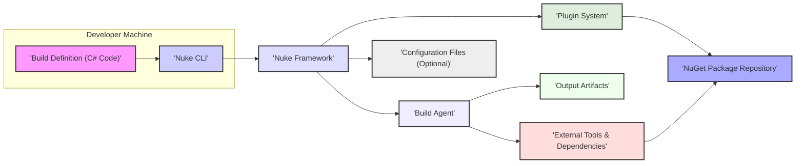
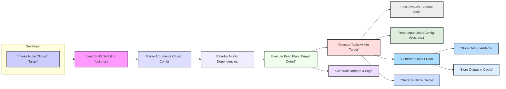

# Project Design Document: Nuke Build System

**Version:** 1.1
**Date:** October 26, 2023
**Author:** AI Software Architect

## 1. Project Overview

This document provides an enhanced architectural overview of the Nuke build system, based on the project at [https://github.com/nuke-build/nuke](https://github.com/nuke-build/nuke). Nuke is a cross-platform build automation system primarily targeting .NET projects. It empowers developers to define build processes using strongly-typed C# code, offering a robust and extensible alternative to traditional scripting approaches. This refined design document is specifically intended to facilitate comprehensive threat modeling activities.

## 2. Goals and Objectives of this Document

*   To present a more detailed and nuanced understanding of the Nuke build system's architecture, including finer-grained component descriptions and interactions.
*   To meticulously map out the data flows within the system, highlighting the types of data being exchanged and processed.
*   To proactively identify potential security vulnerabilities and attack vectors relevant to each component and data flow, thereby informing threat modeling efforts.
*   To serve as a comprehensive and easily understandable reference for security engineers, developers, and operations teams involved with Nuke.

## 3. Target Audience

This document is intended for:

*   Security engineers and architects tasked with performing threat modeling, security assessments, and penetration testing.
*   Software developers contributing to or utilizing the Nuke build system.
*   DevOps and operations teams responsible for the deployment, management, and security of build environments leveraging Nuke.

## 4. System Architecture

Nuke's architecture centers around defining build logic as C# code. The following provides a more detailed breakdown of the key components and their interactions:

*   **Build Definition (C# Code):**
    *   The core of a Nuke build, written in C#.
    *   Defines build targets (e.g., compile, test, pack, publish).
    *   Specifies dependencies between targets.
    *   Contains tasks, which are individual units of work (e.g., running a compiler, executing tests).
    *   Leverages the Nuke framework's APIs and attributes for build orchestration.
    *   Can include custom logic and integrations.
*   **Nuke Framework:**
    *   A .NET library providing the foundational infrastructure for Nuke.
    *   Offers abstractions for common build operations (file system access, process execution, etc.).
    *   Manages command-line argument parsing and configuration binding.
    *   Provides logging, reporting, and error handling mechanisms.
    *   Facilitates extensibility through its plugin system.
*   **Nuke CLI (Command-Line Interface):**
    *   The primary user interface for interacting with Nuke.
    *   Responsible for loading and executing build definitions.
    *   Parses command-line arguments passed by the user.
    *   Invokes the Nuke framework to initiate the build process.
    *   Displays build progress and results to the user.
*   **Build Agent (Local or Remote):**
    *   The execution environment where the build process runs.
    *   Can be the developer's workstation, a dedicated CI/CD server, or a cloud-based build agent.
    *   Requires the .NET SDK and any other tools specified in the build definition.
    *   Provides the necessary resources (CPU, memory, disk space) for build execution.
*   **External Tools and Dependencies:**
    *   Nuke builds frequently interact with external tools.
        *   Compilers (e.g., `dotnet build`, `csc.exe`).
        *   Package managers (e.g., NuGet CLI, npm).
        *   Testing frameworks (e.g., xUnit, NUnit).
        *   Linters and code analysis tools.
        *   Deployment tools (e.g., Docker CLI, Azure CLI).
    *   Dependencies are managed through package managers like NuGet.
    *   Build definitions specify the required tools and dependencies.
*   **Output Artifacts:**
    *   The tangible results of the build process.
        *   Compiled binaries (.dll, .exe files).
        *   NuGet packages (.nupkg files).
        *   Container images (Docker images).
        *   Installation packages (.msi, .deb).
        *   Deployment scripts and configuration files.
        *   Test reports and code coverage data.
    *   Stored in designated output directories, often configurable.
*   **Configuration Files (Optional):**
    *   Nuke can utilize configuration files (typically within the `.nuke` directory).
    *   Store settings and parameters that influence the build process.
    *   Can include API keys, connection strings, and other sensitive information (should be handled securely).
    *   Support various formats (e.g., JSON, YAML).
*   **Plugin System (Extensibility):**
    *   Allows extending Nuke's functionality with custom tasks and integrations.
    *   Plugins are typically distributed as NuGet packages.
    *   Can introduce new build steps, integrate with external services, or modify existing behavior.
    *   Plugin code executes within the Nuke process.
*   **Caching Mechanism:**
    *   Optimizes build times by reusing outputs from previous builds.
    *   Can cache compiled artifacts, downloaded dependencies, or intermediate results.
    *   Cache locations can be local or remote.
    *   Cache invalidation strategies are employed to ensure correctness.

## 5. Data Flow

The data flow during a typical Nuke build execution involves the following steps:

*   **Initiation:**
    *   The developer executes the Nuke CLI command, specifying the target to be executed and potentially passing arguments.
    *   The Nuke CLI loads the `build.cs` file (or the specified build definition).
*   **Configuration and Initialization:**
    *   The Nuke framework parses command-line arguments and loads configuration settings from files (if present).
    *   The framework initializes logging and reporting mechanisms.
*   **Dependency Resolution:**
    *   The framework analyzes the build definition to identify required NuGet packages (for dependencies and plugins).
    *   NuGet retrieves these packages from configured package sources.
*   **Build Plan Execution:**
    *   The framework determines the order of target execution based on dependencies defined in the build definition.
    *   For each target, the associated tasks are executed sequentially.
*   **Task Execution Details:**
    *   Tasks often involve invoking external tools.
    *   Input data for tasks can originate from:
        *   The build definition itself (hardcoded values).
        *   Command-line arguments.
        *   Configuration files.
        *   The output of previous tasks.
        *   Environment variables.
    *   Tasks process input data and generate output data.
*   **Artifact Generation and Storage:**
    *   Tasks responsible for generating build artifacts write these artifacts to designated output directories.
    *   The location and naming of artifacts are often configurable.
*   **Caching Operations:**
    *   Before executing a task, Nuke checks the cache for existing outputs.
    *   If a valid cache entry exists, the cached output is used, skipping the task execution.
    *   After a task completes, its output may be stored in the cache for future use.
*   **Reporting and Logging:**
    *   Throughout the build process, the Nuke framework logs events, warnings, and errors.
    *   Summary reports are generated, indicating the success or failure of the build.

## 6. Key Technologies

*   **Primary Programming Language:** C#
*   **.NET SDK:** Essential for compiling and executing Nuke build definitions and the Nuke framework itself.
*   **NuGet:** The primary package manager for managing .NET dependencies, including Nuke plugins and project dependencies.
*   **Command-Line Interface (CLI):** The primary means of interacting with the Nuke build system.
*   **Potentially a wide range of external tools:**  Including but not limited to:
    *   Compilers for various languages (e.g., Roslyn, javac, go).
    *   Testing frameworks (e.g., xUnit, NUnit, Jest).
    *   Containerization tools (e.g., Docker).
    *   Cloud provider CLIs (e.g., Azure CLI, AWS CLI).
    *   Version control systems (e.g., Git).
    *   Code analysis tools (e.g., SonarQube scanners).

## 7. Security Considerations (Detailed for Threat Modeling)

This section expands on the initial security considerations, providing more specific examples relevant for threat modeling:

*   **Malicious Build Definitions:**
    *   **Threat:** An attacker could inject malicious code into a build definition, leading to arbitrary code execution on the build agent.
    *   **Examples:** Downloading and executing malware, exfiltrating secrets, modifying build outputs.
*   **Dependency Vulnerabilities:**
    *   **Threat:** Using vulnerable NuGet packages can introduce security flaws into the built application.
    *   **Examples:** Exploiting known vulnerabilities in libraries for remote code execution, data breaches.
*   **Insecure Plugin Code:**
    *   **Threat:** Malicious or poorly written Nuke plugins can compromise the build process or the build agent.
    *   **Examples:** Plugins that steal credentials, introduce backdoors, or disrupt the build process.
*   **Command Injection:**
    *   **Threat:** If build definitions construct commands using untrusted input (e.g., from command-line arguments or external sources), they are vulnerable to command injection.
    *   **Examples:**  An attacker could manipulate input to execute arbitrary commands on the build agent.
*   **Information Disclosure:**
    *   **Threat:** Build logs or output artifacts might unintentionally expose sensitive information.
    *   **Examples:**  Leaking API keys, connection strings, or internal system details in logs or compiled binaries.
*   **Supply Chain Attacks:**
    *   **Threat:** Compromised build tools, NuGet packages, or even the Nuke framework itself could lead to supply chain attacks.
    *   **Examples:**  A compromised compiler injecting malicious code into binaries.
*   **Remote Code Execution (if using remote build agents):**
    *   **Threat:** Insecure communication or authentication with remote build agents could allow unauthorized access and code execution.
    *   **Examples:**  An attacker gaining control of a build agent and using it to attack other systems.
*   **Caching Vulnerabilities:**
    *   **Threat:** If the caching mechanism is not properly secured, attackers could inject malicious artifacts into the cache.
    *   **Examples:**  Replacing legitimate compiled binaries with compromised versions.
*   **Configuration Vulnerabilities:**
    *   **Threat:** Insecurely stored or managed configuration files can expose sensitive information.
    *   **Examples:**  Storing API keys or database credentials in plain text in configuration files.
*   **Insufficient Input Validation:**
    *   **Threat:** Build definitions that don't properly validate input from external sources (e.g., environment variables, command-line arguments) can be exploited.
    *   **Examples:**  Path traversal vulnerabilities if file paths are not validated.
*   **Lack of Secure Secrets Management:**
    *   **Threat:** Hardcoding secrets in build definitions or configuration files is a significant security risk.
    *   **Examples:**  Exposing database passwords or API tokens in version control.

## 8. Assumptions and Constraints

*   Developers writing build definitions are expected to adhere to secure coding practices.
*   The underlying operating system and .NET environment are assumed to be reasonably secure and patched.
*   This document focuses on the core Nuke build system and may not cover all possible custom integrations or extensions.
*   Secure storage and management of sensitive information (like API keys) are considered the responsibility of the user or organization implementing the build process.

## 9. Future Considerations

*   Detailed security analysis of common Nuke plugins and their potential vulnerabilities.
*   Development of guidelines and best practices for writing secure Nuke build definitions.
*   Integration of security scanning tools (SAST/DAST) within the Nuke build process.
*   Implementation of mechanisms for verifying the integrity and authenticity of build artifacts.
*   Exploration of secure secrets management solutions integrated with Nuke.
*   Consideration of sandboxing or containerization for build agent environments to limit the impact of potential compromises.

This enhanced design document provides a more granular and security-focused understanding of the Nuke build system, making it a more effective resource for comprehensive threat modeling activities. The detailed security considerations offer specific examples of potential threats to guide the identification of vulnerabilities and the development of appropriate mitigation strategies.