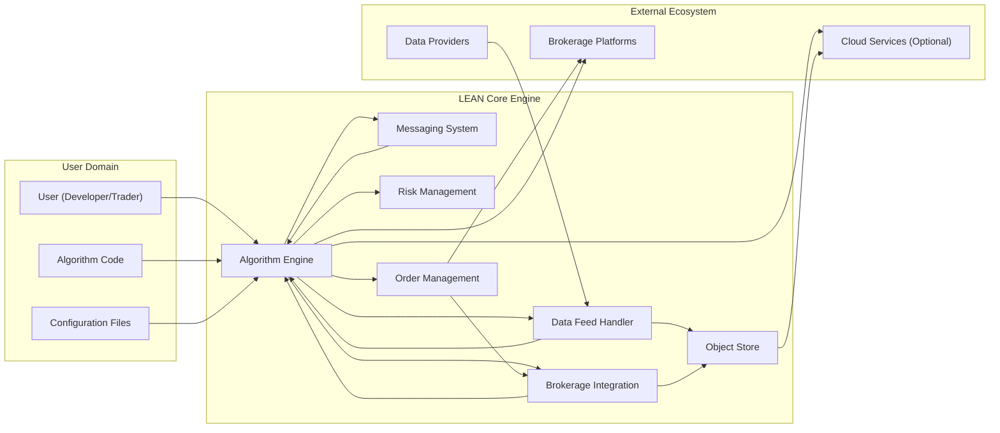

# Project Design Document: LEAN Algorithmic Trading Engine

**Version:** 1.1
**Date:** October 26, 2023
**Author:** AI Software Architect

## 1. Introduction

This document provides an enhanced design overview of the LEAN Algorithmic Trading Engine, an open-source platform for backtesting and live trading quantitative strategies. This document aims to provide a more detailed and comprehensive understanding of the system's architecture, components, and data flow, serving as a robust foundation for subsequent threat modeling activities. This revision incorporates feedback and expands on the initial design.

## 2. Project Overview

LEAN is a sophisticated, C# based engine designed to empower both individual and institutional users to engage in the complete lifecycle of quantitative trading strategy development and deployment. This encompasses research, development, and automated execution across a diverse range of asset classes and brokerage integrations. The platform offers a unified framework that streamlines data ingestion, algorithm creation, rigorous backtesting, performance optimization, and seamless live trading implementation.

**Key Goals:**

*   **Extensive Flexibility:**  Support for a wide spectrum of trading strategies, from simple moving average crossovers to complex machine learning models, and compatibility with diverse asset classes including equities, forex, and cryptocurrencies.
*   **High Scalability:**  Designed to efficiently process substantial volumes of market data and execute computationally intensive algorithms, catering to both individual researchers and institutional demands.
*   **Deep Extensibility:**  A modular and well-defined architecture facilitating easy integration of new data sources (e.g., alternative data), brokerage connections, custom indicators, and specialized features through its plugin system.
*   **Exceptional Accuracy:**  Emphasis on providing highly accurate backtesting environments that closely mirror live trading conditions, alongside precise and reliable live trade execution.
*   **Community-Driven Open Source:**  Built upon principles of transparency and community collaboration, encouraging contributions, shared knowledge, and continuous improvement.

## 3. System Architecture

LEAN employs a layered and modular architecture, promoting separation of concerns and maintainability. Distinct components interact through well-defined interfaces to manage the complexities of the trading lifecycle.

### 3.1. Component Diagram



### 3.2. Component Descriptions

*   **Algorithm Engine:** The central processing unit of LEAN, responsible for interpreting and executing the user-defined trading algorithm. It orchestrates the flow of data, triggers trading decisions, and interacts with other components. This includes managing the algorithm's lifecycle, handling events, and providing debugging capabilities.
*   **Data Feed Handler:**  A crucial component that manages the entire lifecycle of market data. This involves connecting to various data providers, ingesting both historical and real-time data, normalizing data formats, handling data gaps or errors, and efficiently distributing data to the Algorithm Engine and other interested components. It supports various data types including tick data, trade bars, and quote bars.
*   **Brokerage Integration:**  Provides a standardized and secure interface for interacting with diverse brokerage platforms. It handles authentication, order construction and submission, real-time order status updates, portfolio management, and funds management. This component abstracts away the specific API details of each broker.
*   **Object Store:**  A persistent storage solution for various types of data generated and used by LEAN. This includes backtesting results (performance metrics, trade logs), algorithm state (for resuming execution), configuration settings, and potentially cached market data. It supports various storage backends like local files, databases (SQL or NoSQL), and cloud storage services.
*   **Messaging System:** Facilitates asynchronous communication and event-driven interactions between different components within LEAN. This enables loose coupling and allows components to react to events without direct dependencies. Examples include order updates, data feed status changes, and risk management alerts.
*   **Risk Management:**  An integral component responsible for monitoring and enforcing risk parameters defined by the user or system defaults. This includes features like position sizing limits, stop-loss and take-profit orders, and potentially more sophisticated risk models. It can prevent the Algorithm Engine from executing trades that violate defined risk constraints.
*   **Order Management:**  Manages the lifecycle of orders, from creation to execution or cancellation. It interacts with the Brokerage Integration to submit orders and tracks their status, providing feedback to the Algorithm Engine and potentially the user. It may also implement smart order routing logic.
*   **User (Developer/Trader):** The individual or team responsible for developing, backtesting, deploying, and monitoring trading algorithms using LEAN. They interact with the system through configuration files, code, and potentially user interfaces (not explicitly part of the core engine).
*   **Algorithm Code:** The user-written C# code that defines the specific trading strategy.
*   **Configuration Files:**  External files (e.g., JSON, XML) used to configure LEAN, including data feed connections, brokerage settings, and risk parameters.
*   **Data Providers:** External services or APIs that supply market data (historical and real-time) to LEAN. Examples include market data vendors and brokerage data feeds.
*   **Brokerage Platforms:** External trading platforms that execute the orders generated by LEAN.
*   **Cloud Services (Optional):**  External cloud platforms (e.g., AWS, Azure, GCP) that LEAN can leverage for deployment, data storage, or other services.

## 4. Data Flow

The following outlines the detailed data flow within the LEAN system during both backtesting and live trading scenarios, highlighting the specific data exchanged between components.

### 4.1. Backtesting Data Flow

```mermaid
graph LR
    A["User Algorithm"] --> B{"Algorithm Engine"};
    C["Historical Data"] --> D{"Data Feed Handler"};
    D --> | "Normalized Market Data" | B;
    B --> E{"Execution Logic"};
    E --> F{"Order Simulation"};
    F --> | "Simulated Order Events" | G{"Backtesting Results"};
    G --> H{"Object Store"};
    B --> | "Algorithm State Updates" | H;
```

*   **User Algorithm:** The C# code implementing the trading strategy.
*   **Historical Data:** Time-series market data for past periods, including OHLCV (Open, High, Low, Close, Volume) data, and potentially other indicators.
*   **Data Feed Handler:** Reads and processes historical data from the configured source.
*   **Normalized Market Data:**  The processed and standardized market data delivered to the Algorithm Engine.
*   **Algorithm Engine:** Executes the user algorithm logic against the historical data.
*   **Execution Logic:**  The internal logic within the Algorithm Engine that simulates order execution based on the algorithm's signals and market conditions.
*   **Order Simulation:**  Simulates the placement, filling, and potential slippage of orders.
*   **Simulated Order Events:** Data representing the simulated trades, including entry/exit prices, quantities, and timestamps.
*   **Backtesting Results:**  Comprehensive performance metrics (e.g., Sharpe Ratio, drawdown), trade logs, and visualizations generated from the backtest.
*   **Object Store:** Stores the backtesting results and any saved algorithm state.
*   **Algorithm State Updates:** Periodic snapshots of the algorithm's internal variables and state, allowing for resuming backtests or analysis.

### 4.2. Live Trading Data Flow

```mermaid
graph LR
    A["User Algorithm"] --> B{"Algorithm Engine"};
    C["Real-time Data"] --> D{"Data Feed Handler"};
    D --> | "Normalized Market Data" | B;
    B --> E{"Execution Logic"};
    E --> F{"Order Management"};
    F --> | "Order Instructions" | G{"Brokerage Integration"};
    G --> | "API Calls" | H["Brokerage Platform"];
    H --> | "Execution Reports" | G;
    G --> | "Order Status Updates" | F;
    F --> B;
    B --> I{"Risk Management"};
    I --> | "Risk Check Result" | F;
    F --> J{"Portfolio Updates"};
    J --> K{"Object Store"};
```

*   **User Algorithm:** The C# code implementing the trading strategy.
*   **Real-time Data:** Live market data streaming from data providers, including price updates, order book information, and potentially news feeds.
*   **Data Feed Handler:** Receives, processes, and normalizes real-time market data.
*   **Normalized Market Data:** The processed real-time data delivered to the Algorithm Engine.
*   **Algorithm Engine:** Executes the user algorithm logic based on the incoming real-time data.
*   **Execution Logic:** Determines when and how to place trades based on the algorithm's signals.
*   **Order Management:** Creates, tracks, and manages the lifecycle of trade orders.
*   **Order Instructions:**  Data representing the details of the order to be placed (e.g., symbol, quantity, side, order type).
*   **Brokerage Integration:** Translates LEAN's order instructions into the specific API calls required by the connected brokerage platform.
*   **Brokerage Platform:** The external platform where orders are executed.
*   **Execution Reports:**  Confirmation messages from the brokerage platform indicating the status of orders (e.g., filled, partially filled, rejected).
*   **Order Status Updates:** Information about the current state of orders, relayed back to the Order Management component.
*   **Risk Management:** Evaluates proposed trades against defined risk parameters.
*   **Risk Check Result:**  Indicates whether a proposed trade is within acceptable risk limits.
*   **Portfolio Updates:** Information about changes in holdings and positions resulting from executed trades.
*   **Object Store:** Persists portfolio updates and potentially live trading logs for auditing and analysis.

## 5. Key Technologies

*   **Core Programming Language:** C# (.NET Framework or .NET)
*   **Concurrency and Parallelism:**  Utilizes features of the .NET framework for multi-threading and asynchronous operations to handle high-frequency data and computations.
*   **Data Serialization:**  Likely employs JSON.NET for serializing and deserializing data exchanged between components and with external systems. Potentially Protocol Buffers for performance-critical data.
*   **Messaging Libraries:**  Could leverage libraries like RabbitMQ.Client or Apache Kafka client for robust asynchronous communication between components.
*   **Data Storage Libraries/ORMs:**  May use Entity Framework Core or Dapper for interacting with relational databases. Potentially libraries for interacting with NoSQL databases or cloud storage services.
*   **Networking:**  Relies on TCP/IP for communication, with HTTPS/TLS for secure communication with external services. Brokerage integrations often use specific SDKs or REST APIs over HTTP/HTTPS.
*   **Logging Framework:**  Likely utilizes a logging framework like Serilog or NLog for comprehensive logging and auditing.

## 6. Deployment Model

LEAN's flexibility allows for various deployment strategies, each with its own considerations:

*   **Local Machine Deployment:**
    *   **Use Case:** Primarily for development, backtesting, and learning.
    *   **Considerations:** Resource limitations of the local machine, direct access to files, simpler security configuration but potentially less secure if the machine is compromised.
*   **Cloud Environment Deployment:**
    *   **Use Case:**  Scalable and reliable live trading execution, access to cloud-based data and services.
    *   **Considerations:** Requires managing cloud infrastructure (e.g., virtual machines, containers, serverless functions), implementing robust security measures (IAM, network security groups), and potential cost implications. Can leverage container orchestration (Kubernetes) for managing multiple LEAN instances.
*   **Containerized Deployment (Docker):**
    *   **Use Case:**  Consistent and reproducible deployments across different environments, simplifies management and scaling.
    *   **Considerations:** Requires familiarity with containerization technologies, managing container images and registries, and potentially using container orchestration platforms. Enhances portability and isolation.

## 7. Security Considerations (Detailed)

This section expands on the initial security considerations, providing more specific examples and categorizations.

*   **Authentication and Authorization:**
    *   **User Authentication:** Securely verifying the identity of users accessing LEAN, especially in cloud deployments or multi-user environments. Mechanisms could include password-based authentication, API keys, or integration with identity providers (OAuth 2.0).
    *   **Component Authorization:**  Controlling access and permissions between different components within LEAN to prevent unauthorized actions.
    *   **Brokerage Account Security:** Securely storing and managing brokerage account credentials (API keys, passwords) using encryption and secure vault solutions.
*   **Data Security:**
    *   **Data at Rest:** Encrypting sensitive data stored in the Object Store, including backtesting results, algorithm code (if stored), and configuration files containing secrets.
    *   **Data in Transit:**  Enforcing HTTPS/TLS for all communication with external services (data providers, brokerage platforms) and potentially encrypting internal communication channels.
    *   **Algorithm Confidentiality:** Protecting the intellectual property embedded in the trading algorithms. This can involve secure storage, access control, and potentially obfuscation techniques.
*   **Input Validation and Sanitization:**
    *   **Data Feed Validation:**  Verifying the integrity and format of data received from data providers to prevent malicious data injection or manipulation.
    *   **Brokerage Response Handling:**  Carefully validating responses from brokerage platforms to prevent misinterpretation or exploitation.
    *   **Configuration Validation:**  Sanitizing user-provided configuration parameters to prevent injection attacks or unexpected behavior.
*   **Secure Communication:**
    *   **TLS/SSL Encryption:**  Mandatory use of TLS/SSL for all external communication.
    *   **Mutual Authentication:**  Potentially implementing mutual TLS (mTLS) for enhanced security in internal communication.
*   **Dependency Management:**
    *   **Vulnerability Scanning:** Regularly scanning dependencies for known vulnerabilities and updating them promptly.
    *   **Supply Chain Security:**  Being mindful of the security of third-party libraries and components used in LEAN.
*   **Logging and Monitoring:**
    *   **Security Auditing:**  Logging security-related events (authentication attempts, authorization failures, API access) for auditing and forensic analysis.
    *   **Anomaly Detection:**  Implementing monitoring systems to detect unusual activity that might indicate a security breach.
*   **Rate Limiting and Throttling:**
    *   **API Rate Limiting:**  Implementing rate limits on interactions with external APIs (data providers, brokers) to prevent abuse and denial-of-service attacks.
*   **Secret Management:**
    *   **Secure Storage:**  Using secure vault solutions (e.g., HashiCorp Vault, Azure Key Vault) to store and manage sensitive credentials and API keys.
    *   **Principle of Least Privilege:**  Granting only the necessary permissions to components and users.

## 8. Assumptions and Constraints

*   Users are expected to follow secure coding practices when developing their trading algorithms.
*   The security of external data providers and brokerage platforms is the responsibility of those entities. LEAN focuses on secure integration with these services.
*   Performance requirements may necessitate trade-offs with certain security measures.
*   This document describes the general architecture of LEAN. Specific implementations and security features may vary.

## 9. Future Considerations

*   Enhanced support for hardware security modules (HSMs) for cryptographic key management.
*   Integration with more advanced risk management tools and libraries.
*   Development of a comprehensive security auditing framework.
*   Formal security assessments and penetration testing.
*   Community-driven security guidelines and best practices for LEAN users.
*   Support for secure enclaves or confidential computing for protecting algorithm code and sensitive data in memory.

This enhanced design document provides a more detailed and comprehensive understanding of the LEAN Algorithmic Trading Engine, crucial for effective threat modeling and security analysis. It clarifies component responsibilities, data flows, and security considerations, paving the way for a more secure and robust platform.
