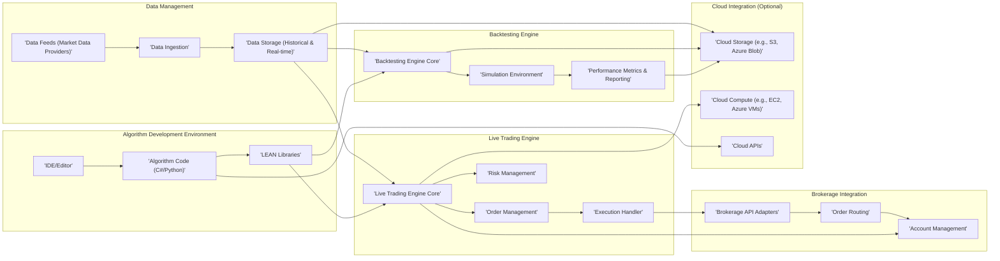
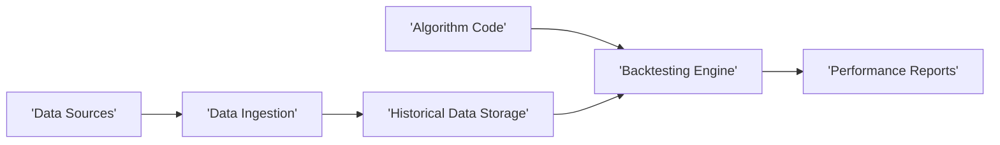
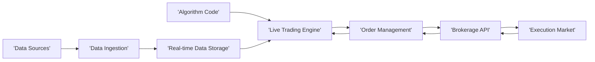

# Project Design Document: LEAN Algorithmic Trading Engine

**Version:** 1.1
**Date:** October 26, 2023
**Author:** AI Software Architect

## 1. Project Overview

This document provides an enhanced design overview of the LEAN Algorithmic Trading Engine, an open-source platform enabling the development, backtesting, and live deployment of financial algorithms. This detailed design serves as a crucial foundation for subsequent threat modeling activities by clearly outlining the system's architecture, components, and data flows. The design emphasizes the core functionalities and interactions within the LEAN engine, while also acknowledging its potential integration points with external services and cloud platforms.

## 2. Goals and Objectives

*   Deliver a refined and more detailed architectural overview of the LEAN engine.
*   Provide enhanced descriptions of key components and their interactions, including specific examples.
*   Clarify the data flow within the system with improved diagrams.
*   Establish a precise understanding of the system's boundaries, interfaces, and potential integration points.
*   Serve as a robust and comprehensive basis for identifying potential security vulnerabilities during threat modeling exercises.

## 3. Target Audience

*   Security engineers and architects tasked with performing threat modeling and security assessments on the LEAN platform.
*   Development team members actively involved in the ongoing maintenance, enhancement, and feature development of LEAN.
*   Operations team members responsible for the deployment, configuration, and management of LEAN instances in various environments.

## 4. System Architecture

### 4.1. High-Level Architecture

The LEAN engine's functionality can be broadly categorized into these key areas:

*   **Algorithm Development:** Offers a comprehensive environment with tools and libraries for users to design, code, and test their custom trading algorithms.
*   **Data Management:**  Manages the entire lifecycle of financial market data, including ingestion from various sources, secure storage, and efficient retrieval for both backtesting and live trading.
*   **Backtesting Engine:**  Provides a robust simulation environment to rigorously evaluate the performance of trading strategies against historical market data.
*   **Live Trading Engine:** Facilitates the automated execution of trading decisions in live financial markets through seamless integration with brokerage platforms.
*   **Brokerage Integration:**  Acts as a bridge, enabling secure communication and order placement with a variety of supported brokerage platforms.
*   **Cloud Integration (Optional):**  Allows for flexible integration with cloud platforms to leverage scalable resources for data storage, computational power, and deployment flexibility.

### 4.2. Detailed Architecture

## 5. Data Flow Diagrams

### 5.1. Backtesting Data Flow

### 5.2. Live Trading Data Flow

## 6. Key Components

*   **Algorithm Code (C#/Python):**  User-defined scripts containing the core trading logic, written in either C# or Python.
    *   Leverages the LEAN API to interact with market data and order management functionalities.
    *   Defines specific conditions and rules for entering and exiting trades based on market analysis.
    *   Examples include moving average crossovers, breakout strategies, or statistical arbitrage models.
*   **LEAN Libraries:**  A comprehensive set of pre-built functions, classes, and data structures that provide developers with essential tools for building trading algorithms.
    *   Offers abstractions for seamless interaction with diverse market data sources and brokerage platforms.
    *   Handles complex financial calculations, technical indicators, and data transformations efficiently.
    *   Examples include classes for managing portfolios, handling order events, and accessing historical data.
*   **IDE/Editor:**  The development environment where users create, edit, and manage their algorithm code. This can range from local IDEs like Visual Studio or VS Code to cloud-based development platforms.
*   **Data Feeds (Market Data Providers):** External services that supply real-time and historical financial market data, such as stock prices, options chains, and forex rates.
    *   Examples include providers like Polygon.io, Alpha Vantage, and Interactive Brokers.
    *   Data is typically provided through APIs or data streams in various formats.
*   **Data Ingestion:** The process of retrieving, processing, and validating market data from external data feed providers.
    *   Involves tasks like parsing data formats (e.g., JSON, CSV), cleaning inconsistencies, and normalizing data for consistent use within LEAN.
    *   May incorporate caching mechanisms to improve data access performance and reduce API calls.
*   **Data Storage (Historical & Real-time):**  Persistent storage mechanisms for both historical market data used for backtesting and real-time data used for live trading.
    *   Historical data storage often involves databases optimized for time-series data.
    *   Real-time data storage might utilize in-memory databases or message queues for low-latency access.
    *   Examples include SQL databases like PostgreSQL with TimescaleDB extension, NoSQL databases like InfluxDB, or cloud storage services like AWS S3.
*   **Backtesting Engine Core:** The central component responsible for simulating trading strategies against historical market conditions.
    *   Replays historical market data tick-by-tick or bar-by-bar, mimicking real-world market dynamics.
    *   Executes trades virtually based on the logic defined in the user's algorithm.
    *   Maintains a simulated portfolio and tracks its performance over the backtesting period.
*   **Simulation Environment:**  The isolated environment within the backtesting engine where trading simulations are executed, ensuring that backtesting does not impact live trading operations.
*   **Performance Metrics & Reporting:**  Generates comprehensive reports and calculates key performance indicators (KPIs) to evaluate the effectiveness of backtested algorithms.
    *   Includes metrics such as Sharpe ratio, maximum drawdown, profit and loss (P&L), win rate, and average trade duration.
    *   Provides visualizations and summaries to aid in analyzing backtesting results.
*   **Live Trading Engine Core:** The core component responsible for automating the execution of trading decisions in live financial markets.
    *   Receives trading signals generated by the user's algorithm based on real-time market data.
    *   Manages the entire order lifecycle, from creation to execution confirmation.
    *   Continuously monitors portfolio positions and market conditions.
*   **Order Management:**  Handles the creation, modification, and cancellation of trading orders based on signals from the live trading engine.
    *   Supports various order types, including market orders, limit orders, stop-loss orders, and take-profit orders.
    *   Tracks the status of orders and manages order fills.
*   **Risk Management:**  Implements predefined rules and checks to mitigate potential financial risks associated with live trading.
    *   Includes features like setting maximum position sizes, implementing stop-loss orders to limit potential losses, and defining daily or overall risk limits.
*   **Execution Handler:**  The component that interfaces directly with the Brokerage API Adapters to transmit order instructions and receive execution confirmations.
*   **Brokerage API Adapters:**  Specialized modules that translate LEAN's internal order representation into the specific API format required by each supported brokerage platform.
    *   Handles authentication and authorization with the brokerage.
    *   Manages communication protocols and data formats specific to each brokerage API.
*   **Order Routing:**  The process of directing trading orders from LEAN through the brokerage API to the appropriate exchange or market maker for execution.
*   **Account Management:**  Manages and tracks information related to the connected trading account, including account balances, open positions, and transaction history.
*   **Cloud Storage (e.g., S3, Azure Blob):**  Optional cloud-based storage solutions for storing large datasets, backtesting results, algorithm code repositories, and other persistent data.
*   **Cloud Compute (e.g., EC2, Azure VMs):**  Optional cloud-based compute resources that can be used to run backtesting simulations, deploy live trading instances, and scale computational power as needed.
*   **Cloud APIs:**  Application Programming Interfaces provided by cloud platforms to access and manage cloud services like storage, compute, and other functionalities.

## 7. Security Considerations (Initial)

This section provides an initial overview of security considerations relevant to the LEAN engine. A more detailed threat model will be developed based on this design document to identify and mitigate potential vulnerabilities.

*   **Authentication and Authorization:** Securely verifying the identity of users and controlling their access to the LEAN engine, sensitive data, and connected brokerage accounts. This includes strong password policies, multi-factor authentication, and role-based access control.
*   **Data Security:** Protecting sensitive financial data, including market data, algorithm code (intellectual property), and trading account credentials, both while in transit (using encryption protocols like TLS/SSL) and at rest (using encryption at the storage level).
*   **API Security:** Securing the interfaces between LEAN and external systems, such as market data providers and brokerage platforms. This involves secure API key management, request validation, and protection against common API attacks (e.g., injection attacks, rate limiting).
*   **Code Security:** Ensuring the integrity and security of the LEAN codebase itself and user-developed algorithms. This includes regular code reviews, static and dynamic code analysis, and secure coding practices to prevent vulnerabilities like code injection or logic flaws.
*   **Infrastructure Security:** Protecting the underlying infrastructure where LEAN is deployed from unauthorized access and malicious activities. This involves implementing security best practices for server hardening, network security (firewalls, intrusion detection), and regular security patching.
*   **Brokerage Account Security:**  Protecting the credentials and access to connected brokerage accounts, as compromise could lead to significant financial loss. This includes secure storage of API keys and OAuth tokens, and adherence to brokerage security recommendations.
*   **Data Feed Integrity:** Ensuring the reliability and integrity of market data received from external providers, as manipulated or inaccurate data can lead to incorrect trading decisions. This may involve data validation and anomaly detection mechanisms.

## 8. Technologies Used

*   **Programming Languages:** C#, Python
*   **Data Storage:**  Various options depending on deployment needs and scale, including:
    *   Relational Databases (e.g., PostgreSQL, MySQL)
    *   Time-Series Databases (e.g., InfluxDB, TimescaleDB)
    *   Cloud Storage (e.g., AWS S3, Azure Blob Storage)
*   **Communication Protocols:** HTTPS for secure communication with external services and APIs, potentially WebSockets for real-time data streams.
*   **Cloud Platforms (Optional):** Amazon Web Services (AWS), Microsoft Azure, Google Cloud Platform (GCP).

## 9. Deployment Model

LEAN offers flexibility in its deployment options:

*   **Local Deployment:** Running the LEAN engine directly on a user's personal computer or server. This provides full control over the environment but requires managing infrastructure and dependencies. Suitable for development and testing.
*   **Cloud Deployment:** Deploying LEAN on cloud infrastructure using services like virtual machines (e.g., AWS EC2, Azure VMs), containerization (e.g., Docker, Kubernetes), or serverless functions. This offers scalability, reliability, and reduced operational overhead.
*   **Hybrid Deployment:** Combining local and cloud resources, for example, running backtesting on cloud infrastructure while managing live trading from a local environment for lower latency.

## 10. Assumptions and Constraints

*   This design document primarily focuses on the core functionalities of the LEAN engine. Detailed specifications for specific integrations with individual external services (beyond general data feed and brokerage interactions) are not included here.
*   Security considerations are presented at a high level in this document and will be further analyzed and detailed in a dedicated threat model.
*   The specific technologies chosen for data storage, cloud integration, and other components can vary based on the specific deployment environment, user preferences, and project requirements.
*   It is assumed that users possess a foundational understanding of algorithmic trading concepts, financial markets, and basic software development principles.