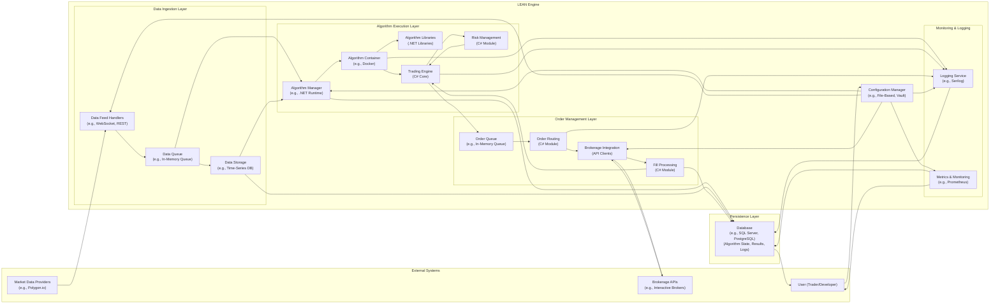

# Project Design Document: LEAN Algorithmic Trading Engine

**Project Name:** LEAN Algorithmic Trading Engine

**Version:** 1.1

**Date:** 2023-10-27

**Author:** AI Cloud & Security Architect

## 1. Project Overview

LEAN is an open-source, cloud-ready algorithmic trading engine written in C#. It is designed for backtesting and live trading of various financial instruments across multiple markets. LEAN aims to provide a robust, flexible, and scalable platform for quantitative researchers and algorithmic traders to develop, test, and deploy their trading strategies. This document outlines the design of the LEAN engine to facilitate threat modeling and security analysis, providing a detailed architectural blueprint for identifying potential vulnerabilities and attack vectors.

**Project Repository:** [https://github.com/quantconnect/lean](https://github.com/quantconnect/lean)

## 2. Goals and Objectives

The primary goals of LEAN are:

* **Flexibility:** Support a wide range of trading strategies and financial instruments, including equities, futures, forex, and cryptocurrencies.
* **Scalability:** Handle high-frequency trading and large volumes of market data, scaling both vertically and horizontally.
* **Extensibility:** Allow users to customize and extend the engine with custom algorithms, data providers (e.g., Polygon.io, Tiingo), and brokers (e.g., Interactive Brokers, Alpaca).
* **Accuracy:** Provide precise backtesting and live trading execution, ensuring accurate simulation and order execution.
* **Open Source:** Foster community collaboration, transparency, and continuous improvement through open contributions.
* **Cloud-Ready:** Designed for seamless deployment in cloud environments like AWS, Azure, and GCP, leveraging cloud-native services.

For the purpose of threat modeling, the key objectives are to ensure:

* **Data Integrity:** Protect market data, algorithm code, trading data, and configuration settings from unauthorized modification, corruption, or accidental deletion.
* **Confidentiality:** Secure sensitive information such as API keys for brokers and data providers, trading algorithms (intellectual property), user credentials, and trading positions.
* **Availability:** Maintain the engine's operational readiness and resilience against failures and attacks, ensuring continuous trading and backtesting capabilities.
* **Secure Execution:** Ensure algorithms are executed in a secure and isolated environment, preventing malicious code injection or unintended system access.
* **Compliance:** Adhere to relevant security and regulatory requirements for financial trading platforms, such as data privacy regulations (GDPR, CCPA) and financial industry standards.
* **Auditability:** Maintain comprehensive logs and audit trails of all system activities for security monitoring, incident response, and regulatory compliance.

## 3. Target Audience

This design document is intended for:

* **Security Architects and Engineers:** To understand the system architecture for conducting thorough threat modeling, vulnerability assessments, and penetration testing.
* **Development Team:** To provide a clear architectural blueprint for secure development practices, code reviews, and security feature implementation.
* **Operations Team:** To understand the deployment architecture, operational security considerations, and incident response planning.
* **Users (Algorithmic Traders):** To gain insight into the engine's design, security features, and responsible usage guidelines.
* **Compliance and Audit Teams:** To assess the system's compliance with relevant security and regulatory standards.

## 4. System Architecture

LEAN's architecture is modular and component-based, designed for flexibility, scalability, and security. It supports various deployment scenarios, from local development to large-scale cloud deployments. The core components are logically separated into layers to promote maintainability and security.

### 4.1. High-Level Architecture Diagram

### 4.2. Detailed Component Description

**4.2.1. Data Ingestion Layer:**

* **"Data Feed Handlers"**:  Responsible for establishing connections and receiving real-time market data streams from various "Market Data Providers" using protocols like WebSocket or REST APIs. Examples include handlers for Polygon.io, IEX Cloud, and custom data feeds.
    * **Security Considerations:**
        * **Credential Management:** Securely store and manage API keys and authentication tokens for data providers, using "Configuration Manager" and potentially secrets management solutions.
        * **Data Validation:** Implement robust input validation to prevent data injection attacks and ensure data integrity from external sources.
        * **Rate Limiting & DoS Protection:** Handle rate limits imposed by data providers and implement mechanisms to prevent denial-of-service attacks from malicious data streams.
* **"Data Queue"**: A temporary, in-memory queue (e.g., ConcurrentQueue in .NET) that buffers incoming market data. This decouples data ingestion from processing, ensuring smooth data flow even during data bursts.
    * **Security Considerations:**
        * **Queue Overflow Protection:** Implement mechanisms to prevent queue overflow, which could lead to data loss or denial of service.
        * **Resource Limits:** Set resource limits (e.g., memory allocation) for the queue to prevent resource exhaustion attacks.
* **"Data Storage"**:  Stores historical and potentially real-time market data. This can utilize various storage mechanisms, including time-series databases (e.g., InfluxDB, TimescaleDB) for efficient storage and retrieval of time-stamped data, or file systems for caching.
    * **Security Considerations:**
        * **Access Control:** Implement strict access control policies to restrict access to sensitive market data, using database-level permissions and file system access controls.
        * **Encryption at Rest:** Encrypt stored market data at rest to protect confidentiality in case of storage breaches.
        * **Data Integrity Checks:** Implement checksums or other data integrity mechanisms to detect unauthorized modifications to stored data.

**4.2.2. Algorithm Execution Layer:**

* **"Algorithm Manager"**: Manages the lifecycle of trading algorithms, including loading, compiling (using the .NET runtime), and executing user-defined algorithms written in C# or Python (via IronPython integration). It retrieves algorithm configurations from the "Configuration Manager".
    * **Security Considerations:**
        * **Secure Code Loading:** Implement secure mechanisms for loading and compiling user-provided algorithm code, preventing injection of malicious code during the loading process.
        * **Input Sanitization:** Sanitize and validate algorithm parameters and inputs to prevent injection attacks and ensure algorithm integrity.
* **"Algorithm Container"**: Provides an isolated execution environment for each algorithm, typically using Docker containers or .NET AppDomains. This enhances security by limiting the impact of a compromised algorithm and improving resource management.
    * **Security Considerations:**
        * **Container Security Hardening:** Harden container images and runtime environments by applying security best practices, such as minimal base images, vulnerability scanning, and resource limits.
        * **Resource Isolation:** Enforce resource limits (CPU, memory, I/O) for each container to prevent resource exhaustion and denial-of-service attacks from rogue algorithms.
        * **Secure Inter-Process Communication:** Secure communication channels between the "Algorithm Container" and other LEAN components.
* **"Algorithm Libraries"**: Contains pre-built, well-tested, and security-audited libraries and functions for common algorithmic trading tasks, such as technical indicators, order types, portfolio optimization, and risk metrics. These are typically .NET libraries.
    * **Security Considerations:**
        * **Library Vulnerability Management:** Regularly update and patch algorithm libraries to address known vulnerabilities.
        * **Code Reviews & Security Audits:** Conduct regular code reviews and security audits of algorithm libraries to identify and mitigate potential security flaws.
        * **Dependency Management:** Securely manage library dependencies and prevent the use of vulnerable or outdated dependencies.
* **"Trading Engine"**: The core component responsible for simulating and executing trading strategies. It processes market data, executes algorithm logic within "Algorithm Containers", manages portfolio state, generates trading signals, and interacts with "Risk Management" and "Order Management" components.
    * **Security Considerations:**
        * **Integrity of Trading Logic:** Ensure the integrity of the core trading logic and prevent unauthorized modifications or manipulations that could lead to financial losses or market manipulation.
        * **Secure State Management:** Securely manage and protect the portfolio state, trading positions, and account balances from unauthorized access or modification.
        * **Audit Logging:** Generate comprehensive audit logs of all trading activities, including order generation, execution, and portfolio changes, for security monitoring and compliance.
* **"Risk Management"**: Implements pre-defined risk management rules and constraints to control trading risks. This includes position limits, stop-loss orders, portfolio diversification rules, and margin requirements.
    * **Security Considerations:**
        * **Enforcement of Risk Rules:** Ensure that risk management rules are correctly and consistently enforced by the "Trading Engine" and cannot be bypassed or overridden by malicious algorithms or attackers.
        * **Secure Risk Parameter Configuration:** Securely configure and manage risk parameters, preventing unauthorized modifications that could lead to excessive risk-taking.
        * **Alerting & Monitoring:** Implement alerting and monitoring mechanisms to detect violations of risk management rules and potential risk events.

**4.2.3. Order Management Layer:**

* **"Order Queue"**: A queue (e.g., in-memory queue) that temporarily stores generated trading orders before they are routed to brokers. This helps manage order flow, handle broker API rate limits, and provide resilience against temporary broker API outages.
    * **Security Considerations:**
        * **Order Tampering Prevention:** Implement mechanisms to prevent unauthorized modification or deletion of orders in the queue.
        * **Order Sequencing & Integrity:** Ensure the correct sequencing and integrity of orders in the queue to prevent order manipulation.
* **"Order Routing"**:  Determines the appropriate brokerage and API endpoint for each order based on factors like asset class, market, and algorithm configuration.
    * **Security Considerations:**
        * **Secure Routing Logic:** Ensure the integrity of the order routing logic and prevent manipulation that could lead to orders being routed to unintended or malicious destinations.
        * **Broker Selection Policies:** Implement secure broker selection policies and prevent unauthorized changes to broker configurations.
* **"Brokerage Integration"**: Handles communication with various "Brokerage APIs" (e.g., REST, FIX) using API clients. This includes authentication, order submission, order status updates, position management, and retrieving account information. Examples include integrations with Interactive Brokers, Alpaca, and OANDA.
    * **Security Considerations:**
        * **Secure API Key Management:** Securely store and manage brokerage API keys and credentials using "Configuration Manager" and dedicated secrets management solutions.
        * **Secure Communication Channels:** Use secure communication protocols (e.g., TLS/SSL) for all interactions with brokerage APIs to protect data in transit.
        * **API Request/Response Validation:** Implement rigorous input validation and output sanitization for all broker API requests and responses to prevent injection attacks and data manipulation.
        * **Rate Limiting & Error Handling:** Implement robust rate limiting and error handling mechanisms to manage broker API rate limits and handle API errors gracefully.
* **"Fill Processing"**: Processes order fill confirmations received from "Brokerage APIs". It updates the portfolio state in the "Trading Engine", records trading history, and triggers post-trade processing.
    * **Security Considerations:**
        * **Fill Confirmation Verification:** Implement mechanisms to verify the authenticity and integrity of fill confirmations received from brokers to prevent fraudulent or manipulated fills.
        * **Transaction Integrity:** Ensure the integrity of transaction processing and prevent data corruption or inconsistencies during fill processing.
        * **Audit Logging:** Log all fill processing activities for audit trails and security monitoring.

**4.2.4. Monitoring & Logging:**

* **"Logging Service"**: Collects, aggregates, and stores logs from all LEAN components using a robust logging framework like Serilog or NLog. Logs are used for debugging, auditing, security monitoring, and incident response.
    * **Security Considerations:**
        * **Secure Logging Practices:** Implement secure logging practices, including log rotation, retention policies, and secure log storage.
        * **Log Integrity Protection:** Protect log data from unauthorized access, modification, or deletion to ensure auditability and prevent tampering with security evidence.
        * **Centralized Log Management:** Utilize a centralized log management system (e.g., ELK stack, Splunk) for efficient log analysis and security monitoring.
* **"Metrics & Monitoring"**: Collects and visualizes performance metrics, system health indicators, and trading statistics using monitoring tools like Prometheus and Grafana. Provides real-time dashboards, alerts, and anomaly detection capabilities.
    * **Security Considerations:**
        * **Secure Monitoring Access:** Secure access to monitoring dashboards and metrics data using authentication and authorization mechanisms.
        * **Alerting for Security Events:** Configure alerts for security-related events, such as異常 API activity, unauthorized access attempts, and system anomalies.
        * **Data Confidentiality:** Protect sensitive metrics data from unauthorized disclosure.

**4.2.5. Configuration Manager:**

* **"Configuration Manager"**: Manages all system-wide configurations, algorithm settings, data provider credentials, broker API keys, and other sensitive parameters. It can use file-based configurations, environment variables, or dedicated secrets management solutions like HashiCorp Vault or AWS Secrets Manager.
    * **Security Considerations:**
        * **Secure Configuration Storage:** Store configuration data securely, especially sensitive credentials, using encryption at rest and access control mechanisms.
        * **Secrets Management:** Utilize dedicated secrets management solutions for storing and managing API keys, passwords, and other sensitive secrets.
        * **Configuration Versioning & Auditing:** Implement configuration versioning and audit logging to track configuration changes and facilitate rollback in case of misconfigurations or security incidents.

**4.2.6. Persistence Layer:**

* **"Database (Algorithm State, Results, Logs)"**:  Utilizes a relational database (e.g., SQL Server, PostgreSQL) or potentially NoSQL databases to persistently store algorithm state, backtesting results, live trading history, logs, configuration data, and other persistent data.
    * **Security Considerations:**
        * **Database Security Hardening:** Harden the database server and database instances by applying security best practices, such as strong passwords, principle of least privilege, and regular security patching.
        * **Database Access Control:** Implement granular access control policies to restrict database access based on roles and responsibilities.
        * **Encryption at Rest & in Transit:** Encrypt database data at rest and in transit to protect confidentiality.
        * **Regular Backups & Disaster Recovery:** Implement regular database backups and disaster recovery plans to ensure data availability and resilience against data loss.
        * **Database Activity Monitoring & Auditing:** Monitor database activity and audit database access for security monitoring and compliance.

## 5. Data Flow

The data flow diagram and description remain the same as in Version 1.0, accurately representing the data movement within the LEAN engine. Please refer to Section 5 of Version 1.0 for the diagram and description.

## 6. Key Components and Technologies

* **Programming Language:** C# (.NET Framework/.NET Core)
* **Data Storage:**
    * Relational Databases: SQL Server, PostgreSQL, MySQL
    * Time-Series Databases: InfluxDB, TimescaleDB
    * NoSQL Databases (potentially for specific data): MongoDB, Redis
    * File Systems (for caching and local storage)
* **Message Queues:**
    * In-Memory Queues (.NET ConcurrentQueue)
    * External Message Brokers (optional for distributed deployments): RabbitMQ, Kafka, Redis Pub/Sub
* **Containerization:** Docker (for algorithm containers and deployment), potentially Kubernetes for orchestration in cloud environments.
* **Cloud Platform (Optional):** AWS (EC2, ECS, RDS, Secrets Manager, CloudWatch), Azure (Virtual Machines, AKS, Azure SQL Database, Key Vault, Monitor), GCP (Compute Engine, GKE, Cloud SQL, Secret Manager, Cloud Logging).
* **Brokerage APIs:** REST and FIX APIs from various brokers like Interactive Brokers, Alpaca, OANDA, TD Ameritrade.
* **Data Provider APIs:** REST and WebSocket APIs from market data providers like Polygon.io, IEX Cloud, Tiingo, Quandl.
* **Logging Framework:** Serilog, NLog, .NET built-in logging.
* **Monitoring Tools:** Prometheus, Grafana, ELK stack (Elasticsearch, Logstash, Kibana), cloud-specific monitoring solutions (AWS CloudWatch, Azure Monitor, GCP Cloud Logging).
* **Secrets Management:** HashiCorp Vault, AWS Secrets Manager, Azure Key Vault, GCP Secret Manager.

## 7. Deployment Architecture

LEAN can be deployed in various configurations, each with distinct security considerations:

* **Local Development Environment:** Primarily for algorithm development and backtesting on a developer's machine.
    * **Security Considerations:**
        * **Code Protection:** Protect algorithm code as intellectual property. Use version control and secure code storage.
        * **Data Security:** Secure API keys and any local data storage.
        * **Limited Network Exposure:** Minimize network exposure and disable unnecessary services.
* **On-Premise Server:** Deployed on dedicated servers within a private network, offering more control over infrastructure.
    * **Security Considerations:**
        * **Physical Security:** Secure physical access to servers and data centers.
        * **Network Security:** Implement firewalls, network segmentation, and intrusion detection/prevention systems (IDS/IPS) to protect the network perimeter and internal network traffic.
        * **Server Hardening:** Harden operating systems and server configurations according to security best practices.
        * **Access Control:** Implement strong authentication and authorization mechanisms, including multi-factor authentication (MFA) and role-based access control (RBAC).
        * **Vulnerability Management:** Establish a vulnerability management program for servers and applications, including regular patching and security assessments.
* **Cloud Deployment:** Deployed on cloud platforms (AWS, Azure, GCP), leveraging cloud-native services for scalability and resilience.
    * **Security Considerations:**
        * **Cloud Security Best Practices:** Adhere to cloud security best practices and utilize cloud provider security services.
        * **IAM (Identity and Access Management):** Implement robust IAM policies to control access to cloud resources and LEAN components.
        * **Network Security Groups (NSGs) / Security Groups:** Use NSGs/Security Groups to control network traffic to and from cloud resources.
        * **Encryption:** Encrypt data at rest and in transit using cloud provider encryption services (e.g., KMS, encryption in transit).
        * **Vulnerability Management:** Utilize cloud provider vulnerability scanning and security monitoring services.
        * **Compliance & Auditing:** Leverage cloud provider compliance certifications and audit logging capabilities.
        * **Secrets Management (Cloud-Based):** Utilize cloud-native secrets management services (e.g., AWS Secrets Manager, Azure Key Vault, GCP Secret Manager) for secure API key and credential management.
* **Hybrid Deployment:** Combines on-premise and cloud components, potentially for sensitive data processing on-premise and scalable execution in the cloud. Security considerations are a combination of on-premise and cloud security practices, with added complexity of securing hybrid network connections.

## 8. Security Considerations (Detailed)

This section expands on the initial security considerations, providing more specific examples of security controls and best practices for each area.

* **Authentication and Authorization:**
    * **Multi-Factor Authentication (MFA):** Enforce MFA for all user accounts, especially administrators and users accessing sensitive data or configurations.
    * **Role-Based Access Control (RBAC):** Implement RBAC to control access to LEAN resources and functionalities based on user roles (e.g., administrator, developer, trader, read-only user).
    * **Strong Password Policies:** Enforce strong password policies, including password complexity requirements and regular password rotation.
    * **API Authentication:** Secure APIs using API keys, OAuth 2.0, or JWT (JSON Web Tokens) for authentication and authorization.
* **API Security:**
    * **API Gateway:** Utilize an API Gateway to manage and secure APIs, providing features like authentication, authorization, rate limiting, and traffic management.
    * **Web Application Firewall (WAF):** Deploy a WAF to protect APIs from common web attacks, such as SQL injection, cross-site scripting (XSS), and cross-site request forgery (CSRF).
    * **Input Validation & Output Sanitization:** Implement rigorous input validation for all API requests and sanitize outputs to prevent injection attacks.
    * **Rate Limiting & Throttling:** Implement rate limiting and throttling to protect APIs from abuse and denial-of-service attacks.
    * **API Security Audits & Penetration Testing:** Conduct regular security audits and penetration testing of APIs to identify and address vulnerabilities.
* **Data Encryption:**
    * **Encryption at Rest:** Encrypt sensitive data at rest in databases, file systems, and backups using strong encryption algorithms (e.g., AES-256).
    * **Encryption in Transit:** Enforce encryption in transit for all network communication using TLS/SSL (e.g., HTTPS for web APIs, TLS for database connections).
    * **Key Management:** Implement secure key management practices, using dedicated key management systems (KMS) or secrets management solutions to protect encryption keys.
* **Input Validation:**
    * **Server-Side Validation:** Implement robust server-side input validation for all user inputs, algorithm parameters, configuration settings, and data received from external APIs.
    * **Data Type Validation:** Validate data types, formats, and ranges to prevent unexpected inputs and errors.
    * **Sanitization & Encoding:** Sanitize and encode user inputs to prevent injection attacks (e.g., SQL injection, command injection, XSS).
* **Code Security:**
    * **Secure Coding Practices:** Adhere to secure coding practices throughout the development lifecycle, including input validation, output sanitization, error handling, and secure configuration management.
    * **Code Reviews:** Conduct regular code reviews by security-trained developers to identify and address potential security vulnerabilities.
    * **Static Application Security Testing (SAST):** Utilize SAST tools to automatically scan code for potential security vulnerabilities during development.
    * **Dynamic Application Security Testing (DAST):** Utilize DAST tools to dynamically test the running application for vulnerabilities.
    * **Software Composition Analysis (SCA):** Utilize SCA tools to identify vulnerabilities in third-party libraries and dependencies.
* **Algorithm Security:**
    * **Sandboxing & Isolation:** Enforce sandboxing and isolation of algorithm execution environments using containers or virtual machines to limit the impact of compromised algorithms.
    * **Resource Limits:** Implement resource limits (CPU, memory, I/O) for algorithm containers to prevent resource exhaustion and denial-of-service attacks.
    * **Algorithm Code Audits:** Conduct security audits of user-provided algorithm code to identify potential vulnerabilities or malicious code.
    * **Input Validation for Algorithms:** Implement input validation for algorithm parameters and data inputs to prevent manipulation or injection attacks.
* **Logging and Monitoring:**
    * **Centralized Logging:** Implement centralized logging to aggregate logs from all LEAN components for efficient security monitoring and analysis.
    * **Security Information and Event Management (SIEM):** Integrate with a SIEM system to correlate logs, detect security events, and trigger alerts.
    * **Real-time Monitoring & Alerting:** Implement real-time monitoring and alerting for security-related events, anomalies, and suspicious activities.
    * **Audit Trails:** Maintain comprehensive audit trails of all system activities, including user logins, configuration changes, trading activities, and security events.
* **Vulnerability Management:**
    * **Regular Security Assessments:** Conduct regular security assessments, including vulnerability scans and penetration testing, to identify and address vulnerabilities.
    * **Vulnerability Scanning:** Utilize vulnerability scanning tools to automatically scan systems and applications for known vulnerabilities.
    * **Penetration Testing:** Conduct penetration testing by ethical hackers to simulate real-world attacks and identify exploitable vulnerabilities.
    * **Patch Management:** Implement a robust patch management process to promptly apply security patches to operating systems, applications, and libraries.
* **Compliance:**
    * **Data Privacy Regulations (GDPR, CCPA):** Implement measures to comply with data privacy regulations, including data minimization, data anonymization, and user consent management.
    * **Financial Industry Standards (e.g., SOC 2, ISO 27001):** Adhere to relevant financial industry security standards and frameworks to demonstrate security posture and compliance.
    * **Regulatory Requirements:** Comply with relevant financial regulations and reporting requirements in applicable jurisdictions.
* **Secrets Management:**
    * **Dedicated Secrets Management Solutions:** Utilize dedicated secrets management solutions (e.g., HashiCorp Vault, AWS Secrets Manager, Azure Key Vault, GCP Secret Manager) to securely store, manage, and rotate API keys, passwords, and other sensitive credentials.
    * **Principle of Least Privilege:** Grant access to secrets based on the principle of least privilege, limiting access to only authorized components and users.
    * **Secret Rotation:** Implement automatic secret rotation to reduce the risk of compromised credentials.
* **Network Security:**
    * **Network Segmentation:** Segment the network into different security zones to isolate critical components and limit the impact of security breaches.
    * **Firewalls:** Deploy firewalls to control network traffic between security zones and protect the LEAN engine from external threats.
    * **Intrusion Detection/Prevention Systems (IDS/IPS):** Implement IDS/IPS to detect and prevent malicious network traffic and attacks.
    * **VPNs & Secure Tunnels:** Use VPNs or secure tunnels for secure remote access and communication between components in different networks.

This improved design document provides a more comprehensive and detailed overview of the LEAN Algorithmic Trading Engine architecture and security considerations. It serves as a strong foundation for conducting a thorough threat modeling exercise and developing robust security controls for the project.